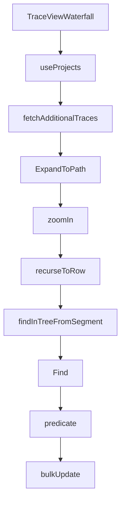

This document will cover the TraceViewWaterfall feature of the Sentry application. We'll cover:

1. The purpose of TraceViewWaterfall
2. How projects are fetched and managed
3. The process of fetching additional traces
4. The method of expanding to a path
5. The functionality of zooming in on a trace
6. The process of finding a specific node in the trace tree
7. The final step of bulk updating items in the store.

Technical document: <SwmLink doc-title="Understanding TraceViewWaterfall">[Understanding TraceViewWaterfall](/.swm/understanding-traceviewwaterfall.yn6pvax9.sw.md)</SwmLink>

# TraceViewWaterfall

TraceViewWaterfall is a key component in the Sentry application. It is responsible for managing and displaying the trace view waterfall, a visual representation of the execution of a program. It uses various hooks and states to manage the trace view and defines several callback functions to handle different events such as trace view changes, physical space changes, trace space initialization, and trace search.

# useProjects

`useProjects` is a hook that provides projects from the ProjectsStore. It also provides a way to select specific project slugs, and search (type-ahead) for more projects that may not be in the project store. It fetches projects by slug and handles search functionality.

# Fetching Additional Traces

`fetchAdditionalTraces` is a method that fetches additional traces for the trace view. It uses the `fetchSingleTrace` function to fetch each trace and then appends the fetched trace to the trace tree.

# ExpandToPath

The `ExpandToPath` method is the starting point of the flow. It takes a `TraceTree`, a `scrollQueue`, a `rerender` function, and `options` as parameters. It traverses the tree based on the segments in the `scrollQueue` and performs operations based on the type of the current node. The `recurseToRow` function is used to traverse the tree recursively.

# Zooming In

The `zoomIn` method is called within `ExpandToPath` when the current node is a transaction node and the next segment starts with 'span-', 'empty-', 'ag-', or 'ms-'. This method fetches transaction spans and updates the tree based on the fetched data. It also handles the case when the node is collapsed before the promise is resolved.

# Recursing to Row

The `recurseToRow` function is a recursive function that navigates through the trace tree. It pops a segment from the path and tries to find it in the tree. If the segment is not found, it checks if the segment is a span and if it is, it checks if it's already on the node. If it's still not found, an error message is sent to Sentry. If the segment is found, the function checks if it's a transaction node and if it is, it zooms in. If the segment is an autogrouped node, it expands the node. If there are more segments, it calls itself again. If there are no more segments, it finds the node in the list and returns the index and the node.

# Finding in Tree from Segment

The `findInTreeFromSegment` function is the starting point of this flow. It takes a start node and a segment, splits the segment into type and id, and then uses these to find a specific node in the trace tree.

# Finding Node

The `Find` method is used within `findInTreeFromSegment`. It takes a root node and a predicate function, and uses a queue to traverse the tree until it finds a node that satisfies the predicate.

# Predicate Function

The `predicate` function is used as a parameter in the `Find` method. It checks if the query starts with a specific string, which is used to determine if the node satisfies the condition.

# Bulk Update

The `bulkUpdate` function is the final step in this flow. It takes an API client, update parameters, and request options, and uses these to update a group of items in the store.

&nbsp;

*This is an auto-generated document by Swimm AI 🌊 and has not yet been verified by a human*

<SwmMeta version="3.0.0" repo-id="Z2l0aHViJTNBJTNBc2VudHJ5LWRlbW8lM0ElM0FTd2ltbS1EZW1v" repo-name="sentry-demo" doc-type="product-flows">Powered by [Swimm](/)</SwmMeta>
