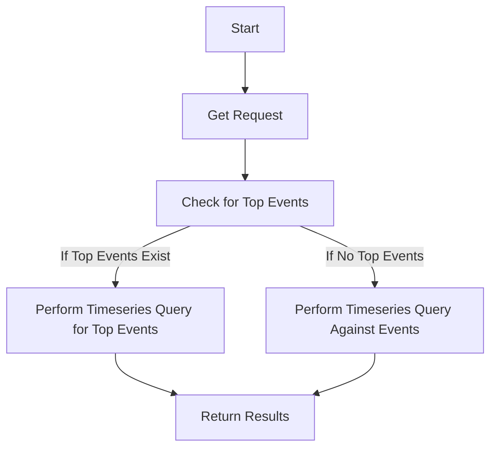

This document will cover the 'track_response_metric' feature of the sentry-demo repo. We'll cover:

1. The purpose of the 'track_response_metric' feature
2. How the feature works
3. The impact of the feature on the end user.

Technical document: <SwmLink doc-title="Understanding track_response_metric">[Understanding track_response_metric](/.swm/understanding-track_response_metric.tgyfqr1s.sw.md)</SwmLink>

# Purpose of the 'track_response_metric' Feature

The 'track_response_metric' feature is designed to monitor the success or failure of HTTP responses from the Amazon SQS service. This is crucial for maintaining the reliability and efficiency of the service. The success or failure is determined based on whether an exception was raised during the execution of certain functions.

# How the 'track_response_metric' Feature Works

The 'track_response_metric' feature works by wrapping around another function. When a request is received, it first checks if there are any top events. If top events exist, it performs a timeseries query for a limited number of top events. If there are no top events, it performs a timeseries query against events. The results of these queries are then returned.

# Impact of the 'track_response_metric' Feature on the End User

The 'track_response_metric' feature impacts the end user by ensuring the reliability of the service. By monitoring the success or failure of HTTP responses, it helps to identify and address any issues promptly. This leads to a smoother and more efficient user experience.

&nbsp;

*This is an auto-generated document by Swimm AI 🌊 and has not yet been verified by a human*

<SwmMeta version="3.0.0" repo-id="Z2l0aHViJTNBJTNBc2VudHJ5LWRlbW8lM0ElM0FTd2ltbS1EZW1v" repo-name="sentry-demo" doc-type="product-flows">Powered by [Swimm](/)</SwmMeta>
