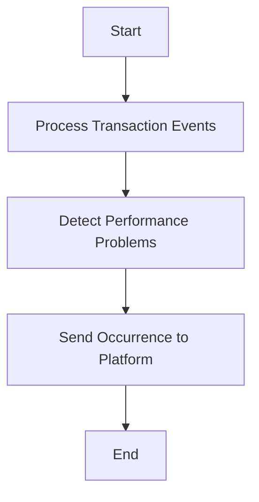

This document will cover the 'Transaction Event Processing' flow in the Sentry application. We'll cover:

1. The purpose of the flow
2. The steps involved in the flow
3. How each step contributes to the end goal of the flow.

Technical document: <SwmLink doc-title="Understanding the save_transaction_events Flow">[Understanding the save_transaction_events Flow](/.swm/understanding-the-save_transaction_events-flow.nuw0gegu.sw.md)</SwmLink>

# Purpose of the Flow

The 'Transaction Event Processing' flow is a crucial part of the Sentry application. It is responsible for processing transaction events, detecting performance problems, and sending occurrences to the platform. This flow ensures that performance issues are identified and reported, which helps in maintaining the overall performance of the application.

# Steps Involved in the Flow

The flow involves several steps:

1. Processing transaction events: This is the first step where a sequence of jobs related to transaction events are processed.
2. Detecting performance problems: In this step, the system iterates over a list of jobs and tries to detect any performance problems.
3. Sending occurrence to the platform: Once the performance problems are detected, an occurrence is created for each problem and sent to the platform.

# How Each Step Contributes to the End Goal

Each step in the flow contributes to the end goal of maintaining the performance of the application. Processing transaction events ensures that all events are accounted for. Detecting performance problems helps in identifying any issues that might affect the performance. Sending occurrences to the platform ensures that these issues are reported and can be addressed. Together, these steps help in maintaining the overall performance of the application.

&nbsp;

*This is an auto-generated document by Swimm AI 🌊 and has not yet been verified by a human*

<SwmMeta version="3.0.0" repo-id="Z2l0aHViJTNBJTNBc2VudHJ5LWRlbW8lM0ElM0FTd2ltbS1EZW1v" repo-name="sentry-demo" doc-type="product-flows">Powered by [Swimm](/)</SwmMeta>
