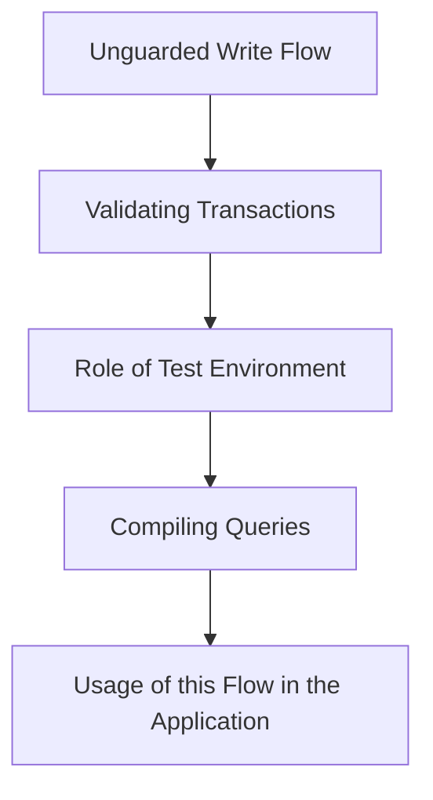

This document will cover the 'Unguarded Write Flow' in the Sentry application. We'll cover:

1. The purpose of the Unguarded Write Flow
2. The process of validating transactions
3. The role of the test environment in this flow
4. The process of compiling queries
5. The usage of this flow in the application.

Technical document: <SwmLink doc-title="Understanding the unguarded_write Flow">[Understanding the unguarded_write Flow](/.swm/understanding-the-unguarded_write-flow.ieppsfaw.sw.md)</SwmLink>

# Purpose of the Unguarded Write Flow

The Unguarded Write Flow is a key component in the Sentry application. It is used to indicate that the wrapped block is safe to do mutations on outbox backed records. This function is particularly useful in test environments where it emits 'fencing' queries that are audited at the end of each test run.

# Validating Transactions

The Unguarded Write Flow initiates a sequence of operations involving several other functions. One of these is the 'validate_transaction_using_for_silo_mode' function. This function validates the transaction based on the silo mode. If the transaction is in a test environment and not in a test case body, it allows treating it as one DB. It also checks if both silos route to the same DB or if the current silo mode is MONOLITH.

# Role of Test Environment

The test environment plays a crucial role in this flow. The 'is_in_test_case_body' function is used to determine whether the current execution stack is in a test case body. This is a best-effort, potentially brittle implementation that depends on private behavior of the current Pytest implementation.

# Compiling Queries

The 'compile' function is used to compile the MQL query by replacing all variables inside the formulas with the corresponding queries. This allows for a more flexible structure and reuse of the same query across multiple formulas.

# Usage of this Flow in the Application

This flow is used multiple times in the codebase. Some of the entry points of this flow include functions like 'sync_status_inbound', 'post', '\_create_artifact_bundle', and 'write_relocation_import'.

&nbsp;

*This is an auto-generated document by Swimm AI 🌊 and has not yet been verified by a human*

<SwmMeta version="3.0.0" repo-id="Z2l0aHViJTNBJTNBc2VudHJ5LWRlbW8lM0ElM0FTd2ltbS1EZW1v" repo-name="sentry-demo" doc-type="product-flows">Powered by [Swimm](/)</SwmMeta>
