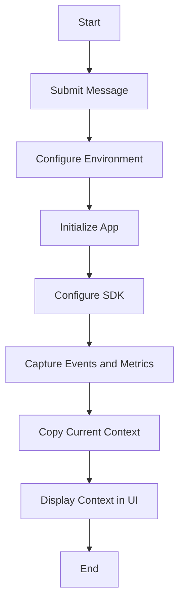

This document will cover the 'up' functionality in the Sentry-Demo repository. We'll cover:

1. The purpose of the 'up' functionality
2. The flow of the 'up' functionality
3. The product logic behind each step of the flow.

Technical document: <SwmLink doc-title="up">[up](/.swm/understanding-the-up-functionality.rkd0iud5.sw.md)</SwmLink>

# Purpose of the 'up' Functionality

The 'up' functionality is a multi-step process that is primarily responsible for running or updating all devservices in the background. It configures the environment, prepares the containers, and starts each service in a separate thread. After all services are started, it checks their health.

# Flow of the 'up' Functionality

The 'up' functionality begins with the 'submit' function, which takes a message as input, extracts the payload from the message, and then produces billing outcomes and flags metrics for the project. It then submits the message to the next step in the process. The 'up' function also calls the 'configure' function, which sets up the environment based on two different config files. It ensures warnings are always displayed and adds additional mimetypes for static files. If the configuration file does not exist, it raises an exception. It also sets the 'DJANGO_SETTINGS_MODULE' environment variable and initializes the application with the 'initialize_app' function.

# Product Logic Behind Each Step

The 'up' functionality involves several steps, each with its own product logic. The 'submit' function takes a message as input and produces billing outcomes and flags metrics for the project. This is important for tracking the project's usage and billing. The 'configure' function sets up the environment based on two different config files. This is crucial for ensuring the application runs correctly and securely. The 'initialize_app' function sets up the application, which is necessary for the application to function properly. The 'configure_sdk' function sets up the SDK options and initializes the SDK with these options. This is important for ensuring the SDK functions correctly and efficiently. The '\_capture_anything' function captures events and metrics, which is crucial for monitoring the application's performance and identifying issues. The 'copy' function creates a copy of the current context, which is important for ensuring the original context is not modified when processing events. Finally, the 'Context' function displays the context of a frame in the Sentry UI, which is crucial for users to understand the context of their data.

&nbsp;

*This is an auto-generated document by Swimm AI 🌊 and has not yet been verified by a human*

<SwmMeta version="3.0.0" repo-id="Z2l0aHViJTNBJTNBc2VudHJ5LWRlbW8lM0ElM0FTd2ltbS1EZW1v" repo-name="sentry-demo" doc-type="product-flows">Powered by [Swimm](/)</SwmMeta>
