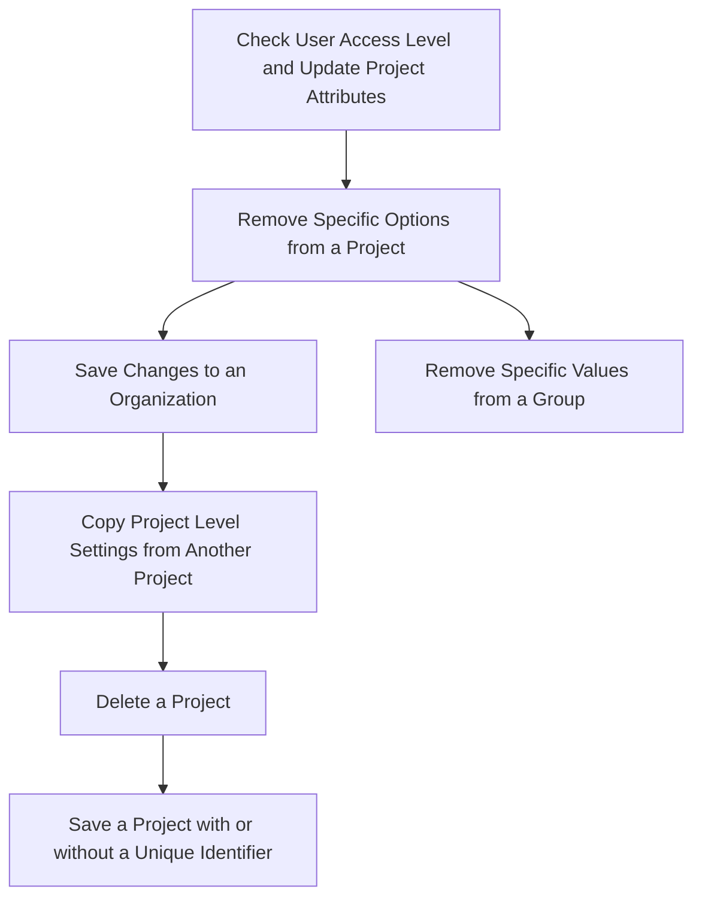

This document will cover the 'Update Project Settings' feature in the Sentry application. The feature includes the following steps:

1. Checking user access level and updating project attributes
2. Removing specific options from a project
3. Saving changes to an organization
4. Removing specific values from a group
5. Copying project level settings from another project
6. Deleting a project
7. Saving a project with or without a unique identifier.

Technical document: <SwmLink doc-title="put">[put](/.swm/understanding-the-put-functionality.6oc9zvhn.sw.md)</SwmLink>

# Checking User Access Level and Updating Project Attributes

The first step in updating project settings is to check the user's access level. Depending on the user's access level, the system will serialize the request data accordingly. The serialized data is then validated and applied to the project. If the changes are successful, the project is saved with the new settings.

# Removing Specific Options from a Project

In some cases, it may be necessary to remove a specific option from a project. This is done by updating the revision for the option and then unsetting the value of the option.

# Saving Changes to an Organization

Changes can also be saved to an organization. The system first checks if the organization has any changes in its options. If there are changes, it updates the options and saves the organization with the new settings. The function also handles special cases like updating the avatar, requiring 2FA, and requiring email verification.

# Removing Specific Values from a Group

Specific values can be removed from a group. This is done by deleting the value from the group and removing it from the cache.

# Copying Project Level Settings from Another Project

Project level settings can be copied from another project. The system takes a project ID as input and copies over various settings such as General Settings, ProjectTeams, Alerts Settings and Rules, EnvironmentProjects, ProjectOwnership Rules and settings, and Project Inbound Data Filters. It returns a boolean indicating whether the settings have been successfully copied.

# Deleting a Project

A project can be deleted from the system. This involves removing notification settings for the project and saving the state of the project in an outbox before deleting it.

# Saving a Project with or without a Unique Identifier

A project can be saved with or without a unique identifier. If the project does not have a slug, it generates one. If the 'SENTRY_USE_SNOWFLAKE' setting is enabled, it saves the project with a snowflake ID.

&nbsp;

*This is an auto-generated document by Swimm AI 🌊 and has not yet been verified by a human*

<SwmMeta version="3.0.0" repo-id="Z2l0aHViJTNBJTNBc2VudHJ5LWRlbW8lM0ElM0FTd2ltbS1EZW1v" repo-name="sentry-demo" doc-type="product-flows">Powered by [Swimm](/)</SwmMeta>
