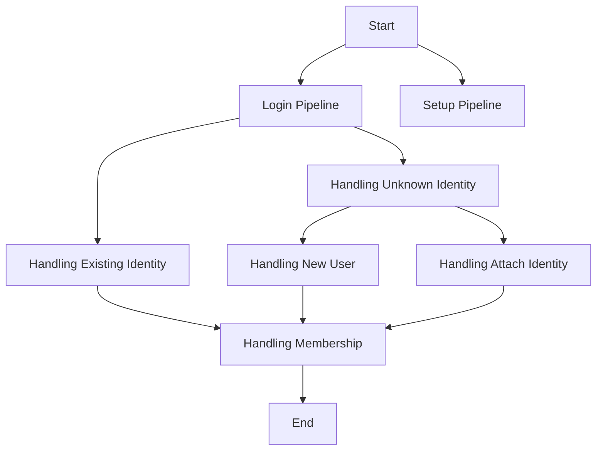

This document will cover the User Authentication Flow in Sentry, which includes:

1. The purpose of the authentication process
2. The Login Pipeline
3. The Setup Pipeline
4. Handling Existing Identity
5. Handling Unknown Identity
6. Handling New User
7. Handling Attach Identity
8. Handling Membership

Technical document: <SwmLink doc-title="Understanding the finish_pipeline Function">[Understanding the finish_pipeline Function](/.swm/understanding-the-finish_pipeline-function.0cktaec7.sw.md)</SwmLink>

# Purpose of the Authentication Process

The authentication process in Sentry is a crucial part of ensuring the security and integrity of user data. It involves fetching state data and building an identity based on it. Depending on the flow state, it either completes the login pipeline or the setup pipeline.

# Login Pipeline

The login pipeline is executed for both anonymous and authenticated users. If the user's identity is already linked, they are logged in and redirected immediately. Otherwise, the user is presented with a confirmation window that will show them the new account that will be created. If they're already authenticated, an optional button to associate the identity with their account is presented.

# Setup Pipeline

The setup pipeline is responsible for configuring Single Sign-On (SSO) for an organization. It checks the user's authentication and membership, disables 2FA requirement, creates an AuthProvider, attaches the identity to the user, marks SSO as complete, schedules a signal for SSO enabled, records an audit log, sends an email for missing links, and finally redirects to the auth provider settings page.

# Handling Existing Identity

If the user's identity is already linked, the system updates the identity, checks the membership of the user, and handles the login process. If the user is not a member, it creates a new membership.

# Handling Unknown Identity

If a user logs in and an AuthIdentity is not present, the system attempts to answer whether there's an existing user with the same email address, an existing user via authentication that should be merged, or if a new user should be created based on this identity. Depending on the operation, it may call `handle_attach_identity` or `handle_new_user`.

# Handling New User

If a new user needs to be created, the system creates a new user with a unique username, the email from the identity, and the name from the identity (if available). It then creates an AuthIdentity for the new user and sends confirmation emails. Finally, it handles new membership for the created AuthIdentity.

# Handling Attach Identity

If the operation is 'confirm' and the user is authenticated or the account is verified, the system attaches the identity to the existing user. It first tries to identify the user by the SSO provider's user ID. If no identity is found, it creates a new one. If an existing identity is found, it checks if the user ID of the existing identity matches the current user's ID. If they don't match, it wipes out the existing identity. After that, it updates the identity with the new data and sets the `last_verified` and `last_synced` fields to the current time.

# Handling Membership

The system checks if the user is currently pending invite acceptance or if an existing invite exists for the email provided by the identity provider. If an invite can be accepted, it does so. Otherwise, it handles new membership creation.

&nbsp;

*This is an auto-generated document by Swimm AI 🌊 and has not yet been verified by a human*

<SwmMeta version="3.0.0" repo-id="Z2l0aHViJTNBJTNBc2VudHJ5LWRlbW8lM0ElM0FTd2ltbS1EZW1v" repo-name="sentry-demo" doc-type="product-flows">Powered by [Swimm](/)</SwmMeta>
