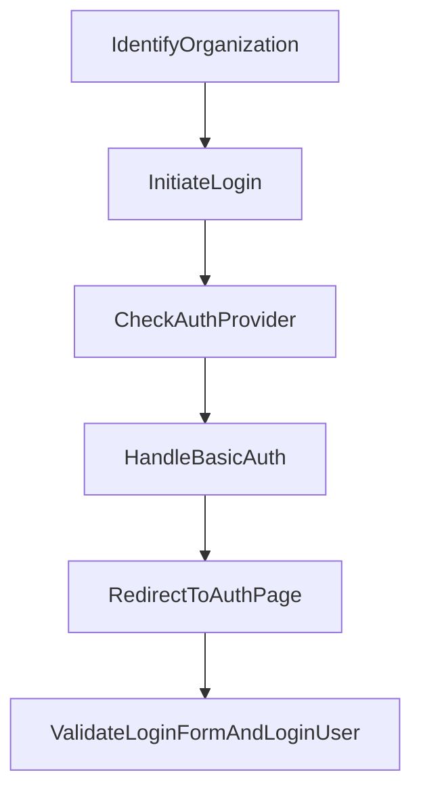

This document will cover the process of user authentication in Sentry, which includes: 1. Identifying the organization based on the provided slug. 2. Initiating the login process for a POST request. 3. Handling basic authentication if no specific auth provider is found for the organization. 4. Redirecting to the organization's auth page for a GET request. 5. Validating the login form and logging in the user for a POST request.

Technical document: <SwmLink doc-title="Understanding the Handle Functions">[Understanding the Handle Functions](/.swm/understanding-the-handle-functions.symqgs03.sw.md)</SwmLink>

# Identifying the Organization

The first step in the authentication process is to identify the organization based on the provided slug. If the organization is not found, the user is redirected to the login page.

# Initiating the Login Process

If the organization is found and the request method is a POST request, the login process is initiated. This is to handle multiple tabs case well now that we include redirect in url.

# Checking for Auth Provider

The system then checks if an auth provider exists for the organization. If no auth provider is found, it proceeds to handle basic authentication.

# Handling Basic Authentication

Basic authentication handles GET and POST requests for registration and login. If the request method is GET and the organization exists, it redirects to the organization's auth page.

# Validating Login Form and Logging in User

If the request method is POST, it checks if the operation is a login attempt. If it is, it validates the login form and logs in the user if the form is valid. If the user is not active, it redirects to the reactivate account page. If the user is active, it checks the login state of the organization and sets the active organization if the user is not a superuser.

&nbsp;

*This is an auto-generated document by Swimm AI 🌊 and has not yet been verified by a human*

<SwmMeta version="3.0.0" repo-id="Z2l0aHViJTNBJTNBc2VudHJ5LWRlbW8lM0ElM0FTd2ltbS1EZW1v" repo-name="sentry-demo" doc-type="product-flows">Powered by [Swimm](/)</SwmMeta>
