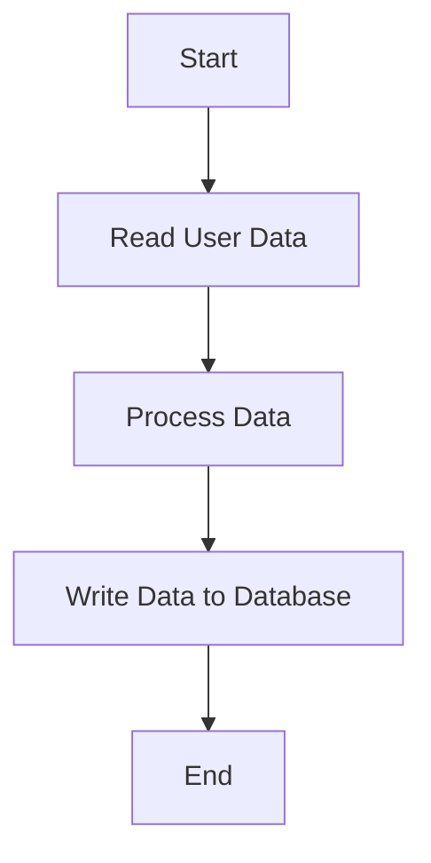

This document will cover the User Import Process in Sentry, which includes:

1. Reading user data from a source file
2. Processing the data
3. Writing it to the database.

Technical document: <SwmLink doc-title="Understanding the User Import Process">[Understanding the User Import Process](/.swm/understanding-the-user-import-process.6cpuvmb7.sw.md)</SwmLink>

# Reading User Data

The user import process begins with reading user data from a source file. This file contains all the necessary information about the users that need to be imported into the system. The data is encrypted for security purposes and requires decryption keys to access. Additionally, user filters can be applied to select specific users from the source file.

# Processing Data

Once the user data is read from the source file, it is processed. This involves importing the data in the User scope, meaning that only models with User will be imported from the provided source file. The user filter argument allows imports to be filtered by username. If the argument is set to None, there is no filtering, meaning all encountered users are imported. The data is then prepared for writing to the database.

# Writing Data to Database

After processing, the data is written to the database. This involves iterating over the JSON models and writing each one to the database. Additionally, organization slugs are resolved from the primary key map and created in bulk. This ensures that each organization has a unique identifier in the system. Finally, the data is saved into the eventstream after normalizing and processing it. Adjacent models such as releases and environments are also saved to the database.

&nbsp;

*This is an auto-generated document by Swimm AI 🌊 and has not yet been verified by a human*

<SwmMeta version="3.0.0" repo-id="Z2l0aHViJTNBJTNBc2VudHJ5LWRlbW8lM0ElM0FTd2ltbS1EZW1v" repo-name="sentry-demo" doc-type="product-flows">Powered by [Swimm](/)</SwmMeta>
