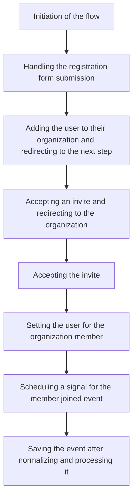

This document will cover the User Registration Flow in Sentry. We'll cover:

1. The initiation of the flow
2. Handling the registration form submission
3. Adding the user to their organization and redirecting to the next step
4. Accepting an invite and redirecting to the organization
5. Accepting the invite
6. Setting the user for the organization member
7. Scheduling a signal for the member joined event
8. Saving the event after normalizing and processing it.

Technical document: <SwmLink doc-title="Understanding the Post Flow">[Understanding the Post Flow](/.swm/understanding-the-post-flow.msdudxsc.sw.md)</SwmLink>

# Initiation of the Flow

The flow begins with the handling of an HTTP POST request. Depending on the operation specified in the request, it either redirects to Single Sign-On (SSO) or handles the registration or login form submission.

# Handling the Registration Form Submission

The registration form is validated. If the form is valid, a new user is created and the flow proceeds to the next registration step. If the form is not valid, it is returned with its errors displayed.

# Adding the User to Their Organization and Redirecting to the Next Step

The user is added to their organization, any pending invites are accepted, and the user is redirected to their next step. If the application is in single organization mode and there's no pending invitation, the user is associated with the only organization.

# Accepting an Invite and Redirecting to the Organization

An invite is accepted on behalf of a user and they are redirected to their organization login.

# Accepting the Invite

The invite for a user is accepted. If the user is already a member, the existing member scenario is handled. If the user is not a member, the user is set for the organization member and a signal for the member joined event is scheduled.

# Setting the User for the Organization Member

A user is set for an organization member. If the user is already a member of the organization, the member is returned. If the user is not a member, the user is set for the organization member and the changes are saved.

# Scheduling a Signal for the Member Joined Event

A signal for the member joined event is scheduled. The signal is added to the outbox for the organization scope.

# Saving the Event After Normalizing and Processing It

The event is saved after it has been normalized and processed. Adjacent models such as releases and environments are saved to the database and the event is written into the event stream. From there, it will be picked up by Snuba and post-processing.

&nbsp;

*This is an auto-generated document by Swimm AI 🌊 and has not yet been verified by a human*

<SwmMeta version="3.0.0" repo-id="Z2l0aHViJTNBJTNBc2VudHJ5LWRlbW8lM0ElM0FTd2ltbS1EZW1v" repo-name="sentry-demo" doc-type="product-flows">Powered by [Swimm](/)</SwmMeta>
