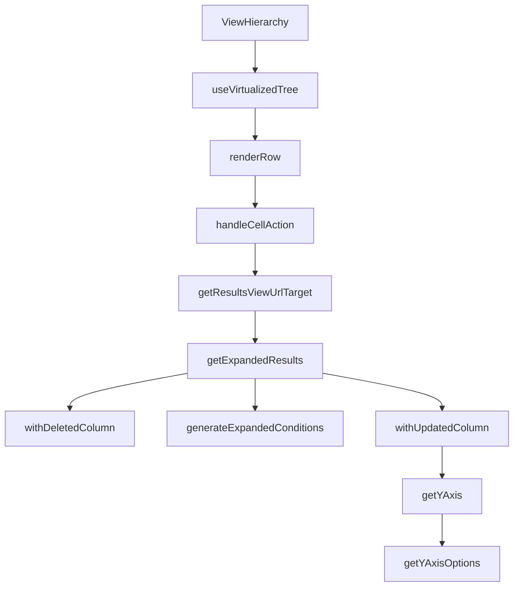

This document will cover the 'ViewHierarchy' feature in the Sentry application. We'll cover:

1. The purpose of the ViewHierarchy feature
2. The process of rendering each row in the hierarchy
3. The role of the 'useVirtualizedTree' hook
4. The process of handling actions on each cell in the row
5. The generation of the URL for the results view
6. The conversion of an aggregated query into one that does not have aggregates.

Technical document: <SwmLink doc-title="Understanding ViewHierarchy">[Understanding ViewHierarchy](/.swm/understanding-viewhierarchy.6u63pwtz.sw.md)</SwmLink>

# Purpose of the ViewHierarchy feature

The ViewHierarchy feature is the starting point of the flow. It sets up the state and organizes the hierarchy of views. This feature is crucial for the user interface as it determines how the views are displayed to the user.

# Rendering each row in the hierarchy

Each row in the hierarchy is rendered by the 'renderRow' function. This function is responsible for displaying each row in the transactions table. It uses the 'handleCellAction' function to handle actions on each cell in the row. This ensures that the user can interact with each cell in the row.

# Role of the 'useVirtualizedTree' hook

The 'useVirtualizedTree' hook is used to create a virtualized tree of the hierarchy. It takes in the 'renderRow' function from 'ViewHierarchy' and uses it to render each row. It also handles scrolling and selection of nodes in the tree. This hook is crucial for the performance of the application as it optimizes the rendering of the hierarchy.

# Handling actions on each cell in the row

The 'handleCellAction' function handles actions on each cell in the row. Depending on the action, it may modify the query and navigate to a new view. This function is crucial for the user experience as it allows the user to interact with the cells in the row and navigate to different views based on their actions.

# Generation of the URL for the results view

The 'getResultsViewUrlTarget' method is used to generate the URL for the results view based on the current state of the event view. This ensures that the user is directed to the correct view based on their actions.

# Conversion of an aggregated query into one that does not have aggregates

The 'getExpandedResults' function is the starting point of the flow. It converts an aggregated query into one that does not have aggregates. It also applies additional conditions and generates conditions based on the 'dataRow' parameter and the current fields in the 'eventView'. This function is crucial for the accuracy of the results displayed to the user.

&nbsp;

*This is an auto-generated document by Swimm AI 🌊 and has not yet been verified by a human*

<SwmMeta version="3.0.0" repo-id="Z2l0aHViJTNBJTNBc2VudHJ5LWRlbW8lM0ElM0FTd2ltbS1EZW1v" repo-name="sentry-demo" doc-type="product-flows">Powered by [Swimm](/)</SwmMeta>
