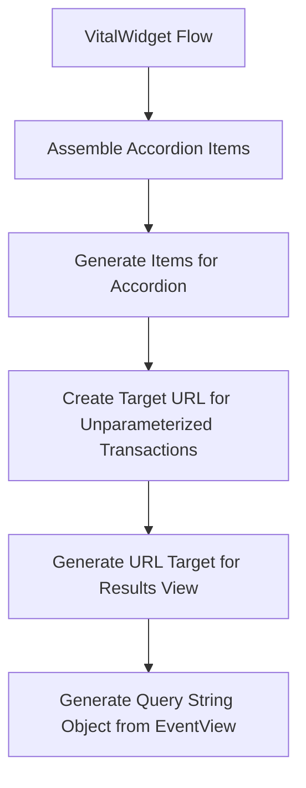

This document will cover the 'VitalWidget Flow' feature of the Sentry application. We'll cover:

1. The purpose of the VitalWidget Flow
2. The process of assembling accordion items
3. The generation of items for the accordion
4. The creation of a target URL for unparameterized transactions
5. The generation of a URL target for the results view
6. The generation of a query string object from the EventView.

Technical document: <SwmLink doc-title="Understanding the VitalWidget Flow">[Understanding the VitalWidget Flow](/.swm/understanding-the-vitalwidget-flow.1bexgj0n.sw.md)</SwmLink>

# Purpose of the VitalWidget Flow

The VitalWidget Flow is the starting point of the feature. It sets up the widget's state and defines several helper functions and components. It also defines the logic for fetching the data needed for the widget.

# Assembling Accordion Items

The assembleAccordionItems function is called within the VitalWidget Flow. It uses the getItems function to generate a list of items. For each item, it creates an object with a header and content. The content is generated by the getChart function.

# Generating Items for the Accordion

The getItems function is used to generate a list of items for the accordion. It takes the widget data and maps it to a list of items. Each item is a transaction with additional data and a target URL. The target URL is generated by either transactionSummaryRouteWithQuery or createUnnamedTransactionsDiscoverTarget depending on whether the transaction is unparameterized.

# Creating a Target URL for Unparameterized Transactions

The createUnnamedTransactionsDiscoverTarget function is used to create a target URL for unparameterized transactions. It creates a new EventView with a specific query and then generates a URL target for the results view.

# Generating a URL Target for the Results View

The getResultsViewUrlTarget method is used to generate a URL target for the results view of an EventView. It takes the organization slug and a flag indicating whether it's the homepage.

# Generating a Query String Object from the EventView

The generateQueryStringObject method is used to generate a query string object from the EventView. This object includes all the necessary parameters for the results view URL.

&nbsp;

*This is an auto-generated document by Swimm AI 🌊 and has not yet been verified by a human*

<SwmMeta version="3.0.0" repo-id="Z2l0aHViJTNBJTNBc2VudHJ5LWRlbW8lM0ElM0FTd2ltbS1EZW1v" repo-name="sentry-demo" doc-type="product-flows">Powered by [Swimm](/)</SwmMeta>
