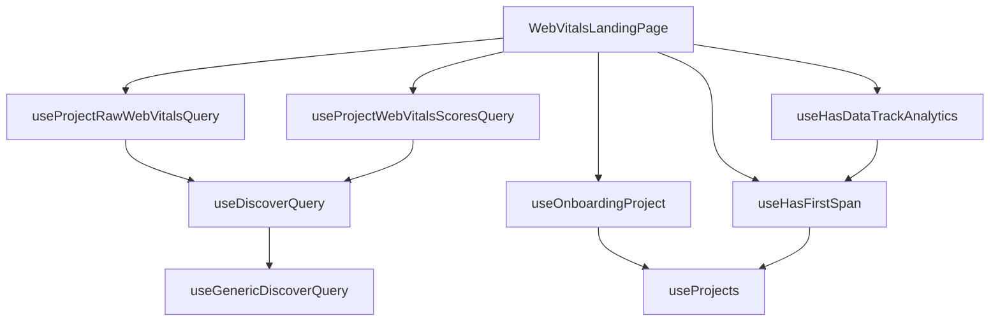

This document will cover the Web Vitals Landing Page feature, which includes:

1. Fetching and managing the state of the page
2. Defining the layout and components of the page
3. Fetching raw web vitals data for a project
4. Tracking whether a module has ever sent data
5. Fetching the onboarding project for the current selection
6. Checking if the current project selection has received a first insight span for a given module
7. Fetching the web vitals scores for a project.

Technical document: <SwmLink doc-title="Understanding WebVitalsLandingPage">[Understanding WebVitalsLandingPage](/.swm/understanding-webvitalslandingpage.gygantdm.sw.md)</SwmLink>

# Fetching and Managing the State of the Page

The Web Vitals Landing Page is the main entry point for the Web Vitals feature. It fetches and manages the state of the page, including the organization, location, onboarding project, and module data. It also defines the layout and components that make up the page.

# Fetching Raw Web Vitals Data for a Project

The useProjectRawWebVitalsQuery hook fetches raw web vitals data for a project. It constructs a query based on the provided parameters, such as transaction, tag, dataset, and browser types. This data is then used to populate the Web Vitals Landing Page.

# Tracking Whether a Module Has Ever Sent Data

The useHasDataTrackAnalytics hook tracks whether a module has ever sent data. This information is sent to Sentry for analytics and can be used to understand the usage of different modules.

# Fetching the Onboarding Project for the Current Selection

The useOnboardingProject hook fetches the onboarding project for the current selection. It uses the useProjects hook to get all projects and then filters them based on the current selection. This allows the Web Vitals Landing Page to display data relevant to the selected project.

# Checking if the Current Project Selection Has Received a First Insight Span for a Given Module

The useHasFirstSpan hook checks if the current project selection has received a first insight span for a given module. This information is used to determine whether to display data for that module on the Web Vitals Landing Page.

# Fetching the Web Vitals Scores for a Project

The useProjectWebVitalsScoresQuery hook fetches the web vitals scores for a project. It constructs a query based on the provided parameters and uses the useDiscoverQuery hook to execute the query. The fetched scores are then displayed on the Web Vitals Landing Page.

&nbsp;

*This is an auto-generated document by Swimm AI 🌊 and has not yet been verified by a human*

<SwmMeta version="3.0.0" repo-id="Z2l0aHViJTNBJTNBc2VudHJ5LWRlbW8lM0ElM0FTd2ltbS1EZW1v" repo-name="sentry-demo" doc-type="product-flows">Powered by [Swimm](/)</SwmMeta>
