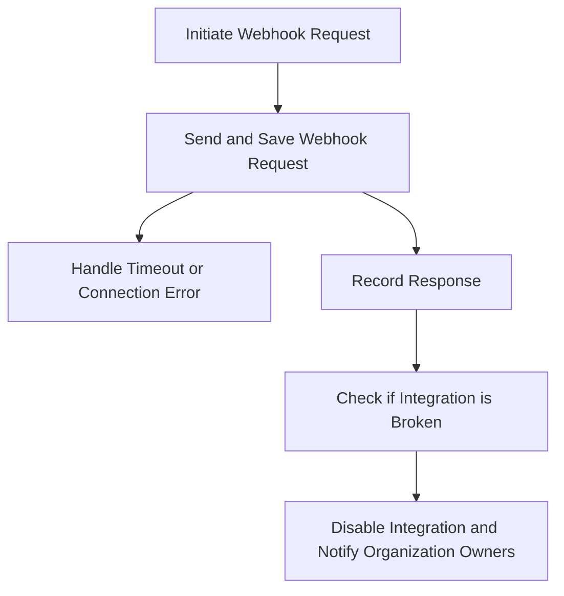

This document will cover the Webhook Request Flow in Sentry, which includes:

1. Initiating the webhook request
2. Sending and saving the webhook request
3. Handling timeouts and connection errors
4. Recording the response and checking if the integration is broken
5. Disabling the integration and notifying the organization owners.

Technical document: <SwmLink doc-title="Webhook Request Flow">[Webhook Request Flow](/.swm/webhook-request-flow.idvnkmx1.sw.md)</SwmLink>

# Initiating the Webhook Request

The process begins by initiating a webhook request. This is the first step in the flow where we verify the action that triggered the request.

# Sending and Saving the Webhook Request

The next step is to send the webhook request and save it. This involves notifying the SentryApp's webhook about an incident and logging the response on Redis. The URL to hit for this webhook is either provided or defaults to the `sentry_app.webhook_url`.

# Handling Timeouts and Connection Errors

If a timeout or connection error occurs during the process, it is recorded in the integration buffer. This is to check if the integration is broken and should be disabled.

# Recording the Response and Checking if the Integration is Broken

The response of a webhook request is recorded. If the response is successful, it records the success. If the response is an error, it records the error and checks if the integration is broken.

# Disabling the Integration and Notifying the Organization Owners

If the integration is found to be broken, it is disabled. The owners of the organization are then notified about the disabled integration. This notification is sent asynchronously to the owners of the organization.

&nbsp;

*This is an auto-generated document by Swimm AI 🌊 and has not yet been verified by a human*

<SwmMeta version="3.0.0" repo-id="Z2l0aHViJTNBJTNBc2VudHJ5LWRlbW8lM0ElM0FTd2ltbS1EZW1v" repo-name="sentry-demo" doc-type="product-flows">Powered by [Swimm](/)</SwmMeta>
