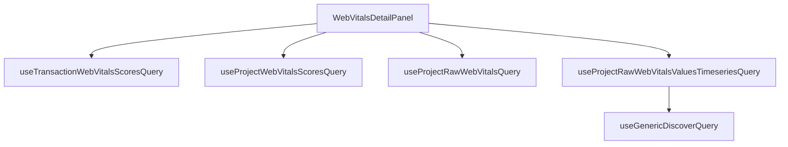

This document will cover the WebVitalsDetailPanel feature, which includes:

1. Displaying detailed information about web vitals
2. Fetching and processing necessary data
3. Closing the panel

Technical document: <SwmLink doc-title="Understanding the WebVitalsDetailPanel">[Understanding the WebVitalsDetailPanel](/.swm/understanding-the-webvitalsdetailpanel.1sraginy.sw.md)</SwmLink>

# Displaying detailed information about web vitals

The WebVitalsDetailPanel is a feature that displays detailed information about web vitals. This information is crucial for users to understand the performance of their web applications. The type of web vital to display details for is specified by the user.

# Fetching and processing necessary data

To display the detailed information, the WebVitalsDetailPanel fetches and processes the necessary data. This is done through several hooks and queries. These hooks and queries fetch the web vitals scores for a specific transaction or project, and the raw web vitals data for a specific project. The data is then processed and returned in a specific format for display.

# Closing the panel

The WebVitalsDetailPanel also includes a feature to close the panel. This is done through an onClose callback function. When the panel is closed, this function is called.

&nbsp;

*This is an auto-generated document by Swimm AI 🌊 and has not yet been verified by a human*

<SwmMeta version="3.0.0" repo-id="Z2l0aHViJTNBJTNBc2VudHJ5LWRlbW8lM0ElM0FTd2ltbS1EZW1v" repo-name="sentry-demo" doc-type="product-flows">Powered by [Swimm](/)</SwmMeta>
