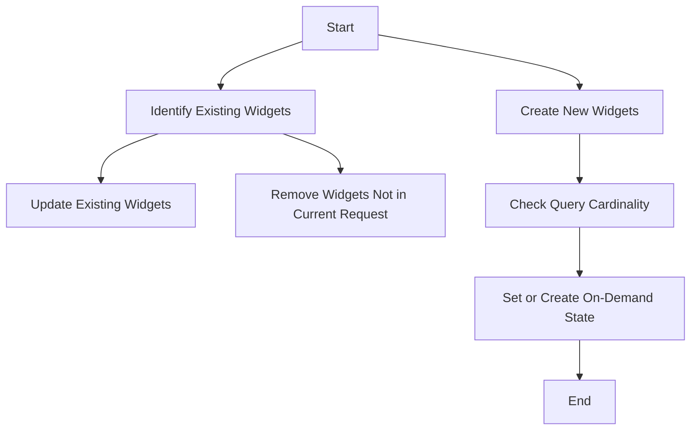

This document will provide a detailed explanation of the Widget Update Flow in Sentry. We'll cover the following aspects:

1. The purpose of the Widget Update Flow
2. The process of identifying and updating existing widgets
3. The process of creating new widgets
4. The role of query cardinality in widget creation
5. The conditions for setting or creating the on-demand state of queries.

Technical document: <SwmLink doc-title="Understanding the Widget Update Flow">[Understanding the Widget Update Flow](/.swm/understanding-the-widget-update-flow.0b28cumd.sw.md)</SwmLink>

# Purpose of the Widget Update Flow

The Widget Update Flow is a crucial part of Sentry's dashboard management system. It is responsible for updating the state of widgets on a dashboard. This involves identifying existing widgets, removing any that are not in the current request, and updating or creating widgets based on the provided data.

# Identifying and Updating Existing Widgets

The Widget Update Flow begins by identifying existing widgets. It does this by comparing the widget IDs in the current request with those in the database. Any widgets that are not in the current request are removed. For the widgets that do exist, their properties are updated based on the data provided in the request. This includes the widget's title, description, thresholds, display type, interval, widget type, and other properties.

# Creating New Widgets

If a widget does not already exist, the Widget Update Flow creates a new one. The new widget is created with properties based on the data provided in the request. This includes the widget's display type, title, description, thresholds, interval, widget type, and other properties. The new widget is also associated with new queries, which are created based on the 'queries' data in the request.

# Role of Query Cardinality in Widget Creation

When creating a new widget, the Widget Update Flow checks the cardinality of the queries associated with the widget. Cardinality refers to the number of distinct values in a column. If the cardinality is within the allowed limit, the Widget Update Flow proceeds to the next step. If not, the widget creation process is halted.

# Setting or Creating the On-Demand State of Queries

The final step in the Widget Update Flow is setting or creating the on-demand state of the queries associated with the widget. This is based on various conditions such as the number of specs, cardinality, and whether the feature is enabled. The on-demand state determines whether the queries are executed immediately or scheduled for later execution.

&nbsp;

*This is an auto-generated document by Swimm AI 🌊 and has not yet been verified by a human*

<SwmMeta version="3.0.0" repo-id="Z2l0aHViJTNBJTNBc2VudHJ5LWRlbW8lM0ElM0FTd2ltbS1EZW1v" repo-name="sentry-demo" doc-type="product-flows">Powered by [Swimm](/)</SwmMeta>
