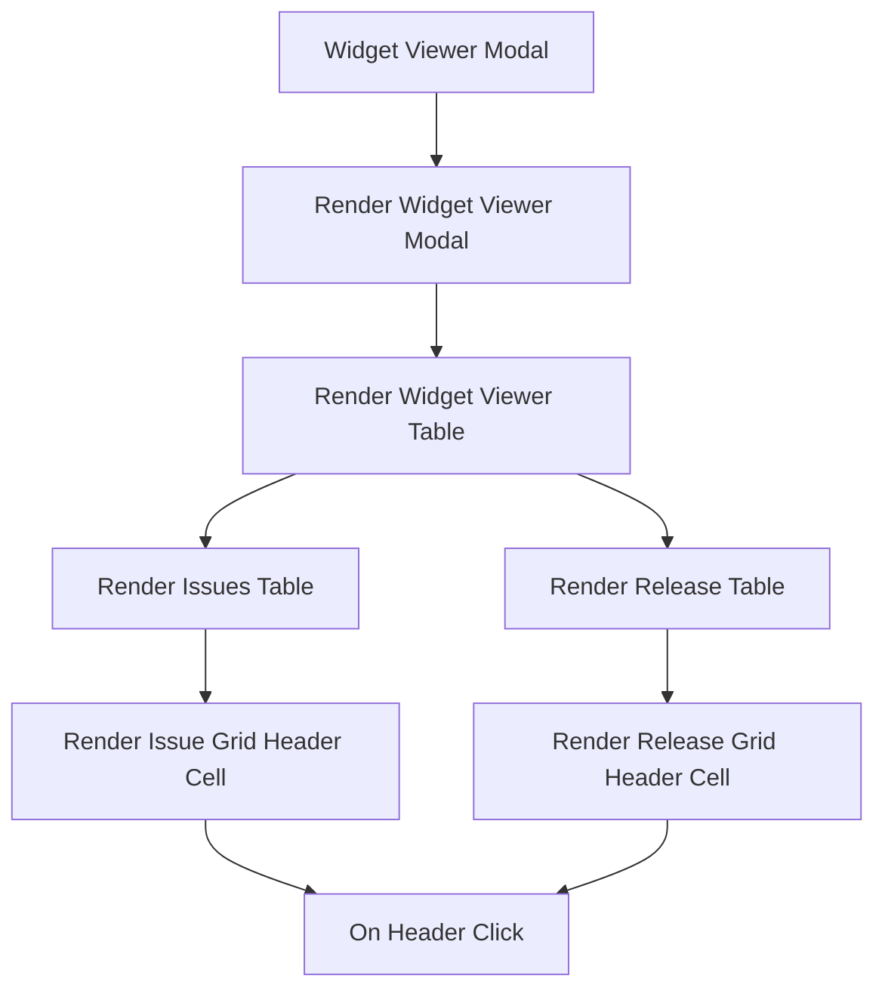

This document will cover the 'Widget Viewer Modal' feature in the Sentry application. We'll cover:

1. The purpose of the Widget Viewer Modal
2. The process of rendering the Widget Viewer Modal
3. The rendering of different tables within the modal
4. The sorting functionality in the tables.

Technical document: <SwmLink doc-title="Understanding the WidgetViewerModal">[Understanding the WidgetViewerModal](/.swm/understanding-the-widgetviewermodal.zyrzggxh.sw.md)</SwmLink>

# Purpose of the Widget Viewer Modal

The Widget Viewer Modal is a feature in the Sentry application that provides a detailed view of a specific widget. It is designed to display various types of data in a modal format, providing users with a comprehensive view of the widget's data.

# Rendering the Widget Viewer Modal

The process of rendering the Widget Viewer Modal begins with the 'WidgetViewerModal' function. This function sets up the state and behavior of the modal, using various properties and hooks. It also determines whether a slider should be shown in the modal based on the organization's features.

# Rendering Tables within the Modal

Within the Widget Viewer Modal, different tables are rendered based on the widget type. For instance, if the widget type is 'ISSUE', the 'renderIssuesTable' function is called. This function renders the issues table, setting up the grid editable component and handling pagination. It also tracks analytics for pagination events. If the widget type is 'RELEASE', the 'renderReleaseTable' function is called. This function is responsible for rendering the table of releases.

# Sorting Functionality in the Tables

The tables within the Widget Viewer Modal have sorting functionality. The 'renderIssueGridHeaderCell' and 'renderReleaseGridHeaderCell' functions are used to render the header cells of the issues grid and the release table respectively. These functions set up the sorting functionality for the columns and track analytics for sort events. When a header cell is clicked, the 'onHeaderClick' function is triggered. This function checks the widget's display type and if the widget has a limit defined. If any of these conditions are met, it sets the chart to be modifiable.

&nbsp;

*This is an auto-generated document by Swimm AI 🌊 and has not yet been verified by a human*

<SwmMeta version="3.0.0" repo-id="Z2l0aHViJTNBJTNBc2VudHJ5LWRlbW8lM0ElM0FTd2ltbS1EZW1v" repo-name="sentry-demo" doc-type="product-flows">Powered by [Swimm](/)</SwmMeta>
