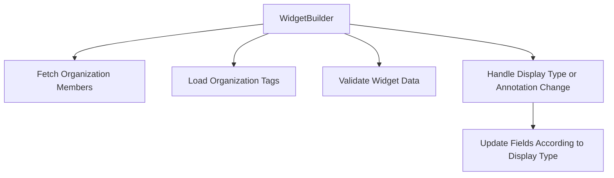

This document will cover the 'WidgetBuilder' feature in the Sentry application. We'll cover:

1. The purpose of the WidgetBuilder
2. Fetching organization members
3. Loading organization tags
4. Validating widget data
5. Handling display type or annotation change
6. Updating fields according to display type.

Technical document: <SwmLink doc-title="Understanding WidgetBuilder">[Understanding WidgetBuilder](/.swm/understanding-widgetbuilder.vyovmwc2.sw.md)</SwmLink>

# Purpose of the WidgetBuilder

The WidgetBuilder is a key component in the Sentry application. It is responsible for building widgets, which are visual representations of data, in the application. The WidgetBuilder takes in various parameters such as the widget index, organization ID, dashboard ID, source, display type, default title, limit, and dataset from the location query. It uses various states and hooks to manage the widget building process.

# Fetching Organization Members

The WidgetBuilder fetches the members of an organization. This is done by making a GET request to the organization's users endpoint. If the request is successful, it filters the members to get the users and loads them into the MemberListStore. This allows the WidgetBuilder to have access to the members of the organization.

# Loading Organization Tags

The WidgetBuilder loads the tags of an organization based on a global selection value. This is done by making a GET request to the organization's tags endpoint. If the request is successful, it triggers the tagFetchSuccess function. This allows the WidgetBuilder to have access to the tags of the organization.

# Validating Widget Data

The WidgetBuilder validates the widget data. It calls the validateWidget function with the API, organization slug, and widget data as parameters. If the validation is successful, it returns true, otherwise, it sets the loading state to false and returns false. This ensures that the widget data is valid before it is used in the WidgetBuilder.

# Handling Display Type or Annotation Change

The WidgetBuilder handles changes in the display type or annotation of the widget. It updates the state based on the new value and calls the updateFieldsAccordingToDisplayType function if the display type has changed. This allows the WidgetBuilder to adapt to changes in the display type or annotation of the widget.

# Updating Fields According to Display Type

The WidgetBuilder updates the fields of the widget according to the new display type. It checks if the new display type is supported by the current dataset and updates the state accordingly. It also normalizes the queries and sets the limit based on the new display type. This ensures that the widget fields are updated according to the new display type.

&nbsp;

*This is an auto-generated document by Swimm AI 🌊 and has not yet been verified by a human*

<SwmMeta version="3.0.0" repo-id="Z2l0aHViJTNBJTNBc2VudHJ5LWRlbW8lM0ElM0FTd2ltbS1EZW1v" repo-name="sentry-demo" doc-type="product-flows">Powered by [Swimm](/)</SwmMeta>
