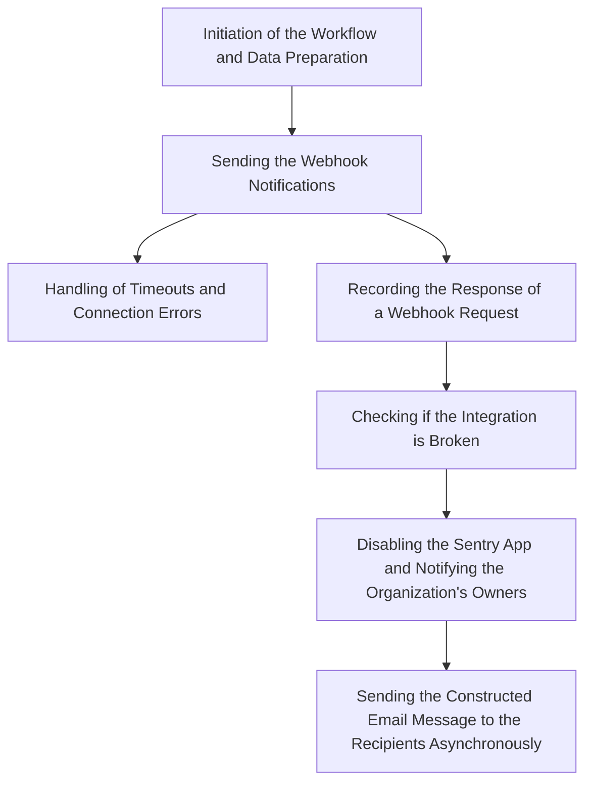

This document will cover the Workflow Notification Process in Sentry. We'll cover:

1. The initiation of the workflow and data preparation.
2. Sending the webhook notifications.
3. Handling of timeouts and connection errors.
4. Recording the response of a webhook request.
5. Checking if the integration is broken.
6. Disabling the Sentry App and notifying the organization's owners.
7. Sending the constructed email message to the recipients asynchronously.

Technical document: <SwmLink doc-title="Workflow Notification Process">[Workflow Notification Process](/.swm/workflow-notification-process.yqfvbzgy.sw.md)</SwmLink>

# Initiation of the Workflow and Data Preparation

The Workflow Notification Process begins with the preparation of data for the webhook. This data includes the details of the issue and any additional data passed. The function then triggers the next step in the process, which is to send the webhook notifications.

# Sending the Webhook Notifications

The system checks if the event is registered in the service hook. If it is, it prepares the request data and calls the function to send the webhook request and log the response. If the request times out or a connection error occurs, it records the timeout and re-raises the exception. If the response is not an alert event, it records the response for disabling integration.

# Handling of Timeouts and Connection Errors

If a request times out or a connection error occurs, the system records the timeout or connection error in the integration buffer. It then checks if the integration is broken and should be disabled.

# Recording the Response of a Webhook Request

The system records the response of a webhook request for a specific Sentry App. If the response indicates an error, it triggers the function to check if the integration is broken.

# Checking if the Integration is Broken

The system checks if the integration is broken by examining the buffer of requests. If the integration is broken, it disables the Sentry App and triggers the function to notify the organization's owners that the integration has been disabled.

# Disabling the Sentry App and Notifying the Organization's Owners

The system notifies the organization's owners that the integration has been disabled. It constructs a message with the integration details and sends it asynchronously.

# Sending the Constructed Email Message to the Recipients Asynchronously

The final step in the Workflow Notification Process is to send the constructed email message to the recipients asynchronously.

&nbsp;

*This is an auto-generated document by Swimm AI 🌊 and has not yet been verified by a human*

<SwmMeta version="3.0.0" repo-id="Z2l0aHViJTNBJTNBc2VudHJ5LWRlbW8lM0ElM0FTd2ltbS1EZW1v" repo-name="sentry-demo" doc-type="product-flows">Powered by [Swimm](/)</SwmMeta>
