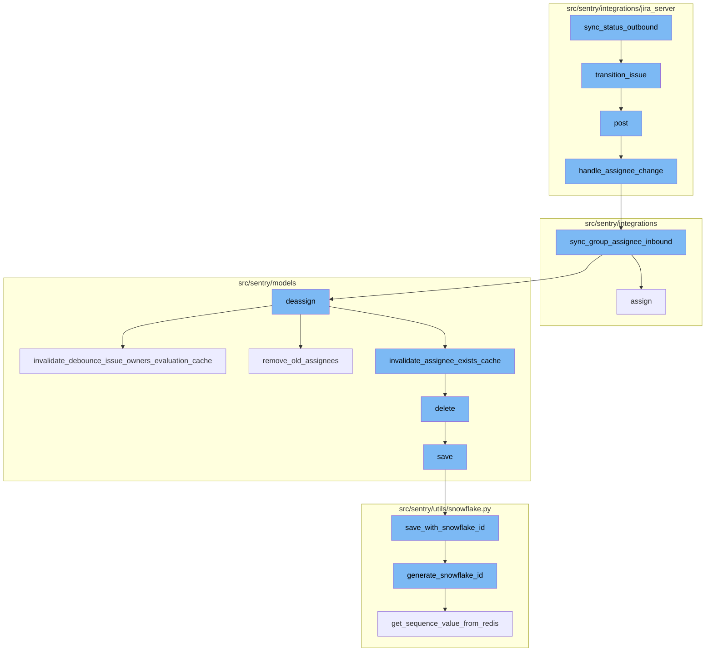
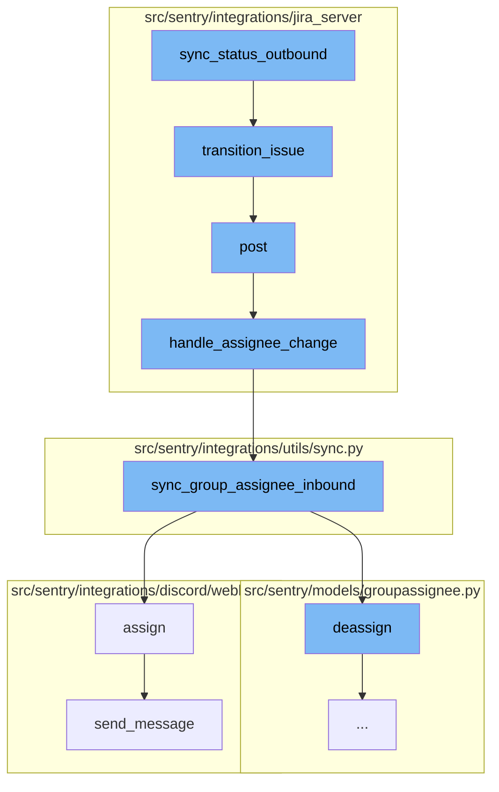
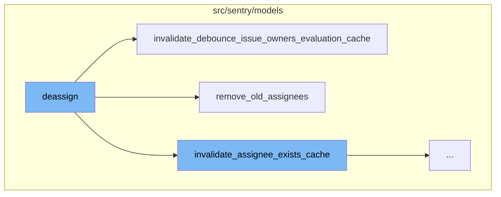
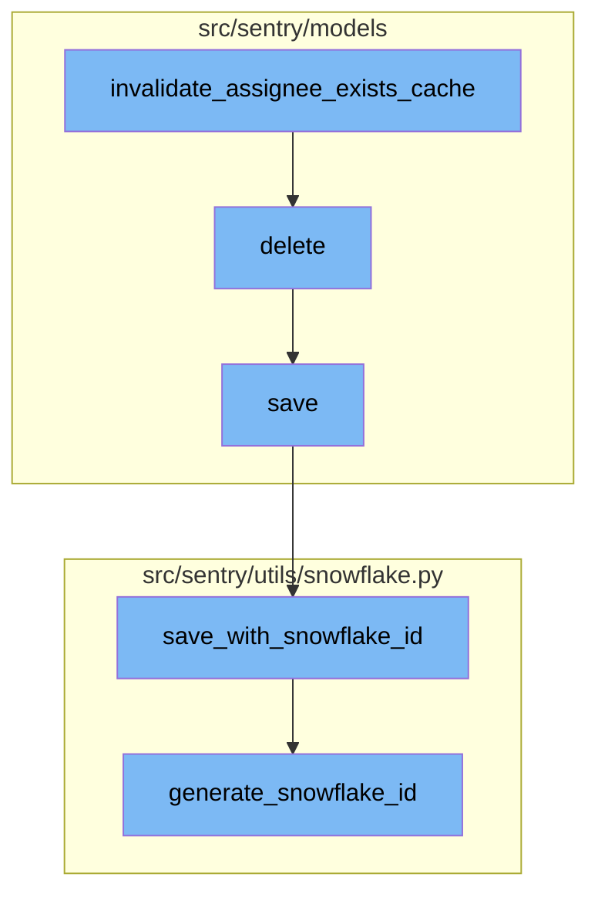

# Overview of sync_status_outbound

The `sync_status_outbound` is a function that initiates a series of operations to synchronize the status of an issue between Sentry and an external system, such as Jira. The process begins with the `sync_status_outbound` function, which checks if the status of a Sentry issue needs to be updated in the linked external issue. If an update is required, it triggers a transition in the external issue.

<SwmSnippet path="/src/sentry/integrations/jira_server/integration.py" line="1088">

---

# Overview of sync_status_outbound

Here is where the `sync_status_outbound` function is defined. It fetches the issue from Jira and checks if the status needs to be updated. If so, it fetches the possible transitions for the issue and applies the appropriate one.

```python
    def sync_status_outbound(self, external_issue, is_resolved, project_id, **kwargs):
        """
        Propagate a sentry issue's status to a linked issue's status.
        """
        client = self.get_client()
        jira_issue = client.get_issue(external_issue.key)
        jira_project = jira_issue["fields"]["project"]

        external_project = integration_service.get_integration_external_project(
            organization_id=external_issue.organization_id,
            integration_id=external_issue.integration_id,
            external_id=jira_project["id"],
        )
        if not external_project:
            return

        jira_status = (
            external_project.resolved_status if is_resolved else external_project.unresolved_status
        )

        # don't bother updating if it's already the status we'd change it to
```

---

</SwmSnippet>

<SwmSnippet path="/src/sentry/integrations/jira_server/client.py" line="196">

---

The `transition_issue` function is used to apply a transition to a Jira issue. It makes a POST request to the Jira API with the issue key and the transition id.

```python
    def transition_issue(self, issue_key, transition_id):
        return self.post(
            self.TRANSITION_URL % issue_key, data={"transition": {"id": transition_id}}
        )
```

---

</SwmSnippet>

<SwmSnippet path="/src/sentry/integrations/jira_server/webhooks.py" line="63">

---

The `post` function handles incoming webhooks from Jira. It validates the token, parses the request data, and calls the `handle_assignee_change` function if the assignee has changed.

```python
    def post(self, request: Request, token, *args, **kwargs) -> Response:
        clear_tags_and_context()
        extra = {}
        try:
            integration = get_integration_from_token(token)
            extra["integration_id"] = integration.id
        except ValueError as err:
            extra.update({"token": token, "error": str(err)})
            logger.warning("token-validation-error", extra=extra)
            metrics.incr("jira_server.webhook.invalid_token")
            return self.respond(status=400)

        data = request.data

        # Note: If we ever process more webhooks from jira server
        # we also need to update JiraServerRequestParser
        if not data.get("changelog"):
            logger.info("missing-changelog", extra=extra)
            return self.respond()

        try:
```

---

</SwmSnippet>

<SwmSnippet path="/src/sentry/integrations/jira_server/utils/api.py" line="25">

---

The `handle_assignee_change` function checks if the assignee has changed and if so, it calls the `sync_group_assignee_inbound` function with the appropriate parameters.

```python
def handle_assignee_change(
    integration: RpcIntegration | Integration,
    data: Mapping[str, Any],
) -> None:
    assignee_changed = any(
        item for item in data["changelog"]["items"] if item["field"] == "assignee"
    )
    if not assignee_changed:
        return

    fields = data["issue"]["fields"]

    # If there is no assignee, assume it was unassigned.
    assignee = fields.get("assignee")
    issue_key = data["issue"]["key"]

    if assignee is None:
        sync_group_assignee_inbound(integration, None, issue_key, assign=False)
        return

    email = get_assignee_email(integration, assignee)
```

---

</SwmSnippet>

<SwmSnippet path="/src/sentry/integrations/utils/sync.py" line="64">

---

The `sync_group_assignee_inbound` function assigns linked groups to matching users. It checks project membership and returns a list of groups that were successfully assigned.

```python
def sync_group_assignee_inbound(
    integration: RpcIntegration,
    email: str | None,
    external_issue_key: str,
    assign: bool = True,
) -> Sequence[Group]:
    """
    Given an integration, user email address and an external issue key,
    assign linked groups to matching users. Checks project membership.
    Returns a list of groups that were successfully assigned.
    """

    logger = logging.getLogger(f"sentry.integrations.{integration.provider}")

    orgs_with_sync_enabled = where_should_sync(integration, "inbound_assignee")
    affected_groups = Group.objects.get_groups_by_external_issue(
        integration,
        orgs_with_sync_enabled,
        external_issue_key,
    )
    log_context = {
```

---

</SwmSnippet>

<SwmSnippet path="/src/sentry/integrations/discord/webhooks/message_component.py" line="137">

---

The `assign` function updates the group with the selected assignee and sends a message to Discord indicating that the assignee has been updated.

```python
    def assign(self) -> Response:
        assignee = self.request.get_selected_options()[0]

        self.update_group(
            {
                "assignedTo": assignee,
                "integration": ActivityIntegration.DISCORD.value,
            }
        )

        logger.info(
            "discord.assign.dialog",
            extra={
                "assignee": assignee,
                "user": self.request.user,
            },
        )

        assert self.request.user is not None

        analytics.record(
```

---

</SwmSnippet>

<SwmSnippet path="/src/sentry/integrations/discord/webhooks/handler.py" line="24">

---

The `send_message` function sends a new follow-up message to Discord. It can either send a new message or update an existing one.

```python
    def send_message(self, message: str | DiscordMessageBuilder, update: bool = False) -> Response:
        """Sends a new follow up message."""
        response_type = DiscordResponseTypes.UPDATE if update else DiscordResponseTypes.MESSAGE

        if isinstance(message, str):
            message = DiscordMessageBuilder(
                content=message, flags=DiscordMessageFlags().set_ephemeral()
            )
        return Response(
            {
                "type": response_type,
                "data": message.build(),
            },
            status=200,
        )
```

---

</SwmSnippet>

# Deassigning and Cleaning Up

Once the status has been synchronized, the process moves on to deassigning and cleaning up. This involves removing the assignment of a group, clearing caches, and removing old assignees.

<SwmSnippet path="/src/sentry/models/groupassignee.py" line="197">

---

# Deassigning and Cleaning Up

The `deassign` function is responsible for removing the assignment of a group. It first checks if there is a previous assignee for the group and if so, it deletes the assignment. It then creates an activity for the unassigned group and records the group history. The function also invalidates the assignee cache for the deassigned group and syncs the Sentry assignee to external issues.

```python
    def deassign(
        self,
        group: Group,
        acting_user: User | RpcUser | None = None,
        assigned_to: Team | RpcUser | None = None,
        extra: dict[str, str] | None = None,
    ) -> None:
        from sentry.integrations.utils import sync_group_assignee_outbound
        from sentry.models.activity import Activity
        from sentry.models.projectownership import ProjectOwnership

        try:
            previous_groupassignee = self.get(group=group)
        except GroupAssignee.DoesNotExist:
            previous_groupassignee = None

        affected = self.filter(group=group)[:1].count()
        self.filter(group=group).delete()

        if affected > 0:
            Activity.objects.create_group_activity(group, ActivityType.UNASSIGNED, user=acting_user)
```

---

</SwmSnippet>

<SwmSnippet path="/src/sentry/models/groupowner.py" line="125">

---

The `invalidate_debounce_issue_owners_evaluation_cache` function is called within the `deassign` function. It clears the debounce issue owners cache for the group that has been deassigned. If a group id is provided, it clears the cache for that specific group. Otherwise, it clears the cache for all groups in a project that had an event within a certain time window.

```python
    def invalidate_debounce_issue_owners_evaluation_cache(cls, project_id, group_id=None):
        """
        If `group_id` is provided, clear the debounce issue owners cache for that group, else clear
        the cache of all groups for a project that had an event within the
        ISSUE_OWNERS_DEBOUNCE_DURATION window.
        """
        if group_id:
            cache.delete(ISSUE_OWNERS_DEBOUNCE_KEY(group_id))
            return

        # Get all the groups for a project that had an event within the ISSUE_OWNERS_DEBOUNCE_DURATION window.
        # Any groups without events in that window would have expired their TTL in the cache.
        queryset = Group.objects.filter(
            project_id=project_id,
            last_seen__gte=timezone.now() - timedelta(seconds=ISSUE_OWNERS_DEBOUNCE_DURATION),
        ).values_list("id", flat=True)

        # Run cache invalidation in batches
        group_id_iter = queryset.iterator(chunk_size=1000)
        while True:
            group_ids = list(itertools.islice(group_id_iter, 1000))
```

---

</SwmSnippet>

<SwmSnippet path="/src/sentry/models/groupassignee.py" line="65">

---

The `remove_old_assignees` function is also called within the `deassign` function. It removes the old assignees from the group. If the previous assignee was a team and the new assignee is a user within that team, the user is not removed. If the new assignee is a team and the old assignee (a user) is in that team, the user is not removed. In all other cases, the old assignee is removed.

```python
    def remove_old_assignees(
        self,
        group: Group,
        previous_assignee: GroupAssignee | None,
        new_assignee_id: int | None = None,
        new_assignee_type: str | None = None,
    ) -> None:
        from sentry.models.team import Team

        if not previous_assignee:
            return

        if (
            features.has("organizations:team-workflow-notifications", group.organization)
            and previous_assignee.team
        ):
            GroupSubscription.objects.filter(
                group=group,
                project=group.project,
                team=previous_assignee.team,
                reason=GroupSubscriptionReason.assigned,
```

---

</SwmSnippet>

# Final Steps

The final steps of the process involve further cache invalidation, deletion of old data, and saving the updated data with a unique identifier.

<SwmSnippet path="/src/sentry/models/groupowner.py" line="152">

---

# Final Steps

The `invalidate_assignee_exists_cache` function is used to clear the assignee exists cache. If a `group_id` is provided, the cache for that specific group is cleared. Otherwise, the cache for all groups within a project that had an event within the `ASSIGNEE_EXISTS_DURATION` window is cleared.

```python
    def invalidate_assignee_exists_cache(cls, project_id, group_id=None):
        """
        If `group_id` is provided, clear the assignee exists cache for that group, else
        clear the cache of all groups for a project that had an event within the
        ASSIGNEE_EXISTS_DURATION window.
        """
        if group_id:
            cache.delete(ASSIGNEE_EXISTS_KEY(group_id))
            return

        # Get all the groups for a project that had an event within the ASSIGNEE_EXISTS_DURATION window.
        # Any groups without events in that window would have expired their TTL in the cache.
        queryset = Group.objects.filter(
            project_id=project_id,
            last_seen__gte=timezone.now() - timedelta(seconds=ASSIGNEE_EXISTS_DURATION),
        ).values_list("id", flat=True)

        # Run cache invalidation in batches
        group_id_iter = queryset.iterator(chunk_size=1000)
        while True:
            group_ids = list(itertools.islice(group_id_iter, 1000))
```

---

</SwmSnippet>

<SwmSnippet path="/src/sentry/models/project.py" line="722">

---

The `delete` function is used to delete a project. It manually cascades the deletion due to the absence of a foreign key relationship. It also removes notification settings for the project.

```python
    def delete(self, **kwargs):
        # There is no foreign key relationship so we have to manually cascade.
        notifications_service.remove_notification_settings_for_project(project_id=self.id)

        with outbox_context(transaction.atomic(router.db_for_write(Project))):
            Project.outbox_for_update(self.id, self.organization_id).save()
            return super().delete(**kwargs)
```

---

</SwmSnippet>

<SwmSnippet path="/src/sentry/models/project.py" line="365">

---

The `save` function is used to save a project. If the project doesn't have a slug, it generates one. If the `SENTRY_USE_SNOWFLAKE` setting is enabled, it saves the project with a snowflake id.

```python
    def save(self, *args, **kwargs):
        if not self.slug:
            lock = locks.get(
                f"slug:project:{self.organization_id}", duration=5, name="project_slug"
            )
            with TimedRetryPolicy(10)(lock.acquire):
                slugify_instance(
                    self,
                    self.name,
                    organization=self.organization,
                    reserved=RESERVED_PROJECT_SLUGS,
                    max_length=50,
                )

        if SENTRY_USE_SNOWFLAKE:
            snowflake_redis_key = "project_snowflake_key"
            save_with_snowflake_id(
                instance=self,
                snowflake_redis_key=snowflake_redis_key,
                save_callback=lambda: super(Project, self).save(*args, **kwargs),
            )
```

---

</SwmSnippet>

<SwmSnippet path="/src/sentry/utils/snowflake.py" line="47">

---

The `save_with_snowflake_id` function is used to save an instance with a snowflake id. It generates a new snowflake id if the instance doesn't have one and then attempts to save the instance.

```python
def save_with_snowflake_id(
    instance: BaseModel, snowflake_redis_key: str, save_callback: Callable[[], object]
) -> None:
    assert uses_snowflake_id(
        instance.__class__
    ), "Only models decorated with uses_snowflake_id can be saved with save_with_snowflake_id()"

    for _ in range(settings.MAX_REDIS_SNOWFLAKE_RETRY_COUNTER):
        if not instance.id:
            instance.id = generate_snowflake_id(snowflake_redis_key)
        try:
            with enforce_constraints(transaction.atomic(using=router.db_for_write(type(instance)))):
                save_callback()
            return
        except IntegrityError:
            instance.id = None  # type: ignore[assignment]  # see typeddjango/django-stubs#2014
    raise MaxSnowflakeRetryError
```

---

</SwmSnippet>

<SwmSnippet path="/src/sentry/utils/snowflake.py" line="113">

---

The `generate_snowflake_id` function is used to generate a unique snowflake id. It uses various segment values such as version id, region id, and time difference to generate the id.

```python
def generate_snowflake_id(redis_key: str) -> int:
    segment_values = {}

    segment_values[VERSION_ID] = msb_0_ordering(settings.SNOWFLAKE_VERSION_ID, VERSION_ID.length)

    try:
        segment_values[REGION_ID] = get_local_region().snowflake_id
    except RegionContextError:  # expected if running in monolith mode
        segment_values[REGION_ID] = NULL_REGION_ID

    current_time = datetime.now().timestamp()
    # supports up to 130 years
    segment_values[TIME_DIFFERENCE] = int(current_time - settings.SENTRY_SNOWFLAKE_EPOCH_START)

    snowflake_id = 0
    (
        segment_values[TIME_DIFFERENCE],
        segment_values[REGION_SEQUENCE],
    ) = get_sequence_value_from_redis(redis_key, segment_values[TIME_DIFFERENCE])

    for segment in BIT_SEGMENT_SCHEMA:
```

---

</SwmSnippet>



# Flow drill down

First, we'll zoom into this section of the flow:



<SwmSnippet path="/src/sentry/integrations/jira_server/integration.py" line="1088">

---

# sync_status_outbound

The `sync_status_outbound` function is responsible for propagating a Sentry issue's status to a linked issue's status. It fetches the issue from Jira and checks if the status needs to be updated. If so, it fetches the possible transitions for the issue and applies the appropriate one.

```python
    def sync_status_outbound(self, external_issue, is_resolved, project_id, **kwargs):
        """
        Propagate a sentry issue's status to a linked issue's status.
        """
        client = self.get_client()
        jira_issue = client.get_issue(external_issue.key)
        jira_project = jira_issue["fields"]["project"]

        external_project = integration_service.get_integration_external_project(
            organization_id=external_issue.organization_id,
            integration_id=external_issue.integration_id,
            external_id=jira_project["id"],
        )
        if not external_project:
            return

        jira_status = (
            external_project.resolved_status if is_resolved else external_project.unresolved_status
        )

        # don't bother updating if it's already the status we'd change it to
```

---

</SwmSnippet>

<SwmSnippet path="/src/sentry/integrations/jira_server/client.py" line="196">

---

# transition_issue

The `transition_issue` function is used to apply a transition to a Jira issue. It makes a POST request to the Jira API with the issue key and the transition id.

```python
    def transition_issue(self, issue_key, transition_id):
        return self.post(
            self.TRANSITION_URL % issue_key, data={"transition": {"id": transition_id}}
        )
```

---

</SwmSnippet>

<SwmSnippet path="/src/sentry/integrations/jira_server/webhooks.py" line="63">

---

# post

The `post` function handles incoming webhooks from Jira. It validates the token, parses the request data, and calls the `handle_assignee_change` function if the assignee has changed.

```python
    def post(self, request: Request, token, *args, **kwargs) -> Response:
        clear_tags_and_context()
        extra = {}
        try:
            integration = get_integration_from_token(token)
            extra["integration_id"] = integration.id
        except ValueError as err:
            extra.update({"token": token, "error": str(err)})
            logger.warning("token-validation-error", extra=extra)
            metrics.incr("jira_server.webhook.invalid_token")
            return self.respond(status=400)

        data = request.data

        # Note: If we ever process more webhooks from jira server
        # we also need to update JiraServerRequestParser
        if not data.get("changelog"):
            logger.info("missing-changelog", extra=extra)
            return self.respond()

        try:
```

---

</SwmSnippet>

<SwmSnippet path="/src/sentry/integrations/jira_server/utils/api.py" line="25">

---

# handle_assignee_change

The `handle_assignee_change` function checks if the assignee has changed and if so, it calls the `sync_group_assignee_inbound` function with the appropriate parameters.

```python
def handle_assignee_change(
    integration: RpcIntegration | Integration,
    data: Mapping[str, Any],
) -> None:
    assignee_changed = any(
        item for item in data["changelog"]["items"] if item["field"] == "assignee"
    )
    if not assignee_changed:
        return

    fields = data["issue"]["fields"]

    # If there is no assignee, assume it was unassigned.
    assignee = fields.get("assignee")
    issue_key = data["issue"]["key"]

    if assignee is None:
        sync_group_assignee_inbound(integration, None, issue_key, assign=False)
        return

    email = get_assignee_email(integration, assignee)
```

---

</SwmSnippet>

<SwmSnippet path="/src/sentry/integrations/utils/sync.py" line="64">

---

# sync_group_assignee_inbound

The `sync_group_assignee_inbound` function assigns linked groups to matching users. It checks project membership and returns a list of groups that were successfully assigned.

```python
def sync_group_assignee_inbound(
    integration: RpcIntegration,
    email: str | None,
    external_issue_key: str,
    assign: bool = True,
) -> Sequence[Group]:
    """
    Given an integration, user email address and an external issue key,
    assign linked groups to matching users. Checks project membership.
    Returns a list of groups that were successfully assigned.
    """

    logger = logging.getLogger(f"sentry.integrations.{integration.provider}")

    orgs_with_sync_enabled = where_should_sync(integration, "inbound_assignee")
    affected_groups = Group.objects.get_groups_by_external_issue(
        integration,
        orgs_with_sync_enabled,
        external_issue_key,
    )
    log_context = {
```

---

</SwmSnippet>

<SwmSnippet path="/src/sentry/integrations/discord/webhooks/message_component.py" line="137">

---

# assign

The `assign` function updates the group with the selected assignee and sends a message to Discord indicating that the assignee has been updated.

```python
    def assign(self) -> Response:
        assignee = self.request.get_selected_options()[0]

        self.update_group(
            {
                "assignedTo": assignee,
                "integration": ActivityIntegration.DISCORD.value,
            }
        )

        logger.info(
            "discord.assign.dialog",
            extra={
                "assignee": assignee,
                "user": self.request.user,
            },
        )

        assert self.request.user is not None

        analytics.record(
```

---

</SwmSnippet>

<SwmSnippet path="/src/sentry/integrations/discord/webhooks/handler.py" line="24">

---

# send_message

The `send_message` function sends a new follow-up message to Discord. It can either send a new message or update an existing one.

```python
    def send_message(self, message: str | DiscordMessageBuilder, update: bool = False) -> Response:
        """Sends a new follow up message."""
        response_type = DiscordResponseTypes.UPDATE if update else DiscordResponseTypes.MESSAGE

        if isinstance(message, str):
            message = DiscordMessageBuilder(
                content=message, flags=DiscordMessageFlags().set_ephemeral()
            )
        return Response(
            {
                "type": response_type,
                "data": message.build(),
            },
            status=200,
        )
```

---

</SwmSnippet>

Now, lets zoom into this section of the flow:



<SwmSnippet path="/src/sentry/models/groupassignee.py" line="197">

---

# Deassign Function

The `deassign` function is responsible for removing the assignment of a group. It first checks if there is a previous assignee for the group and if so, it deletes the assignment. It then creates an activity for the unassigned group and records the group history. The function also invalidates the assignee cache for the deassigned group and syncs the Sentry assignee to external issues.

```python
    def deassign(
        self,
        group: Group,
        acting_user: User | RpcUser | None = None,
        assigned_to: Team | RpcUser | None = None,
        extra: dict[str, str] | None = None,
    ) -> None:
        from sentry.integrations.utils import sync_group_assignee_outbound
        from sentry.models.activity import Activity
        from sentry.models.projectownership import ProjectOwnership

        try:
            previous_groupassignee = self.get(group=group)
        except GroupAssignee.DoesNotExist:
            previous_groupassignee = None

        affected = self.filter(group=group)[:1].count()
        self.filter(group=group).delete()

        if affected > 0:
            Activity.objects.create_group_activity(group, ActivityType.UNASSIGNED, user=acting_user)
```

---

</SwmSnippet>

<SwmSnippet path="/src/sentry/models/groupowner.py" line="125">

---

# Invalidate Debounce Issue Owners Evaluation Cache Function

The `invalidate_debounce_issue_owners_evaluation_cache` function is called within the `deassign` function. It clears the debounce issue owners cache for the group that has been deassigned. If a group id is provided, it clears the cache for that specific group. Otherwise, it clears the cache for all groups in a project that had an event within a certain time window.

```python
    def invalidate_debounce_issue_owners_evaluation_cache(cls, project_id, group_id=None):
        """
        If `group_id` is provided, clear the debounce issue owners cache for that group, else clear
        the cache of all groups for a project that had an event within the
        ISSUE_OWNERS_DEBOUNCE_DURATION window.
        """
        if group_id:
            cache.delete(ISSUE_OWNERS_DEBOUNCE_KEY(group_id))
            return

        # Get all the groups for a project that had an event within the ISSUE_OWNERS_DEBOUNCE_DURATION window.
        # Any groups without events in that window would have expired their TTL in the cache.
        queryset = Group.objects.filter(
            project_id=project_id,
            last_seen__gte=timezone.now() - timedelta(seconds=ISSUE_OWNERS_DEBOUNCE_DURATION),
        ).values_list("id", flat=True)

        # Run cache invalidation in batches
        group_id_iter = queryset.iterator(chunk_size=1000)
        while True:
            group_ids = list(itertools.islice(group_id_iter, 1000))
```

---

</SwmSnippet>

<SwmSnippet path="/src/sentry/models/groupassignee.py" line="65">

---

# Remove Old Assignees Function

The `remove_old_assignees` function is also called within the `deassign` function. It removes the old assignees from the group. If the previous assignee was a team and the new assignee is a user within that team, the user is not removed. If the new assignee is a team and the old assignee (a user) is in that team, the user is not removed. In all other cases, the old assignee is removed.

```python
    def remove_old_assignees(
        self,
        group: Group,
        previous_assignee: GroupAssignee | None,
        new_assignee_id: int | None = None,
        new_assignee_type: str | None = None,
    ) -> None:
        from sentry.models.team import Team

        if not previous_assignee:
            return

        if (
            features.has("organizations:team-workflow-notifications", group.organization)
            and previous_assignee.team
        ):
            GroupSubscription.objects.filter(
                group=group,
                project=group.project,
                team=previous_assignee.team,
                reason=GroupSubscriptionReason.assigned,
```

---

</SwmSnippet>

Now, lets zoom into this section of the flow:



<SwmSnippet path="/src/sentry/models/groupowner.py" line="152">

---

## Invalidate Assignee Exists Cache

The `invalidate_assignee_exists_cache` function is used to clear the assignee exists cache. If a `group_id` is provided, the cache for that specific group is cleared. Otherwise, the cache for all groups within a project that had an event within the `ASSIGNEE_EXISTS_DURATION` window is cleared.

```python
    def invalidate_assignee_exists_cache(cls, project_id, group_id=None):
        """
        If `group_id` is provided, clear the assignee exists cache for that group, else
        clear the cache of all groups for a project that had an event within the
        ASSIGNEE_EXISTS_DURATION window.
        """
        if group_id:
            cache.delete(ASSIGNEE_EXISTS_KEY(group_id))
            return

        # Get all the groups for a project that had an event within the ASSIGNEE_EXISTS_DURATION window.
        # Any groups without events in that window would have expired their TTL in the cache.
        queryset = Group.objects.filter(
            project_id=project_id,
            last_seen__gte=timezone.now() - timedelta(seconds=ASSIGNEE_EXISTS_DURATION),
        ).values_list("id", flat=True)

        # Run cache invalidation in batches
        group_id_iter = queryset.iterator(chunk_size=1000)
        while True:
            group_ids = list(itertools.islice(group_id_iter, 1000))
```

---

</SwmSnippet>

<SwmSnippet path="/src/sentry/models/project.py" line="722">

---

## Delete

The `delete` function is used to delete a project. It manually cascades the deletion due to the absence of a foreign key relationship. It also removes notification settings for the project.

```python
    def delete(self, **kwargs):
        # There is no foreign key relationship so we have to manually cascade.
        notifications_service.remove_notification_settings_for_project(project_id=self.id)

        with outbox_context(transaction.atomic(router.db_for_write(Project))):
            Project.outbox_for_update(self.id, self.organization_id).save()
            return super().delete(**kwargs)
```

---

</SwmSnippet>

<SwmSnippet path="/src/sentry/models/project.py" line="365">

---

## Save

The `save` function is used to save a project. If the project doesn't have a slug, it generates one. If the `SENTRY_USE_SNOWFLAKE` setting is enabled, it saves the project with a snowflake id.

```python
    def save(self, *args, **kwargs):
        if not self.slug:
            lock = locks.get(
                f"slug:project:{self.organization_id}", duration=5, name="project_slug"
            )
            with TimedRetryPolicy(10)(lock.acquire):
                slugify_instance(
                    self,
                    self.name,
                    organization=self.organization,
                    reserved=RESERVED_PROJECT_SLUGS,
                    max_length=50,
                )

        if SENTRY_USE_SNOWFLAKE:
            snowflake_redis_key = "project_snowflake_key"
            save_with_snowflake_id(
                instance=self,
                snowflake_redis_key=snowflake_redis_key,
                save_callback=lambda: super(Project, self).save(*args, **kwargs),
            )
```

---

</SwmSnippet>

<SwmSnippet path="/src/sentry/utils/snowflake.py" line="47">

---

## Save with Snowflake ID

The `save_with_snowflake_id` function is used to save an instance with a snowflake id. It generates a new snowflake id if the instance doesn't have one and then attempts to save the instance.

```python
def save_with_snowflake_id(
    instance: BaseModel, snowflake_redis_key: str, save_callback: Callable[[], object]
) -> None:
    assert uses_snowflake_id(
        instance.__class__
    ), "Only models decorated with uses_snowflake_id can be saved with save_with_snowflake_id()"

    for _ in range(settings.MAX_REDIS_SNOWFLAKE_RETRY_COUNTER):
        if not instance.id:
            instance.id = generate_snowflake_id(snowflake_redis_key)
        try:
            with enforce_constraints(transaction.atomic(using=router.db_for_write(type(instance)))):
                save_callback()
            return
        except IntegrityError:
            instance.id = None  # type: ignore[assignment]  # see typeddjango/django-stubs#2014
    raise MaxSnowflakeRetryError
```

---

</SwmSnippet>

<SwmSnippet path="/src/sentry/utils/snowflake.py" line="113">

---

## Generate Snowflake ID

The `generate_snowflake_id` function is used to generate a unique snowflake id. It uses various segment values such as version id, region id, and time difference to generate the id.

```python
def generate_snowflake_id(redis_key: str) -> int:
    segment_values = {}

    segment_values[VERSION_ID] = msb_0_ordering(settings.SNOWFLAKE_VERSION_ID, VERSION_ID.length)

    try:
        segment_values[REGION_ID] = get_local_region().snowflake_id
    except RegionContextError:  # expected if running in monolith mode
        segment_values[REGION_ID] = NULL_REGION_ID

    current_time = datetime.now().timestamp()
    # supports up to 130 years
    segment_values[TIME_DIFFERENCE] = int(current_time - settings.SENTRY_SNOWFLAKE_EPOCH_START)

    snowflake_id = 0
    (
        segment_values[TIME_DIFFERENCE],
        segment_values[REGION_SEQUENCE],
    ) = get_sequence_value_from_redis(redis_key, segment_values[TIME_DIFFERENCE])

    for segment in BIT_SEGMENT_SCHEMA:
```

---

</SwmSnippet>

&nbsp;

*This is an auto-generated document by Swimm AI 🌊 and has not yet been verified by a human*

<SwmMeta version="3.0.0" repo-id="Z2l0aHViJTNBJTNBc2VudHJ5LWRlbW8lM0ElM0FTd2ltbS1EZW1v" repo-name="sentry-demo" doc-type="flows"><sup>Powered by [Swimm](/)</sup></SwmMeta>
