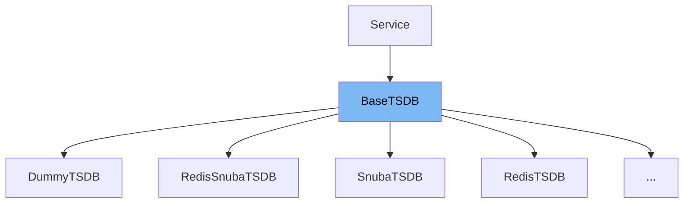

This document will cover the BaseTSDB class in the sentry-demo repo. We'll cover:

1. What is BaseTSDB
2. Variables and functions in BaseTSDB
3. Usage example of BaseTSDB



# What is BaseTSDB

BaseTSDB is a base class for Time Series Database (TSDB) in the Sentry application. It provides a set of methods for reading and writing time series data. The class is designed to be extended by specific implementations of a TSDB, such as a Redis-based TSDB.

<SwmSnippet path="/src/sentry/tsdb/base.py" line="114">

---

# Variables and functions

The variable `__read_methods__` is a set of method names for reading data from the TSDB. These methods are expected to be implemented in any class that extends BaseTSDB.

```python
    __read_methods__ = frozenset(
        [
            "get_range",
            "get_sums",
            "get_distinct_counts_series",
            "get_distinct_counts_totals",
            "get_distinct_counts_union",
            "get_most_frequent",
            "get_most_frequent_series",
            "get_frequency_series",
            "get_frequency_totals",
        ]
```

---

</SwmSnippet>

<SwmSnippet path="/src/sentry/tsdb/base.py" line="128">

---

The variable `__write_methods__` is a set of method names for writing data to the TSDB. These methods are expected to be implemented in any class that extends BaseTSDB.

```python
    __write_methods__ = frozenset(
        [
            "incr",
            "incr_multi",
            "merge",
            "delete",
            "record",
            "record_multi",
            "merge_distinct_counts",
            "delete_distinct_counts",
            "record_frequency_multi",
            "merge_frequencies",
            "delete_frequencies",
            "flush",
        ]
```

---

</SwmSnippet>

<SwmSnippet path="/src/sentry/tsdb/base.py" line="145">

---

The variable `__all__` is a set of all method names in the BaseTSDB class. It includes both read and write methods.

```python
    __all__ = (
        frozenset(
            [
                "get_earliest_timestamp",
                "get_optimal_rollup",
                "get_optimal_rollup_series",
                "get_rollups",
                "make_series",
                "models_with_environment_support",
                "normalize_to_epoch",
                "rollup",
            ]
        )
        | __write_methods__
        | __read_methods__
    )
```

---

</SwmSnippet>

<SwmSnippet path="/src/sentry/tsdb/base.py" line="162">

---

The variable `models_with_environment_support` is a set of TSDB models that support environment parameters.

```python
    models_with_environment_support = frozenset(
        [
            TSDBModel.project,
            TSDBModel.group,
            TSDBModel.release,
            TSDBModel.users_affected_by_group,
            TSDBModel.users_affected_by_project,
        ]
    )
```

---

</SwmSnippet>

<SwmSnippet path="/src/sentry/tsdb/base.py" line="172">

---

The `__init__` function is the constructor for the BaseTSDB class. It initializes the rollups and legacy rollups for the TSDB.

```python
    def __init__(
        self,
        rollups: Iterable[tuple[int, int]] | None = None,
        legacy_rollups: dict[int, int] | None = None,
        **options: object,
    ):
        if rollups is None:
            rollups = settings.SENTRY_TSDB_ROLLUPS

        self.rollups: dict[int, int] = dict(rollups)

        # The ``SENTRY_TSDB_LEGACY_ROLLUPS`` setting should be used to store
        # previous rollup configuration values after they are modified in
        # ``SENTRY_TSDB_ROLLUPS``. The values can be removed after the new
        # rollup period is full of new data.
        if legacy_rollups is None:
            legacy_rollups = getattr(settings, "SENTRY_TSDB_LEGACY_ROLLUPS", {})

        self.__legacy_rollups = legacy_rollups
```

---

</SwmSnippet>

<SwmSnippet path="/src/sentry/tsdb/base.py" line="192">

---

The `validate_arguments` function is used to validate the models and environment IDs passed to the TSDB methods.

```python
    def validate_arguments(
        self, models: list[TSDBModel], environment_ids: Iterable[int | None]
    ) -> None:
        if any(e is not None for e in environment_ids):
            unsupported_models = set(models) - self.models_with_environment_support
            if unsupported_models:
                raise ValueError("not all models support environment parameters")

```

---

</SwmSnippet>

<SwmSnippet path="/src/sentry/tsdb/base.py" line="200">

---

The `get_rollups` function returns the rollups for the TSDB.

```python
    def get_rollups(self) -> dict[int, int]:
        return self.rollups
```

---

</SwmSnippet>

<SwmSnippet path="/src/sentry/tsdb/base.py" line="203">

---

The `normalize_to_epoch` function normalizes a timestamp to an epoch timestamp based on a given rollup interval.

```python
    def normalize_to_epoch(self, timestamp: datetime, seconds: int) -> int:
        """
        Given a ``timestamp`` (datetime object) normalize to an epoch timestamp.

        i.e. if the rollup is minutes, the resulting timestamp would have
        the seconds and microseconds rounded down.
        """
        epoch = int(timestamp.timestamp())
        return epoch - (epoch % seconds)
```

---

</SwmSnippet>

<SwmSnippet path="/src/sentry/tsdb/base.py" line="213">

---

The `normalize_ts_to_epoch` function normalizes an epoch to an epoch rollup.

```python
    def normalize_ts_to_epoch(self, epoch: float, seconds: int) -> float:
        """
        Given a ``epoch`` normalize to an epoch rollup.
        """
        return epoch - (epoch % seconds)
```

---

</SwmSnippet>

<SwmSnippet path="/src/sentry/tsdb/base.py" line="219">

---

The `normalize_to_rollup` function normalizes a timestamp to an epoch rollup.

```python
    def normalize_to_rollup(self, timestamp: datetime | float, seconds: int) -> int:
        """
        Given a ``timestamp`` (datetime object) normalize to an epoch rollup.
        """
        if isinstance(timestamp, datetime):
            epoch = int(timestamp.timestamp())
        else:
            epoch = int(timestamp)
        return int(epoch / seconds)
```

---

</SwmSnippet>

<SwmSnippet path="/src/sentry/tsdb/base.py" line="229">

---

The `normalize_ts_to_rollup` function normalizes an epoch to an epoch rollup.

```python
    def normalize_ts_to_rollup(self, epoch: float, seconds: int) -> int:
        """
        Given a ``epoch`` normalize to an epoch rollup.
        """
        return int(epoch / seconds)
```

---

</SwmSnippet>

<SwmSnippet path="/src/sentry/tsdb/base.py" line="235">

---

The `get_optimal_rollup` function identifies the lowest granularity rollup available within a given time range.

```python
    def get_optimal_rollup(self, start_timestamp: datetime, end_timestamp: datetime) -> int:
        """
        Identify the lowest granularity rollup available within the given time
        range.
        """
        num_seconds = int(end_timestamp.timestamp()) - int(start_timestamp.timestamp())

        # This loop attempts to find the smallest possible rollup that will
        # contain both the start and end timestamps. ``self.rollups`` is
        # ordered from the highest resolution (smallest interval) to lowest
        # resolution (largest interval.)
        # XXX: There is a bug here, since this function assumes that the end
        # timestamp is always equal to or greater than the current time. If the
        # time range is shifted far enough into the past (e.g. a 30 second
        # window, retrieved several days after it's occurrence), this can
        # return a rollup that has already been evicted due to TTL, even if a
        # lower resolution representation of the range exists.
        for rollup, samples in self.rollups.items():
            if rollup * samples >= num_seconds:
                return rollup

```

---

</SwmSnippet>

<SwmSnippet path="/src/sentry/tsdb/base.py" line="260">

---

The `get_optimal_rollup_series` function returns the optimal rollup series for a given time range.

```python
    def get_optimal_rollup_series(
        self, start: datetime, end: datetime | None = None, rollup: int | None = None
    ) -> tuple[int, list[int]]:
        if end is None:
            end = timezone.now()

        if rollup is None:
            rollup = self.get_optimal_rollup(start, end)

        # This attempts to create a range with a duration as close as possible
        # to the requested interval using the requested (or inferred) rollup
        # resolution. This result always includes the ``end`` timestamp, but
        # may not include the ``start`` timestamp.
        series = []
        timestamp = end
        while timestamp >= start:
            series.append(self.normalize_to_epoch(timestamp, rollup))
            timestamp = timestamp - timedelta(seconds=rollup)

        return rollup, series[::-1]
```

---

</SwmSnippet>

<SwmSnippet path="/src/sentry/tsdb/base.py" line="281">

---

The `get_active_series` function returns the active series for each rollup in the TSDB.

```python
    def get_active_series(
        self,
        start: datetime | None = None,
        end: datetime | None = None,
        timestamp: datetime | None = None,
    ) -> dict[int, list[datetime]]:
        rollups: dict[int, list[datetime]] = {}
        for rollup, samples in self.rollups.items():
            _, series = self.get_optimal_rollup_series(
                (
                    start
                    if start is not None
                    else to_datetime(self.get_earliest_timestamp(rollup, timestamp=timestamp))
                ),
                end,
                rollup=rollup,
            )
            rollups[rollup] = [to_datetime(item) for item in series]
        return rollups
```

---

</SwmSnippet>

<SwmSnippet path="/src/sentry/tsdb/base.py" line="301">

---

The `make_series` function creates a series of data points for a given time range and rollup.

```python
    def make_series(
        self, default, start: datetime, end: datetime | None = None, rollup: int | None = None
    ) -> list[tuple[int, int]]:
        f = default if callable(default) else lambda timestamp: default
        return [
            (timestamp, f(timestamp))
            for timestamp in self.get_optimal_rollup_series(start, end, rollup)[1]
        ]
```

---

</SwmSnippet>

<SwmSnippet path="/src/sentry/tsdb/base.py" line="310">

---

The `calculate_expiry` function calculates the expiration time for a rollup.

```python
    def calculate_expiry(self, rollup: int, samples: int, timestamp: datetime) -> int:
        """
        Calculate the expiration time for a rollup.

        :param rollup: rollup interval (in seconds)
        :param samples: number of samples to maintain
        :param timestamp: datetime used to calculate the rollup epoch
        """
        epoch = self.normalize_to_epoch(timestamp, rollup)
        return epoch + (rollup * samples)
```

---

</SwmSnippet>

<SwmSnippet path="/src/sentry/tsdb/base.py" line="321">

---

The `get_earliest_timestamp` function calculates the earliest available timestamp for a rollup.

```python
    def get_earliest_timestamp(self, rollup: int, timestamp: datetime | None = None) -> int:
        """
        Calculate the earliest available timestamp for a rollup.
        """
        if timestamp is None:
            timestamp = timezone.now()

        samples = self.__legacy_rollups.get(rollup)
        if samples is None:
            samples = self.rollups[rollup]

        seconds = rollup * (samples - 1)
        lifespan = timedelta(seconds=seconds)
        return self.normalize_to_epoch(timestamp - lifespan, rollup)
```

---

</SwmSnippet>

<SwmSnippet path="/src/sentry/tsdb/base.py" line="336">

---

The `incr` function increments a counter in the TSDB. This is a write method that needs to be implemented in any class that extends BaseTSDB.

```python
    def incr(
        self,
        model: TSDBModel,
        key: TSDBKey,
        timestamp: datetime | None = None,
        count: int = 1,
        environment_id: int | None = None,
    ) -> None:
        """
        Increment project ID=1:

        >>> incr(TimeSeriesModel.project, 1)
        """
```

---

</SwmSnippet>

<SwmSnippet path="/src/sentry/tsdb/base.py" line="351">

---

The `incr_multi` function increments multiple counters in the TSDB. This is a write method that needs to be implemented in any class that extends BaseTSDB.

```python
    def incr_multi(
        self,
        items: Sequence[tuple[TSDBModel, TSDBKey] | tuple[TSDBModel, TSDBKey, IncrMultiOptions]],
        timestamp: datetime | None = None,
        count: int = 1,
        environment_id: int | None = None,
    ) -> None:
        """
        Increment project ID=1 and group ID=5:

        >>> incr_multi([(TimeSeriesModel.project, 1), (TimeSeriesModel.group, 5)])

        Increment individual timestamps:

        >>> incr_multi([(TimeSeriesModel.project, 1, {"timestamp": ...}),
        ...             (TimeSeriesModel.group, 5, {"timestamp": ...})])
        """
        for item in items:
            if len(item) == 2:
                model, key = item
                _timestamp: datetime | None = timestamp
```

---

</SwmSnippet>

<SwmSnippet path="/src/sentry/tsdb/base.py" line="388">

---

The `merge` function transfers all counters from the source keys to the destination key. This is a write method that needs to be implemented in any class that extends BaseTSDB.

```python
    def merge(
        self,
        model: TSDBModel,
        destination: int,
        sources: list[int],
        timestamp: datetime | None = None,
        environment_ids: Iterable[int] | None = None,
    ) -> None:
        """
        Transfer all counters from the source keys to the destination key.
        """
```

---

</SwmSnippet>

<SwmSnippet path="/src/sentry/tsdb/base.py" line="401">

---

The `delete` function deletes all counters in the TSDB. This is a write method that needs to be implemented in any class that extends BaseTSDB.

```python
    def delete(
        self,
        models: list[TSDBModel],
        keys: list[int],
        start: datetime | None = None,
        end: datetime | None = None,
        timestamp: datetime | None = None,
        environment_ids: Iterable[int | None] | None = None,
    ) -> None:
```

---

</SwmSnippet>

<SwmSnippet path="/src/sentry/tsdb/base.py" line="415">

---

The `get_range` function retrieves a range of data from the TSDB. This is a read method that needs to be implemented in any class that extends BaseTSDB.

```python
    def get_range(
        self,
        model: TSDBModel,
        keys: Sequence[TSDBKey],
        start: datetime,
        end: datetime,
        rollup: int | None = None,
        environment_ids: list[int] | None = None,
        conditions=None,
        use_cache: bool = False,
        jitter_value: int | None = None,
        tenant_ids: dict[str, str | int] | None = None,
        referrer_suffix: str | None = None,
    ) -> dict[TSDBKey, list[tuple[int, int]]]:
```

---

</SwmSnippet>

<SwmSnippet path="/src/sentry/tsdb/base.py" line="441">

---

The `get_sums` function retrieves the sum of data points for a given range from the TSDB. This is a read method that needs to be implemented in any class that extends BaseTSDB.

```python
    def get_sums(
        self,
        model: TSDBModel,
        keys: list[int],
        start: datetime,
        end: datetime,
        rollup: int | None = None,
        environment_id: int | None = None,
        use_cache: bool = False,
        jitter_value: int | None = None,
        tenant_ids: dict[str, str | int] | None = None,
        referrer_suffix: str | None = None,
    ) -> dict[int, int]:
```

---

</SwmSnippet>

<SwmSnippet path="/src/sentry/tsdb/base.py" line="524">

---

The `get_distinct_counts_series` function retrieves the counts of distinct items for each rollup interval within a range from the TSDB. This is a read method that needs to be implemented in any class that extends BaseTSDB.

```python
    def get_distinct_counts_series(
        self,
        model: TSDBModel,
        keys: Sequence[int],
        start: datetime,
        end: datetime | None = None,
        rollup: int | None = None,
        environment_id: int | None = None,
        tenant_ids: dict[str, str | int] | None = None,
    ) -> dict[int, list[tuple[int, Any]]]:
```

---

</SwmSnippet>

<SwmSnippet path="/src/sentry/tsdb/base.py" line="539">

---

The `get_distinct_counts_totals` function retrieves the total count of distinct items within a range from the TSDB. This is a read method that needs to be implemented in any class that extends BaseTSDB.

```python
    def get_distinct_counts_totals(
        self,
        model: TSDBModel,
        keys: Sequence[int],
        start: datetime,
        end: datetime | None = None,
        rollup: int | None = None,
        environment_id: int | None = None,
        use_cache: bool = False,
        jitter_value: int | None = None,
        tenant_ids: dict[str, int | str] | None = None,
        referrer_suffix: str | None = None,
    ) -> dict[int, Any]:
```

---

</SwmSnippet>

<SwmSnippet path="/src/sentry/tsdb/base.py" line="557">

---

The `get_distinct_counts_union` function retrieves the total count of distinct items across multiple counters within a range from the TSDB. This is a read method that needs to be implemented in any class that extends BaseTSDB.

```python
    def get_distinct_counts_union(
        self,
        model: TSDBModel,
        keys: list[int] | None,
        start: datetime,
        end: datetime | None = None,
        rollup: int | None = None,
        environment_id: int | None = None,
        tenant_ids: dict[str, str | int] | None = None,
    ) -> int:
```

---

</SwmSnippet>

<SwmSnippet path="/src/sentry/tsdb/base.py" line="573">

---

The `merge_distinct_counts` function transfers all distinct counters from the source keys to the destination key. This is a write method that needs to be implemented in any class that extends BaseTSDB.

```python
    def merge_distinct_counts(
        self,
        model: TSDBModel,
        destination: int,
        sources: list[int],
        timestamp: datetime | None = None,
        environment_ids: Iterable[int] | None = None,
    ) -> None:
```

---

</SwmSnippet>

<SwmSnippet path="/src/sentry/tsdb/base.py" line="587">

---

The `delete_distinct_counts` function deletes all distinct counters in the TSDB. This is a write method that needs to be implemented in any class that extends BaseTSDB.

```python
    def delete_distinct_counts(
        self,
        models: list[TSDBModel],
        keys: list[int],
        start: datetime | None = None,
        end: datetime | None = None,
        timestamp: datetime | None = None,
        environment_ids: Iterable[int] | None = None,
    ) -> None:
```

---

</SwmSnippet>

&nbsp;

*This is an auto-generated document by Swimm AI 🌊 and has not yet been verified by a human*

<SwmMeta version="3.0.0" repo-id="Z2l0aHViJTNBJTNBc2VudHJ5LWRlbW8lM0ElM0FTd2ltbS1EZW1v" repo-name="sentry-demo" doc-type="class"><sup>Powered by [Swimm](/)</sup></SwmMeta>
