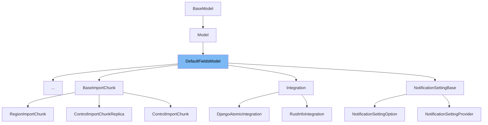

This document will cover the following aspects of the `DefaultFieldsModel` class:

1. What is `DefaultFieldsModel` and its purpose.
2. The variables and functions defined in `DefaultFieldsModel`.
3. An example of how `DefaultFieldsModel` is used in `SentryAppInstallationForProvider`.



# What is DefaultFieldsModel

`DefaultFieldsModel` is a class in the `sentry/db/models/base.py` file. It is an abstract base class that extends the `Model` class. It provides two default fields, `date_updated` and `date_added`, which are both instances of `models.DateTimeField`. These fields are common in many models, so having them in a base class reduces code duplication.

<SwmSnippet path="/src/sentry/db/models/base.py" line="325">

---

# Variables in DefaultFieldsModel

The `date_updated` variable is a DateTimeField with a default value of the current time. It is used to store the timestamp of the last update to an instance of a model that extends `DefaultFieldsModel`.

```python
    date_updated = models.DateTimeField(default=timezone.now)
```

---

</SwmSnippet>

<SwmSnippet path="/src/sentry/db/models/base.py" line="326">

---

The `date_added` variable is also a DateTimeField with a default value of the current time. However, it can be null. This variable is used to store the timestamp of when an instance of a model that extends `DefaultFieldsModel` was added.

```python
    date_added = models.DateTimeField(default=timezone.now, null=True)
```

---

</SwmSnippet>

<SwmSnippet path="/src/sentry/db/models/base.py" line="332">

---

# Functions in DefaultFieldsModel

The `__model_pre_save` function is a signal handler for the `pre_save` signal. It checks if the instance being saved is an instance of `DefaultFieldsModel`. If it is, it updates the `date_updated` field to the current time. This ensures that every time an instance of a model that extends `DefaultFieldsModel` is saved, the `date_updated` field is automatically updated.

```python
def __model_pre_save(instance: models.Model, **kwargs: Any) -> None:
    if not isinstance(instance, DefaultFieldsModel):
        return
    instance.date_updated = timezone.now()

```

---

</SwmSnippet>

# Usage example

Unfortunately, there are no direct usages of `DefaultFieldsModel` in the `SentryAppInstallationForProvider` or any other part of the provided context. However, any model that needs to track when it was added and last updated can extend `DefaultFieldsModel` to get these fields automatically.

&nbsp;

*This is an auto-generated document by Swimm AI 🌊 and has not yet been verified by a human*

<SwmMeta version="3.0.0" repo-id="Z2l0aHViJTNBJTNBc2VudHJ5LWRlbW8lM0ElM0FTd2ltbS1EZW1v" repo-name="sentry-demo" doc-type="class"><sup>Powered by [Swimm](/)</sup></SwmMeta>
