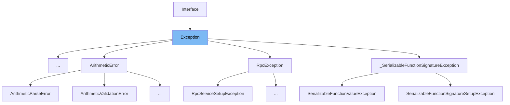

This document will cover the following aspects of the Exception class in the sentry-demo repo:

1. What is Exception
2. Variables and functions in Exception
3. Usage example of Exception



# What is Exception

The Exception class in src/sentry/interfaces/exception.py is a key part of the error tracking and performance monitoring functionality provided by Sentry. It represents an exception that has occurred in the codebase. Each exception has a mandatory `value` argument and optional `type` and `module` arguments describing the exception class type and module namespace. An exception can also optionally bind a stacktrace interface to it.

<SwmSnippet path="/src/sentry/interfaces/exception.py" line="393">

---

# Variables and functions

The `score` variable is used to store the score of the exception, which can be used for prioritizing exceptions.

```python
    score = 2000
    grouping_variants = ["system", "app"]

```

---

</SwmSnippet>

<SwmSnippet path="/src/sentry/interfaces/exception.py" line="396">

---

The `exceptions` function is used to get the values of the exceptions.

```python
    def exceptions(self):
        return get_path(self.values, filter=True)

    def __getitem__(self, key):
        return self.exceptions()[key]

    def __iter__(self):
        return iter(self.exceptions())

    def __len__(self):
        return len(self.exceptions())

```

---

</SwmSnippet>

<SwmSnippet path="/src/sentry/interfaces/exception.py" line="408">

---

The `to_python` function is used to convert the data of the exception to python data types.

```python
    @classmethod
    def to_python(cls, data, **kwargs):
        values = []
        for i, v in enumerate(get_path(data, "values", default=[])):
            if not v:
                # Cannot skip over None-values, need to preserve offsets
                values.append(v)
            else:
                values.append(SingleException.to_python_subpath(data, ["values", i], **kwargs))

        return super().to_python(
            {"values": values, "exc_omitted": data.get("exc_omitted")}, **kwargs
        )
```

---

</SwmSnippet>

<SwmSnippet path="/src/sentry/interfaces/exception.py" line="425">

---

The `to_json` function is used to convert the exception data to JSON format.

```python
    def to_json(self):
        return prune_empty_keys(
            {
                "values": [v and v.to_json() for v in self.values] or None,
                "exc_omitted": self.exc_omitted,
            }
        )
```

---

</SwmSnippet>

<SwmSnippet path="/src/sentry/interfaces/exception.py" line="433">

---

The `get_api_context` function is used to get the API context of the exception.

```python
    def get_api_context(self, is_public=False, platform=None):
        return {
            "values": [
                v.get_api_context(is_public=is_public, platform=platform) for v in self.values if v
            ],
            "hasSystemFrames": any(
                v.stacktrace.get_has_system_frames() for v in self.values if v and v.stacktrace
            ),
            "excOmitted": self.exc_omitted,
        }
```

---

</SwmSnippet>

<SwmSnippet path="/src/sentry/interfaces/exception.py" line="444">

---

The `get_api_meta` function is used to get the API metadata of the exception.

```python
    def get_api_meta(self, meta, is_public=False, platform=None):
        if not meta:
            return meta

        result = {}
        values = meta.get("values", meta)
        for index, value in values.items():
            exc = self.values[int(index)]
            if exc is not None:
                result[index] = exc.get_api_meta(value, is_public=is_public, platform=platform)

        return {"values": result}
```

---

</SwmSnippet>

<SwmSnippet path="/src/sentry/interfaces/exception.py" line="457">

---

The `to_string` function is used to convert the exception data to a string format.

```python
    def to_string(self, event, is_public=False, **kwargs):
        if not self.values:
            return ""

        output = []
        for exc in self.values:
            if not exc:
                continue

            output.append(f"{exc.type}: {exc.value}\n")
            if exc.stacktrace:
                output.append(
                    exc.stacktrace.get_stacktrace(
                        event, system_frames=False, max_frames=5, header=False
                    )
                    + "\n\n"
                )
        return ("".join(output)).strip()
```

---

</SwmSnippet>

<SwmSnippet path="/src/sentry/interfaces/exception.py" line="476">

---

The `get_stacktrace` function is used to get the stacktrace of the exception.

```python
    def get_stacktrace(self, *args, **kwargs):
        exc = self.values[-1]
        if exc.stacktrace:
            return exc.stacktrace.get_stacktrace(*args, **kwargs)
        return ""

```

---

</SwmSnippet>

<SwmSnippet path="/src/sentry/interfaces/exception.py" line="482">

---

The `iter_tags` function is used to iterate over the tags of the exception.

```python
    def iter_tags(self):
        if not self.values or not self.values[-1]:
            return

        mechanism = self.values[-1].mechanism
        if mechanism:
            yield from mechanism.iter_tags()
```

---

</SwmSnippet>

<SwmSnippet path="/src/sentry/interfaces/exception.py" line="360">

---

# Usage example

Here is an example of how the Exception class is used. This example shows how an exception consists of a list of values, which usually contains a single exception, with an optional stacktrace interface. Each exception has a mandatory `value` argument and optional `type` and `module` arguments describing the exception class type and module namespace. A stacktrace interface can also be optionally bound to an exception.

```python
class Exception(Interface):
    """
    An exception consists of a list of values. In most cases, this list
    contains a single exception, with an optional stacktrace interface.

    Each exception has a mandatory ``value`` argument and optional ``type`` and
    ``module`` arguments describing the exception class type and module
    namespace.

    You can also optionally bind a stacktrace interface to an exception. The
    spec is identical to ``stacktrace``.

    >>> {
    >>>     "values": [{
    >>>         "type": "ValueError",
    >>>         "value": "My exception value",
    >>>         "module": "__builtins__",
    >>>         "mechanism": {
    >>>             # see sentry.interfaces.Mechanism
    >>>         },
    >>>         "stacktrace": {
```

---

</SwmSnippet>

&nbsp;

*This is an auto-generated document by Swimm AI 🌊 and has not yet been verified by a human*

<SwmMeta version="3.0.0" repo-id="Z2l0aHViJTNBJTNBc2VudHJ5LWRlbW8lM0ElM0FTd2ltbS1EZW1v" repo-name="sentry-demo" doc-type="class"><sup>Powered by [Swimm](/)</sup></SwmMeta>
