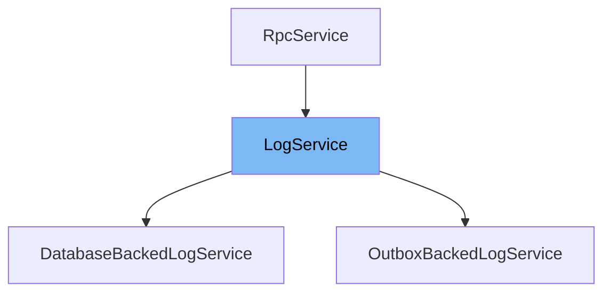

This document will cover the following aspects of the `LogService` class:

1. What is `LogService` and its purpose.
2. The variables and functions defined in `LogService`.
3. An example of how to use `LogService` in `DatabaseBackedLogService`.



# What is LogService

`LogService` is a class that extends `RpcService`. It is used to handle logging services in the application. It provides methods to record audit logs, user IP events, and find the last log based on certain parameters.

<SwmSnippet path="/src/sentry/audit_log/services/log/service.py" line="16">

---

# Variables and functions

The variable `key` is used to identify the `LogService`. It is set to 'log'.

```python
    key = "log"
```

---

</SwmSnippet>

<SwmSnippet path="/src/sentry/audit_log/services/log/service.py" line="17">

---

The variable `local_mode` is set to `SiloMode.CONTROL`. This indicates the mode of operation for the `LogService`.

```python
    local_mode = SiloMode.CONTROL
```

---

</SwmSnippet>

<SwmSnippet path="/src/sentry/audit_log/services/log/service.py" line="20">

---

The function `get_local_implementation` returns the local implementation of the `LogService` by calling the `impl_by_db` function.

```python
    def get_local_implementation(cls) -> RpcService:
        return impl_by_db()
```

---

</SwmSnippet>

<SwmSnippet path="/src/sentry/audit_log/services/log/service.py" line="25">

---

The function `record_audit_log` is an abstract method that is intended to record audit log events. The actual implementation is expected to be provided by the subclasses of `LogService`.

```python
    def record_audit_log(self, *, event: AuditLogEvent) -> None:
        pass
```

---

</SwmSnippet>

<SwmSnippet path="/src/sentry/audit_log/services/log/service.py" line="30">

---

The function `record_user_ip` is an abstract method that is intended to record user IP events. The actual implementation is expected to be provided by the subclasses of `LogService`.

```python
    def record_user_ip(self, *, event: UserIpEvent) -> None:
        pass
```

---

</SwmSnippet>

<SwmSnippet path="/src/sentry/audit_log/services/log/service.py" line="35">

---

The function `find_last_log` is an abstract method that is intended to find the last log based on certain parameters. The actual implementation is expected to be provided by the subclasses of `LogService`.

```python
    def find_last_log(
        self,
        *,
        organization_id: int,
        target_object_id: int | None,
        event: int,
        data: dict[str, str] | None = None,
    ) -> AuditLogEvent | None:
        pass
```

---

</SwmSnippet>

<SwmSnippet path="/src/sentry/audit_log/services/log/service.py" line="47">

---

# Usage example

Here is an example of how `LogService` is used in `DatabaseBackedLogService`. The `impl_by_db` function returns an instance of `DatabaseBackedLogService`, which is a subclass of `LogService`.

```python
    from .impl import DatabaseBackedLogService

    return DatabaseBackedLogService()
```

---

</SwmSnippet>

&nbsp;

*This is an auto-generated document by Swimm AI 🌊 and has not yet been verified by a human*

<SwmMeta version="3.0.0" repo-id="Z2l0aHViJTNBJTNBc2VudHJ5LWRlbW8lM0ElM0FTd2ltbS1EZW1v" repo-name="sentry-demo" doc-type="class"><sup>Powered by [Swimm](/)</sup></SwmMeta>
