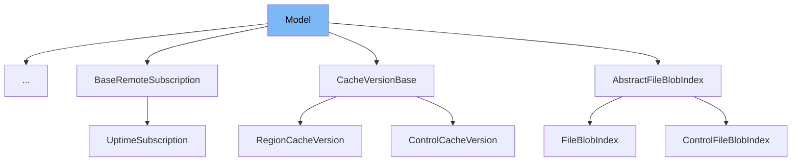

This document will cover the 'Model' class in the sentry-demo repository. We'll cover:

1. What is the 'Model' class
2. Variables and functions in the 'Model' class
3. An example of how to use the 'Model' class



# What is the 'Model' class

The 'Model' class is an abstract base class that represents a model in the codebase. It is used to define a structure for models that require validation before running. The class is generic, meaning it can be used with any type of input and output, as long as the input is a subclass of 'ModelInput'.

<SwmSnippet path="/src/sentry/dynamic_sampling/models/base.py" line="29">

---

# Variables and functions in the 'Model' class

The '\_run' method is an abstract method that needs to be implemented by subclasses. It takes an instance of 'ModelInput' as an argument and returns an output. The actual implementation of this method is left to the subclasses.

```python
class Model(ABC, Generic[Input, Output]):
    @abstractmethod
    def _run(self, model_input: Input) -> Output:
        raise NotImplementedError()

    def run(self, model_input: Input) -> Output:
        if not model_input.validate():
            raise InvalidModelInputError()

        return self._run(model_input)
```

---

</SwmSnippet>

<SwmSnippet path="/src/sentry/dynamic_sampling/models/base.py" line="34">

---

The 'run' method is used to validate the model input and run the model. If the input is not valid, it raises an 'InvalidModelInputError'. If the input is valid, it calls the '\_run' method.

```python
    def run(self, model_input: Input) -> Output:
        if not model_input.validate():
            raise InvalidModelInputError()

        return self._run(model_input)
```

---

</SwmSnippet>

# Usage example

The 'Model' class is an abstract class and cannot be used directly. It needs to be subclassed and the '\_run' method needs to be implemented. Unfortunately, there are no examples of subclasses of the 'Model' class in the provided context.

&nbsp;

*This is an auto-generated document by Swimm AI 🌊 and has not yet been verified by a human*

<SwmMeta version="3.0.0" repo-id="Z2l0aHViJTNBJTNBc2VudHJ5LWRlbW8lM0ElM0FTd2ltbS1EZW1v" repo-name="sentry-demo" doc-type="class"><sup>Powered by [Swimm](/)</sup></SwmMeta>
