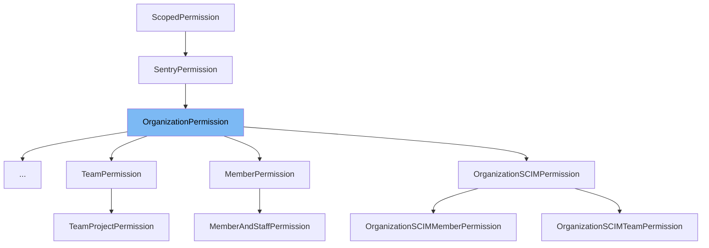

This document will cover the following topics related to the `OrganizationPermission` class:

1. What is `OrganizationPermission` and its purpose.
2. The variables and functions defined in `OrganizationPermission`.
3. An example of how `OrganizationPermission` is used in `AccessRequestPermission`.



# What is OrganizationPermission

`OrganizationPermission` is a class that extends `SentryPermission` and is used to manage permissions within an organization in the Sentry application. It defines the scope of permissions for different HTTP methods and provides methods to check for specific conditions like two-factor authentication compliance, Single Sign-On (SSO) requirements, and object-level permissions.

<SwmSnippet path="/src/sentry/api/bases/organization.py" line="47">

---

# Variables and functions

`scope_map` is a dictionary that maps HTTP methods to the required permissions for that method in the context of an organization.

```python
    scope_map = {
        "GET": ["org:read", "org:write", "org:admin"],
        "POST": ["org:write", "org:admin"],
        "PUT": ["org:write", "org:admin"],
        "DELETE": ["org:admin"],
    }
```

---

</SwmSnippet>

<SwmSnippet path="/src/sentry/api/bases/organization.py" line="54">

---

`is_not_2fa_compliant` is a method that checks if the organization requires two-factor authentication and if the user has complied with this requirement.

```python
    def is_not_2fa_compliant(
        self, request: Request, organization: RpcOrganization | Organization
    ) -> bool:
        if not organization.flags.require_2fa:
            return False

        if request.user.has_2fa():  # type: ignore[union-attr]
            return False

        if is_active_superuser(request):
            return False

        return True
```

---

</SwmSnippet>

<SwmSnippet path="/src/sentry/api/bases/organization.py" line="68">

---

`needs_sso` is a method that checks if the organization requires Single Sign-On (SSO) and if the user has completed the SSO process.

```python
    def needs_sso(self, request: Request, organization: Organization | RpcOrganization) -> bool:
        # XXX(dcramer): this is very similar to the server-rendered views
        # logic for checking valid SSO
        if not request.access.requires_sso:
            return False
        if not auth.has_completed_sso(request, organization.id):
            return True
        if not request.access.sso_is_valid:
            return True
        return False
```

---

</SwmSnippet>

<SwmSnippet path="/src/sentry/api/bases/organization.py" line="79">

---

`has_object_permission` is a method that checks if the user has the required permissions for the requested HTTP method in the context of the organization.

```python
    def has_object_permission(
        self,
        request: Request,
        view: object,
        organization: Organization | RpcOrganization | RpcUserOrganizationContext,
    ) -> bool:
        self.determine_access(request, organization)
        allowed_scopes = set(self.scope_map.get(request.method or "", []))
        return any(request.access.has_scope(s) for s in allowed_scopes)
```

---

</SwmSnippet>

<SwmSnippet path="/src/sentry/api/bases/organization.py" line="89">

---

`is_member_disabled_from_limit` is a method that checks if the member is disabled from the limit in the context of the organization.

```python
    def is_member_disabled_from_limit(
        self,
        request: Request,
        organization: Organization | RpcOrganization | RpcUserOrganizationContext,
    ) -> bool:
        return is_member_disabled_from_limit(request, organization)
```

---

</SwmSnippet>

<SwmSnippet path="/src/sentry/api/endpoints/organization_access_request_details.py" line="1">

---

# Usage example

`OrganizationPermission` is used as a base class for defining permissions in various endpoints. For example, in `AccessRequestPermission`, it is used to define the scope of permissions for different HTTP methods and to check for specific conditions like two-factor authentication compliance and Single Sign-On (SSO) requirements.

```python
from django.db import IntegrityError, router, transaction
from rest_framework import serializers
from rest_framework.request import Request
from rest_framework.response import Response

from sentry import audit_log
from sentry.api.api_owners import ApiOwner
from sentry.api.api_publish_status import ApiPublishStatus
from sentry.api.base import region_silo_endpoint
from sentry.api.bases.organization import OrganizationEndpoint, OrganizationPermission
from sentry.api.exceptions import ResourceDoesNotExist
from sentry.api.serializers import serialize
from sentry.models.organizationaccessrequest import OrganizationAccessRequest
from sentry.models.organizationmemberteam import OrganizationMemberTeam


class AccessRequestPermission(OrganizationPermission):
    scope_map = {
        "GET": [
            "org:read",
            "org:write",
```

---

</SwmSnippet>

&nbsp;

*This is an auto-generated document by Swimm AI 🌊 and has not yet been verified by a human*

<SwmMeta version="3.0.0" repo-id="Z2l0aHViJTNBJTNBc2VudHJ5LWRlbW8lM0ElM0FTd2ltbS1EZW1v" repo-name="sentry-demo" doc-type="class"><sup>Powered by [Swimm](/)</sup></SwmMeta>
