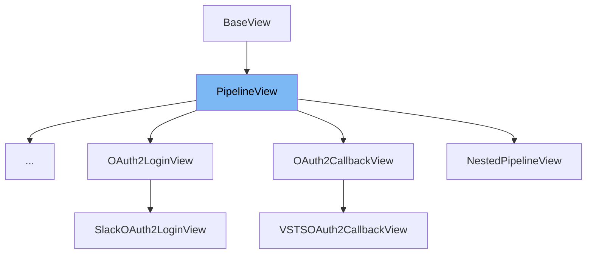

This document will cover the following topics about the `PipelineView` class:

1. What is `PipelineView`.
2. Variables and functions in `PipelineView`.
3. An example of how to use `PipelineView`.



# What is PipelineView

`PipelineView` is a class that may be used in a `PipelineProviders`' `get_pipeline_views` list. It is an abstract base class that provides a structure for views in the pipeline.

<SwmSnippet path="/src/sentry/pipeline/views/base.py" line="22">

---

# Variables and functions

The `dispatch` function is an abstract method that is called on request. The active pipeline is passed in which can and should be used to bind data and traverse the pipeline.

```python
    @abc.abstractmethod
    def dispatch(self, request: Request, pipeline: "Pipeline") -> HttpResponseBase:
        """
        Called on request, the active pipeline is passed in which can and
        should be used to bind data and traverse the pipeline.
        """
```

---

</SwmSnippet>

<SwmSnippet path="/src/sentry/pipeline/views/base.py" line="29">

---

The `render_react_view` function is a static method that returns a response rendered to a template. It takes in a request, a pipeline name, and props as parameters.

```python
    @staticmethod
    def render_react_view(
        request: Request,
        pipeline_name: str,
        props: Mapping[str, Any],
    ) -> HttpResponseBase:
        return render_to_response(
            template="sentry/bases/react_pipeline.html",
            request=request,
            context={"pipelineName": pipeline_name, "props": json.dumps(props)},
        )
```

---

</SwmSnippet>

# Usage example

The `PipelineView` class is an abstract base class and cannot be instantiated directly. However, it can be subclassed. An example of this is the `AccountConfigView` class.

&nbsp;

*This is an auto-generated document by Swimm AI 🌊 and has not yet been verified by a human*

<SwmMeta version="3.0.0" repo-id="Z2l0aHViJTNBJTNBc2VudHJ5LWRlbW8lM0ElM0FTd2ltbS1EZW1v" repo-name="sentry-demo" doc-type="class"><sup>Powered by [Swimm](/)</sup></SwmMeta>
