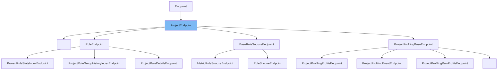

This document will cover the following aspects of the `ProjectEndpoint` class in the `sentry-demo` repo:

1. What is `ProjectEndpoint`.
2. Variables and functions in `ProjectEndpoint`.
3. An example of how to use `ProjectEndpoint`.



# What is ProjectEndpoint

`ProjectEndpoint` is a class in `src/sentry/api/bases/project.py` that extends the `Endpoint` class. It is used to handle requests related to projects in the Sentry application. It includes methods for converting arguments, getting filter parameters, and handling exceptions.

<SwmSnippet path="/src/sentry/api/bases/project.py" line="117">

---

# Variables and functions

`permission_classes` is a tuple that stores the permission classes for the `ProjectEndpoint`. It is initialized with `ProjectPermission`.

```python
    permission_classes: tuple[type[BasePermission], ...] = (ProjectPermission,)
```

---

</SwmSnippet>

<SwmSnippet path="/src/sentry/api/bases/project.py" line="119">

---

`convert_args` is a method that converts the arguments received in a request. It extracts the organization and project identifiers from the arguments or keyword arguments, retrieves the corresponding project from the database, and checks the permissions of the request. If the project does not exist or is inactive, it raises an exception. If the project has been moved, it raises a `ProjectMoved` exception. The method then binds the organization context, sets the project in the request, and returns the modified arguments and keyword arguments.

```python
    def convert_args(
        self,
        request: Request,
        *args,
        **kwargs,
    ):
        if args and args[0] is not None:
            organization_id_or_slug: int | str = args[0]
            # Required so it behaves like the original convert_args, where organization_id_or_slug was another parameter
            # TODO: Remove this once we remove the old `organization_slug` parameter from getsentry
            args = args[1:]
        else:
            organization_id_or_slug = kwargs.pop("organization_id_or_slug", None) or kwargs.pop(
                "organization_slug"
            )

        if args and args[0] is not None:
            project_id_or_slug: int | str = args[0]
            # Required so it behaves like the original convert_args, where project_id_or_slug was another parameter
            args = args[1:]
        else:
```

---

</SwmSnippet>

<SwmSnippet path="/src/sentry/api/bases/project.py" line="195">

---

`get_filter_params` is a method that retrieves filter parameters from the request. It gets the start and end dates from the request parameters and retrieves the environments for the project's organization. It then constructs a dictionary of parameters including the start and end dates, the project id, and the environments if they exist.

```python
    def get_filter_params(self, request: Request, project, date_filter_optional=False):
        """Similar to the version on the organization just for a single project."""
        # get the top level params -- projects, time range, and environment
        # from the request
        try:
            start, end = get_date_range_from_params(request.GET, optional=date_filter_optional)
        except InvalidParams as e:
            raise ProjectEventsError(str(e))

        environments = [env.name for env in get_environments(request, project.organization)]
        params = {"start": start, "end": end, "project_id": [project.id]}
        if environments:
            params["environment"] = environments

        return params
```

---

</SwmSnippet>

<SwmSnippet path="/src/sentry/api/bases/project.py" line="211">

---

`handle_exception` is a method that handles exceptions raised during the processing of a request. If the exception is a `ProjectMoved` exception, it creates a response with the new project slug and URL. For other exceptions, it calls the `handle_exception` method of the superclass.

```python
    def handle_exception(
        self,
        request: Request,
        exc: Exception,
        handler_context: Mapping[str, Any] | None = None,
        scope: Scope | None = None,
    ) -> Response:
        if isinstance(exc, ProjectMoved):
            response = Response(
                {"slug": exc.detail["detail"]["extra"]["slug"], "detail": exc.detail["detail"]},
                status=exc.status_code,
            )
            response["Location"] = exc.detail["detail"]["extra"]["url"]
            return response
        return super().handle_exception(request, exc, handler_context, scope)
```

---

</SwmSnippet>

# Usage example

The `ProjectEndpoint` class is used as a base class for other classes that handle project-related requests. For example, the `SourceMapDebugBlueThunderEditionEndpoint` class would extend `ProjectEndpoint` and inherit its methods. This allows `SourceMapDebugBlueThunderEditionEndpoint` to handle requests in the same way as `ProjectEndpoint`, while also adding its own specific functionality.

&nbsp;

*This is an auto-generated document by Swimm AI 🌊 and has not yet been verified by a human*

<SwmMeta version="3.0.0" repo-id="Z2l0aHViJTNBJTNBc2VudHJ5LWRlbW8lM0ElM0FTd2ltbS1EZW1v" repo-name="sentry-demo" doc-type="class"><sup>Powered by [Swimm](/)</sup></SwmMeta>
