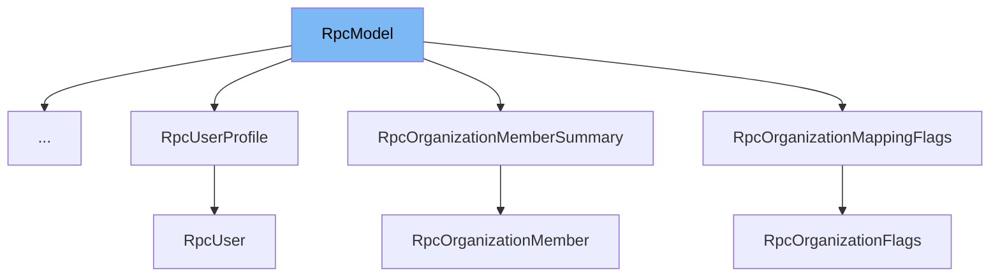

This document will cover the RpcModel class in the sentry-demo repository. We'll cover:

1. What is RpcModel
2. Variables and functions in RpcModel
3. Usage example of RpcModel



# What is RpcModel

RpcModel is a class that represents a serializable object that may be part of an RPC schema. It is a subclass of the pydantic BaseModel and is used to serialize objects with field names matching this model class.

<SwmSnippet path="/src/sentry/hybridcloud/rpc/__init__.py" line="46">

---

# Variables and functions

The Config class inside RpcModel has two variables: `orm_mode` and `use_enum_values`. `orm_mode` is set to True, which allows the model to be parsed from arbitrary types like Django ORM models. `use_enum_values` is also set to True, which means the enum values will be serialized/deserialized instead of the enum members themselves.

```python
    class Config:
        orm_mode = True
        use_enum_values = True
```

---

</SwmSnippet>

<SwmSnippet path="/src/sentry/hybridcloud/rpc/__init__.py" line="51">

---

The `get_field_names` class method returns an iterator over the keys of the `__fields__` attribute of the class. This is used to get the names of all the fields in the model.

```python
    def get_field_names(cls) -> Iterable[str]:
        return iter(cls.__fields__.keys())
```

---

</SwmSnippet>

<SwmSnippet path="/src/sentry/hybridcloud/rpc/__init__.py" line="55">

---

The `serialize_by_field_name` class method is used to serialize an object with field names matching this model class. It takes an object and optional transform functions for the field names and values. It returns an instance of the subclass on which it is called. This method is useful for model types where new fields may be added in the future and we'd like them to be serialized automatically.

```python
    def serialize_by_field_name(
        cls,
        obj: Any,
        name_transform: Callable[[str], str] | None = None,
        value_transform: Callable[[Any], Any] | None = None,
    ) -> Self:
        """Serialize an object with field names matching this model class.

        This class method may be called only on an instantiable subclass. The
        returned value is an instance of that subclass. The optional "transform"
        arguments, if present, modify each field name or attribute value before it is
        passed through to the serialized object. Raises AttributeError if the
        argument does not have an attribute matching each field name (after
        transformation, if any) of this RpcModel class.

        This method should not necessarily be used for every serialization operation.
        It is useful for model types, such as "flags" objects, where new fields may
        be added in the future and we'd like them to be serialized automatically. For
        more stable or more complex models, it is more suitable to list the fields
        out explicitly in a constructor call.
        """
```

---

</SwmSnippet>

# Usage example

Unfortunately, there are no direct usage examples of RpcModel in the provided context. However, it's important to note that RpcModel is a base class meant to be extended by other classes. It provides a structure and methods that are useful for serializing objects in an RPC schema.

&nbsp;

*This is an auto-generated document by Swimm AI 🌊 and has not yet been verified by a human*

<SwmMeta version="3.0.0" repo-id="Z2l0aHViJTNBJTNBc2VudHJ5LWRlbW8lM0ElM0FTd2ltbS1EZW1v" repo-name="sentry-demo" doc-type="class"><sup>Powered by [Swimm](/)</sup></SwmMeta>
