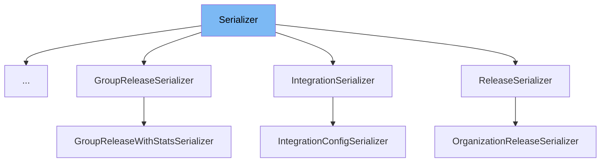

This document will cover the following topics related to the Serializer class in the sentry-demo repo:

1. What is Serializer
2. Variables and functions in Serializer
3. Usage example of Serializer



# What is Serializer

The Serializer class in src/sentry/api/serializers/base.py is a fundamental part of the Sentry API. It contains the logic to serialize a specific type of object. Serialization is the process of converting a data structure or object state into a format that can be stored or transmitted and reconstructed later. In the context of Sentry, the Serializer class is used to convert models or lists of models into Python objects made entirely of primitives.

<SwmSnippet path="/src/sentry/api/serializers/base.py" line="10">

---

# Variables and functions

The `logger` variable is a logging instance used for logging errors or other information.

```python
logger = logging.getLogger(__name__)
```

---

</SwmSnippet>

<SwmSnippet path="/src/sentry/api/serializers/base.py" line="12">

---

The `K` variable is a TypeVar used for type hinting in Python.

```python
K = TypeVar("K")
```

---

</SwmSnippet>

<SwmSnippet path="/src/sentry/api/serializers/base.py" line="14">

---

The `registry` variable is a mutable mapping that stores all registered serializers.

```python
registry: MutableMapping[Any, Any] = {}
```

---

</SwmSnippet>

<SwmSnippet path="/src/sentry/api/serializers/base.py" line="17">

---

The `register` function is a decorator used to add the wrapped Serializer to the Serializer registry for the key `type`.

```python
def register(type: Any) -> Callable[[type[K]], type[K]]:
    """A wrapper that adds the wrapped Serializer to the Serializer registry (see above) for the key `type`."""

    def wrapped(cls: type[K]) -> type[K]:
        registry[type] = cls()
        return cls

    return wrapped
```

---

</SwmSnippet>

<SwmSnippet path="/src/sentry/api/serializers/base.py" line="27">

---

The `serialize` function is used to turn a model or list of models into a python object made entirely of primitives.

```python
def serialize(
    objects: Any | Sequence[Any],
    user: Any | None = None,
    serializer: Any | None = None,
    **kwargs: Any,
) -> Any:
    """
    Turn a model (or list of models) into a python object made entirely of primitives.

    :param objects: A list of objects
    :param user: The user who will be viewing the objects. Omit to view as `AnonymousUser`.
    :param serializer: The `Serializer` class whose logic we'll use to serialize
        `objects` (see below.) Omit to just look up the Serializer in the
        registry by the `objects`'s type.
    :param kwargs Any
    :returns A list of the serialized versions of `objects`.
    """
    if user is None:
        user = AnonymousUser()

    if not objects:
```

---

</SwmSnippet>

<SwmSnippet path="/src/sentry/api/serializers/base.py" line="83">

---

The `__call__` function is a special method in Python classes, it allows the class's instance to be called as a function, not a method. In the context of the Serializer class, it calls the `_serialize` method.

```python
    def __call__(
        self, obj: Any, attrs: Mapping[Any, Any], user: Any, **kwargs: Any
    ) -> Mapping[str, Any] | None:
        """See documentation for `serialize`."""
        if obj is None:
            return None
        return self._serialize(obj, attrs, user, **kwargs)
```

---

</SwmSnippet>

<SwmSnippet path="/src/sentry/api/serializers/base.py" line="91">

---

The `get_attrs` function fetches all of the associated data needed to serialize the objects in `item_list`.

```python
    def get_attrs(
        self, item_list: Sequence[Any], user: Any, **kwargs: Any
    ) -> MutableMapping[Any, Any]:
        """
        Fetch all of the associated data needed to serialize the objects in `item_list`.

        :param item_list: List of input objects that should be serialized.
        :param user: The user who will be viewing the objects.
        :param kwargs: Any
        :returns A mapping of items from the `item_list` to an Object.
        """
        return {}
```

---

</SwmSnippet>

<SwmSnippet path="/src/sentry/api/serializers/base.py" line="104">

---

The `_serialize` function is a private method that tries to serialize an object and logs an exception if it fails.

```python
    def _serialize(
        self, obj: Any, attrs: Mapping[Any, Any], user: Any, **kwargs: Any
    ) -> Mapping[str, Any] | None:
        try:
            return self.serialize(obj, attrs, user, **kwargs)
        except Exception:
            logger.exception("Failed to serialize", extra={"instance": obj})
            return None
```

---

</SwmSnippet>

<SwmSnippet path="/src/sentry/api/serializers/base.py" line="113">

---

The `serialize` function converts an arbitrary python object `obj` to an object that only contains primitives.

```python
    def serialize(
        self, obj: Any, attrs: Mapping[Any, Any], user: Any, **kwargs: Any
    ) -> Mapping[str, Any]:
        """
        Convert an arbitrary python object `obj` to an object that only contains primitives.

        :param obj: An item from `item_list` that was passed to `get_attrs`.
        :param attrs: The object in `get_attrs` that corresponds to `obj`.
        :param user: The user who will be viewing the objects.
        :param kwargs: Any
        :returns A serialized version of `obj`.
        """
        return {}
```

---

</SwmSnippet>

<SwmSnippet path="/src/sentry/incidents/endpoints/serializers/alert_rule_trigger_action.py" line="1">

---

# Usage example

The `AlertRuleTriggerActionSerializer` class is an example of how the Serializer class is used. It extends the Serializer class and overrides its methods to provide custom serialization logic.

```python
import logging

from sentry.api.serializers import Serializer, register
from sentry.incidents.models.alert_rule import AlertRuleTriggerAction

logger = logging.getLogger(__name__)


@register(AlertRuleTriggerAction)
class AlertRuleTriggerActionSerializer(Serializer):
    def human_desc(self, action):
        # Returns a human readable description to display in the UI
        priority = (
            action.sentry_app_config.get("priority")
            if isinstance(action.sentry_app_config, dict)
            else ""
        )
        if priority:
            priority += " level"

        if action.type == action.Type.EMAIL.value:
```

---

</SwmSnippet>

&nbsp;

*This is an auto-generated document by Swimm AI 🌊 and has not yet been verified by a human*

<SwmMeta version="3.0.0" repo-id="Z2l0aHViJTNBJTNBc2VudHJ5LWRlbW8lM0ElM0FTd2ltbS1EZW1v" repo-name="sentry-demo" doc-type="class"><sup>Powered by [Swimm](/)</sup></SwmMeta>
