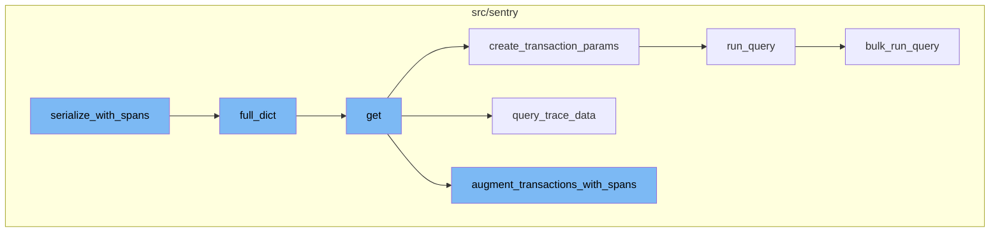

<SwmSnippet path="/src/sentry/api/endpoints/organization_events_trace.py" line="1540">

---

# serialize_with_spans Function

The `serialize_with_spans` function is the starting point of the flow. It processes a list of transactions and errors to create a serialized trace. The function uses the `sentry_sdk.start_span` context manager to create new spans for various operations such as creating a parent map, associating children, and sorting. The function ends by returning a dictionary containing the serialized transactions and orphan errors.

```python
    def serialize_with_spans(
        self,
        limit: int,
        transactions: Sequence[SnubaTransaction],
        errors: Sequence[SnubaError],
        roots: Sequence[SnubaTransaction],
        warning_extra: dict[str, str],
        event_id: str | None,
        detailed: bool = False,
    ) -> SerializedTrace:
        root_traces: list[TraceEvent] = []
        orphans: list[TraceEvent] = []
        orphan_event_ids: set[str] = set()
        orphan_errors: list[SnubaError] = []
        if detailed:
            raise ParseError("Cannot return a detailed response using Spans")

        with sentry_sdk.start_span(op="serialize", description="create parent map"):
            parent_to_children_event_map = defaultdict(list)
            serialized_transactions: list[TraceEvent] = []
            for transaction in transactions:
```

---

</SwmSnippet>

<SwmSnippet path="/src/sentry/api/endpoints/organization_events_trace.py" line="395">

---

# full_dict Function

The `full_dict` function is called within `serialize_with_spans` for each root trace and orphan. It checks if the current event id is in the visited set, if so it returns None, otherwise it adds the event id to the visited set and proceeds to create a result dictionary. If the `detailed` flag is set, it adds additional information to the result. The function ends by returning the result dictionary.

```python
    def full_dict(
        self, detailed: bool = False, visited: set[str] | None = None
    ) -> FullResponse | None:
        if visited is None:
            visited = set()
        event_id = self.event["id"]
        # We're in a loop!
        if event_id in visited:
            return None
        else:
            visited.add(self.event["id"])
        result = cast(FullResponse, self.to_dict())
        if detailed and "transaction.status" in self.event:
            result.update(
                {
                    "transaction.status": SPAN_STATUS_CODE_TO_NAME.get(
                        self.event["transaction.status"], "unknown"
                    ),
                }
            )
        if self.span_serialized:
```

---

</SwmSnippet>

<SwmSnippet path="/src/sentry/api/endpoints/organization_events_trace.py" line="1029">

---

# get Function

The `get` function is responsible for handling the request and organizing the data for the trace view. It first checks if the organization has the required feature, then it retrieves the snuba parameters and updates them with the timestamp. It then creates transaction parameters and queries the trace data. If the `use_spans` flag is set, it augments the transactions with spans. Finally, it serializes the data and returns the response.

```python
    def get(self, request: Request, organization: Organization, trace_id: str) -> HttpResponse:
        if not self.has_feature(organization, request):
            return Response(status=404)

        try:
            # The trace view isn't useful without global views, so skipping the check here
            snuba_params, _ = self.get_snuba_dataclass(
                request, organization, check_global_views=False
            )
        except NoProjects:
            return Response(status=404)

        # Detailed is deprecated now that we want to use spans instead
        detailed = request.GET.get("detailed", "0") == "1"
        # Temporary url params until we finish migrating the frontend
        use_spans = request.GET.get("useSpans", "0") == "1"
        update_snuba_params_with_timestamp(request, snuba_params)

        sentry_sdk.set_tag("trace_view.using_spans", str(use_spans))
        if detailed and use_spans:
            raise ParseError("Cannot return a detailed response while using spans")
```

---

</SwmSnippet>

<SwmSnippet path="/src/sentry/api/endpoints/organization_events_trace.py" line="520">

---

# create_transaction_params Function

The `create_transaction_params` function is used within the `get` function to create transaction parameters based on the trace id and snuba parameters. It queries the metadata and updates the start and end times of the transaction parameters based on the min and max timestamps. It also updates the projects in the transaction parameters based on the project ids.

```python
def create_transaction_params(
    trace_id: str,
    snuba_params: SnubaParams,
) -> SnubaParams:
    """Can't use the transaction params for errors since traces can be errors only"""
    query_metadata = options.get("performance.traces.query_timestamp_projects")
    sentry_sdk.set_tag("trace_view.queried_timestamp_projects", query_metadata)
    if not query_metadata:
        return snuba_params

    metadata_query = DiscoverQueryBuilder(
        Dataset.Discover,
        params={},
        snuba_params=snuba_params,
        query=f"trace:{trace_id}",
        selected_columns=[
            "min(timestamp)",
            "max(timestamp)",
            "project.id",
        ],
    )
```

---

</SwmSnippet>

<SwmSnippet path="/src/sentry/api/endpoints/organization_events_trace.py" line="579">

---

# query_trace_data Function

The `query_trace_data` function is used within the `get` function to query the trace data. It creates a transaction query and an error query based on the trace id, snuba parameters, transaction parameters, limit, and event id. It then runs these queries in bulk and processes the results. The function ends by returning the transformed results.

```python
def query_trace_data(
    trace_id: str,
    snuba_params: SnubaParams,
    transaction_params: SnubaParams,
    limit: int,
    event_id: str | None,
    use_spans: bool,
) -> tuple[Sequence[SnubaTransaction], Sequence[SnubaError]]:
    transaction_columns = [
        "id",
        "transaction.status",
        "transaction.op",
        "transaction.duration",
        "transaction",
        "timestamp",
        "precise.start_ts",
        "precise.finish_ts",
        "project",
        "project.id",
        "profile.id",
        "profile.profiler_id",
```

---

</SwmSnippet>

<SwmSnippet path="/src/sentry/api/endpoints/organization_events_trace.py" line="772">

---

# augment_transactions_with_spans Function

The `augment_transactions_with_spans` function is used within the `get` function to augment the transactions with parent, error, and problem data. It first sets up the necessary data structures and then queries the parent span ids of segment spans and their corresponding transaction ids. It then links the transactions, performance issues, and errors. The function ends by returning the augmented transactions.

```python
def augment_transactions_with_spans(
    transactions: Sequence[SnubaTransaction],
    errors: Sequence[SnubaError],
    trace_id: str,
    params: SnubaParams,
) -> Sequence[SnubaTransaction]:
    """Augment the list of transactions with parent, error and problem data"""
    with sentry_sdk.start_span(op="augment.transactions", description="setup"):
        trace_parent_spans = set()  # parent span ids of segment spans
        transaction_problem_map: dict[str, SnubaTransaction] = {}
        problem_project_map: dict[int, list[str]] = {}
        issue_occurrences = []
        occurrence_spans: set[str] = set()
        error_spans = set()
        projects = set()
        for error in errors:
            if "trace.span" in error:
                error["trace.span"] = pad_span_id(error["trace.span"])
                error_spans.add(error["trace.span"])
            projects.add(error["project.id"])
        ts_params = find_timestamp_params(transactions)
```

---

</SwmSnippet>



# Flow drill down


<SwmSnippet path="/src/sentry/api/endpoints/organization_events_trace.py" line="1540">

---

# serialize_with_spans Function

The `serialize_with_spans` function is the starting point of the flow. It takes in various parameters including a list of transactions and errors, and a boolean flag `detailed`. It processes these transactions and errors to create a serialized trace. The function uses the `sentry_sdk.start_span` context manager to create new spans for various operations such as creating a parent map, associating children, and sorting. The function ends by returning a dictionary containing the serialized transactions and orphan errors.

```python
    def serialize_with_spans(
        self,
        limit: int,
        transactions: Sequence[SnubaTransaction],
        errors: Sequence[SnubaError],
        roots: Sequence[SnubaTransaction],
        warning_extra: dict[str, str],
        event_id: str | None,
        detailed: bool = False,
    ) -> SerializedTrace:
        root_traces: list[TraceEvent] = []
        orphans: list[TraceEvent] = []
        orphan_event_ids: set[str] = set()
        orphan_errors: list[SnubaError] = []
        if detailed:
            raise ParseError("Cannot return a detailed response using Spans")

        with sentry_sdk.start_span(op="serialize", description="create parent map"):
            parent_to_children_event_map = defaultdict(list)
            serialized_transactions: list[TraceEvent] = []
            for transaction in transactions:
```

---

</SwmSnippet>

<SwmSnippet path="/src/sentry/api/endpoints/organization_events_trace.py" line="395">

---

# full_dict Function

The `full_dict` function is called within `serialize_with_spans` for each root trace and orphan. It takes in a boolean `detailed` and a set `visited` as parameters. The function checks if the current event id is in the visited set, if so it returns None, otherwise it adds the event id to the visited set and proceeds to create a result dictionary. If the `detailed` flag is set, it adds additional information to the result. The function ends by returning the result dictionary.

```python
    def full_dict(
        self, detailed: bool = False, visited: set[str] | None = None
    ) -> FullResponse | None:
        if visited is None:
            visited = set()
        event_id = self.event["id"]
        # We're in a loop!
        if event_id in visited:
            return None
        else:
            visited.add(self.event["id"])
        result = cast(FullResponse, self.to_dict())
        if detailed and "transaction.status" in self.event:
            result.update(
                {
                    "transaction.status": SPAN_STATUS_CODE_TO_NAME.get(
                        self.event["transaction.status"], "unknown"
                    ),
                }
            )
        if self.span_serialized:
```

---

</SwmSnippet>

<SwmSnippet path="/src/sentry/api/endpoints/organization_events_trace.py" line="1029">

---

# get Function

The `get` function is responsible for handling the request and organizing the data for the trace view. It first checks if the organization has the required feature, then it retrieves the snuba parameters and updates them with the timestamp. It then creates transaction parameters and queries the trace data. If the `use_spans` flag is set, it augments the transactions with spans. Finally, it serializes the data and returns the response.

```python
    def get(self, request: Request, organization: Organization, trace_id: str) -> HttpResponse:
        if not self.has_feature(organization, request):
            return Response(status=404)

        try:
            # The trace view isn't useful without global views, so skipping the check here
            snuba_params, _ = self.get_snuba_dataclass(
                request, organization, check_global_views=False
            )
        except NoProjects:
            return Response(status=404)

        # Detailed is deprecated now that we want to use spans instead
        detailed = request.GET.get("detailed", "0") == "1"
        # Temporary url params until we finish migrating the frontend
        use_spans = request.GET.get("useSpans", "0") == "1"
        update_snuba_params_with_timestamp(request, snuba_params)

        sentry_sdk.set_tag("trace_view.using_spans", str(use_spans))
        if detailed and use_spans:
            raise ParseError("Cannot return a detailed response while using spans")
```

---

</SwmSnippet>

<SwmSnippet path="/src/sentry/api/endpoints/organization_events_trace.py" line="520">

---

# create_transaction_params Function

The `create_transaction_params` function is used within the `get` function to create transaction parameters based on the trace id and snuba parameters. It queries the metadata and updates the start and end times of the transaction parameters based on the min and max timestamps. It also updates the projects in the transaction parameters based on the project ids.

```python
def create_transaction_params(
    trace_id: str,
    snuba_params: SnubaParams,
) -> SnubaParams:
    """Can't use the transaction params for errors since traces can be errors only"""
    query_metadata = options.get("performance.traces.query_timestamp_projects")
    sentry_sdk.set_tag("trace_view.queried_timestamp_projects", query_metadata)
    if not query_metadata:
        return snuba_params

    metadata_query = DiscoverQueryBuilder(
        Dataset.Discover,
        params={},
        snuba_params=snuba_params,
        query=f"trace:{trace_id}",
        selected_columns=[
            "min(timestamp)",
            "max(timestamp)",
            "project.id",
        ],
    )
```

---

</SwmSnippet>

<SwmSnippet path="/src/sentry/api/endpoints/organization_events_trace.py" line="579">

---

# query_trace_data Function

The `query_trace_data` function is used within the `get` function to query the trace data. It creates a transaction query and an error query based on the trace id, snuba parameters, transaction parameters, limit, and event id. It then runs these queries in bulk and processes the results. The function ends by returning the transformed results.

```python
def query_trace_data(
    trace_id: str,
    snuba_params: SnubaParams,
    transaction_params: SnubaParams,
    limit: int,
    event_id: str | None,
    use_spans: bool,
) -> tuple[Sequence[SnubaTransaction], Sequence[SnubaError]]:
    transaction_columns = [
        "id",
        "transaction.status",
        "transaction.op",
        "transaction.duration",
        "transaction",
        "timestamp",
        "precise.start_ts",
        "precise.finish_ts",
        "project",
        "project.id",
        "profile.id",
        "profile.profiler_id",
```

---

</SwmSnippet>

<SwmSnippet path="/src/sentry/api/endpoints/organization_events_trace.py" line="772">

---

# augment_transactions_with_spans Function

The `augment_transactions_with_spans` function is used within the `get` function to augment the transactions with parent, error, and problem data. It first sets up the necessary data structures and then queries the parent span ids of segment spans and their corresponding transaction ids. It then links the transactions, performance issues, and errors. The function ends by returning the augmented transactions.

```python
def augment_transactions_with_spans(
    transactions: Sequence[SnubaTransaction],
    errors: Sequence[SnubaError],
    trace_id: str,
    params: SnubaParams,
) -> Sequence[SnubaTransaction]:
    """Augment the list of transactions with parent, error and problem data"""
    with sentry_sdk.start_span(op="augment.transactions", description="setup"):
        trace_parent_spans = set()  # parent span ids of segment spans
        transaction_problem_map: dict[str, SnubaTransaction] = {}
        problem_project_map: dict[int, list[str]] = {}
        issue_occurrences = []
        occurrence_spans: set[str] = set()
        error_spans = set()
        projects = set()
        for error in errors:
            if "trace.span" in error:
                error["trace.span"] = pad_span_id(error["trace.span"])
                error_spans.add(error["trace.span"])
            projects.add(error["project.id"])
        ts_params = find_timestamp_params(transactions)
```

---

</SwmSnippet>

&nbsp;

*This is an auto-generated document by Swimm AI 🌊 and has not yet been verified by a human*

<SwmMeta version="3.0.0" repo-id="Z2l0aHViJTNBJTNBc2VudHJ5LWRlbW8lM0ElM0FTd2ltbS1EZW1v" repo-name="sentry-demo" doc-type="flows"><sup>Powered by [Swimm](/)</sup></SwmMeta>
