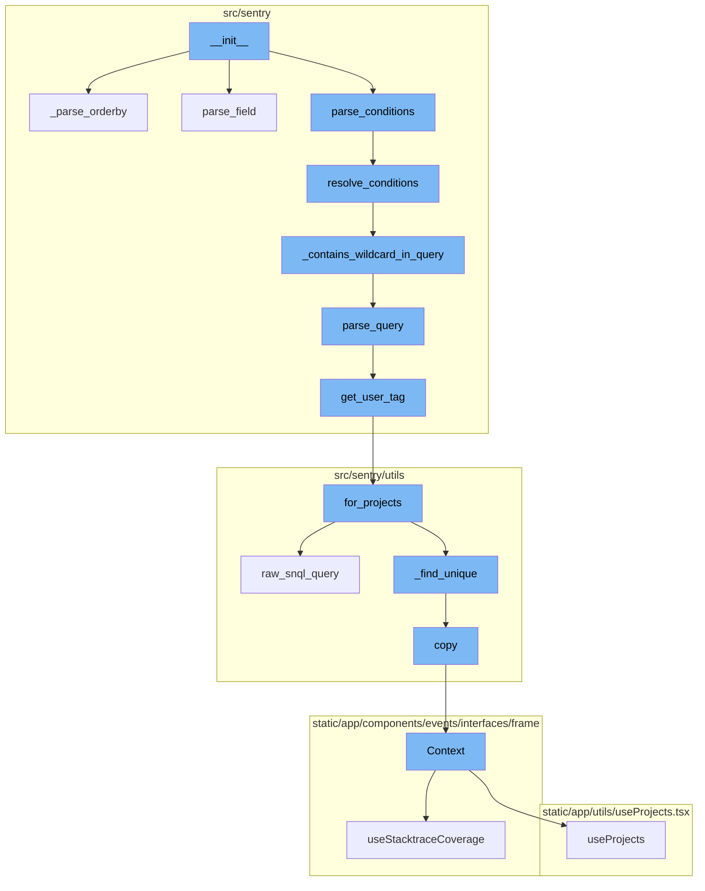
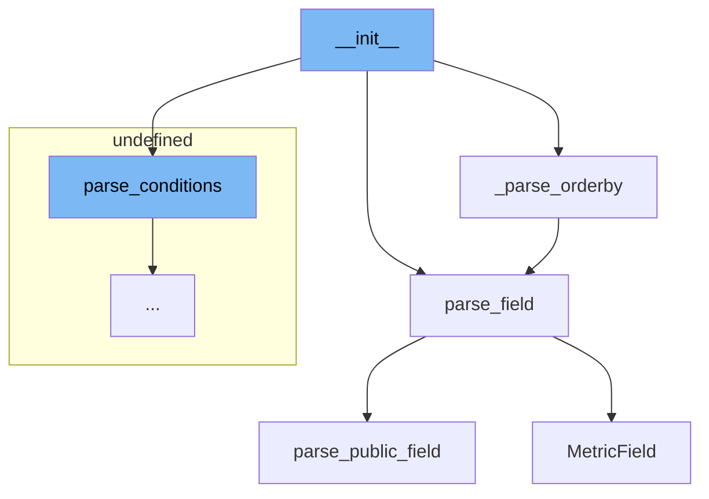
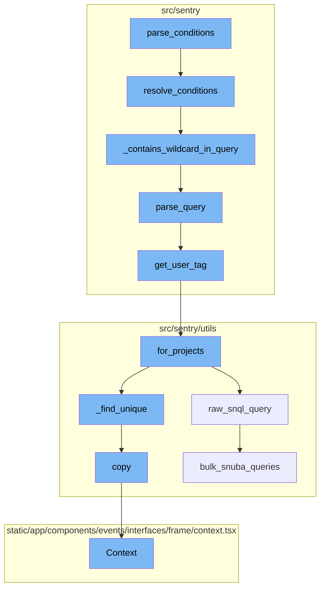

# Overview of **init**

The `__init__` function is a special method in Python classes. It is the constructor method that's automatically called when an object of a class is instantiated. In this case, it is used to initialize the `QueryBuilder` class with the necessary parameters such as projects, query parameters, and pagination arguments. It also sets up various properties of the class like `self.fields`, `self.orderby`, `self.limit`, `self.offset`, `self.having`, `self.where`, and others.

# Parsing Orderby

The `_parse_orderby` function is called within the `__init__` function. It is used to parse the 'orderBy' query parameter. It iterates over the 'orderBy' parameters, determines the direction of ordering (ascending or descending), and calls the `parse_field` function to parse the field for ordering. The result is a list of `MetricsOrderBy` objects.

# Parsing Fields

The `parse_field` function is used to parse a field. It checks if the `allow_mri` flag is set and if so, it attempts to parse the field as an MRI field. If the field is not an MRI field or if `allow_mri` is not set, it calls the `parse_public_field` function to parse the field.

# Parsing Public Fields

The `parse_public_field` function is used to parse a public field. It uses a regular expression to match the field and extract the operation and metric name. If the regular expression does not match, it assumes that the field is a metric name without an operation.

# Metric Field Function

The `MetricField` function is a React component used to render a form field for selecting a metric. It uses the `FormField` component and provides a custom render function. The render function uses the `getFieldOptionConfig` and `generateFieldOptions` functions to generate the options for the field, and the `explodeFieldString` function to parse the current value of the field.

# Parsing Conditions

The `parse_conditions` function is the first step in the `__init__` flow. It takes a query string, projects, and environments as arguments and returns a list of snuba conditions. It uses the `ReleaseHealthQueryBuilder` to resolve conditions and parameters from the query string.

# Resolving Conditions

The `resolve_conditions` function is the next step in the flow. It checks if the query contains a wildcard. If it does, it raises an `InvalidSearchQuery` exception. If not, it calls the parent's `resolve_conditions` method.

# Checking for Wildcards

`_contains_wildcard_in_query` is a helper function used in `resolve_conditions`. It parses the query and checks if any of the parsed terms is a wildcard. It returns a boolean value indicating whether a wildcard was found.

# Parsing Query

`parse_query` function is used to parse the query string and returns a structured dictionary of query term values. It tokenizes the query and processes each token based on its key.

# Getting User Tag

`get_user_tag` function is used to fetch the user tag for a given key-value pair. It uses the `EventUser.for_projects` method to fetch the `EventUser` object for the given projects and filters.

# Fetching EventUser for Projects

`for_projects` function fetches the `EventUser` with a Snuba query that exists within a list of projects and valid keyword filters. It performs a Snuba query and then finds unique `EventUser` objects from the results.

# Performing Raw Snuba Query

`raw_snql_query` function is an alias for `bulk_snuba_queries` and is used to perform a Snuba query without any additional processing.

# Finding Unique EventUsers

`_find_unique` function is used to find unique `EventUser` objects from the Snuba results. It returns the first instance of an `EventUser` object with a unique tag value.

# Copying Context

`copy` function is used to create a copy of the context with the same request and a copy of the backends.

# Context Function

`Context` function is a React component that displays the context of a frame in the Sentry web application. It shows the source code, variables, registers, and assembly for a frame.



# Flow drill down

First, we'll zoom into this section of the flow:



<SwmSnippet path="/src/sentry/snuba/metrics/query_builder.py" line="506">

---

# **init** Function

The `__init__` function is a special method in Python classes. It is the constructor method that's automatically called when an object of a class is instantiated. In this case, it is used to initialize the `QueryBuilder` class with the necessary parameters such as projects, query parameters, and pagination arguments. It also sets up various properties of the class like `self.fields`, `self.orderby`, `self.limit`, `self.offset`, `self.having`, `self.where`, and others.

```python
    def __init__(
        self,
        projects,
        query_params,
        allow_mri: bool = False,
        paginator_kwargs: dict | None = None,
    ):
        self._projects = projects
        paginator_kwargs = paginator_kwargs or {}

        self.query = query_params.get("query", "")
        self.groupby = [
            MetricGroupByField(groupby_col) for groupby_col in query_params.getlist("groupBy", [])
        ]
        self.fields = [
            parse_field(
                key,
                allow_mri=allow_mri,
            )
            for key in query_params.getlist("field", [])
        ]
```

---

</SwmSnippet>

<SwmSnippet path="/src/sentry/snuba/metrics/query_builder.py" line="561">

---

# \_parse_orderby Function

The `_parse_orderby` function is called within the `__init__` function. It is used to parse the 'orderBy' query parameter. It iterates over the 'orderBy' parameters, determines the direction of ordering (ascending or descending), and calls the `parse_field` function to parse the field for ordering. The result is a list of `MetricsOrderBy` objects.

```python
    def _parse_orderby(query_params, allow_mri: bool = False):
        orderbys = query_params.getlist("orderBy", [])
        if not orderbys:
            return None

        orderby_list = []
        for orderby in orderbys:
            direction = Direction.ASC
            if orderby[0] == "-":
                orderby = orderby[1:]
                direction = Direction.DESC

            field = parse_field(orderby, allow_mri=allow_mri)
            orderby_list.append(MetricsOrderBy(field=field, direction=direction))

        return orderby_list
```

---

</SwmSnippet>

<SwmSnippet path="/src/sentry/snuba/metrics/query_builder.py" line="115">

---

# parse_field Function

The `parse_field` function is used to parse a field. It checks if the `allow_mri` flag is set and if so, it attempts to parse the field as an MRI field. If the field is not an MRI field or if `allow_mri` is not set, it calls the `parse_public_field` function to parse the field.

```python
def parse_field(field: str, allow_mri: bool = False) -> MetricField:
    if allow_mri:
        if parsed_mri_field := parse_mri_field(field):
            return MetricField(parsed_mri_field.op, parsed_mri_field.mri.mri_string)

    return parse_public_field(field)
```

---

</SwmSnippet>

<SwmSnippet path="/src/sentry/snuba/metrics/query_builder.py" line="123">

---

# parse_public_field Function

The `parse_public_field` function is used to parse a public field. It uses a regular expression to match the field and extract the operation and metric name. If the regular expression does not match, it assumes that the field is a metric name without an operation.

```python
# TODO(ddm): implement this similar to parse_mri_field
def parse_public_field(field: str) -> MetricField:
    matches = PUBLIC_EXPRESSION_REGEX.match(field)

    try:
        operation = matches[1]
        metric_name = matches[2]
    except (TypeError, IndexError):
        operation = None
        metric_name = field

    return MetricField(operation, get_mri(metric_name))
```

---

</SwmSnippet>

<SwmSnippet path="/static/app/views/alerts/rules/metric/metricField.tsx" line="98">

---

# MetricField Function

The `MetricField` function is a React component used to render a form field for selecting a metric. It uses the `FormField` component and provides a custom render function. The render function uses the `getFieldOptionConfig` and `generateFieldOptions` functions to generate the options for the field, and the `explodeFieldString` function to parse the current value of the field.

```tsx
function MetricField({
  organization,
  columnWidth,
  inFieldLabels,
  alertType,
  ...props
}: Props) {
  return (
    <FormField {...props}>
      {({onChange, value, model, disabled}) => {
        const dataset = model.getValue('dataset');

        const {fieldOptionsConfig, hidePrimarySelector, hideParameterSelector} =
          getFieldOptionConfig({
            dataset: dataset as Dataset,
            alertType,
          });
        const fieldOptions = generateFieldOptions({organization, ...fieldOptionsConfig});
        const fieldValue = explodeFieldString(value ?? '');

        const fieldKey =
```

---

</SwmSnippet>

Now, lets zoom into this section of the flow:



<SwmSnippet path="/src/sentry/snuba/metrics/query_builder.py" line="448">

---

# `__init__` Function Flow

`parse_conditions` function is the first step in the `__init__` flow. It takes a query string, projects, and environments as arguments and returns a list of snuba conditions. It uses the `ReleaseHealthQueryBuilder` to resolve conditions and parameters from the query string.

```python
def parse_conditions(
    query_string: str, projects: Sequence[Project], environments: Sequence[str]
) -> Sequence[Condition]:
    """Parse given filter query and query params into a list of snuba conditions"""
    # HACK: Parse a sessions query, validate / transform afterwards.
    # We will want to write our own grammar + interpreter for this later.
    try:
        query_builder = ReleaseHealthQueryBuilder(
            Dataset.Sessions,
            params={
                "environment": environments,
                "project_id": [project.id for project in projects],
                "organization_id": org_id_from_projects(projects) if projects else None,
            },
            config=QueryBuilderConfig(use_aggregate_conditions=True),
        )
        where, _ = query_builder.resolve_conditions(query_string)
        param_conditions = list(filter(_strip_project_id, query_builder.resolve_params()))
    except InvalidSearchQuery as e:
        raise InvalidParams(f"Failed to parse conditions: {e}")

```

---

</SwmSnippet>

<SwmSnippet path="/src/sentry/snuba/metrics/query_builder.py" line="486">

---

The `resolve_conditions` function is the next step in the flow. It checks if the query contains a wildcard. If it does, it raises an `InvalidSearchQuery` exception. If not, it calls the parent's `resolve_conditions` method.

```python
    def resolve_conditions(
        self,
        query: str | None,
    ) -> tuple[list[WhereType], list[WhereType]]:
        if not self._contains_wildcard_in_query(query):
            return super().resolve_conditions(query)

        raise InvalidSearchQuery("Release Health Queries don't support wildcards")
```

---

</SwmSnippet>

<SwmSnippet path="/src/sentry/snuba/metrics/query_builder.py" line="475">

---

`_contains_wildcard_in_query` is a helper function used in `resolve_conditions`. It parses the query and checks if any of the parsed terms is a wildcard. It returns a boolean value indicating whether a wildcard was found.

```python
    def _contains_wildcard_in_query(self, query: str | None) -> bool:
        parsed_terms = self.parse_query(query)
        for parsed_term in parsed_terms:
            # Since wildcards search uses the clickhouse `match` operator that works on strings, we can't
            # use it for release health, since tags are stored as integers and converted through
            # the indexer.
            if isinstance(parsed_term, SearchFilter) and parsed_term.value.is_wildcard():
                return True

        return False
```

---

</SwmSnippet>

<SwmSnippet path="/src/sentry/search/utils.py" line="706">

---

`parse_query` function is used to parse the query string and returns a structured dictionary of query term values. It tokenizes the query and processes each token based on its key.

```python
def parse_query(
    projects: Sequence[Project],
    query: str,
    user: User | AnonymousUser,
    environments: Sequence[Environment],
) -> dict[str, Any]:
    """| Parses the query string and returns a dict of structured query term values:
    | Required:
    | - tags: dict[str, Union[str, list[str], Any]]: dictionary of tag key-values 'user.id:123'
    | - query: str: the general query portion of the query string
    | Optional:
    | - unassigned: bool: 'is:unassigned'
    | - for_review: bool: 'is:for_review'
    | - linked: bool: 'is:linked'
    | - status: int: 'is:<resolved,unresolved,ignored,muted,reprocessing>'
    | - assigned_to: Optional[Union[User, Team]]: 'assigned:<user or team>'
    | - assigned_or_suggested: Optional[Union[User, Team]]: 'assigned_or_suggested:<user or team>'
    | - bookmarked_by: User: 'bookmarks:<user>'
    | - subscribed_by: User: 'subscribed:<user>'
    | - first_release: Sequence[str]: '<first-release/firstRelease>:1.2.3'
    | - age_from: Union[datetime, bool]: '<age/firstSeen>:-1h'
```

---

</SwmSnippet>

<SwmSnippet path="/src/sentry/search/utils.py" line="34">

---

`get_user_tag` function is used to fetch the user tag for a given key-value pair. It uses the `EventUser.for_projects` method to fetch the `EventUser` object for the given projects and filters.

```python
def get_user_tag(projects: Sequence[Project], key: str, value: str) -> str:
    # TODO(dcramer): do something with case of multiple matches
    try:
        euser = EventUser.for_projects(projects, {key: [value]}, result_limit=1)[0]
    except (KeyError, IndexError):
        return f"{key}:{value}"
    except DataError:
        raise InvalidQuery(f"malformed '{key}:' query '{value}'.")

    return euser.tag_value
```

---

</SwmSnippet>

<SwmSnippet path="/src/sentry/utils/eventuser.py" line="119">

---

`for_projects` function fetches the `EventUser` with a Snuba query that exists within a list of projects and valid keyword filters. It performs a Snuba query and then finds unique `EventUser` objects from the results.

```python
    def for_projects(
        self,
        projects: QuerySet[Project] | list[Project],
        keyword_filters: Mapping[str, list[Any]],
        filter_boolean: BooleanOp = BooleanOp.AND,
        result_offset: int = 0,
        result_limit: int | None = None,
    ) -> list[EventUser]:
        """
        Fetch the EventUser with a Snuba query that exists within a list of projects
        and valid `keyword_filters`. The `keyword_filter` keys are in `KEYWORD_MAP`.
        """
        start_time = time.time()

        oldest_project = min(projects, key=lambda item: item.date_added)

        where_conditions = [
            Condition(Column("project_id"), Op.IN, [p.id for p in projects]),
            Condition(Column("timestamp"), Op.LT, datetime.now()),
            Condition(Column("timestamp"), Op.GTE, oldest_project.date_added),
        ]
```

---

</SwmSnippet>

<SwmSnippet path="/src/sentry/utils/snuba.py" line="881">

---

`raw_snql_query` function is an alias for `bulk_snuba_queries` and is used to perform a Snuba query without any additional processing.

```python
def raw_snql_query(
    request: Request,
    referrer: str | None = None,
    use_cache: bool = False,
    query_source: (
        QuerySource | None
    ) = None,  # TODO: @athena Make this field required after updated all the callsites
) -> Mapping[str, Any]:
    """
    Alias for `bulk_snuba_queries`, kept for backwards compatibility.
    """
    # XXX (evanh): This function does none of the extra processing that the
    # other functions do here. It does not add any automatic conditions, format
    # results, nothing. Use at your own risk.
    return bulk_snuba_queries(
        requests=[request], referrer=referrer, use_cache=use_cache, query_source=query_source
    )[0]
```

---

</SwmSnippet>

<SwmSnippet path="/src/sentry/utils/eventuser.py" line="259">

---

`_find_unique` function is used to find unique `EventUser` objects from the Snuba results. It returns the first instance of an `EventUser` object with a unique tag value.

```python
    def _find_unique(data_results: list[dict[str, Any]], seen_eventuser_tags: set[str]):
        """
        Return the first instance of an EventUser object
        with a unique tag_value from the Snuba results.
        """
        unique_tag_values = seen_eventuser_tags.copy()
        unique_event_users = []

        for euser in [EventUser.from_snuba(item) for item in data_results]:
            tag_value = euser.tag_value
            if tag_value not in unique_tag_values:
                unique_event_users.append(euser)
                unique_tag_values.add(tag_value)

        return unique_event_users, unique_tag_values
```

---

</SwmSnippet>

<SwmSnippet path="/src/sentry/utils/services.py" line="42">

---

`copy` function is used to create a copy of the context with the same request and a copy of the backends.

```python
        self.backends = backends

    def copy(self) -> Context:
        return Context(self.request, self.backends.copy())
```

---

</SwmSnippet>

<SwmSnippet path="/static/app/components/events/interfaces/frame/context.tsx" line="66">

---

`Context` function is a React component that displays the context of a frame in the Sentry web application. It shows the source code, variables, registers, and assembly for a frame.

```tsx
function Context({
  hasContextVars = false,
  hasContextSource = false,
  hasContextRegisters = false,
  isExpanded = false,
  hasAssembly = false,
  emptySourceNotation = false,
  registers,
  frame,
  event,
  className,
  frameMeta,
  registersMeta,
  platform,
}: Props) {
  const organization = useOrganization();

  const {projects} = useProjects();
  const project = useMemo(
    () => projects.find(p => p.id === event.projectID),
    [projects, event]
```

---

</SwmSnippet>

&nbsp;

*This is an auto-generated document by Swimm AI 🌊 and has not yet been verified by a human*

<SwmMeta version="3.0.0" repo-id="Z2l0aHViJTNBJTNBc2VudHJ5LWRlbW8lM0ElM0FTd2ltbS1EZW1v" repo-name="sentry-demo" doc-type="flows"><sup>Powered by [Swimm](/)</sup></SwmMeta>
