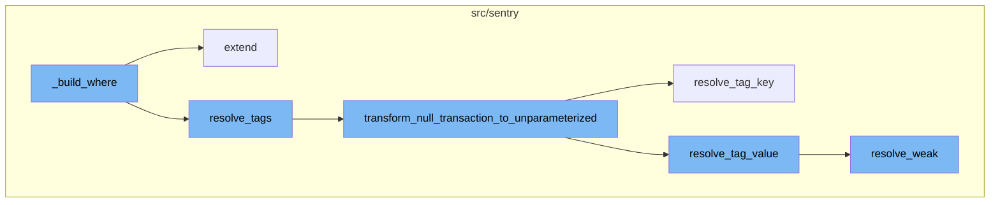
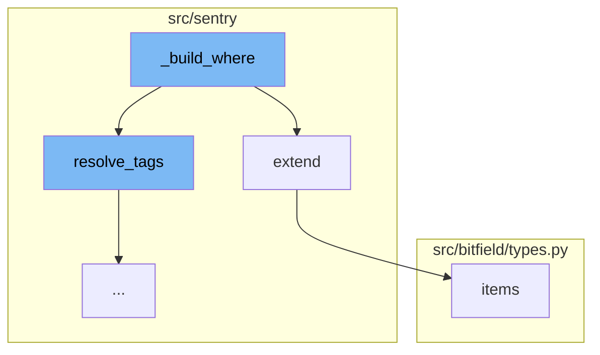
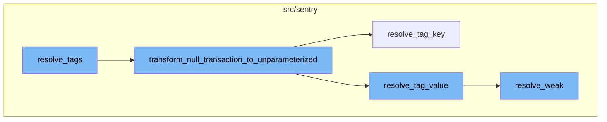
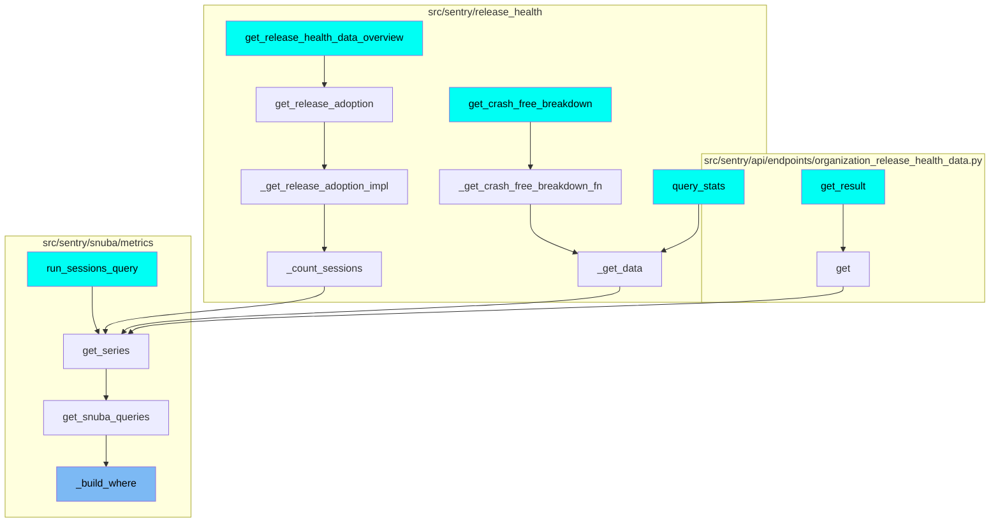

# \_build_where Function Overview

The `_build_where` function is a crucial part of the query building process. It is responsible for constructing the 'where' clause of a query. This function starts by creating a list of conditions that include the organization id and project id, then adds time frame conditions to the list. If there are no additional conditions in the metrics query, it returns the 'where' list. Otherwise, it processes each condition in the metrics query, generating where statements for instances of `MetricConditionField` and appending them to the `metric_condition_filters` list. For other conditions, it appends them to the `snuba_conditions` list. Finally, it extends the 'where' list with the `metric_condition_filters` and resolved tags from the `snuba_conditions`.

# \_build_where Function Flow

The flow of the `_build_where` function involves several steps and functions. It starts with the `resolve_tags` function, which translates tags in snuba conditions. Then, the `transform_null_transaction_to_unparameterized` function transforms any null `tag.transaction` to '<< unparameterized >>'. The `resolve_tag_key` function is then called to resolve the tag key based on the use case id. The `resolve_tag_value` function is then called to resolve the tag value based on the use case id. The final step in the flow is the `resolve_weak` function, which is a version of `resolve` that returns -1 for missing values. This is useful when producing a WHERE-clause, as it makes the WHERE-clause 'impossible' with `WHERE x = -1` instead of explicitly handling that exception.

# Usage of \_build_where Function

The `_build_where` function and its flow are used multiple times in the codebase. Some of the entry points of this flow include `get_release_health_data_overview`, `get_crash_free_breakdown`, `get_result`, `query_stats`, and `run_sessions_query` functions.



# Flow drill down

First, we'll zoom into this section of the flow:



<SwmSnippet path="/src/sentry/snuba/metrics/query_builder.py" line="890">

---

# \_build_where Function

The `_build_where` function is responsible for building the 'where' clause of a query. It starts by creating a list of conditions that include the organization id and project id. It then adds time frame conditions to the list. If there are no additional conditions in the metrics query, it returns the 'where' list. Otherwise, it processes each condition in the metrics query. If the condition is an instance of `MetricConditionField`, it generates where statements and appends them to the `metric_condition_filters` list. If not, it appends the condition to the `snuba_conditions` list. Finally, it extends the 'where' list with the `metric_condition_filters` and resolved tags from the `snuba_conditions`.

```python
    def _build_where(self) -> list[BooleanCondition | Condition]:
        where: list[BooleanCondition | Condition] = [
            Condition(Column("org_id"), Op.EQ, self._org_id),
            Condition(Column("project_id"), Op.IN, self._metrics_query.project_ids),
        ]

        where += self._build_timeframe()

        if not self._metrics_query.where:
            return where

        snuba_conditions = []
        # Adds filters that do not need to be resolved because they are instances of `MetricConditionField`
        metric_condition_filters = []
        for condition in self._metrics_query.where:
            if isinstance(condition, MetricConditionField):
                metric_expression = metric_object_factory(
                    condition.lhs.op, condition.lhs.metric_mri
                )
                try:
                    metric_condition_filters.append(
```

---

</SwmSnippet>

<SwmSnippet path="/src/sentry/backup/dependencies.py" line="359">

---

# extend Method

The `extend` method is used in the `_build_where` function to add additional conditions to the 'where' list. This method takes another map as an argument and inserts all its values into the current map without mutating the original map.

```python
    def extend(self, other: PrimaryKeyMap) -> None:
        """
        Insert all values from another map into this one, without mutating the original map.
        """

        for model_name_str, mappings in other.mapping.items():
            for old_pk, new_entry in mappings.items():
                self.mapping[model_name_str][old_pk] = new_entry
```

---

</SwmSnippet>

<SwmSnippet path="/src/bitfield/types.py" line="225">

---

# items Method

The `items` method is not directly used in the `_build_where` function, but it's a common method in Python used to return a list of dictionary's (key, value) tuple pairs.

```python
    def items(self):
        return list(self.iteritems())
```

---

</SwmSnippet>

Now, lets zoom into this section of the flow:



<SwmSnippet path="/src/sentry/snuba/metrics/query_builder.py" line="179">

---

# \_build_where Flow

The function `resolve_tags` is the first step in the flow. It translates tags in snuba conditions. If the input is a list or tuple, it recursively resolves each item. If the input is a function, it handles different cases based on the function type. If the input is a condition, it resolves the left-hand side and right-hand side of the condition. If the input is a boolean condition, it resolves each condition in the input. If the input is a column, it resolves the column name. If the input is a string, it resolves the string as a tag value or a weak resolution based on the `is_tag_value` flag. If the input is an integer, it simply returns the input.

```python
def resolve_tags(
    use_case_id: UseCaseID,
    org_id: int,
    input_: Any,
    projects: Sequence[Project],
    is_tag_value: bool = False,
    allowed_tag_keys: dict[str, str] | None = None,
) -> Any:
    """Translate tags in snuba condition

    Column("metric_id") is not supported.
    """
    if input_ is None:
        return None
    if isinstance(input_, (list, tuple)):
        elements = [
            resolve_tags(
                use_case_id,
                org_id,
                item,
                projects,
```

---

</SwmSnippet>

<SwmSnippet path="/src/sentry/snuba/metrics/query_builder.py" line="137">

---

The function `transform_null_transaction_to_unparameterized` is the next step in the flow. It transforms any null `tag.transaction` to '<< unparameterized >>' so that it can be handled as such in any query using that tag value.

```python
def transform_null_transaction_to_unparameterized(use_case_id, org_id, alias=None):
    """
    This function transforms any null tag.transaction to '<< unparameterized >>' so that it can be handled
    as such in any query using that tag value.

    The logic behind this query is that ClickHouse will return '' in case tag.transaction is not set and we want to
    transform that '' as '<< unparameterized >>'.

    It is important to note that this transformation has to be applied ONLY on tag.transaction.
    """
    return Function(
        function="transform",
        parameters=[
            Column(resolve_tag_key(use_case_id, org_id, "transaction")),
            [""],
            [resolve_tag_value(use_case_id, org_id, "<< unparameterized >>")],
        ],
        alias=alias,
    )
```

---

</SwmSnippet>

<SwmSnippet path="/src/sentry/sentry_metrics/utils.py" line="141">

---

The function `resolve_tag_key` is called next. It resolves the tag key based on the use case id. If the use case id is `PERFORMANCE`, it returns `tags_raw[resolved]`, otherwise it returns `tags[resolved]`.

```python
def resolve_tag_key(use_case_id: UseCaseID | UseCaseKey, org_id: int, string: str) -> str:
    use_case_id = to_use_case_id(use_case_id)
    resolved = resolve(use_case_id, org_id, string)
    assert isinstance(use_case_id, UseCaseID)
    if METRIC_PATH_MAPPING[use_case_id] is UseCaseKey.PERFORMANCE:
        return f"tags_raw[{resolved}]"
    else:
        return f"tags[{resolved}]"
```

---

</SwmSnippet>

<SwmSnippet path="/src/sentry/sentry_metrics/utils.py" line="151">

---

The function `resolve_tag_value` is then called. It resolves the tag value based on the use case id. If the use case id is `PERFORMANCE`, it returns the string as is, otherwise it calls `resolve_weak` to resolve the string.

```python
def resolve_tag_value(use_case_id: UseCaseID | UseCaseKey, org_id: int, string: str) -> str | int:
    use_case_id = to_use_case_id(use_case_id)
    assert isinstance(string, str)
    assert isinstance(use_case_id, UseCaseID)
    if METRIC_PATH_MAPPING[use_case_id] is UseCaseKey.PERFORMANCE:
        return string
    return resolve_weak(use_case_id, org_id, string)
```

---

</SwmSnippet>

<SwmSnippet path="/src/sentry/sentry_metrics/utils.py" line="173">

---

The final step in the flow is the function `resolve_weak`. It is a version of `resolve` that returns -1 for missing values. This is useful when producing a WHERE-clause, as it makes the WHERE-clause 'impossible' with `WHERE x = -1` instead of explicitly handling that exception.

```python
def resolve_weak(use_case_id: UseCaseID | UseCaseKey, org_id: int, string: str) -> int:
    """
    A version of `resolve` that returns -1 for missing values.

    When using `resolve_weak` to produce a WHERE-clause, it is quite
    useful to make the WHERE-clause "impossible" with `WHERE x = -1` instead of
    explicitly handling that exception.
    """
    use_case_id = to_use_case_id(use_case_id)
    resolved = indexer.resolve(use_case_id, org_id, string)
    if resolved is None:
        return STRING_NOT_FOUND

    return resolved
```

---

</SwmSnippet>

# Where is this flow used?

This flow is used multiple times in the codebase as represented in the following diagram:

(Note - these are only some of the entry points of this flow)



&nbsp;

*This is an auto-generated document by Swimm AI 🌊 and has not yet been verified by a human*

<SwmMeta version="3.0.0" repo-id="Z2l0aHViJTNBJTNBc2VudHJ5LWRlbW8lM0ElM0FTd2ltbS1EZW1v" repo-name="sentry-demo" doc-type="flows"><sup>Powered by [Swimm](/)</sup></SwmMeta>
