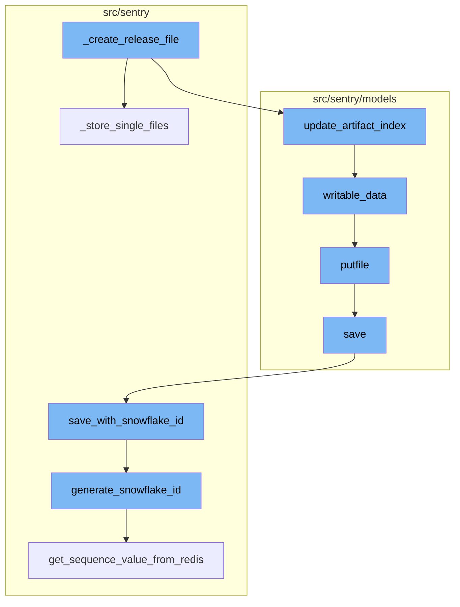
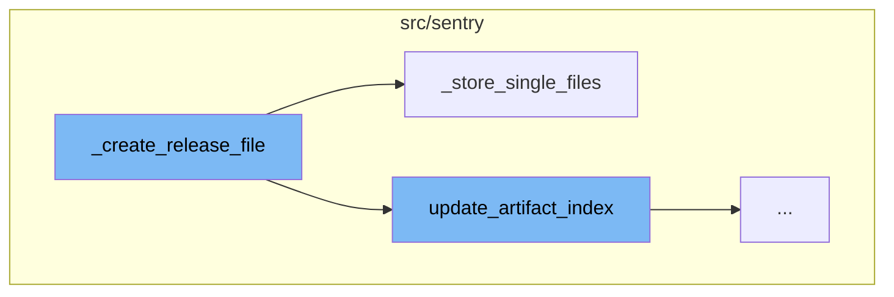
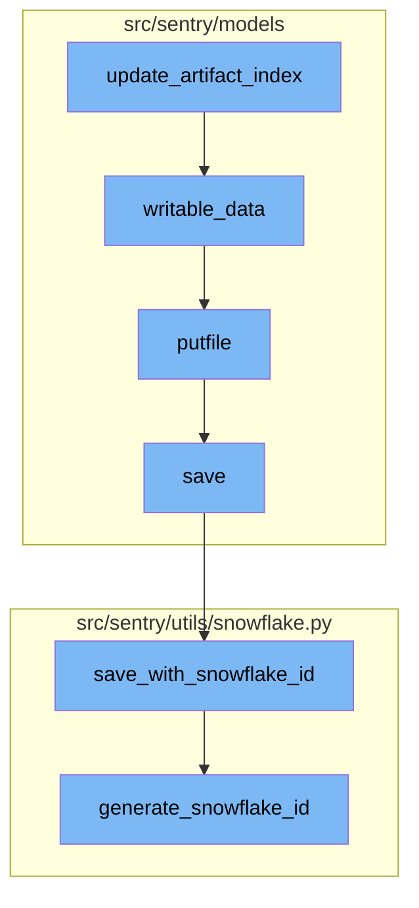

# \_create_release_file Overview

The `_create_release_file` function is a key part of the release process in Sentry. It is responsible for creating a release file, which is a record of a specific version of the codebase. This function validates the manifest of the archive against the organization and release version. If the validation passes, it attempts to retrieve the release from the database. If the release does not exist, it raises an error. If the release exists, it checks if the artifact count of the archive is greater than or equal to the minimum artifact count. If it is, it calls the `update_artifact_index` function. If the artifact count is less than the minimum, it calls the `_store_single_files` function.

# \_store_single_files Function

The `_store_single_files` function is called when the artifact count of the archive is less than the minimum artifact count. It extracts the archive and iterates over the files in the manifest. For each file, it creates a new file object and stores it in the database. It then calls the `_upsert_release_file` function to update or insert the release file in the database.

# update_artifact_index Function

The `update_artifact_index` function adds information from the release archive to the artifact index. It creates a `ReleaseFile` instance and extracts information from the release archive file. The extracted information is then used to update the artifact index.

# writable_data Function

The `writable_data` function is a context manager for the editable artifact index. It either creates a new `ReleaseFile` instance or locks the row for editing. It then loads the artifact index data from the `ReleaseFile` instance and yields it for editing.

# putfile Function

The `putfile` function handles the storage of the attachment data. It normalizes the content type of the attachment, calculates its size and checksum, and saves it to the storage.

# save Function

The `save` function handles the saving of the project instance. It generates a unique slug for the project if it doesn't have one and saves the project instance with a snowflake ID.

# save_with_snowflake_id Function

The `save_with_snowflake_id` function ensures that the instance is saved with a unique snowflake ID. It generates a new snowflake ID if the instance doesn't have one and saves the instance.

# generate_snowflake_id Function

The `generate_snowflake_id` function generates a unique snowflake ID based on the current time, region, and sequence value. The generated snowflake ID is then used to save the instance.



# Flow drill down

First, we'll zoom into this section of the flow:



<SwmSnippet path="/src/sentry/tasks/assemble.py" line="372">

---

# \_create_release_file Function

The `_create_release_file` function is responsible for creating a release file. It first validates the manifest of the archive against the organization and release version. If the validation passes, it attempts to retrieve the release from the database. If the release does not exist, it raises an error. If the release exists, it checks if the artifact count of the archive is greater than or equal to the minimum artifact count. If it is, it calls the `update_artifact_index` function. If the artifact count is less than the minimum, it calls the `_store_single_files` function.

```python
    def _create_release_file(self):
        manifest = self.archive.manifest

        if manifest.get("org") != self.organization.slug:
            raise AssembleArtifactsError("organization does not match uploaded bundle")

        if manifest.get("release") != self.version:
            raise AssembleArtifactsError("release does not match uploaded bundle")

        try:
            release = Release.objects.get(
                organization_id=self.organization.id, version=self.version
            )
        except Release.DoesNotExist:
            raise AssembleArtifactsError("release does not exist")

        dist_name = manifest.get("dist")
        dist = release.add_dist(dist_name) if dist_name else None

        min_artifact_count = options.get("processing.release-archive-min-files")
        saved_as_archive = False
```

---

</SwmSnippet>

<SwmSnippet path="/src/sentry/tasks/assemble.py" line="422">

---

# \_store_single_files Function

The `_store_single_files` function is called when the artifact count of the archive is less than the minimum artifact count. It extracts the archive and iterates over the files in the manifest. For each file, it creates a new file object and stores it in the database. It then calls the `_upsert_release_file` function to update or insert the release file in the database.

```python
    def _store_single_files(self, meta: dict):
        try:
            temp_dir = self.archive.extract()
        except Exception:
            raise AssembleArtifactsError("failed to extract bundle")

        with temp_dir:
            artifacts = self.archive.manifest.get("files", {})
            for rel_path, artifact in artifacts.items():
                artifact_url = artifact.get("url", rel_path)
                artifact_basename = self._get_artifact_basename(artifact_url)

                file = File.objects.create(
                    name=artifact_basename, type="release.file", headers=artifact.get("headers", {})
                )

                full_path = path.join(temp_dir.name, rel_path)
                with open(full_path, "rb") as fp:
                    file.putfile(fp, logger=logger)

                kwargs = dict(meta, name=artifact_url)
```

---

</SwmSnippet>

Now, lets zoom into this section of the flow:



<SwmSnippet path="/src/sentry/models/releasefile.py" line="400">

---

# \_create_release_file Flow

The flow begins with the `update_artifact_index` function. This function adds information from the release archive to the artifact index. It creates a `ReleaseFile` instance and extracts information from the release archive file. The extracted information is then used to update the artifact index.

```python
def update_artifact_index(
    release: Release,
    dist: Distribution | None,
    archive_file: File,
    temp_file: IO | None = None,
):
    """Add information from release archive to artifact index

    :returns: The created ReleaseFile instance
    """
    releasefile = ReleaseFile.objects.create(
        name=archive_file.name,
        release_id=release.id,
        organization_id=release.organization_id,
        dist_id=dist.id if dist else dist,
        file=archive_file,
        artifact_count=0,  # Artifacts will be counted with artifact index
    )

    files_out = {}
    with ReleaseArchive(temp_file or archive_file.getfile()) as archive:
```

---

</SwmSnippet>

<SwmSnippet path="/src/sentry/models/releasefile.py" line="305">

---

Next, the `writable_data` function is called. This function is a context manager for the editable artifact index. It either creates a new `ReleaseFile` instance or locks the row for editing. It then loads the artifact index data from the `ReleaseFile` instance and yields it for editing.

```python
    def writable_data(self, create: bool, initial_artifact_count=None):
        """Context manager for editable artifact index"""
        with atomic_transaction(
            using=(
                router.db_for_write(ReleaseFile),
                router.db_for_write(File),
            )
        ):
            created = False
            if create:
                releasefile, created = self._get_or_create_releasefile(initial_artifact_count)
            else:
                # Lock the row for editing:
                # NOTE: Do not select_related('file') here, because we do not
                # want to lock the File table
                qs = self._releasefile_qs().select_for_update()
                try:
                    releasefile = qs[0]
                except IndexError:
                    releasefile = None

```

---

</SwmSnippet>

<SwmSnippet path="/src/sentry/models/eventattachment.py" line="169">

---

The `putfile` function is then called. This function handles the storage of the attachment data. It normalizes the content type of the attachment, calculates its size and checksum, and saves it to the storage.

```python
    def putfile(cls, project_id: int, attachment: CachedAttachment) -> PutfileResult:
        from sentry.models.files import FileBlob

        content_type = normalize_content_type(attachment.content_type, attachment.name)
        data = attachment.data

        if len(data) == 0:
            return PutfileResult(content_type=content_type, size=0, sha1=sha1().hexdigest())

        blob = BytesIO(data)

        size, checksum = get_size_and_checksum(blob)

        if can_store_inline(data):
            blob_path = ":" + data.decode()
        else:
            blob_path = "eventattachments/v1/" + FileBlob.generate_unique_path()

            storage = get_storage()
            compressed_blob = BytesIO(zstandard.compress(data))
            storage.save(blob_path, compressed_blob)
```

---

</SwmSnippet>

<SwmSnippet path="/src/sentry/models/project.py" line="365">

---

The `save` function is then called. This function handles the saving of the project instance. It generates a unique slug for the project if it doesn't have one and saves the project instance with a snowflake ID.

```python
    def save(self, *args, **kwargs):
        if not self.slug:
            lock = locks.get(
                f"slug:project:{self.organization_id}", duration=5, name="project_slug"
            )
            with TimedRetryPolicy(10)(lock.acquire):
                slugify_instance(
                    self,
                    self.name,
                    organization=self.organization,
                    reserved=RESERVED_PROJECT_SLUGS,
                    max_length=50,
                )

        if SENTRY_USE_SNOWFLAKE:
            snowflake_redis_key = "project_snowflake_key"
            save_with_snowflake_id(
                instance=self,
                snowflake_redis_key=snowflake_redis_key,
                save_callback=lambda: super(Project, self).save(*args, **kwargs),
            )
```

---

</SwmSnippet>

<SwmSnippet path="/src/sentry/utils/snowflake.py" line="47">

---

The `save_with_snowflake_id` function is called within the `save` function. This function ensures that the instance is saved with a unique snowflake ID. It generates a new snowflake ID if the instance doesn't have one and saves the instance.

```python
def save_with_snowflake_id(
    instance: BaseModel, snowflake_redis_key: str, save_callback: Callable[[], object]
) -> None:
    assert uses_snowflake_id(
        instance.__class__
    ), "Only models decorated with uses_snowflake_id can be saved with save_with_snowflake_id()"

    for _ in range(settings.MAX_REDIS_SNOWFLAKE_RETRY_COUNTER):
        if not instance.id:
            instance.id = generate_snowflake_id(snowflake_redis_key)
        try:
            with enforce_constraints(transaction.atomic(using=router.db_for_write(type(instance)))):
                save_callback()
            return
        except IntegrityError:
            instance.id = None  # type: ignore[assignment]  # see typeddjango/django-stubs#2014
    raise MaxSnowflakeRetryError
```

---

</SwmSnippet>

<SwmSnippet path="/src/sentry/utils/snowflake.py" line="113">

---

Finally, the `generate_snowflake_id` function is called. This function generates a unique snowflake ID based on the current time, region, and sequence value. The generated snowflake ID is then used to save the instance.

```python
def generate_snowflake_id(redis_key: str) -> int:
    segment_values = {}

    segment_values[VERSION_ID] = msb_0_ordering(settings.SNOWFLAKE_VERSION_ID, VERSION_ID.length)

    try:
        segment_values[REGION_ID] = get_local_region().snowflake_id
    except RegionContextError:  # expected if running in monolith mode
        segment_values[REGION_ID] = NULL_REGION_ID

    current_time = datetime.now().timestamp()
    # supports up to 130 years
    segment_values[TIME_DIFFERENCE] = int(current_time - settings.SENTRY_SNOWFLAKE_EPOCH_START)

    snowflake_id = 0
    (
        segment_values[TIME_DIFFERENCE],
        segment_values[REGION_SEQUENCE],
    ) = get_sequence_value_from_redis(redis_key, segment_values[TIME_DIFFERENCE])

    for segment in BIT_SEGMENT_SCHEMA:
```

---

</SwmSnippet>

&nbsp;

*This is an auto-generated document by Swimm AI 🌊 and has not yet been verified by a human*

<SwmMeta version="3.0.0" repo-id="Z2l0aHViJTNBJTNBc2VudHJ5LWRlbW8lM0ElM0FTd2ltbS1EZW1v" repo-name="sentry-demo" doc-type="flows"><sup>Powered by [Swimm](/)</sup></SwmMeta>
