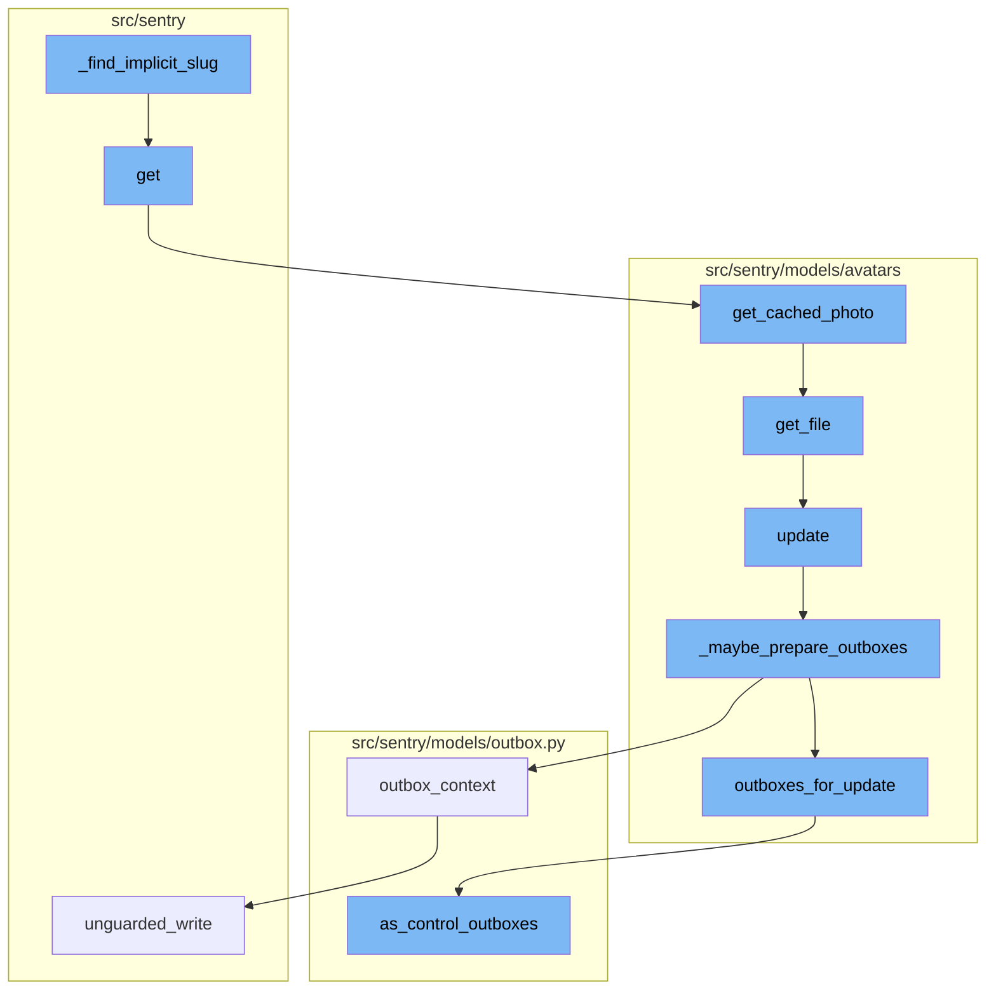

<SwmSnippet path="/src/sentry/web/frontend/base.py" line="229">

---

# \_find_implicit_slug Function

The `_find_implicit_slug` function is used to determine the organization slug from the request. If a subdomain is present and it's not the same as the active organization, the subdomain is used as the organization slug.

```python
    def _find_implicit_slug(self, request: HttpRequest) -> str | None:
        organization_slug = request.session.get("activeorg")
        if request.subdomain is not None and request.subdomain != organization_slug:
            # Customer domain is being used, set the subdomain as the requesting org slug.
            organization_slug = request.subdomain
        return organization_slug
```

---

</SwmSnippet>

<SwmSnippet path="/src/sentry/web/frontend/base.py" line="736">

---

# get Function

The `get` function retrieves an avatar based on the avatar ID provided in the request. It then attempts to get the avatar's photo file. If a size parameter is provided, it gets the cached photo of that size. The function ends by returning the photo file in the HTTP response.

```python
    def get(self, request: HttpRequest, *args: Any, **kwargs: Any) -> HttpResponse:
        avatar_id = kwargs["avatar_id"]
        try:
            avatar = self.model.objects.get(ident=avatar_id)
        except self.model.DoesNotExist:
            return HttpResponseNotFound()

        photo = avatar.get_file()
        if not photo:
            return HttpResponseNotFound()

        size_s = request.GET.get("s")
        photo_file = photo.getfile()
        if size_s:
            try:
                size = int(size_s)
            except ValueError:
                return HttpResponseBadRequest()
            else:
                photo_file = avatar.get_cached_photo(size)

```

---

</SwmSnippet>

<SwmSnippet path="/src/sentry/models/avatars/base.py" line="75">

---

# get_cached_photo Function

The `get_cached_photo` function retrieves a cached photo of a specified size. If the size is not allowed, it adjusts the size to the closest allowed size. If the photo is not in the cache, it opens the photo file, resizes the image, and saves it to the cache.

```python
    def get_cached_photo(self, size):
        file = self.get_file()
        if not file:
            return
        if size not in self.ALLOWED_SIZES:
            size = min(self.ALLOWED_SIZES, key=lambda x: abs(x - size))
        cache_key = self.get_cache_key(size)
        photo = cache.get(cache_key)
        if photo is None:
            photo_file = file.getfile()
            with Image.open(photo_file) as image:
                image = image.resize((size, size), Image.LANCZOS)
                image_file = BytesIO()
                image.save(image_file, "PNG")
                photo = image_file.getvalue()
                cache.set(cache_key, photo)
        return photo
```

---

</SwmSnippet>

<SwmSnippet path="/src/sentry/models/avatars/base.py" line="51">

---

# get_file Function

The `get_file` function retrieves a file based on the file ID. If the file does not exist, it updates the foreign key to None.

```python
    def get_file(self):
        file_id = getattr(self, self.file_write_fk(), None)
        file_class = self.file_class()
        try:
            return file_class.objects.get(pk=file_id)
        except ObjectDoesNotExist:
            # Best effort replication of previous behaviour with foreign key
            # which was set with on_delete=models.SET_NULL
            update = {self.file_fk(): None}
            self.update(**update)
            return None
```

---

</SwmSnippet>

<SwmSnippet path="/src/sentry/models/avatars/user_avatar.py" line="82">

---

# update Function

The `update` function updates the avatar. It uses the `_maybe_prepare_outboxes` function to prepare the outboxes before the update.

```python
    def update(self, *args: Any, **kwds: Any) -> int:
        with self._maybe_prepare_outboxes(outbox_before_super=False):
            return super().update(*args, **kwds)
```

---

</SwmSnippet>

<SwmSnippet path="/src/sentry/models/avatars/user_avatar.py" line="65">

---

# \_maybe_prepare_outboxes Function

The `_maybe_prepare_outboxes` function prepares the outboxes for the update. It uses the `outbox_context` to ensure that the outboxes are saved correctly.

```python
    def _maybe_prepare_outboxes(self, *, outbox_before_super: bool):
        from sentry.models.outbox import outbox_context

        with outbox_context(
            transaction.atomic(router.db_for_write(type(self))),
        ):
            if not outbox_before_super:
                yield
            for outbox in self.outboxes_for_update():
                outbox.save()
            if outbox_before_super:
                yield
```

---

</SwmSnippet>

<SwmSnippet path="/src/sentry/models/avatars/user_avatar.py" line="56">

---

# outboxes_for_update Function

The `outboxes_for_update` function gets the outboxes for the update. It finds the regions for the user and creates control outboxes for each region.

```python
    def outboxes_for_update(self, shard_identifier: int | None = None) -> list[ControlOutboxBase]:
        regions = find_regions_for_user(self.user_id)
        return OutboxCategory.USER_UPDATE.as_control_outboxes(
            region_names=regions,
            shard_identifier=self.user_id,
            object_identifier=self.user_id,
        )
```

---

</SwmSnippet>

<SwmSnippet path="/src/sentry/models/outbox.py" line="187">

---

# as_control_outboxes Function

The `as_control_outboxes` function creates control outboxes for each region. It infers the identifiers, creates an outbox for each region, and returns a list of these outboxes.

```python
    def as_control_outboxes(
        self,
        region_names: Collection[str],
        model: Any | None = None,
        payload: dict[str, Any] | None = None,
        shard_identifier: int | None = None,
        object_identifier: int | None = None,
        outbox: type[ControlOutboxBase] | None = None,
    ) -> list[ControlOutboxBase]:
        scope = self.get_scope()

        shard_identifier, object_identifier = self.infer_identifiers(
            scope, model, object_identifier=object_identifier, shard_identifier=shard_identifier
        )

        Outbox = outbox or ControlOutbox

        return [
            Outbox(
                shard_scope=scope,
                shard_identifier=shard_identifier,
```

---

</SwmSnippet>



# Flow drill down


<SwmSnippet path="/src/sentry/web/frontend/base.py" line="229">

---

# \_find_implicit_slug Function

The `_find_implicit_slug` function is used to determine the organization slug from the request. If a subdomain is present and it's not the same as the active organization, the subdomain is used as the organization slug.

```python
    def _find_implicit_slug(self, request: HttpRequest) -> str | None:
        organization_slug = request.session.get("activeorg")
        if request.subdomain is not None and request.subdomain != organization_slug:
            # Customer domain is being used, set the subdomain as the requesting org slug.
            organization_slug = request.subdomain
        return organization_slug
```

---

</SwmSnippet>

<SwmSnippet path="/src/sentry/web/frontend/base.py" line="736">

---

# get Function

The `get` function retrieves an avatar based on the avatar ID provided in the request. It then attempts to get the avatar's photo file. If a size parameter is provided, it gets the cached photo of that size. The function ends by returning the photo file in the HTTP response.

```python
    def get(self, request: HttpRequest, *args: Any, **kwargs: Any) -> HttpResponse:
        avatar_id = kwargs["avatar_id"]
        try:
            avatar = self.model.objects.get(ident=avatar_id)
        except self.model.DoesNotExist:
            return HttpResponseNotFound()

        photo = avatar.get_file()
        if not photo:
            return HttpResponseNotFound()

        size_s = request.GET.get("s")
        photo_file = photo.getfile()
        if size_s:
            try:
                size = int(size_s)
            except ValueError:
                return HttpResponseBadRequest()
            else:
                photo_file = avatar.get_cached_photo(size)

```

---

</SwmSnippet>

<SwmSnippet path="/src/sentry/models/avatars/base.py" line="75">

---

# get_cached_photo Function

The `get_cached_photo` function retrieves a cached photo of a specified size. If the size is not allowed, it adjusts the size to the closest allowed size. If the photo is not in the cache, it opens the photo file, resizes the image, and saves it to the cache.

```python
    def get_cached_photo(self, size):
        file = self.get_file()
        if not file:
            return
        if size not in self.ALLOWED_SIZES:
            size = min(self.ALLOWED_SIZES, key=lambda x: abs(x - size))
        cache_key = self.get_cache_key(size)
        photo = cache.get(cache_key)
        if photo is None:
            photo_file = file.getfile()
            with Image.open(photo_file) as image:
                image = image.resize((size, size), Image.LANCZOS)
                image_file = BytesIO()
                image.save(image_file, "PNG")
                photo = image_file.getvalue()
                cache.set(cache_key, photo)
        return photo
```

---

</SwmSnippet>

<SwmSnippet path="/src/sentry/models/avatars/base.py" line="51">

---

# get_file Function

The `get_file` function retrieves a file based on the file ID. If the file does not exist, it updates the foreign key to None.

```python
    def get_file(self):
        file_id = getattr(self, self.file_write_fk(), None)
        file_class = self.file_class()
        try:
            return file_class.objects.get(pk=file_id)
        except ObjectDoesNotExist:
            # Best effort replication of previous behaviour with foreign key
            # which was set with on_delete=models.SET_NULL
            update = {self.file_fk(): None}
            self.update(**update)
            return None
```

---

</SwmSnippet>

<SwmSnippet path="/src/sentry/models/avatars/user_avatar.py" line="82">

---

# update Function

The `update` function updates the avatar. It uses the `_maybe_prepare_outboxes` function to prepare the outboxes before the update.

```python
    def update(self, *args: Any, **kwds: Any) -> int:
        with self._maybe_prepare_outboxes(outbox_before_super=False):
            return super().update(*args, **kwds)
```

---

</SwmSnippet>

<SwmSnippet path="/src/sentry/models/avatars/user_avatar.py" line="65">

---

# \_maybe_prepare_outboxes Function

The `_maybe_prepare_outboxes` function prepares the outboxes for the update. It uses the `outbox_context` to ensure that the outboxes are saved correctly.

```python
    def _maybe_prepare_outboxes(self, *, outbox_before_super: bool):
        from sentry.models.outbox import outbox_context

        with outbox_context(
            transaction.atomic(router.db_for_write(type(self))),
        ):
            if not outbox_before_super:
                yield
            for outbox in self.outboxes_for_update():
                outbox.save()
            if outbox_before_super:
                yield
```

---

</SwmSnippet>

<SwmSnippet path="/src/sentry/models/avatars/user_avatar.py" line="56">

---

# outboxes_for_update Function

The `outboxes_for_update` function gets the outboxes for the update. It finds the regions for the user and creates control outboxes for each region.

```python
    def outboxes_for_update(self, shard_identifier: int | None = None) -> list[ControlOutboxBase]:
        regions = find_regions_for_user(self.user_id)
        return OutboxCategory.USER_UPDATE.as_control_outboxes(
            region_names=regions,
            shard_identifier=self.user_id,
            object_identifier=self.user_id,
        )
```

---

</SwmSnippet>

<SwmSnippet path="/src/sentry/models/outbox.py" line="187">

---

# as_control_outboxes Function

The `as_control_outboxes` function creates control outboxes for each region. It infers the identifiers, creates an outbox for each region, and returns a list of these outboxes.

```python
    def as_control_outboxes(
        self,
        region_names: Collection[str],
        model: Any | None = None,
        payload: dict[str, Any] | None = None,
        shard_identifier: int | None = None,
        object_identifier: int | None = None,
        outbox: type[ControlOutboxBase] | None = None,
    ) -> list[ControlOutboxBase]:
        scope = self.get_scope()

        shard_identifier, object_identifier = self.infer_identifiers(
            scope, model, object_identifier=object_identifier, shard_identifier=shard_identifier
        )

        Outbox = outbox or ControlOutbox

        return [
            Outbox(
                shard_scope=scope,
                shard_identifier=shard_identifier,
```

---

</SwmSnippet>

&nbsp;

*This is an auto-generated document by Swimm AI 🌊 and has not yet been verified by a human*

<SwmMeta version="3.0.0" repo-id="Z2l0aHViJTNBJTNBc2VudHJ5LWRlbW8lM0ElM0FTd2ltbS1EZW1v" repo-name="sentry-demo" doc-type="flows"><sup>Powered by [Swimm](/)</sup></SwmMeta>
