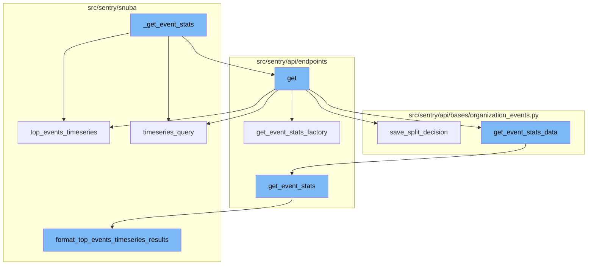
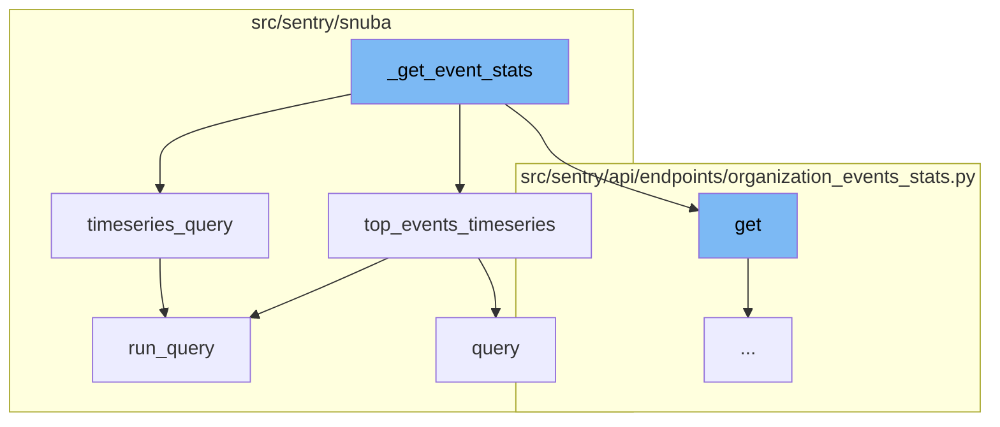
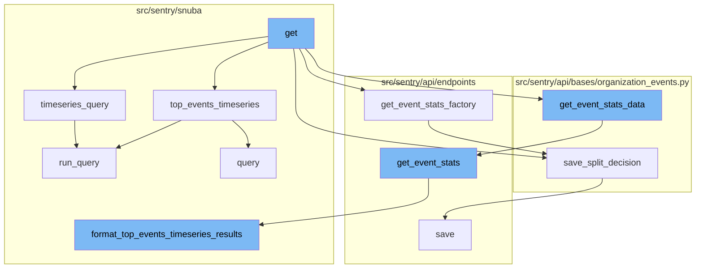
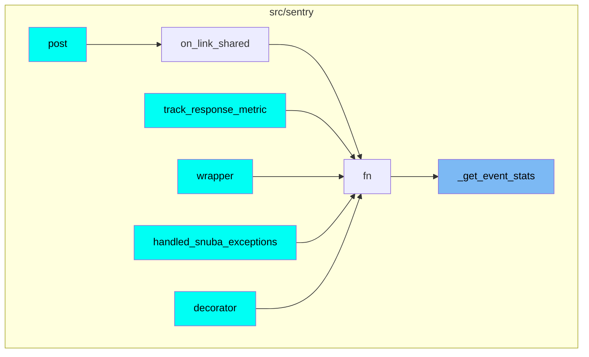

# Overview of \_get_event_stats

The `_get_event_stats` function is a crucial part of the Sentry application. It is responsible for retrieving event statistics based on the provided parameters. The function checks if there are any top events. If there are, it calls the `top_events_timeseries` function, otherwise, it calls the `timeseries_query` function.

# top_events_timeseries Function

The `top_events_timeseries` function is used to perform arbitrary user timeseries queries for a limited number of top events. It returns a dictionary of SnubaTSResult objects that have been zerofilled in case of gaps. Each value of the dictionary should match the result of a timeseries query.

# timeseries_query Function

The `timeseries_query` function is a high-level API for doing arbitrary user timeseries queries against events. It uses the TimeseriesSpansMetricsQueryBuilder to run the query and process the results.

# run_query Function

The `run_query` function is the entry point for executing a metrics query in Snuba. It uses the `bulk_run_query` function to execute the query.

# query Function

The `query` function is used to run a query using the SpansMetricsQueryBuilder. It processes the results of the query and returns them.

# get Function

The flow starts with the `get` function in the `organization_events_stats.py` file. This function is responsible for handling the request and organization parameters.

# get_event_stats_factory Function

The `get` function calls `get_event_stats_factory` which is a factory function that closes over the dataset to make an additional request to the errors dataset if the request is from a dashboard widget and we're trying to split their discover dataset.

# save_split_decision Function

The `get_event_stats_factory` function calls `save_split_decision` which is responsible for saving the decision of whether to split the discover dataset or not based on the presence of errors and transactions data.

# get_event_stats_data Function

The `get` function also calls `get_event_stats_data` which is responsible for getting the event stats data. It does this by calling the `get_event_stats` function with the appropriate parameters.

# get_event_stats Function

The `get_event_stats` function is defined in the `organization_profiling_functions.py` file. It is responsible for getting the event stats by running a series of queries and processing the results.

# format_top_events_timeseries_results Function

The `get_event_stats` function calls `format_top_events_timeseries_results` which formats the results of the top events timeseries query.



# Flow drill down

First, we'll zoom into this section of the flow:



<SwmSnippet path="/src/sentry/api/endpoints/organization_events_stats.py" line="254">

---

# \_get_event_stats Function

\_get_event_stats is a function that retrieves event statistics based on the provided parameters. It checks if there are any top events. If there are, it calls the top_events_timeseries function, otherwise, it calls the timeseries_query function.

```python
        def _get_event_stats(
            scoped_dataset: Any,
            query_columns: Sequence[str],
            query: str,
            params: dict[str, str],
            rollup: int,
            zerofill_results: bool,
            comparison_delta: datetime | None,
        ) -> SnubaTSResult | dict[str, SnubaTSResult]:
            if top_events > 0:
                return scoped_dataset.top_events_timeseries(
                    timeseries_columns=query_columns,
                    selected_columns=self.get_field_list(organization, request),
                    equations=self.get_equation_list(organization, request),
                    user_query=query,
                    params=params,
                    orderby=self.get_orderby(request),
                    rollup=rollup,
                    limit=top_events,
                    organization=organization,
                    referrer=referrer + ".find-topn",
```

---

</SwmSnippet>

<SwmSnippet path="/src/sentry/snuba/spans_metrics.py" line="138">

---

## top_events_timeseries Function

The top_events_timeseries function is used to perform arbitrary user timeseries queries for a limited number of top events. It returns a dictionary of SnubaTSResult objects that have been zerofilled in case of gaps. Each value of the dictionary should match the result of a timeseries query.

```python
def top_events_timeseries(
    timeseries_columns,
    selected_columns,
    user_query,
    params,
    orderby,
    rollup,
    limit,
    organization,
    equations=None,
    referrer=None,
    top_events=None,
    allow_empty=True,
    zerofill_results=True,
    include_other=False,
    functions_acl=None,
    on_demand_metrics_enabled=False,
    on_demand_metrics_type: MetricSpecType | None = None,
):
    """
    High-level API for doing arbitrary user timeseries queries for a limited number of top events
```

---

</SwmSnippet>

<SwmSnippet path="/src/sentry/snuba/spans_metrics.py" line="76">

---

## timeseries_query Function

The timeseries_query function is a high-level API for doing arbitrary user timeseries queries against events. It uses the TimeseriesSpansMetricsQueryBuilder to run the query and process the results.

```python
def timeseries_query(
    selected_columns: Sequence[str],
    query: str,
    params: dict[str, str],
    rollup: int,
    referrer: str,
    zerofill_results: bool = True,
    allow_metric_aggregates=True,
    comparison_delta: timedelta | None = None,
    functions_acl: list[str] | None = None,
    has_metrics: bool = True,
    use_metrics_layer: bool = False,
    on_demand_metrics_enabled: bool = False,
    on_demand_metrics_type: MetricSpecType | None = None,
    groupby: Column | None = None,
) -> SnubaTSResult:
    """
    High-level API for doing arbitrary user timeseries queries against events.
    this API should match that of sentry.snuba.discover.timeseries_query
    """
    metrics_query = TimeseriesSpansMetricsQueryBuilder(
```

---

</SwmSnippet>

<SwmSnippet path="/src/sentry/snuba/metrics_layer/query.py" line="143">

---

## run_query Function

The run_query function is the entry point for executing a metrics query in Snuba. It uses the bulk_run_query function to execute the query.

```python
def run_query(request: Request) -> Mapping[str, Any]:
    """
    Entrypoint for executing a metrics query in Snuba.
    """
    return bulk_run_query([request])[0]
```

---

</SwmSnippet>

<SwmSnippet path="/src/sentry/snuba/spans_metrics.py" line="21">

---

## query Function

The query function is used to run a query using the SpansMetricsQueryBuilder. It processes the results of the query and returns them.

```python
def query(
    selected_columns,
    query,
    params,
    snuba_params=None,
    equations=None,
    orderby=None,
    offset=None,
    limit=50,
    referrer=None,
    auto_fields=False,
    auto_aggregations=False,
    include_equation_fields=False,
    allow_metric_aggregates=False,
    use_aggregate_conditions=False,
    conditions=None,
    functions_acl=None,
    transform_alias_to_input_format=False,
    sample=None,
    has_metrics=False,
    use_metrics_layer=False,
```

---

</SwmSnippet>

Now, lets zoom into this section of the flow:



<SwmSnippet path="/src/sentry/api/endpoints/organization_events_stats.py" line="167">

---

# \_get_event_stats Flow

The flow starts with the `get` function in the `organization_events_stats.py` file. This function is responsible for handling the request and organization parameters.

```python
    def get(self, request: Request, organization: Organization) -> Response:
```

---

</SwmSnippet>

<SwmSnippet path="/src/sentry/api/endpoints/organization_events_stats.py" line="307">

---

The `get` function calls `get_event_stats_factory` which is a factory function that closes over the dataset to make an additional request to the errors dataset if the request is from a dashboard widget and we're trying to split their discover dataset.

```python
        def get_event_stats_factory(scoped_dataset):
            """
            This factory closes over dataset in order to make an additional request to the errors dataset
            in the case that this request is from a dashboard widget and we're trying to split their discover dataset.

            This should be removed once the discover dataset is completely split in dashboards.
            """
            dashboard_widget_id = request.GET.get("dashboardWidgetId", None)

            def fn(
```

---

</SwmSnippet>

<SwmSnippet path="/src/sentry/api/bases/organization_events.py" line="257">

---

The `get_event_stats_factory` function calls `save_split_decision` which is responsible for saving the decision of whether to split the discover dataset or not based on the presence of errors and transactions data.

```python
    def save_split_decision(self, widget, has_errors, has_transactions_data):
        """This can be removed once the discover dataset has been fully split"""
        new_discover_widget_split = self.get_split_decision(has_errors, has_transactions_data)
        if (
            new_discover_widget_split is not None
            and widget.discover_widget_split != new_discover_widget_split
        ):
            widget.discover_widget_split = new_discover_widget_split
            widget.save()

        return new_discover_widget_split
```

---

</SwmSnippet>

<SwmSnippet path="/src/sentry/api/bases/organization_events.py" line="421">

---

The `get` function also calls `get_event_stats_data` which is responsible for getting the event stats data. It does this by calling the `get_event_stats` function with the appropriate parameters.

```python
    def get_event_stats_data(
        self,
        request: Request,
        organization: Organization,
        get_event_stats: Callable[
            [Sequence[str], str, dict[str, str], int, bool, timedelta | None], SnubaTSResult
        ],
        top_events: int = 0,
        query_column: str = "count()",
        params: ParamsType | None = None,
        query: str | None = None,
        allow_partial_buckets: bool = False,
        zerofill_results: bool = True,
        comparison_delta: timedelta | None = None,
        additional_query_column: str | None = None,
        dataset: Any | None = None,
    ) -> dict[str, Any]:
        with handle_query_errors():
            with sentry_sdk.start_span(
                op="discover.endpoint", description="base.stats_query_creation"
            ):
```

---

</SwmSnippet>

<SwmSnippet path="/src/sentry/api/endpoints/organization_profiling_functions.py" line="115">

---

The `get_event_stats` function is defined in the `organization_profiling_functions.py` file. It is responsible for getting the event stats by running a series of queries and processing the results.

```python
        def get_event_stats(_columns, query, params, _rollup, zerofill_results, _comparison_delta):
            rollup = get_rollup_from_range(params["end"] - params["start"])

            chunks = [
                top_functions["data"][i : i + FUNCTIONS_PER_QUERY]
                for i in range(0, len(top_functions["data"]), FUNCTIONS_PER_QUERY)
            ]

            builders = [
                ProfileTopFunctionsTimeseriesQueryBuilder(
                    dataset=Dataset.Functions,
                    params=params,
                    interval=rollup,
                    top_events=chunk,
                    other=False,
                    query=query,
                    selected_columns=["project.id", "fingerprint"],
                    # It's possible to override the columns via
                    # the `yAxis` qs. So we explicitly ignore the
                    # columns, and hard code in the columns we want.
                    timeseries_columns=[data["function"], "examples()"],
```

---

</SwmSnippet>

<SwmSnippet path="/src/sentry/snuba/functions.py" line="196">

---

The `get_event_stats` function calls `format_top_events_timeseries_results` which formats the results of the top events timeseries query.

```python
def format_top_events_timeseries_results(
    result,
    query_builder,
    params,
    rollup,
    top_events=None,
    allow_empty=True,
    zerofill_results=True,
    result_key_order=None,
):
    if top_events is None:
        assert top_events, "Need to provide top events"  # TODO: support this use case

    if not allow_empty and not len(result.get("data", [])):
        return SnubaTSResult(
            {
                "data": zerofill([], params["start"], params["end"], rollup, "time")
                if zerofill_results
                else [],
            },
            params["start"],
```

---

</SwmSnippet>

# Where is this flow used?

This flow is used multiple times in the codebase as represented in the following diagram:

(Note - these are only some of the entry points of this flow)



&nbsp;

*This is an auto-generated document by Swimm AI 🌊 and has not yet been verified by a human*

<SwmMeta version="3.0.0" repo-id="Z2l0aHViJTNBJTNBc2VudHJ5LWRlbW8lM0ElM0FTd2ltbS1EZW1v" repo-name="sentry-demo" doc-type="flows"><sup>Powered by [Swimm](/)</sup></SwmMeta>
