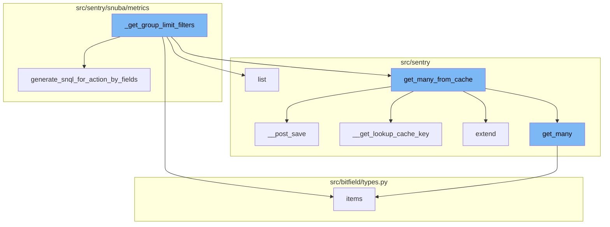
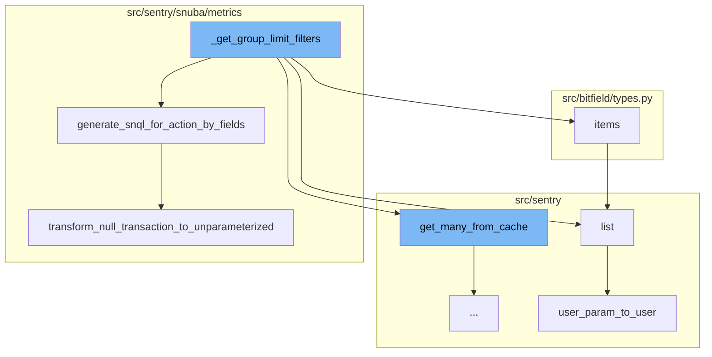
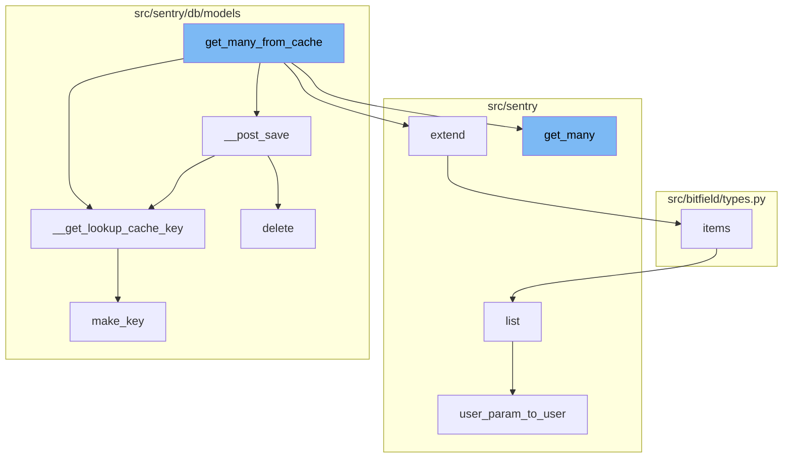

# Overview of \_get_group_limit_filters

The `_get_group_limit_filters` function is a key component in the metrics query process. It is responsible for generating filters that limit the results of a metrics query based on the groupby fields. This function takes in a metrics query, a list of results, and a use case ID as inputs.

# Functionality of \_get_group_limit_filters

If the metrics query does not have any groupby fields or if the results list is empty, the function returns None. Otherwise, it creates a mapping of groupby fields to their equivalent SnQL using the `generate_snql_for_action_by_fields` function. It then constructs a list of conditions based on these mappings and the values of the group keys in the results. Finally, it returns a `GroupLimitFilters` object containing these conditions.

# Role of generate_snql_for_action_by_fields

The `generate_snql_for_action_by_fields` function is used within `_get_group_limit_filters` to generate the necessary SnQL for any action by field, which in this case will be group by and order by. It takes in a metric action by field, a use case ID, an organization ID, a sequence of projects, and a boolean indicating whether the action is a column. Depending on the type of the metric action by field, it generates the appropriate SnQL expression.

# Role of items Function

The `items` function is used to return a list of the items in the bitfield. This function is used in the `_get_group_limit_filters` function to iterate over the groupby fields in the metrics query.

# Role of get_many_from_cache

The function `get_many_from_cache` is a wrapper around `QuerySet.filter(pk__in=values)` which supports caching of the intermediate value. It queries by primary key or some other unique identifier and returns a sequence of results. If the cache key is not cleared on save, it raises a ValueError.

# Role of \__post_save

The function `__post_save` is called after saving an instance. It pushes changes to an instance into the cache, and removes invalid (changed) lookup values. It also ensures that the database is not serialized into the cache.

# Role of \__get_lookup_cache_key

The function `__get_lookup_cache_key` is used to generate a cache key for a given model and set of arguments.

# Role of extend

The function `extend` is used to insert all values from another map into the current one, without mutating the original map.

# Role of get_many

The function `get_many` is used to get multiple values from the cache. It supports both namespaced and non-namespaced cache keys.

# Role of make_key

The function `make_key` is used to generate a unique key for a given model, prefix, and set of arguments.

# Role of delete

The function `delete` is used to mark an instance as deleted by updating its `date_deleted` field.



# Flow drill down

First, we'll zoom into this section of the flow:



<SwmSnippet path="/src/sentry/snuba/metrics/datasource.py" line="763">

---

# \_get_group_limit_filters Function

The `_get_group_limit_filters` function is used to generate filters for limiting the results of a metrics query based on the groupby fields. It takes in a metrics query, a list of results, and a use case ID. If the metrics query does not have any groupby fields or if the results list is empty, the function returns None. Otherwise, it creates a mapping of groupby fields to their equivalent SnQL using the `generate_snql_for_action_by_fields` function. It then constructs a list of conditions based on these mappings and the values of the group keys in the results. Finally, it returns a `GroupLimitFilters` object containing these conditions.

```python
def _get_group_limit_filters(
    metrics_query: DeprecatingMetricsQuery,
    results: list[Mapping[str, int]],
    use_case_id: UseCaseID,
) -> GroupLimitFilters | None:
    if not metrics_query.groupby or not results:
        return None

    # Creates a mapping of groupBy fields to their equivalent SnQL
    key_to_condition_dict: dict[Groupable, Any] = {}
    for metric_groupby_obj in metrics_query.groupby:
        key_to_condition_dict[
            metric_groupby_obj.name
        ] = SnubaQueryBuilder.generate_snql_for_action_by_fields(
            metric_action_by_field=metric_groupby_obj,
            use_case_id=use_case_id,
            org_id=metrics_query.org_id,
            projects=Project.objects.get_many_from_cache(metrics_query.project_ids),
            is_column=True,
        )

```

---

</SwmSnippet>

<SwmSnippet path="/src/sentry/snuba/metrics/query_builder.py" line="794">

---

# generate_snql_for_action_by_fields Function

The `generate_snql_for_action_by_fields` function is used within `_get_group_limit_filters` to generate the necessary SnQL for any action by field, which in this case will be group by and order by. It takes in a metric action by field, a use case ID, an organization ID, a sequence of projects, and a boolean indicating whether the action is a column. Depending on the type of the metric action by field, it generates the appropriate SnQL expression.

```python
    def generate_snql_for_action_by_fields(
        metric_action_by_field: MetricActionByField,
        use_case_id: UseCaseID,
        org_id: int,
        projects: Sequence[Project],
        is_column: bool = False,
    ) -> list[OrderBy] | Column | AliasedExpression | Function:
        """
        Generates the necessary snql for any action by field which in our case will be group by and order by. This
        function has been designed to share as much logic as possible, however, it should be refactored in case
        the snql generation starts to diverge significantly.
        """

        is_group_by = isinstance(metric_action_by_field, MetricGroupByField)
        is_order_by = isinstance(metric_action_by_field, MetricOrderByField)
        if not is_group_by and not is_order_by:
            raise InvalidParams("The metric action must either be an order by or group by.")

        if isinstance(metric_action_by_field.field, str):
            # This transformation is currently supported only for group by because OrderBy doesn't support the Function type.
            if is_group_by and metric_action_by_field.field == "transaction":
```

---

</SwmSnippet>

<SwmSnippet path="/src/bitfield/types.py" line="225">

---

# items Function

The `items` function is used to return a list of the items in the bitfield. This function is used in the `_get_group_limit_filters` function to iterate over the groupby fields in the metrics query.

```python
    def items(self):
        return list(self.iteritems())
```

---

</SwmSnippet>

<SwmSnippet path="/src/sentry/runner/commands/permissions.py" line="76">

---

# list Function

The `list` function is used to list permissions for a user. It is not directly related to the `_get_group_limit_filters` function but is part of the overall flow of the code.

```python
def list(user: str) -> None:
    "List permissions for a user."
    from sentry.models.userpermission import UserPermission

    user_inst = user_param_to_user(user)
    up_list = UserPermission.objects.filter(user=user_inst).order_by("permission")
    click.echo(f"Permissions for `{user_inst.username}`:")
    for permission in up_list:
        click.echo(f"- {permission.permission}")
```

---

</SwmSnippet>

<SwmSnippet path="/src/sentry/runner/commands/permissions.py" line="14">

---

# user_param_to_user Function

The `user_param_to_user` function is used to convert a user parameter to a user object. It is not directly related to the `_get_group_limit_filters` function but is part of the overall flow of the code.

```python
def user_param_to_user(value: str) -> User:
    from sentry.utils.auth import find_users

    users = find_users(value)
    if not users:
        raise click.ClickException(f"No user matching `{value}`")
    if len(users) > 1:
        raise click.ClickException(f"Found more than one user matching `{value}`")
    user = users[0]
    if not user.is_superuser:
        raise click.ClickException(f"User `{user.username}` does not have superuser status")
    return user
```

---

</SwmSnippet>

<SwmSnippet path="/src/sentry/snuba/metrics/query_builder.py" line="137">

---

# transform_null_transaction_to_unparameterized Function

The `transform_null_transaction_to_unparameterized` function is used within `generate_snql_for_action_by_fields` to transform any null `tag.transaction` to '<< unparameterized >>' so that it can be handled as such in any query using that tag value.

```python
def transform_null_transaction_to_unparameterized(use_case_id, org_id, alias=None):
    """
    This function transforms any null tag.transaction to '<< unparameterized >>' so that it can be handled
    as such in any query using that tag value.

    The logic behind this query is that ClickHouse will return '' in case tag.transaction is not set and we want to
    transform that '' as '<< unparameterized >>'.

    It is important to note that this transformation has to be applied ONLY on tag.transaction.
    """
    return Function(
        function="transform",
        parameters=[
            Column(resolve_tag_key(use_case_id, org_id, "transaction")),
            [""],
            [resolve_tag_value(use_case_id, org_id, "<< unparameterized >>")],
        ],
        alias=alias,
    )
```

---

</SwmSnippet>

Now, lets zoom into this section of the flow:



<SwmSnippet path="/src/sentry/db/models/manager/base.py" line="360">

---

# \_get_group_limit_filters Flow

The function `get_many_from_cache` is a wrapper around `QuerySet.filter(pk__in=values)` which supports caching of the intermediate value. It queries by primary key or some other unique identifier and returns a sequence of results. If the cache key is not cleared on save, it raises a ValueError.

```python
    def get_many_from_cache(self, values: Collection[str | int], key: str = "pk") -> Sequence[Any]:
        """
        Wrapper around `QuerySet.filter(pk__in=values)` which supports caching of
        the intermediate value.  Callee is responsible for making sure the
        cache key is cleared on save.

        NOTE: We can only query by primary key or some other unique identifier.
        It is not possible to e.g. run `Project.objects.get_many_from_cache([1,
        2, 3], key="organization_id")` and get back all projects belonging to
        those orgs. The length of the return value is bounded by the length of
        `values`.

        For most models, if one attempts to use a non-PK value this will just
        degrade to a DB query, like with `get_from_cache`.
        """

        pk_name = self.model._meta.pk.name

        if key == "pk":
            key = pk_name

```

---

</SwmSnippet>

<SwmSnippet path="/src/sentry/db/models/manager/base.py" line="188">

---

The function `__post_save` is called after saving an instance. It pushes changes to an instance into the cache, and removes invalid (changed) lookup values. It also ensures that the database is not serialized into the cache.

```python
    def __post_save(self, instance: M, **kwargs: Any) -> None:
        """
        Pushes changes to an instance into the cache, and removes invalid (changed)
        lookup values.
        """
        pk_name = instance._meta.pk.name
        pk_names = ("pk", pk_name)
        pk_val = instance.pk
        for key in self.cache_fields:
            if key in pk_names:
                continue
            # store pointers
            value = self.__value_for_field(instance, key)
            cache.set(
                key=self.__get_lookup_cache_key(**{key: value}),
                value=pk_val,
                timeout=self.cache_ttl,
                version=self.cache_version,
            )

        # Ensure we don't serialize the database into the cache
```

---

</SwmSnippet>

<SwmSnippet path="/src/sentry/db/models/manager/base.py" line="259">

---

The function `__get_lookup_cache_key` is used to generate a cache key for a given model and set of arguments.

```python
    def __get_lookup_cache_key(self, **kwargs: Any) -> str:
        return make_key(self.model, "modelcache", kwargs)
```

---

</SwmSnippet>

<SwmSnippet path="/src/sentry/backup/dependencies.py" line="359">

---

The function `extend` is used to insert all values from another map into the current one, without mutating the original map.

```python
    def extend(self, other: PrimaryKeyMap) -> None:
        """
        Insert all values from another map into this one, without mutating the original map.
        """

        for model_name_str, mappings in other.mapping.items():
            for old_pk, new_entry in mappings.items():
                self.mapping[model_name_str][old_pk] = new_entry
```

---

</SwmSnippet>

<SwmSnippet path="/src/sentry/sentry_metrics/indexer/cache.py" line="158">

---

The function `get_many` is used to get multiple values from the cache. It supports both namespaced and non-namespaced cache keys.

```python
    def get_many(self, namespace: str, keys: Iterable[str]) -> MutableMapping[str, int | None]:
        if options.get(NAMESPACED_READ_FEAT_FLAG):
            metrics.incr(_INDEXER_CACHE_DOUBLE_READ_METRIC)
            cache_keys = {self._make_namespaced_cache_key(namespace, key): key for key in keys}
            namespaced_results: MutableMapping[str, int | None] = {
                k: self._validate_result(v)
                for k, v in self.cache.get_many(cache_keys.keys(), version=self.version).items()
            }
            return self._format_namespaced_results(
                namespace,
                keys,
                namespaced_results,
            )
        else:
            cache_keys = {self._make_cache_key(key): key for key in keys}
            results: Mapping[str, int | None] = self.cache.get_many(
                cache_keys.keys(), version=self.version
            )
            return self._format_results(keys, results)
```

---

</SwmSnippet>

<SwmSnippet path="/src/bitfield/types.py" line="225">

---

The function `items` is used to get a list of items from the bitfield.

```python
    def items(self):
        return list(self.iteritems())
```

---

</SwmSnippet>

<SwmSnippet path="/src/sentry/runner/commands/permissions.py" line="76">

---

The function `list` is used to list permissions for a user.

```python
def list(user: str) -> None:
    "List permissions for a user."
    from sentry.models.userpermission import UserPermission

    user_inst = user_param_to_user(user)
    up_list = UserPermission.objects.filter(user=user_inst).order_by("permission")
    click.echo(f"Permissions for `{user_inst.username}`:")
    for permission in up_list:
        click.echo(f"- {permission.permission}")
```

---

</SwmSnippet>

<SwmSnippet path="/src/sentry/runner/commands/permissions.py" line="14">

---

The function `user_param_to_user` is used to convert a user parameter to a user instance.

```python
def user_param_to_user(value: str) -> User:
    from sentry.utils.auth import find_users

    users = find_users(value)
    if not users:
        raise click.ClickException(f"No user matching `{value}`")
    if len(users) > 1:
        raise click.ClickException(f"Found more than one user matching `{value}`")
    user = users[0]
    if not user.is_superuser:
        raise click.ClickException(f"User `{user.username}` does not have superuser status")
    return user
```

---

</SwmSnippet>

<SwmSnippet path="/src/sentry/db/models/manager/base.py" line="61">

---

The function `make_key` is used to generate a unique key for a given model, prefix, and set of arguments.

```python
def make_key(model: Any, prefix: str, kwargs: Mapping[str, Model | int | str]) -> str:
    kwargs_bits = []
    for k, v in sorted(kwargs.items()):
        k = __prep_key(model, k)
        v = smart_str(__prep_value(model, k, v))
        kwargs_bits.append(f"{k}={v}")
    kwargs_bits_str = ":".join(kwargs_bits)

    return f"{prefix}:{model.__name__}:{md5_text(kwargs_bits_str).hexdigest()}"
```

---

</SwmSnippet>

<SwmSnippet path="/src/sentry/db/models/paranoia.py" line="24">

---

The function `delete` is used to mark an instance as deleted by updating its `date_deleted` field.

```python
    def delete(self) -> tuple[int, dict[str, int]]:
        self.update(date_deleted=timezone.now())
        return _bogus_delete_return_value()
```

---

</SwmSnippet>

&nbsp;

*This is an auto-generated document by Swimm AI 🌊 and has not yet been verified by a human*

<SwmMeta version="3.0.0" repo-id="Z2l0aHViJTNBJTNBc2VudHJ5LWRlbW8lM0ElM0FTd2ltbS1EZW1v" repo-name="sentry-demo" doc-type="flows"><sup>Powered by [Swimm](/)</sup></SwmMeta>
