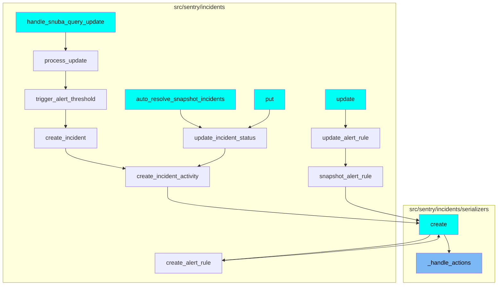

# \_handle_actions Function

The `_handle_actions` function is a crucial part of the alert rule triggers management in Sentry. It is responsible for handling actions related to these triggers. The function operates by taking two parameters: `alert_rule_trigger` and `actions`. The first step in the function is to check if there are any actions that need to be deleted, which are not present in the updated data. If such actions exist, they are deleted. Following this, the function iterates over the actions, rewriting their fields and either fetching an existing action instance or creating a new one. An `AlertRuleTriggerActionSerializer` is then used to validate and save the action data. If the serializer is valid, it attempts to save the action. However, if a `ChannelLookupTimeoutError` is encountered during this process, it is stored and raised after the rest of the validation is complete.

# Usage of \_handle_actions Function

This function is used multiple times in the codebase. It is a part of several flows such as updating an alert rule, creating an alert rule, and updating an incident status. These flows are represented in the provided diagram.



# Flow drill down

```mermaid
graph TD;

classDef mainFlowStyle color:#000000,fill:#7CB9F4
classDef rootsStyle color:#000000,fill:#00FFF4
classDef Style1 color:#000000,fill:#00FFAA
classDef Style2 color:#000000,fill:#FFFF00
classDef Style3 color:#000000,fill:#AA7CB9
```

<SwmSnippet path="/src/sentry/incidents/serializers/alert_rule_trigger.py" line="62">

---

# \_handle_actions Function

The `_handle_actions` function is responsible for managing actions related to alert rule triggers. It takes two parameters: `alert_rule_trigger` and `actions`. The function first checks if there are any actions to delete that are not present in the updated data. If there are, it deletes them. Then, it iterates over the actions, rewriting their fields and either fetching an existing action instance or creating a new one. An `AlertRuleTriggerActionSerializer` is then used to validate and save the action data. If the serializer is valid, it attempts to save the action. If a `ChannelLookupTimeoutError` is encountered during this process, it is stored and raised after the rest of the validation is complete.

```python
    def _handle_actions(self, alert_rule_trigger, actions):
        channel_lookup_timeout_error = None
        if actions is not None:
            # Delete actions we don't have present in the updated data.
            action_ids = [x["id"] for x in actions if "id" in x]
            actions_to_delete = AlertRuleTriggerAction.objects.filter(
                alert_rule_trigger=alert_rule_trigger
            ).exclude(id__in=action_ids)
            for action in actions_to_delete:
                delete_alert_rule_trigger_action(action)

            for action_data in actions:
                action_data = rewrite_trigger_action_fields(action_data)
                if "id" in action_data:
                    action_instance = AlertRuleTriggerAction.objects.get(
                        alert_rule_trigger=alert_rule_trigger, id=action_data["id"]
                    )
                else:
                    action_instance = None

                action_serializer = AlertRuleTriggerActionSerializer(
```

---

</SwmSnippet>

# Where is this flow used?

This flow is used multiple times in the codebase as represented in the following diagram:

(Note - these are only some of the entry points of this flow)


&nbsp;

*This is an auto-generated document by Swimm AI 🌊 and has not yet been verified by a human*

<SwmMeta version="3.0.0" repo-id="Z2l0aHViJTNBJTNBc2VudHJ5LWRlbW8lM0ElM0FTd2ltbS1EZW1v" repo-name="sentry-demo" doc-type="flows"><sup>Powered by [Swimm](/)</sup></SwmMeta>
