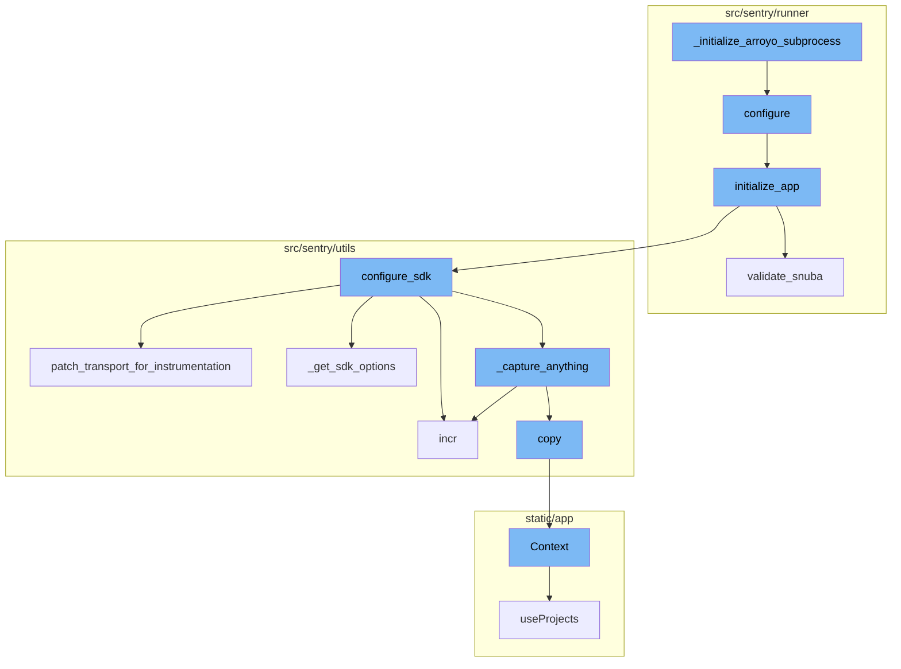
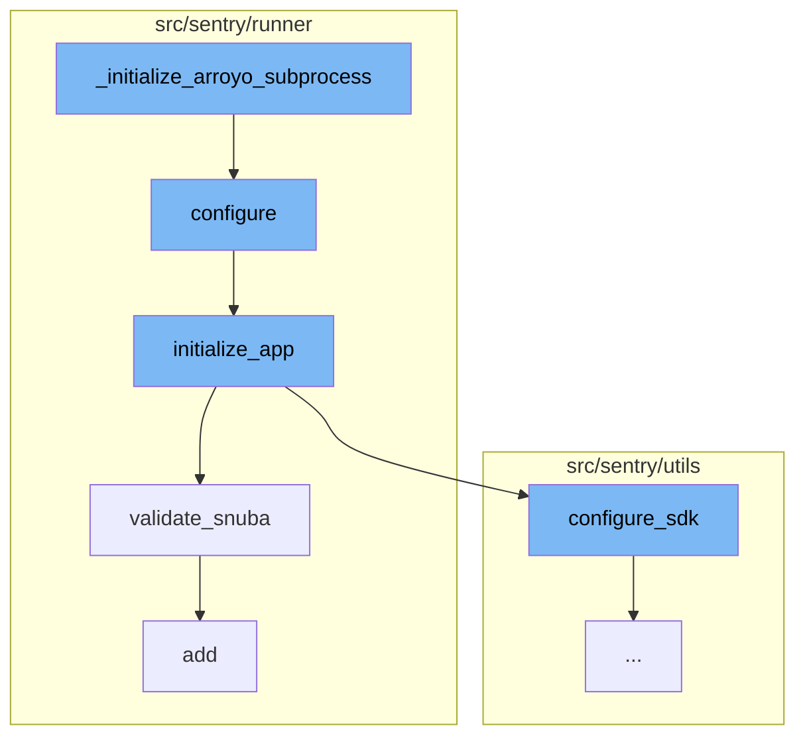
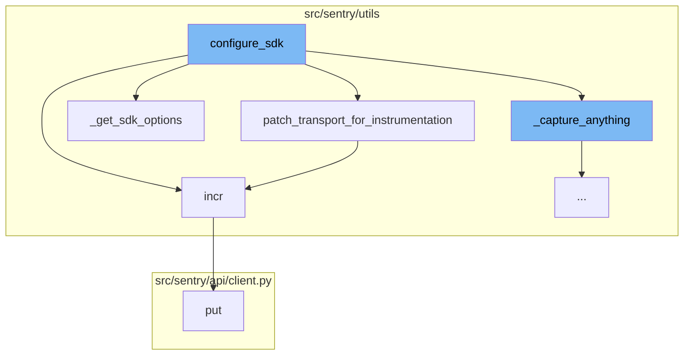
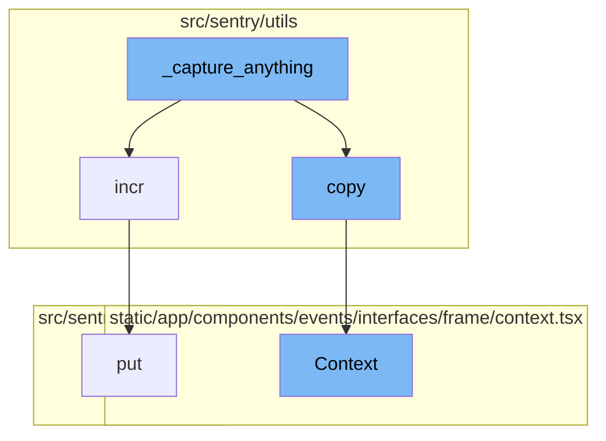

# \_initialize_arroyo_subprocess Overview

The `_initialize_arroyo_subprocess` function is a key part of the Sentry application's data processing pipeline. It is responsible for setting up the Arroyo subprocess, a component that handles data streaming and processing in the application. The function takes an initializer function and a set of tags as arguments. If an initializer is provided, it is called. Then, it imports the `add_global_tags` function from `sentry.metrics.middleware` and adds the provided tags to all threads.

# Flow of \_initialize_arroyo_subprocess

The flow of `_initialize_arroyo_subprocess` involves several steps. After the function is called, it triggers the `configure` function, which sets up the environment given two different config files. Then, the `initialize_app` function is called within the `configure` function. It sets up various settings, validates the configuration, and initializes various services. The `validate_snuba` function is then called to ensure everything related to Snuba is in sync. Finally, the `add` function is called to add a permission to a user.

# SDK Configuration

The `configure_sdk` function is responsible for setting up the Sentry SDK. This includes configuring the transport layer and capturing any events or errors. The `patch_transport_for_instrumentation` function is called within `configure_sdk` to patch the transport functions to add metrics for better resolution around events sent to the ingest. The `incr` function is used to increment a metric. It is called within `patch_transport_for_instrumentation` and `configure_sdk` to track the number of sent requests and captured events respectively.

# Event Capture

The `_capture_anything` function is responsible for capturing events and metrics. It checks if the sentry4sentry_transport is available and if so, it increments the internal captured events upstream metric. The `copy` function is used to create a copy of the current context. This is used in `_capture_anything` to create a copy of the envelope for sentry4sentry_transport.



# Flow drill down

First, we'll zoom into this section of the flow:



<SwmSnippet path="/src/sentry/utils/arroyo.py" line="115">

---

# \_initialize_arroyo_subprocess

The function `_initialize_arroyo_subprocess` is the starting point of the flow. It takes an initializer function and a set of tags as arguments. If an initializer is provided, it is called. Then, it imports the `add_global_tags` function from `sentry.metrics.middleware` and adds the provided tags to all threads.

```python
def _initialize_arroyo_subprocess(initializer: Callable[[], None] | None, tags: Tags) -> None:
    from sentry.runner import configure

    configure()

    if initializer:
        initializer()

    from sentry.metrics.middleware import add_global_tags

    # Inherit global tags from the parent process
    add_global_tags(_all_threads=True, **tags)
```

---

</SwmSnippet>

<SwmSnippet path="/src/sentry/runner/settings.py" line="53">

---

## configure

The `configure` function is called next. It sets up the environment given two different config files. It adds additional mimetypes that are useful for static files, checks if the configuration files exist, and if they do, it sets up the environment variables and initializes the application.

```python
def configure(
    ctx: click.Context | None, py: str, yaml: str | None, skip_service_validation: bool = False
) -> None:
    """
    Given the two different config files, set up the environment.

    NOTE: Will only execute once, so it's safe to call multiple times.
    """
    global __installed
    if __installed:
        return

    # Make sure that our warnings are always displayed.
    warnings.filterwarnings("default", "", Warning, r"^sentry")

    # Add in additional mimetypes that are useful for our static files
    # which aren't common in default system registries
    import mimetypes

    for type, ext in (
        ("application/json", "map"),
```

---

</SwmSnippet>

<SwmSnippet path="/src/sentry/runner/initializer.py" line="306">

---

## initialize_app

The `initialize_app` function is called within the `configure` function. It takes a configuration dictionary and a boolean flag `skip_service_validation` as arguments. It sets up various settings, validates the configuration, and initializes various services.

```python
def initialize_app(config: dict[str, Any], skip_service_validation: bool = False) -> None:
    settings = config["settings"]

    # Just reuse the integration app for Single Org / Self-Hosted as
    # it doesn't make much sense to use 2 separate apps for SSO and
    # integration.
    if settings.SENTRY_SINGLE_ORGANIZATION:
        options_mapper.update(
            {
                "github-app.client-id": "GITHUB_APP_ID",
                "github-app.client-secret": "GITHUB_API_SECRET",
            }
        )

    bootstrap_options(settings, config["options"])

    logging.raiseExceptions = settings.DEBUG

    configure_structlog()

    # Commonly setups don't correctly configure themselves for production envs
```

---

</SwmSnippet>

<SwmSnippet path="/src/sentry/runner/initializer.py" line="620">

---

## validate_snuba

The `validate_snuba` function is called within the `initialize_app` function. It checks if everything related to Snuba is in sync. If not, it raises a ConfigurationError.

```python
def validate_snuba() -> None:
    """
    Make sure everything related to Snuba is in sync.

    This covers a few cases:

    * When you have features related to Snuba, you must also
      have Snuba fully configured correctly to continue.
    * If you have Snuba specific search/tagstore/tsdb backends,
      you must also have a Snuba compatible eventstream backend
      otherwise no data will be written into Snuba.
    * If you only have Snuba related eventstream, yell that you
      probably want the other backends otherwise things are weird.
    """
    if not settings.DEBUG:
        return

    has_all_snuba_required_backends = (
        settings.SENTRY_SEARCH
        in (
            "sentry.search.snuba.EventsDatasetSnubaSearchBackend",
```

---

</SwmSnippet>

<SwmSnippet path="/src/sentry/runner/commands/permissions.py" line="37">

---

## add

The `add` function is called at the end of the flow. It adds a permission to a user. If the permission already exists, it prints a message and does not add the permission.

```python
def add(user: str, permission: str) -> None:
    "Add a permission to a user."
    from django.db import IntegrityError, transaction

    from sentry.models.userpermission import UserPermission

    user_inst = user_param_to_user(user)

    try:
        with transaction.atomic(router.db_for_write(UserPermission)):
            UserPermission.objects.create(user=user_inst, permission=permission)
    except IntegrityError:
        click.echo(f"Permission already exists for `{user_inst.username}`")
    else:
        click.echo(f"Added permission `{permission}` to `{user_inst.username}`")
```

---

</SwmSnippet>

Now, lets zoom into this section of the flow:



<SwmSnippet path="/src/sentry/utils/sdk.py" line="275">

---

# \_initialize_arroyo_subprocess Flow

The `configure_sdk` function is the starting point of this flow. It is responsible for setting up the SDK, which includes configuring the transport layer and capturing any events or errors. This function also includes the definition of the `MultiplexingTransport` class, which has methods for capturing events and envelopes, and checking the health of the transport.

```python
def configure_sdk():
    """
    Setup and initialize the Sentry SDK.
    """
    sdk_options, dsns = _get_sdk_options()

    internal_project_key = get_project_key()

    if dsns.sentry4sentry:
        transport = make_transport(get_options(dsn=dsns.sentry4sentry, **sdk_options))
        sentry4sentry_transport = patch_transport_for_instrumentation(transport, "upstream")
    else:
        sentry4sentry_transport = None

    if dsns.sentry_saas:
        transport = make_transport(get_options(dsn=dsns.sentry_saas, **sdk_options))
        sentry_saas_transport = patch_transport_for_instrumentation(transport, "relay")
    elif settings.IS_DEV and not settings.SENTRY_USE_RELAY:
        sentry_saas_transport = None
    elif internal_project_key and internal_project_key.dsn_private:
        transport = make_transport(get_options(dsn=internal_project_key.dsn_private, **sdk_options))
```

---

</SwmSnippet>

<SwmSnippet path="/src/sentry/utils/sdk.py" line="237">

---

The `patch_transport_for_instrumentation` function is called within `configure_sdk`. This function patches the transport functions to add metrics for better resolution around events sent to the ingest. It does this by wrapping the original `_send_request` method of the transport with a new method that increments a metric before calling the original method.

```python
# Patches transport functions to add metrics to improve resolution around events sent to our ingest.
# Leaving this in to keep a permanent measurement of sdk requests vs ingest.
def patch_transport_for_instrumentation(transport, transport_name):
    _send_request = transport._send_request
    if _send_request:

        def patched_send_request(*args, **kwargs):
            metrics.incr(f"internal.sent_requests.{transport_name}.events")
            return _send_request(*args, **kwargs)

        transport._send_request = patched_send_request
    return transport
```

---

</SwmSnippet>

<SwmSnippet path="/src/sentry/utils/metrics.py" line="101">

---

The `incr` function is used to increment a metric. It is called within `patch_transport_for_instrumentation` and `configure_sdk` to track the number of sent requests and captured events respectively.

```python
    def incr(
        self,
        key: str,
        instance: str | None = None,
        tags: Tags | None = None,
        amount: int = 1,
        sample_rate: float = settings.SENTRY_METRICS_SAMPLE_RATE,
    ) -> None:
        if not self._started:
            self._start()
        self.q.put((key, instance, tags, amount, sample_rate))
```

---

</SwmSnippet>

<SwmSnippet path="/src/sentry/utils/sdk.py" line="256">

---

The `_get_sdk_options` function is called within `configure_sdk` to get the SDK options. These options include configurations for sending client reports, tracing, and release information.

```python
def _get_sdk_options() -> tuple[SdkConfig, Dsns]:
    sdk_options = settings.SENTRY_SDK_CONFIG.copy()
    sdk_options["send_client_reports"] = True
    sdk_options["traces_sampler"] = traces_sampler
    sdk_options["before_send_transaction"] = before_send_transaction
    sdk_options["before_send"] = before_send
    sdk_options["release"] = (
        f"backend@{sdk_options['release']}" if "release" in sdk_options else None
    )

    # Modify SENTRY_SDK_CONFIG in your deployment scripts to specify your desired DSN
    dsns = Dsns(
        sentry4sentry=sdk_options.pop("dsn", None),
        sentry_saas=sdk_options.pop("relay_dsn", None),
    )

    return sdk_options, dsns
```

---

</SwmSnippet>

<SwmSnippet path="/src/sentry/api/client.py" line="119">

---

The `put` function is called within `incr` to send a PUT request. This is part of the process of incrementing a metric.

```python
    def put(self, *args, **kwargs):
        return self.request("PUT", *args, **kwargs)
```

---

</SwmSnippet>

Now, lets zoom into this section of the flow:



<SwmSnippet path="/src/sentry/utils/sdk.py" line="334">

---

# \_initialize_arroyo_subprocess Flow

\_initialize_arroyo_subprocess flow starts with the function `_capture_anything`. This function is responsible for capturing events and metrics. It checks if the sentry4sentry_transport is available and if so, it increments the internal captured events upstream metric.

```python
        def _capture_anything(self, method_name, *args, **kwargs):
            # Sentry4Sentry (upstream) should get the event first because
            # it is most isolated from the sentry installation.
            if sentry4sentry_transport:
                metrics.incr("internal.captured.events.upstream")
                # TODO(mattrobenolt): Bring this back safely.
                # from sentry import options
                # install_id = options.get('sentry:install-id')
                # if install_id:
                #     event.setdefault('tags', {})['install-id'] = install_id
                s4s_args = args
                # We want to control whether we want to send metrics at the s4s upstream.
                if (
                    not settings.SENTRY_SDK_UPSTREAM_METRICS_ENABLED
                    and method_name == "capture_envelope"
                ):
                    args_list = list(args)
                    envelope = args_list[0]
                    # We filter out all the statsd envelope items, which contain custom metrics sent by the SDK.
                    # unless we allow them via a separate sample rate.
                    safe_items = [
```

---

</SwmSnippet>

<SwmSnippet path="/src/sentry/utils/metrics.py" line="101">

---

The `incr` function is used to increment the count of a metric. It is used within `_capture_anything` to increment the count of internal captured events.

```python
    def incr(
        self,
        key: str,
        instance: str | None = None,
        tags: Tags | None = None,
        amount: int = 1,
        sample_rate: float = settings.SENTRY_METRICS_SAMPLE_RATE,
    ) -> None:
        if not self._started:
            self._start()
        self.q.put((key, instance, tags, amount, sample_rate))
```

---

</SwmSnippet>

<SwmSnippet path="/src/sentry/utils/services.py" line="42">

---

The `copy` function is used to create a copy of the current context. This is used in `_capture_anything` to create a copy of the envelope for sentry4sentry_transport.

```python
        self.backends = backends

    def copy(self) -> Context:
        return Context(self.request, self.backends.copy())
```

---

</SwmSnippet>

<SwmSnippet path="/static/app/components/events/interfaces/frame/context.tsx" line="66">

---

The `Context` function is used to create a context for a frame in the user interface. It is used to display the context of a frame in the event details page.

```tsx
function Context({
  hasContextVars = false,
  hasContextSource = false,
  hasContextRegisters = false,
  isExpanded = false,
  hasAssembly = false,
  emptySourceNotation = false,
  registers,
  frame,
  event,
  className,
  frameMeta,
  registersMeta,
  platform,
}: Props) {
  const organization = useOrganization();

  const {projects} = useProjects();
  const project = useMemo(
    () => projects.find(p => p.id === event.projectID),
    [projects, event]
```

---

</SwmSnippet>

<SwmSnippet path="/src/sentry/utils/metrics.py" line="101">

---

The `incr` function is used again to increment the count of internal captured events for relay if the current event is safe.

```python
    def incr(
        self,
        key: str,
        instance: str | None = None,
        tags: Tags | None = None,
        amount: int = 1,
        sample_rate: float = settings.SENTRY_METRICS_SAMPLE_RATE,
    ) -> None:
        if not self._started:
            self._start()
        self.q.put((key, instance, tags, amount, sample_rate))
```

---

</SwmSnippet>

<SwmSnippet path="/src/sentry/api/client.py" line="119">

---

The `put` function is used to make a PUT request. It is part of the API client used in the application.

```python
    def put(self, *args, **kwargs):
        return self.request("PUT", *args, **kwargs)
```

---

</SwmSnippet>

&nbsp;

*This is an auto-generated document by Swimm AI 🌊 and has not yet been verified by a human*

<SwmMeta version="3.0.0" repo-id="Z2l0aHViJTNBJTNBc2VudHJ5LWRlbW8lM0ElM0FTd2ltbS1EZW1v" repo-name="sentry-demo" doc-type="flows"><sup>Powered by [Swimm](/)</sup></SwmMeta>
