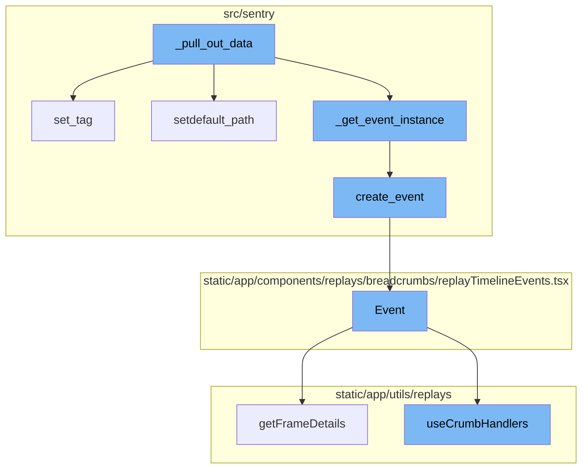
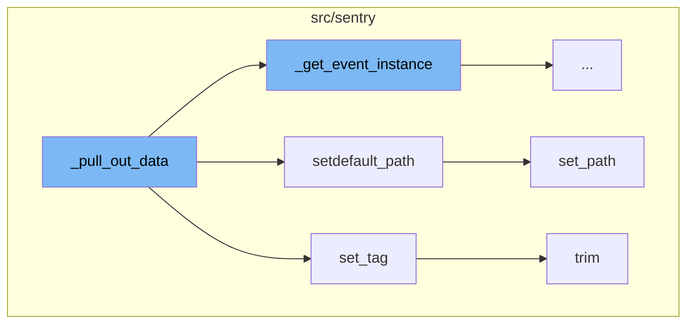
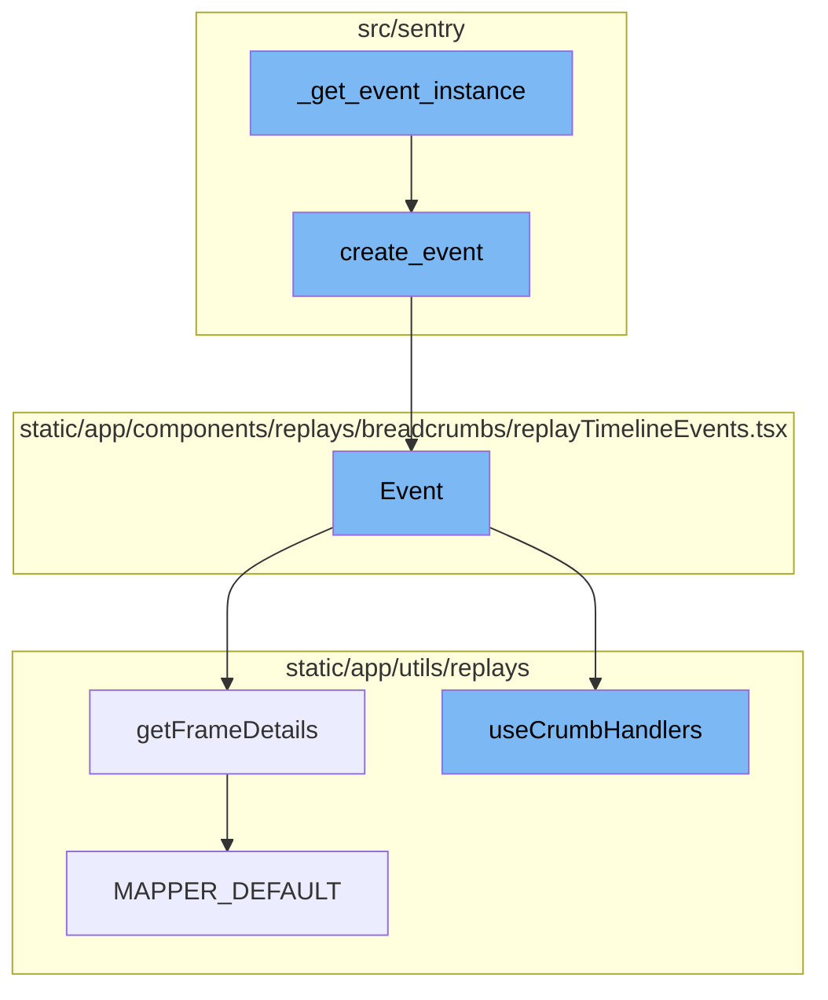

<SwmSnippet path="/src/sentry/event_manager.py" line="688">

---

# \_pull_out_data Function

The `_pull_out_data` function is responsible for updating every job in the list with required information and storing it in the nodestore. It iterates over the jobs, extracts the data, and updates the job with the extracted data. It also stores the event in the nodestore and overwrites the data key with the event's updated data.

```python
def _pull_out_data(jobs: Sequence[Job], projects: ProjectsMapping) -> None:
    """
    Update every job in the list with required information and store it in the nodestore.

    A bunch of (probably) CPU bound stuff.
    """

    for job in jobs:
        job["project_id"] = int(job["project_id"])

        data = job["data"]

        # Pull the toplevel data we're interested in

        transaction_name = data.get("transaction")
        if transaction_name:
            transaction_name = force_str(transaction_name)
        job["transaction"] = transaction_name

        key_id = None if data is None else data.get("key_id")
        if key_id is not None:
```

---

</SwmSnippet>

<SwmSnippet path="/src/sentry/utils/safe.py" line="186">

---

## setdefault_path Function

The `setdefault_path` function is called within `_pull_out_data`. It recursively traverses or creates the specified path and sets the given value if it does not exist. It is equivalent to a recursive dict.setdefault, except for None values.

```python
def setdefault_path(data, *path, **kwargs):
    """
    Recursively traverses or creates the specified path and sets the given value
    argument if it does not exist. `None` is treated like a missing value. If a
    non-mapping item is encountered while traversing, the value is not set.

    This function is equivalent to a recursive dict.setdefault, except for None
    values. Returns True if the value was set, otherwise False.
    """
    kwargs["overwrite"] = False
    return set_path(data, *path, **kwargs)
```

---

</SwmSnippet>

<SwmSnippet path="/src/sentry/utils/safe.py" line="146">

---

## set_path Function

The `set_path` function is used within `setdefault_path`. It also recursively traverses or creates the specified path and sets the given value. However, it has an `overwrite` kwarg that, when set to False, only sets the value if there is no existing value or it is None.

```python
def set_path(data, *path, **kwargs):
    """
    Recursively traverses or creates the specified path and sets the given value
    argument. `None` is treated like a missing value. If a non-mapping item is
    encountered while traversing, the value is not set.

    This function is equivalent to a recursive dict.__setitem__. Returns True if
    the value was set, otherwise False.

    If the ``overwrite` kwarg is set to False, the value is only set if there is
    no existing value or it is None. See ``setdefault_path``.
    """

    try:
        value = kwargs.pop("value")
    except KeyError:
        raise TypeError("set_path() requires a 'value' keyword argument")

    overwrite = kwargs.pop("overwrite", True)
    for k in kwargs:
        raise TypeError("set_path() got an undefined keyword argument '%s'" % k)
```

---

</SwmSnippet>

<SwmSnippet path="/src/sentry/event_manager.py" line="180">

---

## set_tag Function

The `set_tag` function is also called within `_pull_out_data`. It removes the existing tag with the given key and appends a new tag with the given key and value to the data.

```python
def set_tag(data: dict[str, Any], key: str, value: Any) -> None:
    pop_tag(data, key)
    if value is not None:
        data.setdefault("tags", []).append((key, trim(value, MAX_TAG_VALUE_LENGTH)))
```

---

</SwmSnippet>

<SwmSnippet path="/src/sentry/tsdb/snuba.py" line="653">

---

## trim Function

The `trim` function is used within `set_tag`. It removes keys that should not exist from the result. It is used to ensure that the tag value does not exceed the maximum allowed length.

```python
    def trim(self, result, groups, keys):
        """
        Similar to zerofill, but removes keys that should not exist.
        Uses the non-flattened version of keys, so that different sets
        of keys can exist in different branches at the same nesting level.
        """
        if len(groups) > 0:
            group, subgroups = groups[0], groups[1:]
            if isinstance(result, dict):
                for rk in list(result.keys()):
                    if group == "time":  # Skip over time group
                        self.trim(result[rk], subgroups, keys)
                    elif rk in keys:
                        if isinstance(keys, dict):
                            self.trim(result[rk], subgroups, keys[rk])
                    else:
                        del result[rk]
```

---

</SwmSnippet>

<SwmSnippet path="/src/sentry/event_manager.py" line="1264">

---

## \_get_event_instance Function

\_get_event_instance is a function that creates an event instance. It takes in data and a project_id as parameters. The function calls the create_event method from the eventstore backend, passing in the project_id, event_id from the data, and the data itself wrapped in an EventDict.

```python
def _get_event_instance(data: MutableMapping[str, Any], project_id: int) -> Event:
    return eventstore.backend.create_event(
        project_id=project_id,
        event_id=data.get("event_id"),
        group_id=None,
        data=EventDict(data, skip_renormalization=True),
    )
```

---

</SwmSnippet>

<SwmSnippet path="/src/sentry/issues/occurrence_consumer.py" line="71">

---

## create_event Function

create_event is a function that creates an Event object. It takes in a project_id, event_id, and event_data as parameters. The function returns an Event object with the provided parameters and additional data extracted from the event_data.

```python
def create_event(project_id: int, event_id: str, event_data: dict[str, Any]) -> Event:
    return Event(
        event_id=event_id,
        project_id=project_id,
        snuba_data={
            "event_id": event_data["event_id"],
            "project_id": event_data["project_id"],
            "timestamp": event_data["timestamp"],
            "release": event_data.get("release"),
            "environment": event_data.get("environment"),
            "platform": event_data.get("platform"),
            "tags.key": [tag[0] for tag in event_data.get("tags", [])],
            "tags.value": [tag[1] for tag in event_data.get("tags", [])],
        },
    )
```

---

</SwmSnippet>

<SwmSnippet path="/static/app/components/replays/breadcrumbs/replayTimelineEvents.tsx" line="66">

---

## Event Function

Event is a function that generates a visual representation of an event in the form of breadcrumbs. It takes in frames, markerWidth, and startTimestampMs as parameters. The function uses the useCrumbHandlers hook to handle mouse events and the getFrameDetails function to get details about each frame.

```tsx
function Event({
  frames,
  markerWidth,
  startTimestampMs,
}: {
  frames: ReplayFrame[];
  markerWidth: number;
  startTimestampMs: number;
}) {
  const theme = useTheme();
  const {onMouseEnter, onMouseLeave, onClickTimestamp} = useCrumbHandlers();
  const {setActiveTab} = useActiveReplayTab({});

  const buttons = frames.map((frame, i) => (
    <BreadcrumbItem
      frame={frame}
      extraction={undefined}
      key={i}
      onClick={() => {
        onClickTimestamp(frame);
        setActiveTab(getFrameDetails(frame).tabKey);
```

---

</SwmSnippet>

<SwmSnippet path="/static/app/utils/replays/getFrameDetails.tsx" line="431">

---

## getFrameDetails Function

getFrameDetails is a function that retrieves details about a frame. It takes in a frame as a parameter and returns a Details object. The function uses a mapper to map the frame to its details. If an error occurs, it defaults to using the MAPPER_DEFAULT.

```tsx
export default function getFrameDetails(frame: ReplayFrame): Details {
  const key = getFrameOpOrCategory(frame);
  const fn = MAPPER_FOR_FRAME[key] ?? MAPPER_DEFAULT;
  try {
    return fn(frame);
  } catch (error) {
    return MAPPER_DEFAULT(frame);
  }
}
```

---

</SwmSnippet>

<SwmSnippet path="/static/app/utils/replays/hooks/useCrumbHandlers.tsx" line="44">

---

## useCrumbHandlers Function

useCrumbHandlers is a hook that provides handlers for mouse events on breadcrumbs. It returns an object with onMouseEnter, onMouseLeave, and onClickTimestamp functions. These functions are used to handle mouse events on the breadcrumbs, updating the current hover time and highlights as necessary.

```tsx
function useCrumbHandlers() {
  const {replay, clearAllHighlights, addHighlight, removeHighlight, setCurrentTime} =
    useReplayContext();
  const [, setCurrentHoverTime] = useCurrentHoverTime();
  const startTimestampMs = replay?.getReplay()?.started_at?.getTime() || 0;

  const mouseEnterCallback = useRef<{
    id: RecordType | null;
    timeoutId: NodeJS.Timeout | null;
  }>({
    id: null,
    timeoutId: null,
  });

  const onMouseEnter = useCallback(
    (record: RecordType) => {
      // This debounces the mouseEnter callback in unison with mouseLeave.
      // We ensure the pointer remains over the target element before dispatching
      // state events in order to minimize unnecessary renders. This helps during
      // scrolling or mouse move events which would otherwise fire in rapid
      // succession slowing down our app.
```

---

</SwmSnippet>

<SwmSnippet path="/static/app/utils/replays/getFrameDetails.tsx" line="423">

---

## MAPPER_DEFAULT Function

MAPPER_DEFAULT is a function that provides default details for a frame. It takes in a frame as a parameter and returns a Details object with default values. This function is used as a fallback when the mapper in getFrameDetails encounters an error.

```tsx
const MAPPER_DEFAULT = (frame): Details => ({
  color: 'gray300',
  description: frame.message ?? '',
  tabKey: TabKey.CONSOLE,
  title: defaultTitle(frame),
  icon: <IconTerminal size="xs" />,
});
```

---

</SwmSnippet>



# Flow drill down

First, we'll zoom into this section of the flow:



<SwmSnippet path="/src/sentry/event_manager.py" line="688">

---

# \_pull_out_data Function

The `_pull_out_data` function is responsible for updating every job in the list with required information and storing it in the nodestore. It iterates over the jobs, extracts the data, and updates the job with the extracted data. It also stores the event in the nodestore and overwrites the data key with the event's updated data.

```python
def _pull_out_data(jobs: Sequence[Job], projects: ProjectsMapping) -> None:
    """
    Update every job in the list with required information and store it in the nodestore.

    A bunch of (probably) CPU bound stuff.
    """

    for job in jobs:
        job["project_id"] = int(job["project_id"])

        data = job["data"]

        # Pull the toplevel data we're interested in

        transaction_name = data.get("transaction")
        if transaction_name:
            transaction_name = force_str(transaction_name)
        job["transaction"] = transaction_name

        key_id = None if data is None else data.get("key_id")
        if key_id is not None:
```

---

</SwmSnippet>

<SwmSnippet path="/src/sentry/utils/safe.py" line="186">

---

## setdefault_path Function

The `setdefault_path` function is called within `_pull_out_data`. It recursively traverses or creates the specified path and sets the given value if it does not exist. It is equivalent to a recursive dict.setdefault, except for None values.

```python
def setdefault_path(data, *path, **kwargs):
    """
    Recursively traverses or creates the specified path and sets the given value
    argument if it does not exist. `None` is treated like a missing value. If a
    non-mapping item is encountered while traversing, the value is not set.

    This function is equivalent to a recursive dict.setdefault, except for None
    values. Returns True if the value was set, otherwise False.
    """
    kwargs["overwrite"] = False
    return set_path(data, *path, **kwargs)
```

---

</SwmSnippet>

<SwmSnippet path="/src/sentry/utils/safe.py" line="146">

---

## set_path Function

The `set_path` function is used within `setdefault_path`. It also recursively traverses or creates the specified path and sets the given value. However, it has an `overwrite` kwarg that, when set to False, only sets the value if there is no existing value or it is None.

```python
def set_path(data, *path, **kwargs):
    """
    Recursively traverses or creates the specified path and sets the given value
    argument. `None` is treated like a missing value. If a non-mapping item is
    encountered while traversing, the value is not set.

    This function is equivalent to a recursive dict.__setitem__. Returns True if
    the value was set, otherwise False.

    If the ``overwrite` kwarg is set to False, the value is only set if there is
    no existing value or it is None. See ``setdefault_path``.
    """

    try:
        value = kwargs.pop("value")
    except KeyError:
        raise TypeError("set_path() requires a 'value' keyword argument")

    overwrite = kwargs.pop("overwrite", True)
    for k in kwargs:
        raise TypeError("set_path() got an undefined keyword argument '%s'" % k)
```

---

</SwmSnippet>

<SwmSnippet path="/src/sentry/event_manager.py" line="180">

---

## set_tag Function

The `set_tag` function is also called within `_pull_out_data`. It removes the existing tag with the given key and appends a new tag with the given key and value to the data.

```python
def set_tag(data: dict[str, Any], key: str, value: Any) -> None:
    pop_tag(data, key)
    if value is not None:
        data.setdefault("tags", []).append((key, trim(value, MAX_TAG_VALUE_LENGTH)))
```

---

</SwmSnippet>

<SwmSnippet path="/src/sentry/tsdb/snuba.py" line="653">

---

## trim Function

The `trim` function is used within `set_tag`. It removes keys that should not exist from the result. It is used to ensure that the tag value does not exceed the maximum allowed length.

```python
    def trim(self, result, groups, keys):
        """
        Similar to zerofill, but removes keys that should not exist.
        Uses the non-flattened version of keys, so that different sets
        of keys can exist in different branches at the same nesting level.
        """
        if len(groups) > 0:
            group, subgroups = groups[0], groups[1:]
            if isinstance(result, dict):
                for rk in list(result.keys()):
                    if group == "time":  # Skip over time group
                        self.trim(result[rk], subgroups, keys)
                    elif rk in keys:
                        if isinstance(keys, dict):
                            self.trim(result[rk], subgroups, keys[rk])
                    else:
                        del result[rk]
```

---

</SwmSnippet>

Now, lets zoom into this section of the flow:



<SwmSnippet path="/src/sentry/event_manager.py" line="1264">

---

## \_get_event_instance Function

\_get_event_instance is a function that creates an event instance. It takes in data and a project_id as parameters. The function calls the create_event method from the eventstore backend, passing in the project_id, event_id from the data, and the data itself wrapped in an EventDict.

```python
def _get_event_instance(data: MutableMapping[str, Any], project_id: int) -> Event:
    return eventstore.backend.create_event(
        project_id=project_id,
        event_id=data.get("event_id"),
        group_id=None,
        data=EventDict(data, skip_renormalization=True),
    )
```

---

</SwmSnippet>

<SwmSnippet path="/src/sentry/issues/occurrence_consumer.py" line="71">

---

## create_event Function

create_event is a function that creates an Event object. It takes in a project_id, event_id, and event_data as parameters. The function returns an Event object with the provided parameters and additional data extracted from the event_data.

```python
def create_event(project_id: int, event_id: str, event_data: dict[str, Any]) -> Event:
    return Event(
        event_id=event_id,
        project_id=project_id,
        snuba_data={
            "event_id": event_data["event_id"],
            "project_id": event_data["project_id"],
            "timestamp": event_data["timestamp"],
            "release": event_data.get("release"),
            "environment": event_data.get("environment"),
            "platform": event_data.get("platform"),
            "tags.key": [tag[0] for tag in event_data.get("tags", [])],
            "tags.value": [tag[1] for tag in event_data.get("tags", [])],
        },
    )
```

---

</SwmSnippet>

<SwmSnippet path="/static/app/components/replays/breadcrumbs/replayTimelineEvents.tsx" line="66">

---

## Event Function

Event is a function that generates a visual representation of an event in the form of breadcrumbs. It takes in frames, markerWidth, and startTimestampMs as parameters. The function uses the useCrumbHandlers hook to handle mouse events and the getFrameDetails function to get details about each frame.

```tsx
function Event({
  frames,
  markerWidth,
  startTimestampMs,
}: {
  frames: ReplayFrame[];
  markerWidth: number;
  startTimestampMs: number;
}) {
  const theme = useTheme();
  const {onMouseEnter, onMouseLeave, onClickTimestamp} = useCrumbHandlers();
  const {setActiveTab} = useActiveReplayTab({});

  const buttons = frames.map((frame, i) => (
    <BreadcrumbItem
      frame={frame}
      extraction={undefined}
      key={i}
      onClick={() => {
        onClickTimestamp(frame);
        setActiveTab(getFrameDetails(frame).tabKey);
```

---

</SwmSnippet>

<SwmSnippet path="/static/app/utils/replays/getFrameDetails.tsx" line="431">

---

## getFrameDetails Function

getFrameDetails is a function that retrieves details about a frame. It takes in a frame as a parameter and returns a Details object. The function uses a mapper to map the frame to its details. If an error occurs, it defaults to using the MAPPER_DEFAULT.

```tsx
export default function getFrameDetails(frame: ReplayFrame): Details {
  const key = getFrameOpOrCategory(frame);
  const fn = MAPPER_FOR_FRAME[key] ?? MAPPER_DEFAULT;
  try {
    return fn(frame);
  } catch (error) {
    return MAPPER_DEFAULT(frame);
  }
}
```

---

</SwmSnippet>

<SwmSnippet path="/static/app/utils/replays/hooks/useCrumbHandlers.tsx" line="44">

---

## useCrumbHandlers Function

useCrumbHandlers is a hook that provides handlers for mouse events on breadcrumbs. It returns an object with onMouseEnter, onMouseLeave, and onClickTimestamp functions. These functions are used to handle mouse events on the breadcrumbs, updating the current hover time and highlights as necessary.

```tsx
function useCrumbHandlers() {
  const {replay, clearAllHighlights, addHighlight, removeHighlight, setCurrentTime} =
    useReplayContext();
  const [, setCurrentHoverTime] = useCurrentHoverTime();
  const startTimestampMs = replay?.getReplay()?.started_at?.getTime() || 0;

  const mouseEnterCallback = useRef<{
    id: RecordType | null;
    timeoutId: NodeJS.Timeout | null;
  }>({
    id: null,
    timeoutId: null,
  });

  const onMouseEnter = useCallback(
    (record: RecordType) => {
      // This debounces the mouseEnter callback in unison with mouseLeave.
      // We ensure the pointer remains over the target element before dispatching
      // state events in order to minimize unnecessary renders. This helps during
      // scrolling or mouse move events which would otherwise fire in rapid
      // succession slowing down our app.
```

---

</SwmSnippet>

<SwmSnippet path="/static/app/utils/replays/getFrameDetails.tsx" line="423">

---

## MAPPER_DEFAULT Function

MAPPER_DEFAULT is a function that provides default details for a frame. It takes in a frame as a parameter and returns a Details object with default values. This function is used as a fallback when the mapper in getFrameDetails encounters an error.

```tsx
const MAPPER_DEFAULT = (frame): Details => ({
  color: 'gray300',
  description: frame.message ?? '',
  tabKey: TabKey.CONSOLE,
  title: defaultTitle(frame),
  icon: <IconTerminal size="xs" />,
});
```

---

</SwmSnippet>

&nbsp;

*This is an auto-generated document by Swimm AI 🌊 and has not yet been verified by a human*

<SwmMeta version="3.0.0" repo-id="Z2l0aHViJTNBJTNBc2VudHJ5LWRlbW8lM0ElM0FTd2ltbS1EZW1v" repo-name="sentry-demo" doc-type="flows"><sup>Powered by [Swimm](/)</sup></SwmMeta>
