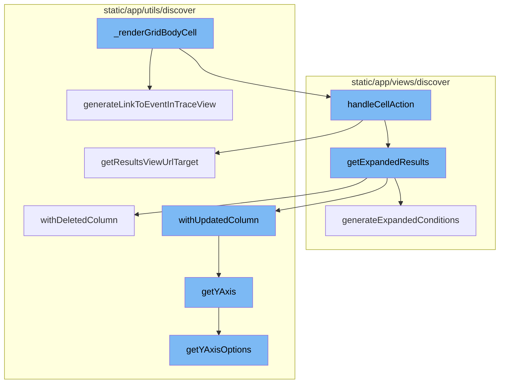
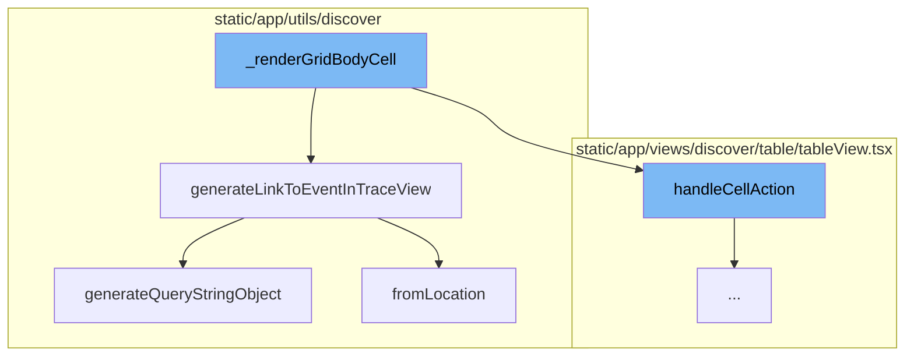
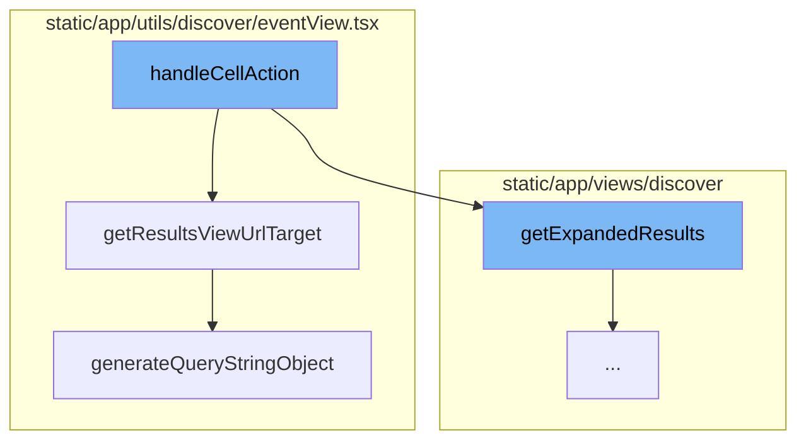
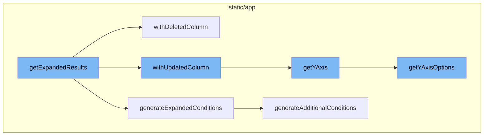

# Overview of \_renderGridBodyCell

The `_renderGridBodyCell` function is a key component in the Sentry application. It is responsible for rendering individual cells within a grid body. This function is used extensively in the `tableView.tsx` file, which is part of the Discover module of the application.

<SwmSnippet path="/static/app/views/discover/table/tableView.tsx" line="296">

---

# Functionality of \_renderGridBodyCell

The `_renderGridBodyCell` function takes in parameters such as the column, dataRow, rowIndex, and columnIndex. It first checks if there is table data and if not, it returns the dataRow for the given column key. It then uses the `getFieldRenderer` function to get the field renderer for the column key. Depending on the column key, it generates different types of cells, such as links to event details, transaction details, trace details, replay links, and profile flamechart links. It also handles the rendering of top results indicators and tooltips for large integer values.

```tsx
  function _renderGridBodyCell(
    column: TableColumn<keyof TableDataRow>,
    dataRow: TableDataRow,
    rowIndex: number,
    columnIndex: number
  ): React.ReactNode {
    const {isFirstPage, eventView, location, organization, tableData, isHomepage} = props;

    if (!tableData || !tableData.meta) {
      return dataRow[column.key];
    }

    const columnKey = String(column.key);
    const fieldRenderer = getFieldRenderer(columnKey, tableData.meta, false);

    const display = eventView.getDisplayMode();
    const isTopEvents =
      display === DisplayModes.TOP5 || display === DisplayModes.DAILYTOP5;

    const topEvents = eventView.topEvents ? parseInt(eventView.topEvents, 10) : TOP_N;
    const count = Math.min(tableData?.data?.length ?? topEvents, topEvents);
```

---

</SwmSnippet>

<SwmSnippet path="/static/app/utils/discover/urls.tsx" line="37">

---

# Link Generation in \_renderGridBodyCell

The `generateLinkToEventInTraceView` function is used within `_renderGridBodyCell` to generate a URL to the trace view or the event details view depending on the feature flag. It takes in parameters such as organization, location, spanId, projectSlug, timestamp, traceSlug, eventId, transactionName, eventView, demo, source, and type. Depending on the organization's features, it returns either the trace details URL or the transaction details URL.

```tsx
/**
 * Return a URL to the trace view or the event details view depending on the
 * feature flag.
 *
 * TODO Abdullah Khan: Add link to new trace view doc explaining why we route to the traceview.
 */
export function generateLinkToEventInTraceView({
  organization,
  isHomepage,
  location,
  spanId,
  projectSlug,
  timestamp,
  traceSlug,
  eventId,
  transactionName,
  eventView,
  demo,
  source,
  type = 'performance',
}: {
```

---

</SwmSnippet>

<SwmSnippet path="/static/app/utils/discover/eventView.tsx" line="672">

---

# Query String Generation in \_renderGridBodyCell

The `generateQueryStringObject` method is used within `generateLinkToEventInTraceView` to generate a query string object from the event view. It returns an object with properties such as id, name, field, widths, sort, environment, project, query, yAxis, dataset, display, topEvents, and interval.

```tsx
  generateQueryStringObject(): Query {
    const output = {
      id: this.id,
      name: this.name,
      field: this.getFields(),
      widths: this.getWidths(),
      sort: encodeSorts(this.sorts),
      environment: this.environment,
      project: this.project,
      query: this.query,
      yAxis: this.yAxis || this.getYAxis(),
      dataset: this.dataset,
      display: this.display,
      topEvents: this.topEvents,
      interval: this.interval,
    };

    for (const field of EXTERNAL_QUERY_STRING_KEYS) {
      if (this[field]?.length) {
        output[field] = this[field];
      }
```

---

</SwmSnippet>

<SwmSnippet path="/static/app/utils/discover/eventView.tsx" line="340">

---

# Event View Creation in \_renderGridBodyCell

The `fromLocation` method is used within `generateLinkToEventInTraceView` to create a new event view from the location. It decodes various parameters from the location query and returns a new EventView object.

```tsx
  static fromLocation(location: Location): EventView {
    const {start, end, statsPeriod} = normalizeDateTimeParams(location.query);

    return new EventView({
      id: decodeScalar(location.query.id),
      name: decodeScalar(location.query.name),
      fields: decodeFields(location),
      sorts: decodeSorts(location.query.sort),
      query: decodeQuery(location),
      team: decodeTeams(location),
      project: decodeProjects(location),
      start: decodeScalar(start),
      end: decodeScalar(end),
      statsPeriod: decodeScalar(statsPeriod),
      environment: collectQueryStringByKey(location.query, 'environment'),
      yAxis: decodeScalar(location.query.yAxis),
      display: decodeScalar(location.query.display),
      topEvents: decodeScalar(location.query.topEvents),
      interval: decodeScalar(location.query.interval),
      createdBy: undefined,
      additionalConditions: new MutableSearch([]),
```

---

</SwmSnippet>

<SwmSnippet path="/static/app/views/discover/table/tableView.tsx" line="526">

---

# Cell Action Handling in \_renderGridBodyCell

The function `handleCellAction` is the starting point of our flow. It takes a data row and a column as parameters. Depending on the action performed, it either navigates to a specific release or drills down into each distinct value and gets a count for each value. In the case of a drilldown, it calls `getExpandedResults` to get the expanded results and then calls `getResultsViewUrlTarget` to get the URL target for the results view.

```tsx
  function handleCellAction(
    dataRow: TableDataRow,
    column: TableColumn<keyof TableDataRow>
  ) {
    return (action: Actions, value: React.ReactText) => {
      const {eventView, organization, location, tableData, isHomepage} = props;

      const query = new MutableSearch(eventView.query);

      let nextView = eventView.clone();
      trackAnalytics('discover_v2.results.cellaction', {
        organization,
        action,
      });

      switch (action) {
        case Actions.RELEASE: {
          const maybeProject = projects.find(project => {
            return project.slug === dataRow.project;
          });

```

---

</SwmSnippet>

<SwmSnippet path="/static/app/utils/discover/eventView.tsx" line="1190">

---

# URL Target Generation in \_renderGridBodyCell

`getResultsViewUrlTarget` is a method that generates the URL target for the results view. It takes a slug and a boolean indicating whether it is a homepage as parameters. It returns an object containing the pathname and query. The query is generated by calling `generateQueryStringObject`.

```tsx
  getResultsViewUrlTarget(
    slug: string,
    isHomepage: boolean = false
  ): {pathname: string; query: Query} {
    const target = isHomepage ? 'homepage' : 'results';
    return {
      pathname: normalizeUrl(`/organizations/${slug}/discover/${target}/`),
      query: this.generateQueryStringObject(),
    };
  }
```

---

</SwmSnippet>

<SwmSnippet path="/static/app/views/discover/utils.tsx" line="262">

---

# Expanded Results Generation in \_renderGridBodyCell

The function `getExpandedResults` is the starting point of the flow. It converts an aggregated query into one that does not have aggregates. It also applies additional conditions defined in `additionalConditions` and generates conditions based on the `dataRow` parameter and the current fields in the `eventView`.

```tsx
export function getExpandedResults(
  eventView: EventView,
  additionalConditions: Record<string, string>,
  dataRow?: TableDataRow | Event
): EventView {
  const fieldSet = new Set();
  // Expand any functions in the resulting column, and dedupe the result.
  // Mark any column as null to remove it.
  const expandedColumns: (Column | null)[] = eventView.fields.map((field: Field) => {
    const exploded = explodeFieldString(field.field, field.alias);
    const column = exploded.kind === 'function' ? drilldownAggregate(exploded) : exploded;

    if (
      // if expanding the function failed
      column === null ||
      // the new column is already present
      fieldSet.has(column.field) ||
      // Skip aggregate equations, their functions will already be added so we just want to remove it
      isAggregateEquation(field.field)
    ) {
      return null;
```

---

</SwmSnippet>

<SwmSnippet path="/static/app/utils/discover/eventView.tsx" line="971">

---

# Column Deletion in \_renderGridBodyCell

The method `withDeletedColumn` is called within `getExpandedResults`. It removes a column from the EventView and adjusts the sort keys and yAxis accordingly.

```tsx
  withDeletedColumn(columnIndex: number, tableMeta: MetaType | undefined): EventView {
    // Disallow removal of the orphan column, and check for out-of-bounds
    if (this.fields.length <= 1 || this.fields.length <= columnIndex || columnIndex < 0) {
      return this;
    }

    // ensure tableMeta is non-empty
    tableMeta = validateTableMeta(tableMeta);

    // delete the column
    const newEventView = this.clone();
    const fields = [...newEventView.fields];
    fields.splice(columnIndex, 1);
    newEventView.fields = fields;

    // Ensure there is at least one auto width column
    // To ensure a well formed table results.
    const hasAutoIndex = fields.find(field => field.width === COL_WIDTH_UNDEFINED);
    if (!hasAutoIndex) {
      newEventView.fields[0].width = COL_WIDTH_UNDEFINED;
    }
```

---

</SwmSnippet>

<SwmSnippet path="/static/app/views/discover/utils.tsx" line="423">

---

# Condition Generation in \_renderGridBodyCell

The function `generateExpandedConditions` is also called within `getExpandedResults`. It generates additional conditions based on the fields in an EventView and a dataRow/event.

```tsx
function generateExpandedConditions(
  eventView: EventView,
  additionalConditions: Record<string, string>,
  dataRow?: TableDataRow | Event
): string {
  const parsedQuery = new MutableSearch(eventView.query);

  // Remove any aggregates from the search conditions.
  // otherwise, it'll lead to an invalid query result.
  for (const key in parsedQuery.filters) {
    const column = explodeFieldString(key);
    if (column.kind === 'function') {
      parsedQuery.removeFilter(key);
    }
  }

  const conditions: Record<string, string | string[]> = Object.assign(
    {},
    additionalConditions,
    generateAdditionalConditions(eventView, dataRow)
  );
```

---

</SwmSnippet>

<SwmSnippet path="/static/app/utils/discover/eventView.tsx" line="877">

---

# Column Update in \_renderGridBodyCell

The method `withUpdatedColumn` is called within `getExpandedResults`. It updates a column in the EventView and adjusts the sort keys and yAxis accordingly.

```tsx
  withUpdatedColumn(
    columnIndex: number,
    updatedColumn: Column,
    tableMeta: MetaType | undefined
  ): EventView {
    const columnToBeUpdated = this.fields[columnIndex];
    const fieldAsString = generateFieldAsString(updatedColumn);

    const updateField = columnToBeUpdated.field !== fieldAsString;
    if (!updateField) {
      return this;
    }

    // ensure tableMeta is non-empty
    tableMeta = validateTableMeta(tableMeta);

    const newEventView = this.clone();

    const updatedField: Field = {
      field: fieldAsString,
      width: COL_WIDTH_UNDEFINED,
```

---

</SwmSnippet>

<SwmSnippet path="/static/app/utils/discover/eventView.tsx" line="1319">

---

# Y-Axis Retrieval in \_renderGridBodyCell

The method `getYAxis` is called within `withUpdatedColumn` and `withDeletedColumn`. It returns the yAxis of the EventView, ensuring that the current selected yAxis is one of the items in yAxisOptions.

```tsx
  getYAxis(): string {
    const yAxisOptions = this.getYAxisOptions();

    const yAxis = this.yAxis;
    const defaultOption = yAxisOptions[0].value;

    if (!yAxis) {
      return defaultOption;
    }

    // ensure current selected yAxis is one of the items in yAxisOptions
    const result = yAxisOptions.findIndex(
      (option: SelectValue<string>) => option.value === yAxis
    );

    if (result >= 0) {
      return typeof yAxis === 'string' ? yAxis : yAxis[0];
    }

    return defaultOption;
  }
```

---

</SwmSnippet>

<SwmSnippet path="/static/app/utils/discover/eventView.tsx" line="1300">

---

# Y-Axis Options in \_renderGridBodyCell

The method `getYAxisOptions` is called within `getYAxis`. It returns the yAxis options of the EventView, including only aggregates that are graphable.

```tsx
  getYAxisOptions(): SelectValue<string>[] {
    // Make option set and add the default options in.
    return uniqBy(
      this.getAggregateFields()
        // Only include aggregates that make sense to be graphable (eg. not string or date)
        .filter(
          (field: Field) =>
            isLegalYAxisType(aggregateOutputType(field.field)) ||
            isAggregateEquation(field.field)
        )
        .map((field: Field) => ({
          label: isEquation(field.field) ? getEquation(field.field) : field.field,
          value: field.field,
        }))
        .concat(CHART_AXIS_OPTIONS),
      'value'
    );
  }
```

---

</SwmSnippet>



# Flow drill down

First, we'll zoom into this section of the flow:



<SwmSnippet path="/static/app/views/discover/table/tableView.tsx" line="296">

---

# \_renderGridBodyCell Function

The `_renderGridBodyCell` function is responsible for rendering a cell in the grid body. It takes in parameters such as the column, dataRow, rowIndex, and columnIndex. The function first checks if there is table data and if not, it returns the dataRow for the given column key. It then uses the `getFieldRenderer` function to get the field renderer for the column key. Depending on the column key, it generates different types of cells, such as links to event details, transaction details, trace details, replay links, and profile flamechart links. It also handles the rendering of top results indicators and tooltips for large integer values.

```tsx
  function _renderGridBodyCell(
    column: TableColumn<keyof TableDataRow>,
    dataRow: TableDataRow,
    rowIndex: number,
    columnIndex: number
  ): React.ReactNode {
    const {isFirstPage, eventView, location, organization, tableData, isHomepage} = props;

    if (!tableData || !tableData.meta) {
      return dataRow[column.key];
    }

    const columnKey = String(column.key);
    const fieldRenderer = getFieldRenderer(columnKey, tableData.meta, false);

    const display = eventView.getDisplayMode();
    const isTopEvents =
      display === DisplayModes.TOP5 || display === DisplayModes.DAILYTOP5;

    const topEvents = eventView.topEvents ? parseInt(eventView.topEvents, 10) : TOP_N;
    const count = Math.min(tableData?.data?.length ?? topEvents, topEvents);
```

---

</SwmSnippet>

<SwmSnippet path="/static/app/utils/discover/urls.tsx" line="37">

---

# generateLinkToEventInTraceView Function

The `generateLinkToEventInTraceView` function is used within `_renderGridBodyCell` to generate a URL to the trace view or the event details view depending on the feature flag. It takes in parameters such as organization, location, spanId, projectSlug, timestamp, traceSlug, eventId, transactionName, eventView, demo, source, and type. Depending on the organization's features, it returns either the trace details URL or the transaction details URL.

```tsx
/**
 * Return a URL to the trace view or the event details view depending on the
 * feature flag.
 *
 * TODO Abdullah Khan: Add link to new trace view doc explaining why we route to the traceview.
 */
export function generateLinkToEventInTraceView({
  organization,
  isHomepage,
  location,
  spanId,
  projectSlug,
  timestamp,
  traceSlug,
  eventId,
  transactionName,
  eventView,
  demo,
  source,
  type = 'performance',
}: {
```

---

</SwmSnippet>

<SwmSnippet path="/static/app/utils/discover/eventView.tsx" line="672">

---

# generateQueryStringObject Method

The `generateQueryStringObject` method is used within `generateLinkToEventInTraceView` to generate a query string object from the event view. It returns an object with properties such as id, name, field, widths, sort, environment, project, query, yAxis, dataset, display, topEvents, and interval.

```tsx
  generateQueryStringObject(): Query {
    const output = {
      id: this.id,
      name: this.name,
      field: this.getFields(),
      widths: this.getWidths(),
      sort: encodeSorts(this.sorts),
      environment: this.environment,
      project: this.project,
      query: this.query,
      yAxis: this.yAxis || this.getYAxis(),
      dataset: this.dataset,
      display: this.display,
      topEvents: this.topEvents,
      interval: this.interval,
    };

    for (const field of EXTERNAL_QUERY_STRING_KEYS) {
      if (this[field]?.length) {
        output[field] = this[field];
      }
```

---

</SwmSnippet>

<SwmSnippet path="/static/app/utils/discover/eventView.tsx" line="340">

---

# fromLocation Method

The `fromLocation` method is used within `generateLinkToEventInTraceView` to create a new event view from the location. It decodes various parameters from the location query and returns a new EventView object.

```tsx
  static fromLocation(location: Location): EventView {
    const {start, end, statsPeriod} = normalizeDateTimeParams(location.query);

    return new EventView({
      id: decodeScalar(location.query.id),
      name: decodeScalar(location.query.name),
      fields: decodeFields(location),
      sorts: decodeSorts(location.query.sort),
      query: decodeQuery(location),
      team: decodeTeams(location),
      project: decodeProjects(location),
      start: decodeScalar(start),
      end: decodeScalar(end),
      statsPeriod: decodeScalar(statsPeriod),
      environment: collectQueryStringByKey(location.query, 'environment'),
      yAxis: decodeScalar(location.query.yAxis),
      display: decodeScalar(location.query.display),
      topEvents: decodeScalar(location.query.topEvents),
      interval: decodeScalar(location.query.interval),
      createdBy: undefined,
      additionalConditions: new MutableSearch([]),
```

---

</SwmSnippet>

Now, lets zoom into this section of the flow:



<SwmSnippet path="/static/app/views/discover/table/tableView.tsx" line="526">

---

# \_renderGridBodyCell Flow

The function `handleCellAction` is the starting point of our flow. It takes a data row and a column as parameters. Depending on the action performed, it either navigates to a specific release or drills down into each distinct value and gets a count for each value. In the case of a drilldown, it calls `getExpandedResults` to get the expanded results and then calls `getResultsViewUrlTarget` to get the URL target for the results view.

```tsx
  function handleCellAction(
    dataRow: TableDataRow,
    column: TableColumn<keyof TableDataRow>
  ) {
    return (action: Actions, value: React.ReactText) => {
      const {eventView, organization, location, tableData, isHomepage} = props;

      const query = new MutableSearch(eventView.query);

      let nextView = eventView.clone();
      trackAnalytics('discover_v2.results.cellaction', {
        organization,
        action,
      });

      switch (action) {
        case Actions.RELEASE: {
          const maybeProject = projects.find(project => {
            return project.slug === dataRow.project;
          });

```

---

</SwmSnippet>

<SwmSnippet path="/static/app/utils/discover/eventView.tsx" line="1190">

---

`getResultsViewUrlTarget` is a method that generates the URL target for the results view. It takes a slug and a boolean indicating whether it is a homepage as parameters. It returns an object containing the pathname and query. The query is generated by calling `generateQueryStringObject`.

```tsx
  getResultsViewUrlTarget(
    slug: string,
    isHomepage: boolean = false
  ): {pathname: string; query: Query} {
    const target = isHomepage ? 'homepage' : 'results';
    return {
      pathname: normalizeUrl(`/organizations/${slug}/discover/${target}/`),
      query: this.generateQueryStringObject(),
    };
  }
```

---

</SwmSnippet>

<SwmSnippet path="/static/app/utils/discover/eventView.tsx" line="672">

---

`generateQueryStringObject` is a method that generates a query string object. It returns an object containing various properties such as id, name, field, widths, sort, environment, project, query, yAxis, dataset, display, topEvents, and interval. This object is used as the query in the URL target for the results view.

```tsx
  generateQueryStringObject(): Query {
    const output = {
      id: this.id,
      name: this.name,
      field: this.getFields(),
      widths: this.getWidths(),
      sort: encodeSorts(this.sorts),
      environment: this.environment,
      project: this.project,
      query: this.query,
      yAxis: this.yAxis || this.getYAxis(),
      dataset: this.dataset,
      display: this.display,
      topEvents: this.topEvents,
      interval: this.interval,
    };

    for (const field of EXTERNAL_QUERY_STRING_KEYS) {
      if (this[field]?.length) {
        output[field] = this[field];
      }
```

---

</SwmSnippet>

Now, lets zoom into this section of the flow:



<SwmSnippet path="/static/app/views/discover/utils.tsx" line="262">

---

# \_renderGridBodyCell Flow

The function `getExpandedResults` is the starting point of the flow. It converts an aggregated query into one that does not have aggregates. It also applies additional conditions defined in `additionalConditions` and generates conditions based on the `dataRow` parameter and the current fields in the `eventView`.

```tsx
export function getExpandedResults(
  eventView: EventView,
  additionalConditions: Record<string, string>,
  dataRow?: TableDataRow | Event
): EventView {
  const fieldSet = new Set();
  // Expand any functions in the resulting column, and dedupe the result.
  // Mark any column as null to remove it.
  const expandedColumns: (Column | null)[] = eventView.fields.map((field: Field) => {
    const exploded = explodeFieldString(field.field, field.alias);
    const column = exploded.kind === 'function' ? drilldownAggregate(exploded) : exploded;

    if (
      // if expanding the function failed
      column === null ||
      // the new column is already present
      fieldSet.has(column.field) ||
      // Skip aggregate equations, their functions will already be added so we just want to remove it
      isAggregateEquation(field.field)
    ) {
      return null;
```

---

</SwmSnippet>

<SwmSnippet path="/static/app/utils/discover/eventView.tsx" line="971">

---

The method `withDeletedColumn` is called within `getExpandedResults`. It removes a column from the EventView and adjusts the sort keys and yAxis accordingly.

```tsx
  withDeletedColumn(columnIndex: number, tableMeta: MetaType | undefined): EventView {
    // Disallow removal of the orphan column, and check for out-of-bounds
    if (this.fields.length <= 1 || this.fields.length <= columnIndex || columnIndex < 0) {
      return this;
    }

    // ensure tableMeta is non-empty
    tableMeta = validateTableMeta(tableMeta);

    // delete the column
    const newEventView = this.clone();
    const fields = [...newEventView.fields];
    fields.splice(columnIndex, 1);
    newEventView.fields = fields;

    // Ensure there is at least one auto width column
    // To ensure a well formed table results.
    const hasAutoIndex = fields.find(field => field.width === COL_WIDTH_UNDEFINED);
    if (!hasAutoIndex) {
      newEventView.fields[0].width = COL_WIDTH_UNDEFINED;
    }
```

---

</SwmSnippet>

<SwmSnippet path="/static/app/views/discover/utils.tsx" line="423">

---

The function `generateExpandedConditions` is also called within `getExpandedResults`. It generates additional conditions based on the fields in an EventView and a dataRow/event.

```tsx
function generateExpandedConditions(
  eventView: EventView,
  additionalConditions: Record<string, string>,
  dataRow?: TableDataRow | Event
): string {
  const parsedQuery = new MutableSearch(eventView.query);

  // Remove any aggregates from the search conditions.
  // otherwise, it'll lead to an invalid query result.
  for (const key in parsedQuery.filters) {
    const column = explodeFieldString(key);
    if (column.kind === 'function') {
      parsedQuery.removeFilter(key);
    }
  }

  const conditions: Record<string, string | string[]> = Object.assign(
    {},
    additionalConditions,
    generateAdditionalConditions(eventView, dataRow)
  );
```

---

</SwmSnippet>

<SwmSnippet path="/static/app/utils/discover/eventView.tsx" line="877">

---

The method `withUpdatedColumn` is called within `getExpandedResults`. It updates a column in the EventView and adjusts the sort keys and yAxis accordingly.

```tsx
  withUpdatedColumn(
    columnIndex: number,
    updatedColumn: Column,
    tableMeta: MetaType | undefined
  ): EventView {
    const columnToBeUpdated = this.fields[columnIndex];
    const fieldAsString = generateFieldAsString(updatedColumn);

    const updateField = columnToBeUpdated.field !== fieldAsString;
    if (!updateField) {
      return this;
    }

    // ensure tableMeta is non-empty
    tableMeta = validateTableMeta(tableMeta);

    const newEventView = this.clone();

    const updatedField: Field = {
      field: fieldAsString,
      width: COL_WIDTH_UNDEFINED,
```

---

</SwmSnippet>

<SwmSnippet path="/static/app/utils/discover/eventView.tsx" line="1319">

---

The method `getYAxis` is called within `withUpdatedColumn` and `withDeletedColumn`. It returns the yAxis of the EventView, ensuring that the current selected yAxis is one of the items in yAxisOptions.

```tsx
  getYAxis(): string {
    const yAxisOptions = this.getYAxisOptions();

    const yAxis = this.yAxis;
    const defaultOption = yAxisOptions[0].value;

    if (!yAxis) {
      return defaultOption;
    }

    // ensure current selected yAxis is one of the items in yAxisOptions
    const result = yAxisOptions.findIndex(
      (option: SelectValue<string>) => option.value === yAxis
    );

    if (result >= 0) {
      return typeof yAxis === 'string' ? yAxis : yAxis[0];
    }

    return defaultOption;
  }
```

---

</SwmSnippet>

<SwmSnippet path="/static/app/utils/discover/eventView.tsx" line="1300">

---

The method `getYAxisOptions` is called within `getYAxis`. It returns the yAxis options of the EventView, including only aggregates that are graphable.

```tsx
  getYAxisOptions(): SelectValue<string>[] {
    // Make option set and add the default options in.
    return uniqBy(
      this.getAggregateFields()
        // Only include aggregates that make sense to be graphable (eg. not string or date)
        .filter(
          (field: Field) =>
            isLegalYAxisType(aggregateOutputType(field.field)) ||
            isAggregateEquation(field.field)
        )
        .map((field: Field) => ({
          label: isEquation(field.field) ? getEquation(field.field) : field.field,
          value: field.field,
        }))
        .concat(CHART_AXIS_OPTIONS),
      'value'
    );
  }
```

---

</SwmSnippet>

&nbsp;

*This is an auto-generated document by Swimm AI 🌊 and has not yet been verified by a human*

<SwmMeta version="3.0.0" repo-id="Z2l0aHViJTNBJTNBc2VudHJ5LWRlbW8lM0ElM0FTd2ltbS1EZW1v" repo-name="sentry-demo" doc-type="flows"><sup>Powered by [Swimm](/)</sup></SwmMeta>
