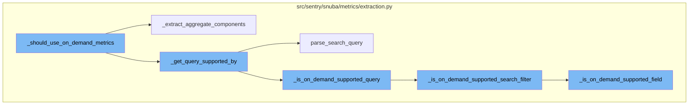
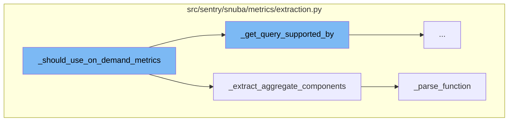
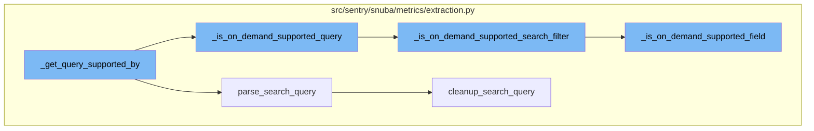

# \_should_use_on_demand_metrics Overview

\_should_use_on_demand_metrics is a function that determines whether on-demand metrics should be used based on the aggregate and query. It checks if the aggregate and query are supported by on-demand metrics but not by standard metrics. It also checks if the dataset is supported and if the aggregate components can be extracted.

# \_extract_aggregate_components Function

\_extract_aggregate_components is a function used within \_should_use_on_demand_metrics to extract the components of the aggregate. If the aggregate is an equation, it returns None. Otherwise, it parses the function and returns the function and its arguments.

# \_parse_function Function

\_parse_function is a function used within \_extract_aggregate_components to parse an aggregate and return its components. It checks if the aggregate is a function and if it is, it parses the arguments and returns the function, arguments, and alias.

# \_get_query_supported_by Function

\_get_query_supported_by is the starting point of the flow. It takes a query as input and parses it using the parse_search_query function. The parsed query is then checked to see if it is supported by standard metrics and on-demand metrics.

# parse_search_query Function

parse_search_query is a function that parses a search query and performs some transformations on the AST to account for edge cases. It also removes elements from the query which are blacklisted if the removed_blacklisted flag is set to True.

# \_is_on_demand_supported_query Function

\_is_on_demand_supported_query is a function that checks if any of the supplied tokens contain search filters that can't be handled by standard metrics. It does this by calling the \_is_on_demand_supported_search_filter function for each token.

# \_is_on_demand_supported_search_filter Function

\_is_on_demand_supported_search_filter is a function that checks if a given token is supported by on-demand metrics. It checks the type of the token and its properties to determine if it is supported.

# \_is_on_demand_supported_field Function

\_is_on_demand_supported_field is a function that checks if a given field is supported by on-demand metrics. It does this by checking if the field is in the \_IGNORED_METRIC_FIELDS list or if it can be mapped using the \_map_field_name function.



# Flow drill down

First, we'll zoom into this section of the flow:



<SwmSnippet path="/src/sentry/snuba/metrics/extraction.py" line="608">

---

# \_should_use_on_demand_metrics Function

The function `_should_use_on_demand_metrics` is used to determine if on-demand metrics should be used based on the aggregate and query. It checks if the aggregate and query are supported by on-demand metrics but not by standard metrics. It also checks if the dataset is supported and if the aggregate components can be extracted.

```python
def _should_use_on_demand_metrics(
    dataset: str | Dataset | None,
    aggregate: str,
    query: str | None,
    groupbys: Sequence[str] | None = None,
    prefilling: bool = False,
) -> bool:
    """On-demand metrics are used if the aggregate and query are supported by on-demand metrics but not standard"""
    groupbys = groupbys or []
    supported_datasets = [Dataset.PerformanceMetrics]
    # In case we are running a prefill, we want to support also transactions, since our goal is to start extracting
    # metrics that will be needed after a query is converted from using transactions to metrics.
    if prefilling:
        supported_datasets.append(Dataset.Transactions)

    if not dataset or Dataset(dataset) not in supported_datasets:
        return False

    components = _extract_aggregate_components(aggregate)
    if components is None:
        return False
```

---

</SwmSnippet>

<SwmSnippet path="/src/sentry/snuba/metrics/extraction.py" line="697">

---

# \_extract_aggregate_components Function

The function `_extract_aggregate_components` is used within `_should_use_on_demand_metrics` to extract the components of the aggregate. If the aggregate is an equation, it returns None. Otherwise, it parses the function and returns the function and its arguments.

```python
def _extract_aggregate_components(aggregate: str) -> tuple[str, list[str]] | None:
    try:
        if is_equation(aggregate):
            return None

        function, args, _ = _parse_function(aggregate)
        return function, args
    except InvalidSearchQuery:
        logger.exception("Failed to parse aggregate: %s", aggregate)

    return None
```

---

</SwmSnippet>

<SwmSnippet path="/src/sentry/snuba/metrics/extraction.py" line="537">

---

# \_parse_function Function

The function `_parse_function` is used within `_extract_aggregate_components` to parse an aggregate and return its components. It checks if the aggregate is a function and if it is, it parses the arguments and returns the function, arguments, and alias.

```python
def _parse_function(aggregate: str) -> tuple[str, list[str], str]:
    """
    Parses an aggregate and returns its components.

    This function is a slightly modified version of the `parse_function` method of the query builders.
    """
    match = fields.is_function(aggregate)
    if not match:
        raise InvalidSearchQuery(f"Invalid characters in field {aggregate}")

    function = match.group("function")
    arguments = fields.parse_arguments(function, match.group("columns"))
    alias = match.group("alias")

    if alias is None:
        alias = fields.get_function_alias_with_columns(function, arguments)

    return function, arguments, alias
```

---

</SwmSnippet>

Now, lets zoom into this section of the flow:



<SwmSnippet path="/src/sentry/snuba/metrics/extraction.py" line="798">

---

# \_should_use_on_demand_metrics Flow

The function `_get_query_supported_by` is the starting point of the flow. It takes a query as input and parses it using the `parse_search_query` function. The parsed query is then checked to see if it is supported by standard metrics and on-demand metrics.

```python
def _get_query_supported_by(query: str | None) -> SupportedBy:
    try:
        parsed_query = parse_search_query(query=query, removed_blacklisted=False)

        standard_metrics = _is_standard_metrics_query(parsed_query)
        on_demand_metrics = _is_on_demand_supported_query(parsed_query)

        return SupportedBy(standard_metrics=standard_metrics, on_demand_metrics=on_demand_metrics)
    except InvalidSearchQuery:
        logger.exception("Failed to parse search query: %s", query)
        return SupportedBy.neither()
```

---

</SwmSnippet>

<SwmSnippet path="/src/sentry/snuba/metrics/extraction.py" line="452">

---

`parse_search_query` is a function that parses a search query and performs some transformations on the AST to account for edge cases. It also removes elements from the query which are blacklisted if the `removed_blacklisted` flag is set to True.

```python
def parse_search_query(
    query: str | None,
    removed_blacklisted: bool = False,
    force_transaction_event_type: bool = False,
) -> Sequence[QueryToken]:
    """
    Parses a search query with the discover grammar and performs some transformations on the AST in order to account for
    edge cases.
    """
    tokens = cast(Sequence[QueryToken], event_search.parse_search_query(query))

    # We might want to force the `event.type:transaction` to be in the query, as a validation step.
    if force_transaction_event_type:
        _check_event_type_transaction(tokens)

    # As first step, we transform the search query by applying basic transformations.
    tokens = _transform_search_query(tokens)

    # As second step, if enabled, we remove elements from the query which are blacklisted.
    if removed_blacklisted:
        tokens = cleanup_search_query(_remove_blacklisted_search_filters(tokens))
```

---

</SwmSnippet>

<SwmSnippet path="/src/sentry/snuba/metrics/extraction.py" line="832">

---

`_is_on_demand_supported_query` is a function that checks if any of the supplied tokens contain search filters that can't be handled by standard metrics. It does this by calling the `_is_on_demand_supported_search_filter` function for each token.

```python
def _is_on_demand_supported_query(tokens: Sequence[QueryToken]) -> bool:
    """
    Recursively checks if any of the supplied token contain search filters that can't be handled by standard metrics.
    """
    for token in tokens:
        if not _is_on_demand_supported_search_filter(token):
            return False

    return True
```

---

</SwmSnippet>

<SwmSnippet path="/src/sentry/snuba/metrics/extraction.py" line="843">

---

`_is_on_demand_supported_search_filter` is a function that checks if a given token is supported by on-demand metrics. It checks the type of the token and its properties to determine if it is supported.

```python
def _is_on_demand_supported_search_filter(token: QueryToken) -> bool:
    if isinstance(token, AggregateFilter):
        return False

    if isinstance(token, SearchFilter):
        if not _SEARCH_TO_RELAY_OPERATORS.get(token.operator):
            return False

        return (
            not _is_excluding_transactions(token)
            and not _is_error_field(token.key.name)
            and _is_on_demand_supported_field(token.key.name)
        )

    if isinstance(token, ParenExpression):
        return _is_on_demand_supported_query(token.children)

    return True
```

---

</SwmSnippet>

<SwmSnippet path="/src/sentry/snuba/metrics/extraction.py" line="890">

---

`_is_on_demand_supported_field` is a function that checks if a given field is supported by on-demand metrics. It does this by checking if the field is in the `_IGNORED_METRIC_FIELDS` list or if it can be mapped using the `_map_field_name` function.

```python
def _is_on_demand_supported_field(field: str) -> bool:
    if field in _IGNORED_METRIC_FIELDS:
        return True

    try:
        _map_field_name(field)
        return True
    except ValueError:
        return False
```

---

</SwmSnippet>

&nbsp;

*This is an auto-generated document by Swimm AI 🌊 and has not yet been verified by a human*

<SwmMeta version="3.0.0" repo-id="Z2l0aHViJTNBJTNBc2VudHJ5LWRlbW8lM0ElM0FTd2ltbS1EZW1v" repo-name="sentry-demo" doc-type="flows"><sup>Powered by [Swimm](/)</sup></SwmMeta>
