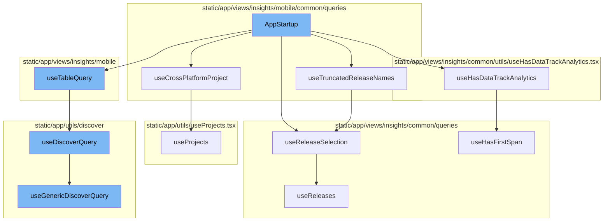

<SwmSnippet path="/static/app/views/insights/mobile/appStarts/components/appStartup.tsx" line="46">

---

# AppStartup Flow

The `AppStartup` function is the entry point of the application startup flow. It initializes various hooks and constructs a query for fetching data. It also handles the rendering of various components based on the fetched data.

```tsx
function AppStartup({additionalFilters, chartHeight}: Props) {
  const theme = useTheme();
  const pageFilter = usePageFilters();
  const {selection} = pageFilter;
  const location = useLocation();
  const organization = useOrganization();
  const {query: locationQuery} = location;

  const {
    primaryRelease,
    secondaryRelease,
    isLoading: isReleasesLoading,
  } = useReleaseSelection();
  const {truncatedPrimaryRelease, truncatedSecondaryRelease} = useTruncatedReleaseNames();
  const {isProjectCrossPlatform, selectedPlatform} = useCrossPlatformProject();

  const router = useRouter();

  const appStartType =
    decodeScalar(location.query[SpanMetricsField.APP_START_TYPE]) ?? COLD_START_TYPE;

```

---

</SwmSnippet>

<SwmSnippet path="/static/app/views/insights/mobile/common/queries/useTruncatedRelease.tsx" line="5">

---

## useTruncatedReleaseNames

`useTruncatedReleaseNames` is a hook that retrieves the primary and secondary release names and truncates them if they exceed a certain length. This is used to ensure that the release names fit within the UI constraints.

```tsx
function useTruncatedReleaseNames(truncation?: number) {
  const {primaryRelease, secondaryRelease} = useReleaseSelection();

  const truncatedPrimaryRelease = formatVersionAndCenterTruncate(
    primaryRelease ?? '',
    truncation ?? MAX_CHART_RELEASE_CHARS
  );
  const truncatedSecondaryRelease = formatVersionAndCenterTruncate(
    secondaryRelease ?? '',
    truncation ?? MAX_CHART_RELEASE_CHARS
  );

  return {truncatedPrimaryRelease, truncatedSecondaryRelease};
}
```

---

</SwmSnippet>

<SwmSnippet path="/static/app/views/insights/common/queries/useReleases.tsx" line="116">

---

## useReleaseSelection

`useReleaseSelection` is a hook that fetches the primary and secondary releases. It decodes the release information from the location query or defaults to the first two releases if not specified.

```tsx
export function useReleaseSelection(): {
  isLoading: boolean;
  primaryRelease: string | undefined;
  secondaryRelease: string | undefined;
} {
  const location = useLocation();

  const {data: releases, isLoading} = useReleases();

  // If there are more than 1 release, the first one should be the older one
  const primaryRelease =
    decodeScalar(location.query.primaryRelease) ??
    (releases && releases.length > 1 ? releases?.[1]?.version : releases?.[0]?.version);

  // If there are more than 1 release, the second one should be the newest one
  const secondaryRelease =
    decodeScalar(location.query.secondaryRelease) ??
    (releases && releases.length > 1 ? releases?.[0]?.version : undefined);

  return {primaryRelease, secondaryRelease, isLoading};
}
```

---

</SwmSnippet>

<SwmSnippet path="/static/app/views/insights/common/utils/useHasDataTrackAnalytics.tsx" line="10">

---

## useHasDataTrackAnalytics

`useHasDataTrackAnalytics` is a hook that tracks analytics data. It checks if the module has ever sent data and sends an analytics event with this information.

```tsx
export function useHasDataTrackAnalytics(module: ModuleName, analyticEvent: string) {
  const organization = useOrganization();
  const pageFilters = usePageFilters();
  const hasEverSentData = useHasFirstSpan(module);

  Sentry.withScope(scope => {
    scope.setTag(`insights.${module}.hasEverSentData`, hasEverSentData);
  });

  const projects = JSON.stringify(pageFilters.selection.projects);

  useEffect(() => {
    trackAnalytics(analyticEvent, {
      organization,
      has_ever_sent_data: hasEverSentData,
    });
  }, [organization, hasEverSentData, analyticEvent, projects]);
}
```

---

</SwmSnippet>

<SwmSnippet path="/static/app/views/insights/mobile/common/queries/useCrossPlatformProject.tsx" line="13">

---

## useCrossPlatformProject

`useCrossPlatformProject` is a hook that determines if the selected project is cross-platform. It also retrieves the selected platform from the location query or local storage.

```tsx
function useCrossPlatformProject() {
  const {selection} = usePageFilters();
  const {projects} = useProjects();
  const location = useLocation();

  const project = useMemo(() => {
    if (selection.projects.length !== 1) {
      return null;
    }

    return projects.find(p => p.id === String(selection.projects)) ?? null;
  }, [projects, selection.projects]);

  const isProjectCrossPlatform = useMemo(
    () => !!(project && isCrossPlatform(project)),
    [project]
  );

  const selectedPlatform =
    decodeScalar(location.query[PLATFORM_QUERY_PARAM]) ??
    localStorage.getItem(PLATFORM_LOCAL_STORAGE_KEY) ??
```

---

</SwmSnippet>

<SwmSnippet path="/static/app/views/insights/mobile/screenload/components/tables/screensTable.tsx" line="252">

---

## useTableQuery

`useTableQuery` is a hook that fetches data for the table view. It uses the `useDiscoverQuery` hook to fetch the data based on the provided event view and other parameters.

```tsx
export function useTableQuery({
  eventView,
  enabled,
  referrer,
  initialData,
  limit,
  staleTime,
  cursor,
}: {
  eventView: EventView;
  cursor?: string;
  enabled?: boolean;
  excludeOther?: boolean;
  initialData?: TableData;
  limit?: number;
  referrer?: string;
  staleTime?: number;
}) {
  const location = useLocation();
  const organization = useOrganization();
  const {isReady: pageFiltersReady} = usePageFilters();
```

---

</SwmSnippet>

<SwmSnippet path="/static/app/utils/discover/discoverQuery.tsx" line="72">

---

## useDiscoverQuery

`useDiscoverQuery` is a hook that fetches data for a discover query. It uses the `useGenericDiscoverQuery` hook to fetch the data and processes the response to extract the data, page links, and other metadata.

```tsx
export function useDiscoverQuery(props: Omit<DiscoverQueryComponentProps, 'children'>) {
  const afterFetch = (data, _) => {
    const {fields, ...otherMeta} = data.meta ?? {};
    return {
      ...data,
      meta: {...fields, ...otherMeta},
    };
  };

  const res = useGenericDiscoverQuery<TableData, DiscoverQueryPropsWithThresholds>({
    route: 'events',
    shouldRefetchData,
    afterFetch,
    ...props,
  });

  const pageLinks = res.response?.getResponseHeader('Link') ?? undefined;

  return {...res, pageLinks};
}
```

---

</SwmSnippet>

<SwmSnippet path="/static/app/utils/discover/genericDiscoverQuery.tsx" line="419">

---

## useGenericDiscoverQuery

`useGenericDiscoverQuery` is a hook that fetches data for a generic discover query. It makes an API request to fetch the data and processes the response to extract the data, status code, and other response metadata.

```tsx
export function useGenericDiscoverQuery<T, P>(props: Props<T, P>) {
  const api = useApi();
  const {orgSlug, route, options} = props;
  const url = `/organizations/${orgSlug}/${route}/`;
  const apiPayload = getPayload<T, P>(props);

  const res = useQuery<[T, string | undefined, ResponseMeta<T> | undefined], QueryError>(
    [route, apiPayload],
    ({signal: _signal}) =>
      doDiscoverQuery<T>(api, url, apiPayload, {
        queryBatching: props.queryBatching,
        skipAbort: props.skipAbort,
      }),
    options
  );

  return {
    ...res,
    data: res.data?.[0] ?? undefined,
    error: parseError(res.error),
    statusCode: res.data?.[1] ?? undefined,
```

---

</SwmSnippet>



# Flow drill down


<SwmSnippet path="/static/app/views/insights/mobile/appStarts/components/appStartup.tsx" line="46">

---

# AppStartup Flow

The `AppStartup` function is the entry point of the application startup flow. It initializes various hooks and constructs a query for fetching data. It also handles the rendering of various components based on the fetched data.

```tsx
function AppStartup({additionalFilters, chartHeight}: Props) {
  const theme = useTheme();
  const pageFilter = usePageFilters();
  const {selection} = pageFilter;
  const location = useLocation();
  const organization = useOrganization();
  const {query: locationQuery} = location;

  const {
    primaryRelease,
    secondaryRelease,
    isLoading: isReleasesLoading,
  } = useReleaseSelection();
  const {truncatedPrimaryRelease, truncatedSecondaryRelease} = useTruncatedReleaseNames();
  const {isProjectCrossPlatform, selectedPlatform} = useCrossPlatformProject();

  const router = useRouter();

  const appStartType =
    decodeScalar(location.query[SpanMetricsField.APP_START_TYPE]) ?? COLD_START_TYPE;

```

---

</SwmSnippet>

<SwmSnippet path="/static/app/views/insights/mobile/common/queries/useTruncatedRelease.tsx" line="5">

---

## useTruncatedReleaseNames

`useTruncatedReleaseNames` is a hook that retrieves the primary and secondary release names and truncates them if they exceed a certain length. This is used to ensure that the release names fit within the UI constraints.

```tsx
function useTruncatedReleaseNames(truncation?: number) {
  const {primaryRelease, secondaryRelease} = useReleaseSelection();

  const truncatedPrimaryRelease = formatVersionAndCenterTruncate(
    primaryRelease ?? '',
    truncation ?? MAX_CHART_RELEASE_CHARS
  );
  const truncatedSecondaryRelease = formatVersionAndCenterTruncate(
    secondaryRelease ?? '',
    truncation ?? MAX_CHART_RELEASE_CHARS
  );

  return {truncatedPrimaryRelease, truncatedSecondaryRelease};
}
```

---

</SwmSnippet>

<SwmSnippet path="/static/app/views/insights/common/queries/useReleases.tsx" line="116">

---

## useReleaseSelection

`useReleaseSelection` is a hook that fetches the primary and secondary releases. It decodes the release information from the location query or defaults to the first two releases if not specified.

```tsx
export function useReleaseSelection(): {
  isLoading: boolean;
  primaryRelease: string | undefined;
  secondaryRelease: string | undefined;
} {
  const location = useLocation();

  const {data: releases, isLoading} = useReleases();

  // If there are more than 1 release, the first one should be the older one
  const primaryRelease =
    decodeScalar(location.query.primaryRelease) ??
    (releases && releases.length > 1 ? releases?.[1]?.version : releases?.[0]?.version);

  // If there are more than 1 release, the second one should be the newest one
  const secondaryRelease =
    decodeScalar(location.query.secondaryRelease) ??
    (releases && releases.length > 1 ? releases?.[0]?.version : undefined);

  return {primaryRelease, secondaryRelease, isLoading};
}
```

---

</SwmSnippet>

<SwmSnippet path="/static/app/views/insights/common/utils/useHasDataTrackAnalytics.tsx" line="10">

---

## useHasDataTrackAnalytics

`useHasDataTrackAnalytics` is a hook that tracks analytics data. It checks if the module has ever sent data and sends an analytics event with this information.

```tsx
export function useHasDataTrackAnalytics(module: ModuleName, analyticEvent: string) {
  const organization = useOrganization();
  const pageFilters = usePageFilters();
  const hasEverSentData = useHasFirstSpan(module);

  Sentry.withScope(scope => {
    scope.setTag(`insights.${module}.hasEverSentData`, hasEverSentData);
  });

  const projects = JSON.stringify(pageFilters.selection.projects);

  useEffect(() => {
    trackAnalytics(analyticEvent, {
      organization,
      has_ever_sent_data: hasEverSentData,
    });
  }, [organization, hasEverSentData, analyticEvent, projects]);
}
```

---

</SwmSnippet>

<SwmSnippet path="/static/app/views/insights/mobile/common/queries/useCrossPlatformProject.tsx" line="13">

---

## useCrossPlatformProject

`useCrossPlatformProject` is a hook that determines if the selected project is cross-platform. It also retrieves the selected platform from the location query or local storage.

```tsx
function useCrossPlatformProject() {
  const {selection} = usePageFilters();
  const {projects} = useProjects();
  const location = useLocation();

  const project = useMemo(() => {
    if (selection.projects.length !== 1) {
      return null;
    }

    return projects.find(p => p.id === String(selection.projects)) ?? null;
  }, [projects, selection.projects]);

  const isProjectCrossPlatform = useMemo(
    () => !!(project && isCrossPlatform(project)),
    [project]
  );

  const selectedPlatform =
    decodeScalar(location.query[PLATFORM_QUERY_PARAM]) ??
    localStorage.getItem(PLATFORM_LOCAL_STORAGE_KEY) ??
```

---

</SwmSnippet>

<SwmSnippet path="/static/app/views/insights/mobile/screenload/components/tables/screensTable.tsx" line="252">

---

## useTableQuery

`useTableQuery` is a hook that fetches data for the table view. It uses the `useDiscoverQuery` hook to fetch the data based on the provided event view and other parameters.

```tsx
export function useTableQuery({
  eventView,
  enabled,
  referrer,
  initialData,
  limit,
  staleTime,
  cursor,
}: {
  eventView: EventView;
  cursor?: string;
  enabled?: boolean;
  excludeOther?: boolean;
  initialData?: TableData;
  limit?: number;
  referrer?: string;
  staleTime?: number;
}) {
  const location = useLocation();
  const organization = useOrganization();
  const {isReady: pageFiltersReady} = usePageFilters();
```

---

</SwmSnippet>

<SwmSnippet path="/static/app/utils/discover/discoverQuery.tsx" line="72">

---

## useDiscoverQuery

`useDiscoverQuery` is a hook that fetches data for a discover query. It uses the `useGenericDiscoverQuery` hook to fetch the data and processes the response to extract the data, page links, and other metadata.

```tsx
export function useDiscoverQuery(props: Omit<DiscoverQueryComponentProps, 'children'>) {
  const afterFetch = (data, _) => {
    const {fields, ...otherMeta} = data.meta ?? {};
    return {
      ...data,
      meta: {...fields, ...otherMeta},
    };
  };

  const res = useGenericDiscoverQuery<TableData, DiscoverQueryPropsWithThresholds>({
    route: 'events',
    shouldRefetchData,
    afterFetch,
    ...props,
  });

  const pageLinks = res.response?.getResponseHeader('Link') ?? undefined;

  return {...res, pageLinks};
}
```

---

</SwmSnippet>

<SwmSnippet path="/static/app/utils/discover/genericDiscoverQuery.tsx" line="419">

---

## useGenericDiscoverQuery

`useGenericDiscoverQuery` is a hook that fetches data for a generic discover query. It makes an API request to fetch the data and processes the response to extract the data, status code, and other response metadata.

```tsx
export function useGenericDiscoverQuery<T, P>(props: Props<T, P>) {
  const api = useApi();
  const {orgSlug, route, options} = props;
  const url = `/organizations/${orgSlug}/${route}/`;
  const apiPayload = getPayload<T, P>(props);

  const res = useQuery<[T, string | undefined, ResponseMeta<T> | undefined], QueryError>(
    [route, apiPayload],
    ({signal: _signal}) =>
      doDiscoverQuery<T>(api, url, apiPayload, {
        queryBatching: props.queryBatching,
        skipAbort: props.skipAbort,
      }),
    options
  );

  return {
    ...res,
    data: res.data?.[0] ?? undefined,
    error: parseError(res.error),
    statusCode: res.data?.[1] ?? undefined,
```

---

</SwmSnippet>

&nbsp;

*This is an auto-generated document by Swimm AI 🌊 and has not yet been verified by a human*

<SwmMeta version="3.0.0" repo-id="Z2l0aHViJTNBJTNBc2VudHJ5LWRlbW8lM0ElM0FTd2ltbS1EZW1v" repo-name="sentry-demo" doc-type="flows"><sup>Powered by [Swimm](/)</sup></SwmMeta>
