# ArchiveActions Overview

ArchiveActions is a feature that allows users to manage the status of issues in the application. It provides a set of actions that can be performed on an issue, such as archiving it for a certain duration, a certain number of occurrences, or until it affects a certain number of users. These actions are encapsulated in functions such as `openCustomIgnoreDuration`, `openCustomIgnoreCount`, and `openCustomIgnoreUserCount`.

# ArchiveActions Flow

The flow of ArchiveActions starts with the `getArchiveActions` function. This function defines several actions that can be taken on an issue, including ignoring it for a certain duration, a certain number of occurrences, or until it affects a certain number of users. These actions are encapsulated in functions such as `openCustomIgnoreDuration`, `openCustomIgnoreCount`, and `openCustomIgnoreUserCount`.

# ArchiveActions Functions

The `openCustomIgnoreDuration`, `openCustomIgnoreCount`, and `openCustomIgnoreUserCount` functions open modals that allow the user to specify the conditions under which an issue should be ignored. Once the user selects a condition, the `onCustomIgnore` function is called with the selected details. This function then calls the `onIgnore` function, bypassing any confirmation prompts.

# Updating Issue Status

The `onIgnore` function opens a confirmation modal (unless bypassed) and upon confirmation, calls the `onUpdate` function with the new status details, setting the issue status to 'IGNORED' and the substatus to 'ARCHIVED_UNTIL_CONDITION_MET'. The `onUpdate` function in the `compactIssue` component is then called. This function prepares the new data for the issue and calls the `bulkUpdate` function, passing the new data and the issue details.

# Bulk Update

Finally, the `bulkUpdate` function in the `group` action creator is called. This function updates the issue in the GroupStore and sends a PUT request to the server to update the issue in the database.



```mermaid
graph TD;
subgraph static/app/components/actions
  ArchiveActions:::mainFlowStyle --> onArchive
end
subgraph static/app/components/actions
  ArchiveActions:::mainFlowStyle --> getArchiveActions:::mainFlowStyle
end
subgraph static/app/components/actions
  getArchiveActions:::mainFlowStyle --> onArchive
end
subgraph static/app/components/actions
  getArchiveActions:::mainFlowStyle --> getIgnoreActions:::mainFlowStyle
end
subgraph static/app/components/actions
  getIgnoreActions:::mainFlowStyle --> openCustomIgnoreCount
end
subgraph static/app/components/actions
  getIgnoreActions:::mainFlowStyle --> openCustomIgnoreUserCount
end
subgraph static/app/components/actions
  getIgnoreActions:::mainFlowStyle --> openCustomIgnoreDuration:::mainFlowStyle
end
subgraph static/app/components/actions
  openCustomIgnoreDuration:::mainFlowStyle --> onCustomIgnore:::mainFlowStyle
end
subgraph static/app/components/actions
  onCustomIgnore:::mainFlowStyle --> onIgnore:::mainFlowStyle
end
subgraph static/app/components/issues/compactIssue.tsx
  onIgnore:::mainFlowStyle --> onUpdate:::mainFlowStyle
end
subgraph static/app/actionCreators/group.tsx
  onUpdate:::mainFlowStyle --> bulkUpdate:::mainFlowStyle
end
subgraph static/app/actionCreators/group.tsx
  bulkUpdate:::mainFlowStyle --> wrapRequest
end

classDef mainFlowStyle color:#000000,fill:#7CB9F4
classDef rootsStyle color:#000000,fill:#00FFF4
classDef Style1 color:#000000,fill:#00FFAA
classDef Style2 color:#000000,fill:#FFFF00
classDef Style3 color:#000000,fill:#AA7CB9
```

# Flow drill down

First, we'll zoom into this section of the flow:


<SwmSnippet path="/static/app/components/actions/archive.tsx" line="99">

---

# ArchiveActions Function

The `ArchiveActions` function is a component that renders a button for archiving issues. It takes in several props, including `onUpdate`, which is a function that will be called when the status of an issue is updated. If the issue is already archived, it renders a button to unarchive the issue. Otherwise, it uses the `getArchiveActions` function to get the actions for archiving the issue and renders a button for each action.

```tsx
function ArchiveActions({
  size = 'xs',
  disabled,
  disableArchiveUntilOccurrence,
  className,
  shouldConfirm,
  confirmLabel,
  isArchived,
  confirmMessage,
  onUpdate,
}: ArchiveActionProps) {
  if (isArchived) {
    return (
      <Button
        priority="primary"
        size="xs"
        title={t('Change status to unresolved')}
        onClick={() =>
          onUpdate({
            status: GroupStatus.UNRESOLVED,
            statusDetails: {},
```

---

</SwmSnippet>

<SwmSnippet path="/static/app/components/actions/archive.tsx" line="63">

---

# onArchive Function

The `onArchive` function is used to handle the action when the archive button is clicked. It takes in a `resolution` parameter which represents the status resolution of the issue. If `shouldConfirm` is true and `confirmMessage` is provided, it opens a confirmation modal before updating the status of the issue. Otherwise, it directly calls the `onUpdate` function with the `resolution`.

```tsx
  const onArchive = (resolution: GroupStatusResolution) => {
    if (shouldConfirm && confirmMessage) {
      openConfirmModal({
        onConfirm: () => onUpdate(resolution),
        message: confirmMessage(),
        confirmText: confirmLabel,
      });
    } else {
      onUpdate(resolution);
    }
  };
```

---

</SwmSnippet>

Now, lets zoom into this section of the flow:


<SwmSnippet path="/static/app/components/actions/archive.tsx" line="45">

---

# ArchiveActions Flow

The `getArchiveActions` function is the entry point of the ArchiveActions flow. It takes in several parameters including `shouldConfirm`, `confirmLabel`, `confirmMessage`, `onUpdate`, and `disableArchiveUntilOccurrence`. It returns an object with `dropdownItems` and `onArchive` function.

```tsx
export function getArchiveActions({
  shouldConfirm,
  confirmLabel,
  confirmMessage,
  onUpdate,
  disableArchiveUntilOccurrence,
}: GetArchiveActionsProps): {
  dropdownItems: MenuItemProps[];
  onArchive: (resolution: GroupStatusResolution) => void;
} {
  // TODO(workflow): Replace ignore actions with more archive actions
  const {dropdownItems} = getIgnoreActions({
    confirmLabel,
    onUpdate,
    shouldConfirm,
    confirmMessage,
  });

  const onArchive = (resolution: GroupStatusResolution) => {
    if (shouldConfirm && confirmMessage) {
      openConfirmModal({
```

---

</SwmSnippet>

<SwmSnippet path="/static/app/components/actions/archive.tsx" line="56">

---

## getIgnoreActions

Inside `getArchiveActions`, the `getIgnoreActions` function is called. This function is responsible for generating the dropdown items for the archive actions.

```tsx
  const {dropdownItems} = getIgnoreActions({
    confirmLabel,
    onUpdate,
    shouldConfirm,
    confirmMessage,
  });
```

---

</SwmSnippet>

<SwmSnippet path="/static/app/components/actions/archive.tsx" line="63">

---

## onArchive Function

The `onArchive` function is defined within `getArchiveActions`. This function is responsible for handling the archive action. If `shouldConfirm` is true and `confirmMessage` is provided, it opens a confirmation modal. Otherwise, it directly calls the `onUpdate` function with the provided resolution.

```tsx
  const onArchive = (resolution: GroupStatusResolution) => {
    if (shouldConfirm && confirmMessage) {
      openConfirmModal({
        onConfirm: () => onUpdate(resolution),
        message: confirmMessage(),
        confirmText: confirmLabel,
      });
    } else {
      onUpdate(resolution);
    }
  };
```

---

</SwmSnippet>

<SwmSnippet path="/static/app/components/actions/archive.tsx" line="77">

---

## Dropdown Items

The `dropdownItems` array is constructed with predefined archive actions and the items returned from `getIgnoreActions`. If `disableArchiveUntilOccurrence` is true, the items with keys 'until-reoccur' and 'until-affect' are filtered out.

```tsx
    dropdownItems: [
      {
        key: 'untilEscalating',
        label: t('Until escalating'),
        details: t('When events exceed their weekly forecast'),
        onAction: () => onArchive(ARCHIVE_UNTIL_ESCALATING),
      },
      {
        key: 'forever',
        label: t('Forever'),
        onAction: () => onArchive(ARCHIVE_FOREVER),
      },
      ...dropdownItems.filter(item => {
        if (disableArchiveUntilOccurrence) {
          return item.key !== 'until-reoccur' && item.key !== 'until-affect';
        }
        return true;
      }),
    ],
  };
```

---

</SwmSnippet>

Now, lets zoom into this section of the flow:


<SwmSnippet path="/static/app/components/actions/ignore.tsx" line="43">

---

# ArchiveActions Flow

The `getIgnoreActions` function is the starting point of the ArchiveActions flow. It defines several actions that can be taken on an issue, including ignoring it for a certain duration, a certain number of occurrences, or until it affects a certain number of users. These actions are encapsulated in functions such as `openCustomIgnoreDuration`, `openCustomIgnoreCount`, and `openCustomIgnoreUserCount`.

```tsx
export function getIgnoreActions({
  confirmLabel,
  confirmMessage,
  shouldConfirm,
  onUpdate,
}: Pick<
  IgnoreActionProps,
  'shouldConfirm' | 'confirmMessage' | 'confirmLabel' | 'onUpdate'
>) {
  const onIgnore = (
    statusDetails: IgnoredStatusDetails | undefined = {},
    {bypassConfirm} = {bypassConfirm: false}
  ) => {
    openConfirmModal({
      bypass: bypassConfirm || !shouldConfirm,
      onConfirm: () =>
        onUpdate({
          status: GroupStatus.IGNORED,
          statusDetails,
          substatus: GroupSubstatus.ARCHIVED_UNTIL_CONDITION_MET,
        }),
```

---

</SwmSnippet>

<SwmSnippet path="/static/app/components/actions/ignore.tsx" line="81">

---

## openCustomIgnoreCount

The `openCustomIgnoreCount` function opens a modal that allows the user to specify the number of times an issue should occur before it is no longer ignored. The selected details are then passed to the `onCustomIgnore` function.

```tsx
  const openCustomIgnoreCount = () =>
    openModal(deps => (
      <CustomIgnoreCountModal
        {...deps}
        onSelected={details => onCustomIgnore(details)}
        label={t('Ignore this issue until it occurs again\u2026')}
        countLabel={t('Number of times')}
        countName="ignoreCount"
        windowName="ignoreWindow"
        windowOptions={IGNORE_WINDOWS}
      />
    ));
```

---

</SwmSnippet>

<SwmSnippet path="/static/app/components/actions/ignore.tsx" line="94">

---

## openCustomIgnoreUserCount

The `openCustomIgnoreUserCount` function opens a modal that allows the user to specify the number of users an issue should affect before it is no longer ignored. The selected details are then passed to the `onCustomIgnore` function.

```tsx
  const openCustomIgnoreUserCount = () =>
    openModal(deps => (
      <CustomIgnoreCountModal
        {...deps}
        onSelected={details => onCustomIgnore(details)}
        label={t('Ignore this issue until it affects an additional\u2026')}
        countLabel={t('Number of users')}
        countName="ignoreUserCount"
        windowName="ignoreUserWindow"
        windowOptions={IGNORE_WINDOWS}
      />
    ));
```

---

</SwmSnippet>

<SwmSnippet path="/static/app/components/actions/ignore.tsx" line="73">

---

## openCustomIgnoreDuration

The `openCustomIgnoreDuration` function opens a modal that allows the user to specify a duration for which an issue should be ignored. The selected details are then passed to the `onCustomIgnore` function.

```tsx
  const openCustomIgnoreDuration = () =>
    openModal(deps => (
      <CustomIgnoreDurationModal
        {...deps}
```

---

</SwmSnippet>

Now, lets zoom into this section of the flow:


<SwmSnippet path="/static/app/components/actions/ignore.tsx" line="73">

---

# ArchiveActions Flow

The flow begins with the `openCustomIgnoreDuration` function. This function opens a modal for the user to specify a custom duration for ignoring an issue.

```tsx
  const openCustomIgnoreDuration = () =>
    openModal(deps => (
      <CustomIgnoreDurationModal
        {...deps}
        onSelected={details => onCustomIgnore(details)}
      />
    ));
```

---

</SwmSnippet>

<SwmSnippet path="/static/app/components/actions/ignore.tsx" line="69">

---

Once the user selects a duration, the `onCustomIgnore` function is called with the selected details. This function then calls the `onIgnore` function, bypassing any confirmation prompts.

```tsx
  const onCustomIgnore = (statusDetails: IgnoredStatusDetails) => {
    onIgnore(statusDetails, {bypassConfirm: true});
  };
```

---

</SwmSnippet>

<SwmSnippet path="/static/app/components/actions/ignore.tsx" line="52">

---

The `onIgnore` function opens a confirmation modal (unless bypassed) and upon confirmation, calls the `onUpdate` function with the new status details, setting the issue status to 'IGNORED' and the substatus to 'ARCHIVED_UNTIL_CONDITION_MET'.

```tsx
  const onIgnore = (
    statusDetails: IgnoredStatusDetails | undefined = {},
    {bypassConfirm} = {bypassConfirm: false}
  ) => {
    openConfirmModal({
      bypass: bypassConfirm || !shouldConfirm,
      onConfirm: () =>
        onUpdate({
          status: GroupStatus.IGNORED,
          statusDetails,
          substatus: GroupSubstatus.ARCHIVED_UNTIL_CONDITION_MET,
        }),
      message: confirmMessage?.() ?? null,
      confirmText: confirmLabel,
    });
  };
```

---

</SwmSnippet>

<SwmSnippet path="/static/app/components/issues/compactIssue.tsx" line="127">

---

The `onUpdate` function in the `compactIssue` component is then called. This function prepares the new data for the issue and calls the `bulkUpdate` function, passing the new data and the issue details.

```tsx
  onUpdate(data: Record<string, string>) {
    const issue = this.state.issue;
    if (!issue) {
      return;
    }
    addLoadingMessage(t('Saving changes\u2026'));

    bulkUpdate(
      this.props.api,
      {
        orgId: this.props.organization.slug,
        projectId: issue.project.slug,
        itemIds: [issue.id],
        data,
      },
      {
        complete: () => {
          clearIndicators();
        },
      }
    );
```

---

</SwmSnippet>

<SwmSnippet path="/static/app/actionCreators/group.tsx" line="337">

---

Finally, the `bulkUpdate` function in the `group` action creator is called. This function updates the issue in the GroupStore and sends a PUT request to the server to update the issue in the database.

```tsx
export function bulkUpdate(
  api: Client,
  params: BulkUpdateParams,
  options: RequestCallbacks
) {
  const {itemIds, failSilently, data} = params;
  const path = getUpdateUrl(params);

  const query: QueryArgs = paramsToQueryArgs(params);
  const id = uniqueId();

  GroupStore.onUpdate(id, itemIds, data);

  return wrapRequest(
    api,
    path,
    {
      query,
      method: 'PUT',
      data,
      success: response => {
```

---

</SwmSnippet>

&nbsp;

*This is an auto-generated document by Swimm AI 🌊 and has not yet been verified by a human*

<SwmMeta version="3.0.0" repo-id="Z2l0aHViJTNBJTNBc2VudHJ5LWRlbW8lM0ElM0FTd2ltbS1EZW1v" repo-name="sentry-demo" doc-type="flows"><sup>Powered by [Swimm](/)</sup></SwmMeta>
