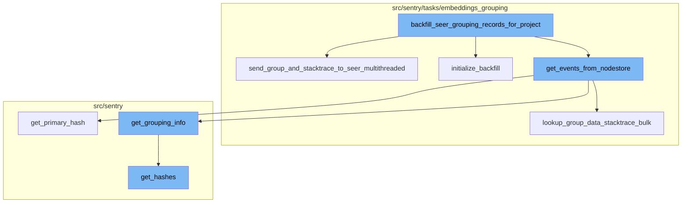
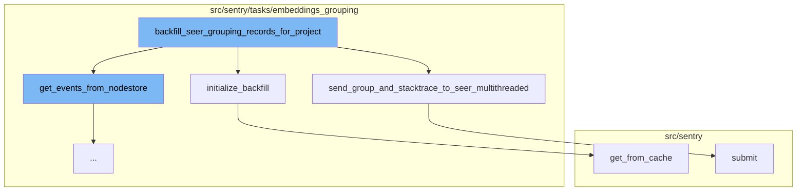
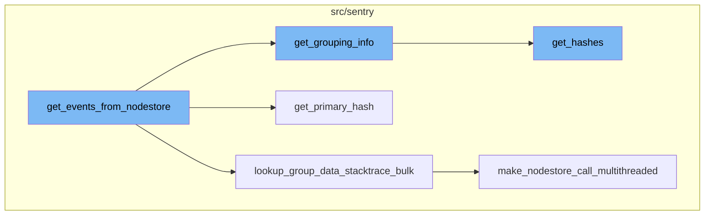

# Overview of backfill_seer_grouping_records_for_project

The `backfill_seer_grouping_records_for_project` function is a task that backfills the seer grouping_records table. It takes in parameters such as the current project id, last processed group index, cohort, and others. It starts by logging the task details and then initializes the backfill process.

# Initialization of Backfill

The initialization of the backfill process is handled by the `initialize_backfill` function. It logs the start of the backfill process, gets the project from cache, checks if the feature is enabled for the project, and gets the last processed group index and project index from redis or the input parameters.

# Fetching Events from Nodestore

The `get_events_from_nodestore` function retrieves events from the nodestore, processes them, and prepares the data for further steps. It calls `lookup_group_data_stacktrace_bulk` to get the events, then iterates over them to extract grouping information and primary hash.

# Sending Group and Stacktrace to Seer

The `send_group_and_stacktrace_to_seer_multithreaded` function is used to send group and stacktrace data to seer in a multithreaded manner. It processes chunks of data and stacktrace and posts bulk grouping records.

# Submitting the Message

The `submit` function is used to submit a message. It gets the payload from the message, produces billing outcomes, flags metric received for the project, and submits the message to the next step.



# Flow drill down

First, we'll zoom into this section of the flow:



<SwmSnippet path="/src/sentry/tasks/embeddings_grouping/backfill_seer_grouping_records_for_project.py" line="46">

---

# backfill_seer_grouping_records_for_project

The `backfill_seer_grouping_records_for_project` function is a task that backfills the seer grouping_records table. It takes in parameters such as the current project id, last processed group index, cohort, and others. It starts by logging the task details and then initializes the backfill process. If the feature is not enabled for the project or the project does not exist, it logs the information and calls the next backfill. If the killswitch is enabled, it logs the information and returns. If only delete is set to true, it deletes all seer grouping records for the current project, logs the information, and calls the next backfill. It then gets the current batch of groups from postgres and if there are no groups to backfill, it calls the next backfill. It then gets data from snuba, filters the results, and if there are no groups to backfill that have a snuba row, it calls the next backfill. It then gets events from nodestore and if there are no group hashes, it calls the next backfill. It then sends the group and stacktrace to seer either multithreaded or not based on the options. If the seer response is not successful, it logs the information and returns. It then updates the groups and calls the next backfill.

```python
def backfill_seer_grouping_records_for_project(
    current_project_id: int,
    last_processed_group_index_input: int | None,
    cohort: str | list[int] | None = None,
    last_processed_project_index_input: int | None = None,
    only_delete=False,
    *args: Any,
    **kwargs: Any,
) -> None:
    """
    Task to backfill seer grouping_records table.
    Pass in last_processed_group_index = None if calling for the first time. This function will spawn
    child tasks that will pass the last_processed_group_index
    """
    redis_client = redis.redis_clusters.get(settings.SENTRY_MONITORS_REDIS_CLUSTER)

    logger.info(
        "backfill_seer_grouping_records",
        extra={
            "current_project_id": current_project_id,
            "last_processed_group_index": last_processed_group_index_input,
```

---

</SwmSnippet>

<SwmSnippet path="/src/sentry/tasks/embeddings_grouping/utils.py" line="359">

---

# send_group_and_stacktrace_to_seer_multithreaded

The `send_group_and_stacktrace_to_seer_multithreaded` function is used to send group and stacktrace data to seer in a multithreaded manner. It processes chunks of data and stacktrace and posts bulk grouping records. It then aggregates the responses from seer and returns the aggregated response.

```python
def send_group_and_stacktrace_to_seer_multithreaded(
    groups_to_backfill_with_no_embedding_has_snuba_row_and_nodestore_row, nodestore_results
):
    def process_chunk(chunk_data, chunk_stacktrace):
        return post_bulk_grouping_records(
            CreateGroupingRecordsRequest(
                group_id_list=chunk_data["group_ids"],
                data=chunk_data["data"],
                stacktrace_list=chunk_stacktrace,
            )
        )

    chunk_size = options.get("similarity.backfill_seer_chunk_size")
    chunks = [
        {
            "group_ids": groups_to_backfill_with_no_embedding_has_snuba_row_and_nodestore_row[
                i : i + chunk_size
            ],
            "data": nodestore_results["data"][i : i + chunk_size],
        }
        for i in range(
```

---

</SwmSnippet>

<SwmSnippet path="/src/sentry/tasks/embeddings_grouping/utils.py" line="94">

---

# initialize_backfill

The `initialize_backfill` function is used to initialize the backfill process. It logs the start of the backfill process, gets the project from cache, checks if the feature is enabled for the project, and gets the last processed group index and project index from redis or the input parameters. It then returns the project and the last processed group and project indices.

```python
def initialize_backfill(
    project_id: int,
    cohort: str | list[int] | None,
    last_processed_group_index: int | None,
    last_processed_project_index: int | None,
    redis_client: StrictRedis | RedisCluster,
):
    logger.info(
        "backfill_seer_grouping_records.start",
        extra={
            "project_id": project_id,
            "last_processed_index": last_processed_group_index,
        },
    )
    project = Project.objects.get_from_cache(id=project_id)
    if not features.has("projects:similarity-embeddings-backfill", project):
        raise FeatureError("Project does not have feature")

    if last_processed_group_index is None:
        last_processed_group_index_ret = int(
            redis_client.get(make_backfill_grouping_index_redis_key(project_id)) or 0
```

---

</SwmSnippet>

<SwmSnippet path="/src/sentry/db/models/manager/base.py" line="281">

---

# get_from_cache

The `get_from_cache` function is a wrapper around QuerySet.get which supports caching of the intermediate value. It checks if the cache fields are set, gets the cache key from the input parameters, gets the result from the local cache or django cache, validates the result, and returns the result.

```python
    def get_from_cache(
        self, use_replica: bool = settings.SENTRY_MODEL_CACHE_USE_REPLICA, **kwargs: Any
    ) -> M:
        """
        Wrapper around QuerySet.get which supports caching of the
        intermediate value.  Callee is responsible for making sure
        the cache key is cleared on save.
        """
        if not self.cache_fields:
            raise ValueError("We cannot cache this query. Just hit the database.")

        key, pk_name, value = self._get_cacheable_kv_from_kwargs(kwargs)
        if key not in self.cache_fields and key != pk_name:
            raise ValueError("We cannot cache this query. Just hit the database.")

        cache_key = self.__get_lookup_cache_key(**{key: value})
        local_cache = self._get_local_cache()

        def validate_result(inst: Any) -> M:
            if isinstance(inst, self.model) and (key != pk_name or int(value) == inst.pk):
                return inst
```

---

</SwmSnippet>

<SwmSnippet path="/src/sentry/ingest/billing_metrics_consumer.py" line="77">

---

# submit

The `submit` function is used to submit a message. It gets the payload from the message, produces billing outcomes, flags metric received for the project, and submits the message to the next step.

```python
    def submit(self, message: Message[KafkaPayload]) -> None:
        assert not self.__closed

        payload = self._get_payload(message)

        self._produce_billing_outcomes(payload)
        self._flag_metric_received_for_project(payload)

        self.__next_step.submit(message)
```

---

</SwmSnippet>

Now, lets zoom into this section of the flow:



<SwmSnippet path="/src/sentry/tasks/embeddings_grouping/utils.py" line="274">

---

# get_events_from_nodestore

The `get_events_from_nodestore` function is the starting point of the flow. It retrieves events from the nodestore, processes them, and prepares the data for further steps. It calls `lookup_group_data_stacktrace_bulk` to get the events, then iterates over them to extract grouping information and primary hash. If the event data is valid, it is added to the `group_data` and `stacktrace_strings` lists. The function returns a tuple containing the group data, stacktrace strings, and a dictionary mapping group ids to hashes.

```python
def get_events_from_nodestore(
    project, snuba_results, groups_to_backfill_with_no_embedding_has_snuba_row
):
    nodestore_events = lookup_group_data_stacktrace_bulk(project, snuba_results)
    # If nodestore returns no data
    if len(nodestore_events) == 0:
        logger.info(
            "tasks.backfill_seer_grouping_records.no_data",
            extra={
                "project_id": project.id,
                "group_id_batch": json.dumps(groups_to_backfill_with_no_embedding_has_snuba_row),
            },
        )
        return (
            GroupStacktraceData(data=[], stacktrace_list=[]),
            {},
        )

    group_data = []
    stacktrace_strings = []
    invalid_event_group_ids = []
```

---

</SwmSnippet>

<SwmSnippet path="/src/sentry/tasks/embeddings_grouping/utils.py" line="514">

---

# lookup_group_data_stacktrace_bulk

The `lookup_group_data_stacktrace_bulk` function is responsible for fetching event data from the nodestore in bulk. It uses either a multithreaded approach or a single-threaded approach based on the configuration. The function returns a dictionary mapping group ids to events.

```python
def lookup_group_data_stacktrace_bulk(
    project: Project, rows: list[GroupEventRow]
) -> dict[int, Event]:
    project_id = project.id
    node_id_to_group_data = {
        Event.generate_node_id(project_id, event_id=row["event_id"]): (
            row["event_id"],
            row["group_id"],
        )
        for row in rows
    }

    groups_to_event = {}

    if options.get("similarity.backfill_nodestore_use_multithread"):
        bulk_data = make_nodestore_call_multithreaded(project, list(node_id_to_group_data.keys()))
    else:
        bulk_data = _make_nodestore_call(project, list(node_id_to_group_data.keys()))

    with sentry_sdk.start_span(op="lookup_event_bulk.loop", description="lookup_event_bulk.loop"):
        for node_id, data in bulk_data.items():
```

---

</SwmSnippet>

<SwmSnippet path="/src/sentry/grouping/grouping_info.py" line="15">

---

# get_grouping_info

The `get_grouping_info` function is used to fetch grouping information for an event. It first retrieves the stored hashes for the event, then determines the grouping variants based on the event type. The function returns a dictionary containing the grouping information.

```python
def get_grouping_info(
    config_name: str | None, project: Project, event: Event
) -> dict[str, dict[str, Any]]:
    # We always fetch the stored hashes here.  The reason for this is
    # that we want to show in the UI if the forced grouping algorithm
    # produced hashes that would normally also appear in the event.
    hashes = event.get_hashes()

    try:
        if event.get_event_type() == "transaction":
            # Transactions events are grouped using performance detection. They
            # are not subject to grouping configs, and the only relevant
            # grouping variant is `PerformanceProblemVariant`.

            problems = EventPerformanceProblem.fetch_multi([(event, h) for h in hashes.hashes])

            # Create a variant for every problem associated with the event
            # TODO: Generate more unique keys, in case this event has more than
            # one problem of a given type
            variants: dict[str, BaseVariant] = {
                problem.problem.type.slug: PerformanceProblemVariant(problem)
```

---

</SwmSnippet>

<SwmSnippet path="/src/sentry/eventstore/models.py" line="479">

---

# get_primary_hash

The `get_primary_hash` function is used to fetch the primary hash for an event. It first retrieves the hashes for the event, then returns the first hierarchical hash if available, otherwise it returns the first flat hash. If no hashes are available, it logs an error and returns None.

```python
    def get_primary_hash(self) -> str | None:
        hashes = self.get_hashes()

        if hashes.hierarchical_hashes:
            return hashes.hierarchical_hashes[0]

        if hashes.hashes:
            return hashes.hashes[0]

        # Temporary investigative measure, to try to figure out when this would happen
        logger.info(
            "Event with no primary hash",
            stack_info=True,
            extra={
                "event_id": self.event_id,
                "event_type": type(self),
                "group_id": getattr(self, "group_id", None),
                "project_id": self.project_id,
            },
        )
        return None
```

---

</SwmSnippet>

<SwmSnippet path="/src/sentry/tasks/embeddings_grouping/utils.py" line="494">

---

# make_nodestore_call_multithreaded

The `make_nodestore_call_multithreaded` function is used to fetch data from the nodestore in a multithreaded manner. It splits the node keys into chunks and processes each chunk in a separate thread. The function returns a dictionary containing the fetched data.

```python
def make_nodestore_call_multithreaded(project, node_keys):
    def process_chunk(chunk):
        return _make_nodestore_call(project, chunk)

    chunk_size = options.get("similarity.backfill_nodestore_chunk_size")
    chunks = [node_keys[i : i + chunk_size] for i in range(0, len(node_keys), chunk_size)]

    bulk_data = {}
    with ThreadPoolExecutor(
        max_workers=options.get("similarity.backfill_nodestore_threads")
    ) as executor:
        future_to_chunk = {executor.submit(process_chunk, chunk): chunk for chunk in chunks}
        for future in as_completed(future_to_chunk):
            bulk_data.update(future.result())

    return bulk_data
```

---

</SwmSnippet>

<SwmSnippet path="/src/sentry/eventstore/models.py" line="328">

---

# get_hashes

The `get_hashes` function is used to fetch all information necessary to group an event into issues. It returns two lists of hashes, `flat_hashes` and `hierarchical_hashes`. The function first checks if hashes are stored in the event data, if not, it generates new ones. The function returns a `CalculatedHashes` object containing the hashes, tree labels, and variants.

```python
    def get_hashes(self, force_config: StrategyConfiguration | None = None) -> CalculatedHashes:
        """
        Returns _all_ information that is necessary to group an event into
        issues. It returns two lists of hashes, `(flat_hashes, hierarchical_hashes)`:

        1. First, `hierarchical_hashes` is walked
           *backwards* (end to start) until one hash has been found that matches
           an existing group. Only *that* hash gets a GroupHash instance that is
           associated with the group.

        2. If no group was found, an event should be sorted into a group X, if
           there is a GroupHash matching *any* of `flat_hashes`. Hashes that do
           not yet have a GroupHash model get one and are associated with the same
           group (unless they already belong to another group).

           This is how regular grouping works.

        Whichever group the event lands in is associated with exactly one
        GroupHash corresponding to an entry in `hierarchical_hashes`, and an
        arbitrary amount of hashes from `flat_hashes` depending on whether some
        of those hashes have GroupHashes already assigned to other groups (and
```

---

</SwmSnippet>

&nbsp;

*This is an auto-generated document by Swimm AI 🌊 and has not yet been verified by a human*

<SwmMeta version="3.0.0" repo-id="Z2l0aHViJTNBJTNBc2VudHJ5LWRlbW8lM0ElM0FTd2ltbS1EZW1v" repo-name="sentry-demo" doc-type="flows"><sup>Powered by [Swimm](/)</sup></SwmMeta>
