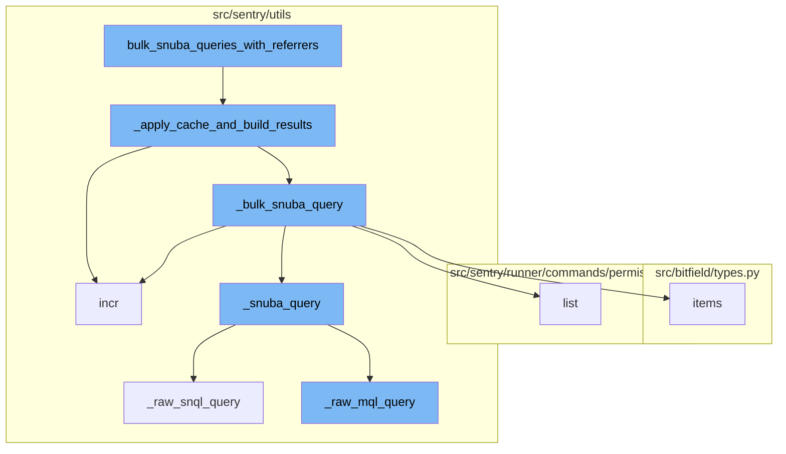
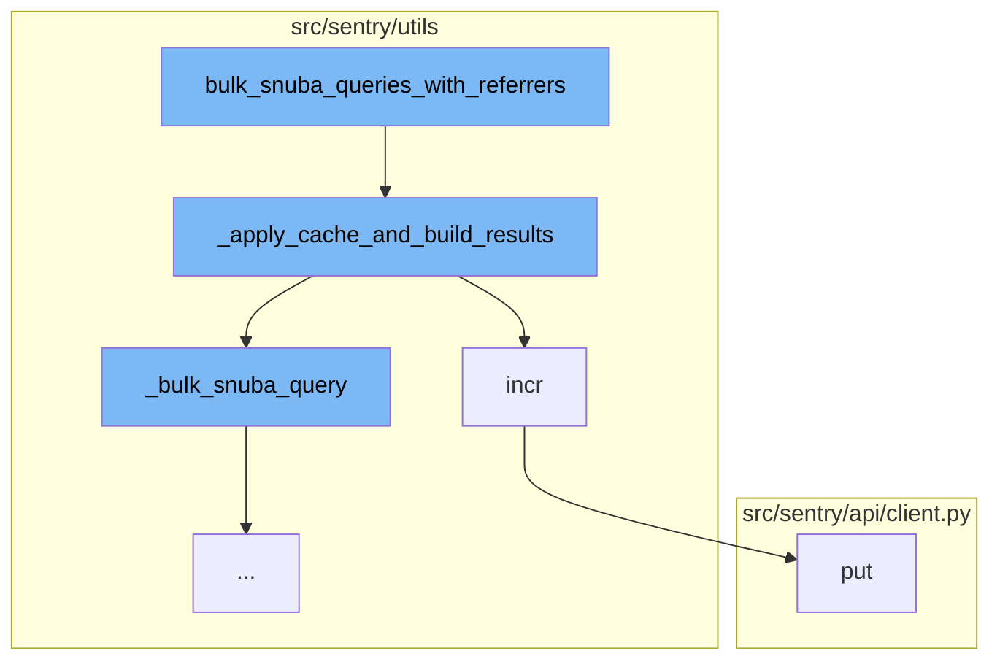
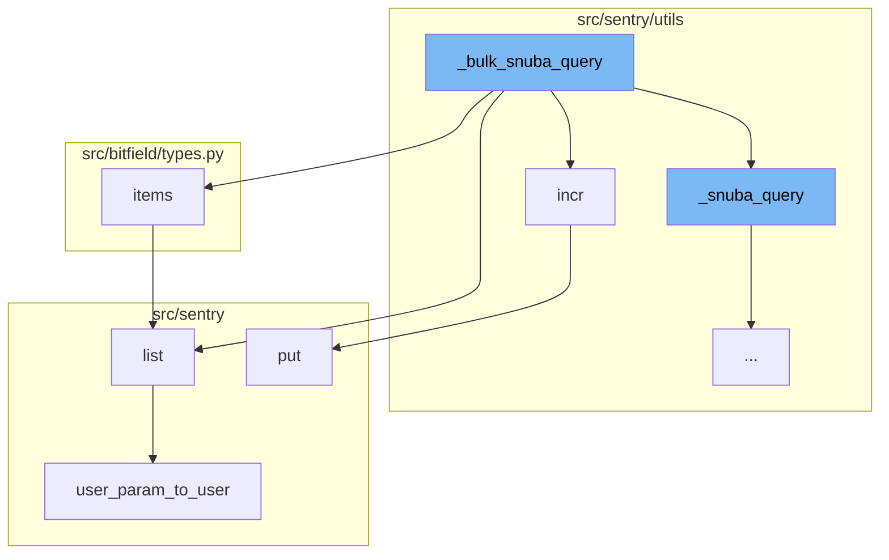
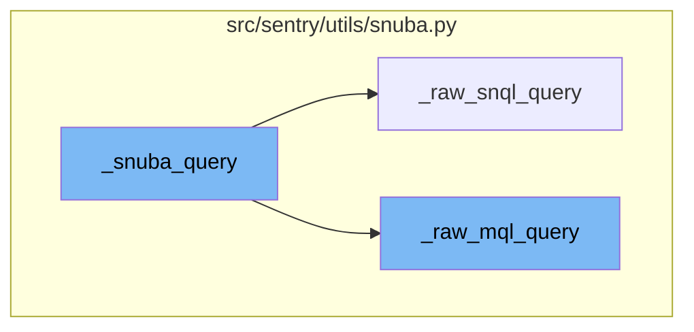

# Overview

The `bulk_snuba_queries_with_referrers` function is a key component in the Sentry application. It is responsible for running multiple queries in Snuba, a column-oriented, open-source, distributed data warehouse. This function accepts requests for either MQL or SnQL queries and runs them on the appropriate endpoint. Each request is paired with a referrer to be used for that request. The function also handles the 'consistent' override option if it is present.

# Flow of the Function

The flow of the function starts with the `bulk_snuba_queries_with_referrers` function, which is the main entry point for running queries in Snuba. It then calls the `_apply_cache_and_build_results` function, which applies caching to the results and builds the final result set. If caching is enabled, it retrieves the cache keys for the requests and gets the cached data. If the cached result is not found, it increments the cache miss metric and adds the request to the query list. If the cached result is found, it increments the cache hit metric and adds the result to the results list. If caching is not enabled, it simply adds all requests to the query list. Finally, it runs the queries that were not found in the cache, stores the results in the cache, and adds them to the results list.

# Further Steps

The flow then moves to the `_bulk_snuba_query` function, which takes a sequence of Snuba requests and executes them. If there is more than one request, it uses a thread pool to execute them concurrently. The results of these queries are then processed and returned. The `incr` function is used within `_apply_cache_and_build_results` to increment the cache hit or miss metric. It adds the metric increment operation to a queue to be processed later. The `put` function is used within `_apply_cache_and_build_results` to store the query results in the cache.

# Final Steps

The `_snuba_query` function is a key part of the bulk query process. It takes in parameters including scopes and a SnubaRequest. The function retrieves the referrer from the headers of the request and sets it as a tag for the sentry_sdk. Depending on the type of the request query, it calls either `_raw_mql_query` or `_raw_snql_query` functions and returns the result.



# Flow drill down

First, we'll zoom into this section of the flow:



<SwmSnippet path="/src/sentry/utils/snuba.py" line="921">

---

# bulk_snuba_queries_with_referrers

The `bulk_snuba_queries_with_referrers` function is the main entry point for running queries in Snuba. It accepts requests for either MQL or SnQL queries and runs them on the appropriate endpoint. Each request is paired with a referrer to be used for that request. The function also handles the 'consistent' override option if it is present.

```python
def bulk_snuba_queries_with_referrers(
    requests_with_referrers: list[tuple[Request, str | None]],
    use_cache: bool = False,
    query_source: (
        QuerySource | None
    ) = None,  # TODO: @athena Make this field required after updated all the callsites
) -> ResultSet:
    """
    The main entrypoint to running queries in Snuba. This function accepts
    Requests for either MQL or SnQL queries and runs them on the appropriate endpoint.

    Every request is paired with a referrer to be used for that request.
    """

    if "consistent" in OVERRIDE_OPTIONS:
        for request, _ in requests_with_referrers:
            request.flags.consistent = OVERRIDE_OPTIONS["consistent"]

    for request, referrer in requests_with_referrers:
        if referrer or query_source:
            request.tenant_ids = request.tenant_ids or dict()
```

---

</SwmSnippet>

<SwmSnippet path="/src/sentry/utils/snuba.py" line="993">

---

## \_apply_cache_and_build_results

The `_apply_cache_and_build_results` function is called within `bulk_snuba_queries_with_referrers`. It applies caching to the results and builds the final result set. If caching is enabled, it retrieves the cache keys for the requests and gets the cached data. If the cached result is not found, it increments the cache miss metric and adds the request to the query list. If the cached result is found, it increments the cache hit metric and adds the result to the results list. If caching is not enabled, it simply adds all requests to the query list. Finally, it runs the queries that were not found in the cache, stores the results in the cache, and adds them to the results list.

```python
def _apply_cache_and_build_results(
    snuba_requests: Sequence[SnubaRequest],
    use_cache: bool | None = False,
) -> ResultSet:
    parent_api: str = "<missing>"
    scope = sentry_sdk.Scope.get_current_scope()
    if scope.transaction:
        parent_api = scope.transaction.name

    # Store the original position of the query so that we can maintain the order
    snuba_requests_list: list[tuple[int, SnubaRequest]] = []
    for i, snuba_request in enumerate(snuba_requests):
        snuba_request.request.parent_api = parent_api
        snuba_requests_list.append((i, snuba_request))

    results = []

    to_query: list[tuple[int, SnubaRequest, str | None]] = []

    if use_cache:
        cache_keys = [
```

---

</SwmSnippet>

<SwmSnippet path="/src/sentry/utils/metrics.py" line="101">

---

### incr

The `incr` function is used within `_apply_cache_and_build_results` to increment the cache hit or miss metric. It adds the metric increment operation to a queue to be processed later.

```python
    def incr(
        self,
        key: str,
        instance: str | None = None,
        tags: Tags | None = None,
        amount: int = 1,
        sample_rate: float = settings.SENTRY_METRICS_SAMPLE_RATE,
    ) -> None:
        if not self._started:
            self._start()
        self.q.put((key, instance, tags, amount, sample_rate))
```

---

</SwmSnippet>

<SwmSnippet path="/src/sentry/api/client.py" line="119">

---

### put

The `put` function is used within `_apply_cache_and_build_results` to store the query results in the cache.

```python
    def put(self, *args, **kwargs):
        return self.request("PUT", *args, **kwargs)
```

---

</SwmSnippet>

Now, lets zoom into this section of the flow:



<SwmSnippet path="/src/sentry/utils/snuba.py" line="1045">

---

# Bulk Snuba Queries with Referrers

The `_bulk_snuba_query` function is the starting point of the flow. It takes a sequence of Snuba requests and executes them. If there is more than one request, it uses a thread pool to execute them concurrently. The results of these queries are then processed and returned.

```python
def _bulk_snuba_query(snuba_requests: Sequence[SnubaRequest]) -> ResultSet:
    snuba_requests_list = list(snuba_requests)

    with sentry_sdk.start_span(op="snuba_query") as span:
        span.set_tag("snuba.num_queries", len(snuba_requests_list))

        if len(snuba_requests_list) > 1:
            query_results = list(
                _query_thread_pool.map(
                    _snuba_query,
                    [
                        (
                            sentry_sdk.Scope.get_isolation_scope().fork(),
                            sentry_sdk.Scope.get_current_scope().fork(),
                            snuba_request,
                        )
                        for snuba_request in snuba_requests_list
                    ],
                )
            )
        else:
```

---

</SwmSnippet>

<SwmSnippet path="/src/sentry/utils/metrics.py" line="101">

---

The `incr` function is called within `_bulk_snuba_query`. It is used to increment a metric, which can be useful for tracking the number of queries or other performance-related metrics.

```python
    def incr(
        self,
        key: str,
        instance: str | None = None,
        tags: Tags | None = None,
        amount: int = 1,
        sample_rate: float = settings.SENTRY_METRICS_SAMPLE_RATE,
    ) -> None:
        if not self._started:
            self._start()
        self.q.put((key, instance, tags, amount, sample_rate))
```

---

</SwmSnippet>

<SwmSnippet path="/src/bitfield/types.py" line="223">

---

The `items` function is used to get a list of items from a bitfield. This could be used to process the results of the Snuba queries.

```python
        return iter(self._keys)

    def items(self):
        return list(self.iteritems())
```

---

</SwmSnippet>

<SwmSnippet path="/src/sentry/runner/commands/permissions.py" line="76">

---

The `list` function is used to list permissions for a user. This could be used to check if the user has the necessary permissions to perform the Snuba queries.

```python
def list(user: str) -> None:
    "List permissions for a user."
    from sentry.models.userpermission import UserPermission

    user_inst = user_param_to_user(user)
    up_list = UserPermission.objects.filter(user=user_inst).order_by("permission")
    click.echo(f"Permissions for `{user_inst.username}`:")
    for permission in up_list:
        click.echo(f"- {permission.permission}")
```

---

</SwmSnippet>

<SwmSnippet path="/src/sentry/runner/commands/permissions.py" line="14">

---

The `user_param_to_user` function is used to convert a user parameter to a user object. This could be used to get the user object for the `list` function.

```python
def user_param_to_user(value: str) -> User:
    from sentry.utils.auth import find_users

    users = find_users(value)
    if not users:
        raise click.ClickException(f"No user matching `{value}`")
    if len(users) > 1:
        raise click.ClickException(f"Found more than one user matching `{value}`")
    user = users[0]
    if not user.is_superuser:
        raise click.ClickException(f"User `{user.username}` does not have superuser status")
    return user
```

---

</SwmSnippet>

<SwmSnippet path="/src/sentry/api/client.py" line="119">

---

The `put` function is used to make a PUT request. This could be used to update the state of the system after the Snuba queries have been executed.

```python
    def put(self, *args, **kwargs):
        return self.request("PUT", *args, **kwargs)
```

---

</SwmSnippet>

Now, lets zoom into this section of the flow:



<SwmSnippet path="/src/sentry/utils/snuba.py" line="1167">

---

# \_snuba_query Function

The `_snuba_query` function is a key part of the bulk query process. It takes in parameters including scopes and a SnubaRequest. The function retrieves the referrer from the headers of the request and sets it as a tag for the sentry_sdk. Depending on the type of the request query, it calls either `_raw_mql_query` or `_raw_snql_query` functions and returns the result.

```python
def _snuba_query(
    params: tuple[
        sentry_sdk.Scope,
        sentry_sdk.Scope,
        SnubaRequest,
    ],
) -> RawResult:
    # Eventually we can get rid of this wrapper, but for now it's cleaner to unwrap
    # the params here than in the calling function. (bc of thread .map)
    thread_isolation_scope, thread_current_scope, snuba_request = params
    with sentry_sdk.scope.use_isolation_scope(thread_isolation_scope):
        with sentry_sdk.scope.use_scope(thread_current_scope):
            headers = snuba_request.headers
            request = snuba_request.request
            try:
                referrer = headers.get("referer", "unknown")

                if SNUBA_INFO:
                    import pprint

                    log_snuba_info(f"{referrer}.body:\n {pprint.pformat(request.to_dict())}")
```

---

</SwmSnippet>

<SwmSnippet path="/src/sentry/utils/snuba.py" line="1230">

---

# \_raw_snql_query Function

The `_raw_snql_query` function is called when the request query is not of type MetricsQuery. It serializes the request, sets the referrer as a tag for the sentry_sdk, and sends a POST request to the Snuba service. The response from the Snuba service is returned.

```python
def _raw_snql_query(request: Request, headers: Mapping[str, str]) -> urllib3.response.HTTPResponse:
    # Enter hub such that http spans are properly nested
    with timer("snql_query"):
        referrer = headers.get("referer", "<unknown>")

        serialized_req = request.serialize()
        with sentry_sdk.start_span(op="snuba_snql.validation", description=referrer) as span:
            span.set_tag("snuba.referrer", referrer)
            body = serialized_req

        with sentry_sdk.start_span(op="snuba_snql.run", description=serialized_req) as span:
            span.set_tag("snuba.referrer", referrer)
            return _snuba_pool.urlopen(
                "POST", f"/{request.dataset}/snql", body=body, headers=headers
            )
```

---

</SwmSnippet>

<SwmSnippet path="/src/sentry/utils/snuba.py" line="1212">

---

# \_raw_mql_query Function

The `_raw_mql_query` function is called when the request query is of type MetricsQuery. Similar to `_raw_snql_query`, it serializes the request, sets the referrer as a tag for the sentry_sdk, and sends a POST request to the Snuba service. The response from the Snuba service is returned.

```python
def _raw_mql_query(request: Request, headers: Mapping[str, str]) -> urllib3.response.HTTPResponse:
    # Enter hub such that http spans are properly nested
    with timer("mql_query"):
        referrer = headers.get("referer", "unknown")

        # TODO: This can be changed back to just `serialize` after we remove SnQL support for MetricsQuery
        serialized_req = request.serialize()
        with sentry_sdk.start_span(op="snuba_mql.validation", description=referrer) as span:
            span.set_tag("snuba.referrer", referrer)
            body = serialized_req

        with sentry_sdk.start_span(op="snuba_mql.run", description=serialized_req) as span:
            span.set_tag("snuba.referrer", referrer)
            return _snuba_pool.urlopen(
                "POST", f"/{request.dataset}/mql", body=body, headers=headers
            )
```

---

</SwmSnippet>

&nbsp;

*This is an auto-generated document by Swimm AI 🌊 and has not yet been verified by a human*

<SwmMeta version="3.0.0" repo-id="Z2l0aHViJTNBJTNBc2VudHJ5LWRlbW8lM0ElM0FTd2ltbS1EZW1v" repo-name="sentry-demo" doc-type="flows"><sup>Powered by [Swimm](/)</sup></SwmMeta>
