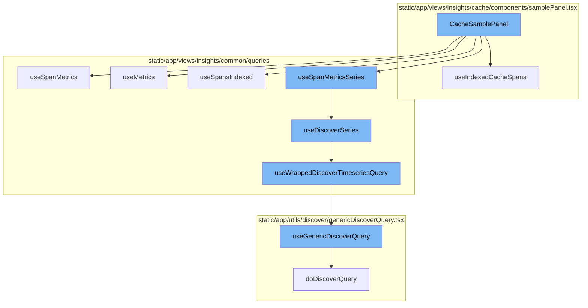
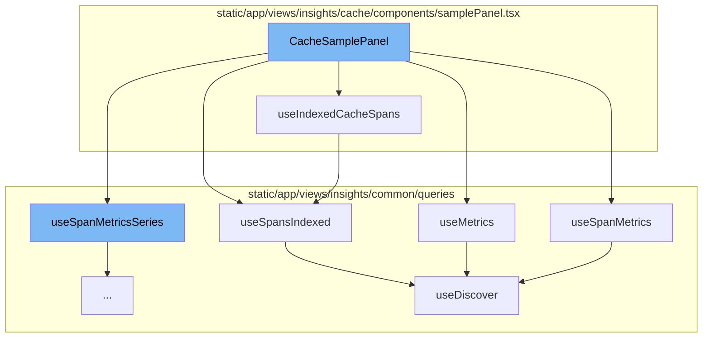
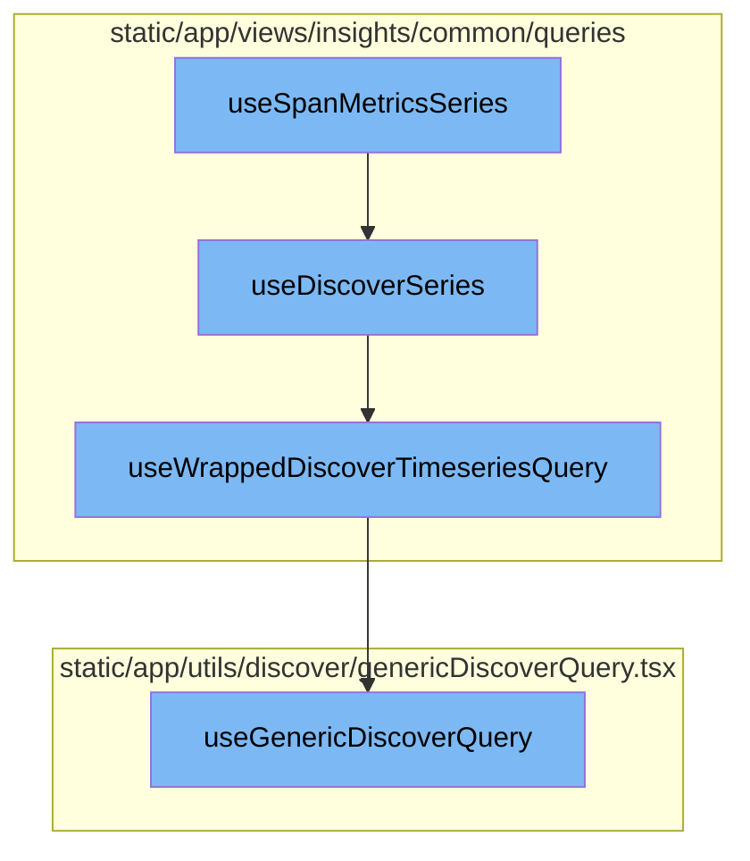

# CacheSamplePanel Overview

The `CacheSamplePanel` is a component that manages the display and interaction of cache samples. It utilizes various hooks and functions to fetch and manipulate data, and to handle user interactions such as search and filter changes.

## useIndexedCacheSpans Function

`useIndexedCacheSpans` is a custom hook used within `CacheSamplePanel` to fetch indexed cache spans. It takes in a boolean indicating whether the cache hit and a limit number, and returns the result of the `useSpansIndexed` function with the appropriate parameters.

## useSpanMetrics Function

`useSpanMetrics` is a custom hook used within `CacheSamplePanel` to fetch span metrics. It uses the `useDiscover` function with the `DiscoverDatasets.SPANS_METRICS` dataset.

## useMetrics Function

`useMetrics` is another custom hook used within `CacheSamplePanel` to fetch metrics. It uses the `useDiscover` function with the `DiscoverDatasets.METRICS` dataset.

## useSpansIndexed Function

`useSpansIndexed` is a custom hook used within `useIndexedCacheSpans` to fetch indexed spans. It uses the `useDiscover` function with the `DiscoverDatasets.SPANS_INDEXED` dataset.

## useDiscover Function

`useDiscover` is a custom hook used within `useSpanMetrics`, `useMetrics`, and `useSpansIndexed` to fetch data. It takes in options, a dataset, and a referrer, and returns the result of the `useWrappedDiscoverQuery` function with the appropriate parameters.

## useSpanMetricsSeries Function

The `useSpanMetricsSeries` function is a hook that wraps around the `useDiscoverSeries` function. It is used to fetch span metrics data series from the Discover datasets.

## useDiscoverSeries Function

The `useDiscoverSeries` function is a hook that fetches metrics series data from the Discover datasets. It constructs an event view based on the provided options and page filters, and then uses the `useWrappedDiscoverTimeseriesQuery` function to fetch the data.

## useWrappedDiscoverTimeseriesQuery Function

The `useWrappedDiscoverTimeseriesQuery` function is a hook that wraps around the `useGenericDiscoverQuery` function. It fetches timeseries data from the Discover datasets. It constructs a request payload based on the event view and other parameters, and then uses the `useGenericDiscoverQuery` function to fetch the data.

## useGenericDiscoverQuery Function

The `useGenericDiscoverQuery` function is a hook that fetches data from the Discover datasets. It constructs a URL and a request payload based on the provided parameters, and then sends a request to the API to fetch the data.



# Flow drill down

First, we'll zoom into this section of the flow:



<SwmSnippet path="/static/app/views/insights/cache/components/samplePanel.tsx" line="64">

---

# CacheSamplePanel Function

The `CacheSamplePanel` function is a component that handles the display and interaction of cache samples. It uses various hooks and functions to fetch and manipulate data, and to handle user interactions such as search and filter changes.

```tsx
export function CacheSamplePanel() {
  const router = useRouter();
  const location = useLocation();
  const organization = useOrganization();
  const {selection} = usePageFilters();
  const supportedTags = useSpanFieldSupportedTags({
    excludedTags: [SpanIndexedField.CACHE_HIT],
  });

  const query = useLocationQuery({
    fields: {
      project: decodeScalar,
      transaction: decodeScalar,
      statusClass: decodeScalar,
      spanSearchQuery: decodeScalar,
    },
  });

  const [highlightedSpanId, setHighlightedSpanId] = useDebouncedState<string | undefined>(
    undefined,
    [],
```

---

</SwmSnippet>

<SwmSnippet path="/static/app/views/insights/cache/components/samplePanel.tsx" line="159">

---

## useIndexedCacheSpans Function

`useIndexedCacheSpans` is a custom hook used within `CacheSamplePanel` to fetch indexed cache spans. It takes in a boolean indicating whether the cache hit and a limit number, and returns the result of the `useSpansIndexed` function with the appropriate parameters.

```tsx
  const useIndexedCacheSpans = (
    isCacheHit: SpanIndexedResponse['cache.hit'],
    limit: number
  ) =>
    useSpansIndexed(
      {
        search: MutableSearch.fromQueryObject({
          ...sampleFilters,
          ...new MutableSearch(query.spanSearchQuery).filters,
          'cache.hit': isCacheHit,
        }),
        fields: [
          SpanIndexedField.PROJECT,
          SpanIndexedField.TRACE,
          SpanIndexedField.TRANSACTION_ID,
          SpanIndexedField.ID,
          SpanIndexedField.TIMESTAMP,
          SpanIndexedField.SPAN_DESCRIPTION,
          SpanIndexedField.CACHE_HIT,
          SpanIndexedField.SPAN_OP,
          SpanIndexedField.CACHE_ITEM_SIZE,
```

---

</SwmSnippet>

<SwmSnippet path="/static/app/views/insights/common/queries/useDiscover.ts" line="38">

---

## useSpanMetrics Function

`useSpanMetrics` is a custom hook used within `CacheSamplePanel` to fetch span metrics. It uses the `useDiscover` function with the `DiscoverDatasets.SPANS_METRICS` dataset.

```typescript
export const useSpanMetrics = <Fields extends SpanMetricsProperty[]>(
  options: UseMetricsOptions<Fields> = {},
  referrer: string
) => {
  return useDiscover<Fields, SpanMetricsResponse>(
    options,
    DiscoverDatasets.SPANS_METRICS,
    referrer
  );
};
```

---

</SwmSnippet>

<SwmSnippet path="/static/app/views/insights/common/queries/useDiscover.ts" line="49">

---

## useMetrics Function

`useMetrics` is another custom hook used within `CacheSamplePanel` to fetch metrics. It uses the `useDiscover` function with the `DiscoverDatasets.METRICS` dataset.

```typescript
export const useMetrics = <Fields extends MetricsProperty[]>(
  options: UseMetricsOptions<Fields> = {},
  referrer: string
) => {
  return useDiscover<Fields, MetricsResponse>(
    options,
    DiscoverDatasets.METRICS,
    referrer
  );
};
```

---

</SwmSnippet>

<SwmSnippet path="/static/app/views/insights/common/queries/useDiscover.ts" line="27">

---

## useSpansIndexed Function

`useSpansIndexed` is a custom hook used within `useIndexedCacheSpans` to fetch indexed spans. It uses the `useDiscover` function with the `DiscoverDatasets.SPANS_INDEXED` dataset.

```typescript
export const useSpansIndexed = <Fields extends SpanIndexedField[]>(
  options: UseMetricsOptions<Fields> = {},
  referrer: string
) => {
  return useDiscover<Fields, SpanIndexedResponse>(
    options,
    DiscoverDatasets.SPANS_INDEXED,
    referrer
  );
};
```

---

</SwmSnippet>

<SwmSnippet path="/static/app/views/insights/common/queries/useDiscover.ts" line="60">

---

## useDiscover Function

`useDiscover` is a custom hook used within `useSpanMetrics`, `useMetrics`, and `useSpansIndexed` to fetch data. It takes in options, a dataset, and a referrer, and returns the result of the `useWrappedDiscoverQuery` function with the appropriate parameters.

```typescript
const useDiscover = <T extends Extract<keyof ResponseType, string>[], ResponseType>(
  options: UseMetricsOptions<T> = {},
  dataset: DiscoverDatasets,
  referrer: string
) => {
  const {
    fields = [],
    search = undefined,
    sorts = [],
    limit,
    cursor,
    pageFilters: pageFiltersFromOptions,
  } = options;

  const pageFilters = usePageFilters();

  const eventView = getEventView(
    search,
    fields,
    sorts,
    pageFiltersFromOptions ?? pageFilters.selection,
```

---

</SwmSnippet>

Now, lets zoom into this section of the flow:



<SwmSnippet path="/static/app/views/insights/common/queries/useDiscoverSeries.ts" line="30">

---

# useSpanMetricsSeries

The `useSpanMetricsSeries` function is a hook that wraps around the `useDiscoverSeries` function. It is used to fetch span metrics data series from the Discover datasets.

```typescript
export const useSpanMetricsSeries = <Fields extends SpanMetricsProperty[]>(
  options: UseMetricsSeriesOptions<Fields> = {},
  referrer: string
) => {
  return useDiscoverSeries<Fields>(options, DiscoverDatasets.SPANS_METRICS, referrer);
};
```

---

</SwmSnippet>

<SwmSnippet path="/static/app/views/insights/common/queries/useDiscoverSeries.ts" line="56">

---

# useDiscoverSeries

The `useDiscoverSeries` function is a hook that fetches metrics series data from the Discover datasets. It constructs an event view based on the provided options and page filters, and then uses the `useWrappedDiscoverTimeseriesQuery` function to fetch the data.

```typescript
const useDiscoverSeries = <T extends string[]>(
  options: UseMetricsSeriesOptions<T> = {},
  dataset: DiscoverDatasets,
  referrer: string
) => {
  const {search = undefined, yAxis = [], interval = undefined} = options;

  const pageFilters = usePageFilters();

  const eventView = getSeriesEventView(
    search,
    undefined,
    pageFilters.selection,
    yAxis,
    undefined,
    dataset
  );

  if (interval) {
    eventView.interval = interval;
  }
```

---

</SwmSnippet>

<SwmSnippet path="/static/app/views/insights/common/queries/useSpansQuery.tsx" line="63">

---

# useWrappedDiscoverTimeseriesQuery

The `useWrappedDiscoverTimeseriesQuery` function is a hook that wraps around the `useGenericDiscoverQuery` function. It fetches timeseries data from the Discover datasets. It constructs a request payload based on the event view and other parameters, and then uses the `useGenericDiscoverQuery` function to fetch the data.

```tsx
export function useWrappedDiscoverTimeseriesQuery<T>({
  eventView,
  enabled,
  initialData,
  referrer,
  cursor,
  overriddenRoute,
}: {
  eventView: EventView;
  cursor?: string;
  enabled?: boolean;
  initialData?: any;
  overriddenRoute?: string;
  referrer?: string;
}) {
  const location = useLocation();
  const organization = useOrganization();
  const {isReady: pageFiltersReady} = usePageFilters();
  const result = useGenericDiscoverQuery<
    {
      data: any[];
```

---

</SwmSnippet>

<SwmSnippet path="/static/app/utils/discover/genericDiscoverQuery.tsx" line="419">

---

# useGenericDiscoverQuery

The `useGenericDiscoverQuery` function is a hook that fetches data from the Discover datasets. It constructs a URL and a request payload based on the provided parameters, and then sends a request to the API to fetch the data.

```tsx
export function useGenericDiscoverQuery<T, P>(props: Props<T, P>) {
  const api = useApi();
  const {orgSlug, route, options} = props;
  const url = `/organizations/${orgSlug}/${route}/`;
  const apiPayload = getPayload<T, P>(props);

  const res = useQuery<[T, string | undefined, ResponseMeta<T> | undefined], QueryError>(
    [route, apiPayload],
    ({signal: _signal}) =>
      doDiscoverQuery<T>(api, url, apiPayload, {
        queryBatching: props.queryBatching,
        skipAbort: props.skipAbort,
      }),
    options
  );

  return {
    ...res,
    data: res.data?.[0] ?? undefined,
    error: parseError(res.error),
    statusCode: res.data?.[1] ?? undefined,
```

---

</SwmSnippet>

&nbsp;

*This is an auto-generated document by Swimm AI 🌊 and has not yet been verified by a human*

<SwmMeta version="3.0.0" repo-id="Z2l0aHViJTNBJTNBc2VudHJ5LWRlbW8lM0ElM0FTd2ltbS1EZW1v" repo-name="sentry-demo" doc-type="flows"><sup>Powered by [Swimm](/)</sup></SwmMeta>
