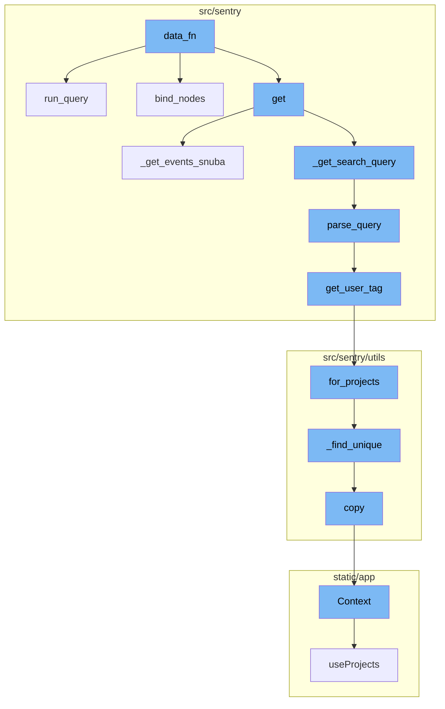
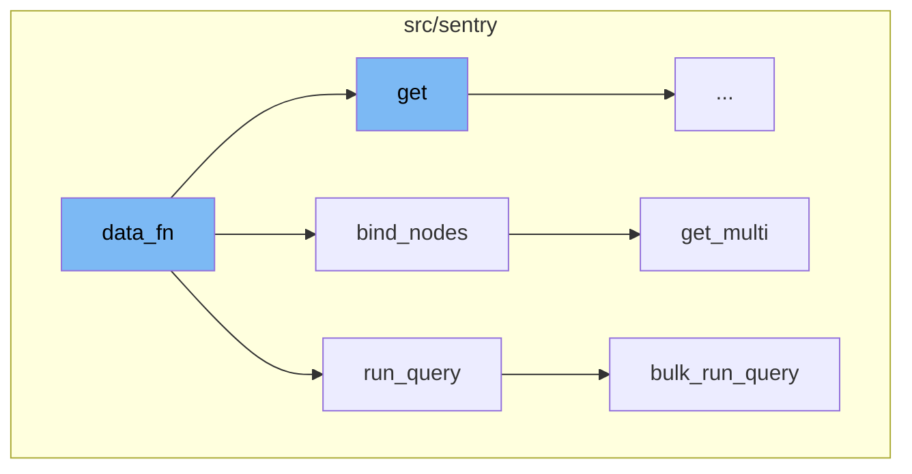
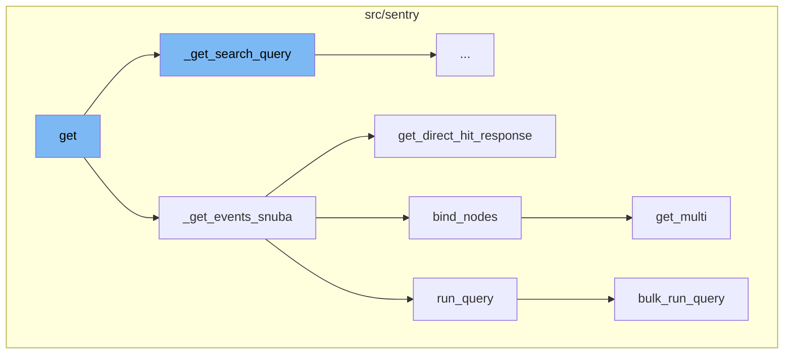
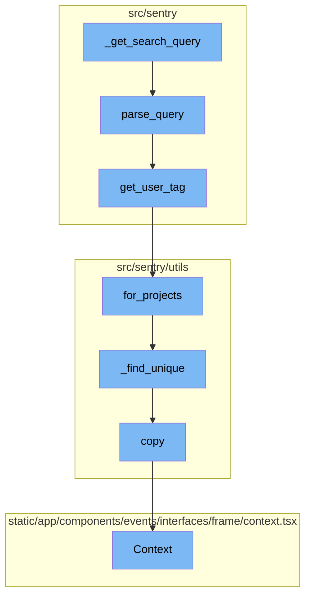

# Overview of data_fn

The `data_fn` function is a key component in the data retrieval and processing flow. It serves as the starting point of the flow, taking an offset and limit as parameters and returning a list of Event objects. The function constructs a query using the `get_query_builder_for_group` function, runs the query using the `run_query` method of the `snuba_query` object, and transforms the results into Event objects. If the `full` flag is set, the `bind_nodes` method is called on the `eventstore.backend` object with the results, fetching all the data blobs for NodeDatas of a list of Event objects with a single multi-get command to nodestore, and binding the returned blobs to the NodeDatas.

# Detailed Flow

The flow begins with the `get` function, which retrieves the search query and calls the `_get_events_snuba` function. This function sets up the parameters for the query, checks for a direct hit response, and if none is found, it calls the `data_fn` function to fetch and process the events. The `data_fn` function constructs a Snuba query using the `get_query_builder_for_group` function, runs the query, and processes the results into a list of `Event` objects. If the `full` parameter in the parent function is set to true, it also binds the results using the `bind_nodes` function from the `eventstore.backend`.

# Query Parsing

The `_get_search_query` function retrieves the raw query from the request. If a raw query exists, it is parsed using the `parse_query` function, otherwise, `None` is returned. The `parse_query` function takes in a query string and returns a structured dictionary of query term values. It tokenizes the query and processes each token based on its key to generate the result dictionary.

# User Tag Fetching

The `get_user_tag` function is used to fetch the user tag for a given key-value pair. It uses the `for_projects` method of the `EventUser` class to fetch the user tag. The `for_projects` function fetches the `EventUser` with a Snuba query that exists within a list of projects and valid `keyword_filters`. It tries to fetch as many unique rows as possible from the query and returns a list of unique `EventUser` objects.

# Unique EventUser Fetching

The `_find_unique` function returns the first instance of an `EventUser` object with a unique tag_value from the Snuba results. It iterates over the data results and appends unique event users to the result list.

# Context Copying

The `copy` function returns a new `Context` object with the same request and a copy of the backends. The `Context` function is a React component that renders the context of a frame in the Sentry UI. It displays the source code, variables, registers, and assembly of the frame based on the provided props.



# Flow drill down

First, we'll zoom into this section of the flow:



<SwmSnippet path="/src/sentry/issues/endpoints/group_events.py" line="120">

---

# data_fn Function

The `data_fn` function is the starting point of the flow. It takes an offset and limit as parameters and returns a list of Event objects. It first builds a query using the `get_query_builder_for_group` function and then runs this query using the `run_query` method of the `snuba_query` object. The results are then transformed into Event objects. If the `full` flag is set, the `bind_nodes` method is called on the `eventstore.backend` object with the results.

```python
        def data_fn(offset: int, limit: int) -> Any:
            try:
                snuba_query = get_query_builder_for_group(
                    request.GET.get("query", ""),
                    params,
                    group,
                    limit=limit,
                    offset=offset,
                    orderby=orderby,
                )
            except InvalidSearchQuery as e:
                raise ParseError(detail=str(e))
            results = snuba_query.run_query(referrer=referrer)
            results = [
                Event(
                    event_id=evt["id"],
                    project_id=evt["project.id"],
                    snuba_data={
                        "event_id": evt["id"],
                        "group_id": evt["issue.id"],
                        "project_id": evt["project.id"],
```

---

</SwmSnippet>

<SwmSnippet path="/src/sentry/snuba/metrics_layer/query.py" line="143">

---

# run_query Function

The `run_query` function is an entry point for executing a metrics query in Snuba. It takes a request as a parameter and returns the result of the `bulk_run_query` function with the request as an argument.

```python
def run_query(request: Request) -> Mapping[str, Any]:
    """
    Entrypoint for executing a metrics query in Snuba.
    """
    return bulk_run_query([request])[0]
```

---

</SwmSnippet>

<SwmSnippet path="/src/sentry/eventstore/base.py" line="264">

---

# bind_nodes Function

The `bind_nodes` function is used to fetch all the data blobs for NodeDatas of a list of Event objects with a single multi-get command to nodestore, and bind the returned blobs to the NodeDatas. It uses the `get_multi` method of the `nodestore.backend` object to fetch the data blobs.

```python
    def bind_nodes(self, object_list: Sequence[Event]) -> None:
        """
        For a list of Event objects, and a property name where we might find an
        (unfetched) NodeData on those objects, fetch all the data blobs for
        those NodeDatas with a single multi-get command to nodestore, and bind
        the returned blobs to the NodeDatas.

        It's not necessary to bind a single Event object since data will be lazily
        fetched on any attempt to access a property.
        """
        sentry_sdk.set_tag("eventstore.backend", "nodestore")

        with sentry_sdk.start_span(op="eventstore.base.bind_nodes"):
            object_node_list = [(i, i.data) for i in object_list if i.data.id]

            # Remove duplicates from the list of nodes to be fetched
            node_ids = list({n.id for _, n in object_node_list})
            if not node_ids:
                return

            node_results = nodestore.backend.get_multi(node_ids)
```

---

</SwmSnippet>

<SwmSnippet path="/src/sentry/nodestore/base.py" line="173">

---

# get_multi Function

The `get_multi` function is used to fetch multiple data blobs from the nodestore. It takes a list of ids as a parameter and returns a dictionary with the ids as keys and the corresponding data blobs as values.

```python
    def get_multi(self, id_list: list[str], subkey: str | None = None) -> dict[str, Any | None]:
        """
        >>> nodestore.get_multi(['key1', 'key2')
        {
            "key1": {"message": "hello world"},
            "key2": {"message": "hello world"}
        }
        """
        with sentry_sdk.start_span(op="nodestore.get_multi") as span:
            span.set_tag("subkey", str(subkey))
            span.set_tag("num_ids", len(id_list))

            if subkey is None:
                cache_items = self._get_cache_items(id_list)
                if len(cache_items) == len(id_list):
                    span.set_tag("result", "from_cache")
                    return cache_items

                uncached_ids = [id for id in id_list if id not in cache_items]
            else:
                uncached_ids = id_list
```

---

</SwmSnippet>

<SwmSnippet path="/src/sentry/snuba/metrics_layer/query.py" line="81">

---

# bulk_run_query Function

The `bulk_run_query` function is used to execute a list of metrics queries in Snuba. It takes a list of requests as a parameter and returns a list of results. Each request is set up and resolved before being passed to the `bulk_snuba_queries` function. The results are then converted and returned.

```python
def bulk_run_query(requests: list[Request]) -> list[Mapping[str, Any]]:
    """
    Entrypoint for executing a list of metrics queries in Snuba.

    This function is used to execute multiple metrics queries in a single request.
    """
    if not requests:
        return []

    queries = []
    for request in requests:
        request, start, end = _setup_metrics_query(request)
        queries.append([request, start, end])

    logging_tags = {"referrer": request.tenant_ids["referrer"] or "unknown", "lang": "mql"}

    for q in queries:
        q[0], reverse_mappings, mappings = _resolve_metrics_query(q[0], logging_tags)
        q.extend([reverse_mappings, mappings])

    try:
```

---

</SwmSnippet>

Now, lets zoom into this section of the flow:



<SwmSnippet path="/src/sentry/issues/endpoints/group_events.py" line="120">

---

# data_fn Function

The `data_fn` function is a local function defined within the `_get_events_snuba` function. It takes two parameters, `offset` and `limit`, and is used to fetch and process event data from Snuba. It constructs a Snuba query using the `get_query_builder_for_group` function, runs the query, and processes the results into a list of `Event` objects. If the `full` parameter in the parent function is set to true, it also binds the results using the `bind_nodes` function from the `eventstore.backend`.

```python
        def data_fn(offset: int, limit: int) -> Any:
            try:
                snuba_query = get_query_builder_for_group(
                    request.GET.get("query", ""),
                    params,
                    group,
                    limit=limit,
                    offset=offset,
                    orderby=orderby,
                )
            except InvalidSearchQuery as e:
                raise ParseError(detail=str(e))
            results = snuba_query.run_query(referrer=referrer)
            results = [
                Event(
                    event_id=evt["id"],
                    project_id=evt["project.id"],
                    snuba_data={
                        "event_id": evt["id"],
                        "group_id": evt["issue.id"],
                        "project_id": evt["project.id"],
```

---

</SwmSnippet>

<SwmSnippet path="/src/sentry/issues/endpoints/group_events.py" line="48">

---

# get Function

The `get` function is the starting point of the flow. It retrieves the search query and calls the `_get_events_snuba` function, which in turn calls the `data_fn` function.

```````````````````````python
    def get(self, request: Request, group: Group) -> Response:
        """
        List an Issue's Events
        ``````````````````````

        This endpoint lists an issue's events.
        :qparam bool full: if this is set to true then the event payload will
                           include the full event body, including the stacktrace.
                           Set to 1 to enable.

        :qparam bool sample: return events in pseudo-random order. This is deterministic,
                             same query will return the same events in the same order.

        :pparam string issue_id: the ID of the issue to retrieve.

        :auth: required
        """

        try:
            environments = get_environments(request, group.project.organization)
            query = self._get_search_query(request, group, environments)
```````````````````````

---

</SwmSnippet>

<SwmSnippet path="/src/sentry/issues/endpoints/group_events.py" line="84">

---

# \_get_events_snuba Function

The `_get_events_snuba` function is responsible for fetching events from Snuba. It sets up the parameters for the query, checks for a direct hit response, and if none is found, it calls the `data_fn` function to fetch and process the events.

```python
    def _get_events_snuba(
        self,
        request: Request,
        group: Group,
        environments: Sequence[Environment],
        query: str | None,
        start: datetime | None,
        end: datetime | None,
    ) -> Response:
        default_end = timezone.now()
        default_start = default_end - timedelta(days=90)
        params: ParamsType = {
            "project_id": [group.project_id],
            "organization_id": group.project.organization_id,
            "start": start if start else default_start,
            "end": end if end else default_end,
        }
        referrer = f"api.group-events.{group.issue_category.name.lower()}"

        direct_hit_resp = get_direct_hit_response(
            request, query, params, f"{referrer}.direct-hit", group
```

---

</SwmSnippet>

<SwmSnippet path="/src/sentry/eventstore/base.py" line="264">

---

# bind_nodes Function

The `bind_nodes` function is called within the `data_fn` function if the `full` parameter is set to true. It fetches all the data blobs for the NodeDatas of the events with a single multi-get command to nodestore, and binds the returned blobs to the NodeDatas.

```python
    def bind_nodes(self, object_list: Sequence[Event]) -> None:
        """
        For a list of Event objects, and a property name where we might find an
        (unfetched) NodeData on those objects, fetch all the data blobs for
        those NodeDatas with a single multi-get command to nodestore, and bind
        the returned blobs to the NodeDatas.

        It's not necessary to bind a single Event object since data will be lazily
        fetched on any attempt to access a property.
        """
        sentry_sdk.set_tag("eventstore.backend", "nodestore")

        with sentry_sdk.start_span(op="eventstore.base.bind_nodes"):
            object_node_list = [(i, i.data) for i in object_list if i.data.id]

            # Remove duplicates from the list of nodes to be fetched
            node_ids = list({n.id for _, n in object_node_list})
            if not node_ids:
                return

            node_results = nodestore.backend.get_multi(node_ids)
```

---

</SwmSnippet>

<SwmSnippet path="/src/sentry/nodestore/base.py" line="173">

---

# get_multi Function

The `get_multi` function is called within the `bind_nodes` function. It fetches the data blobs for the NodeDatas from the nodestore.

```python
    def get_multi(self, id_list: list[str], subkey: str | None = None) -> dict[str, Any | None]:
        """
        >>> nodestore.get_multi(['key1', 'key2')
        {
            "key1": {"message": "hello world"},
            "key2": {"message": "hello world"}
        }
        """
        with sentry_sdk.start_span(op="nodestore.get_multi") as span:
            span.set_tag("subkey", str(subkey))
            span.set_tag("num_ids", len(id_list))

            if subkey is None:
                cache_items = self._get_cache_items(id_list)
                if len(cache_items) == len(id_list):
                    span.set_tag("result", "from_cache")
                    return cache_items

                uncached_ids = [id for id in id_list if id not in cache_items]
            else:
                uncached_ids = id_list
```

---

</SwmSnippet>

<SwmSnippet path="/src/sentry/snuba/metrics_layer/query.py" line="143">

---

# run_query Function

The `run_query` function is the entry point for executing a metrics query in Snuba. It is called within the `data_fn` function to run the constructed Snuba query.

```python
def run_query(request: Request) -> Mapping[str, Any]:
    """
    Entrypoint for executing a metrics query in Snuba.
    """
    return bulk_run_query([request])[0]
```

---

</SwmSnippet>

<SwmSnippet path="/src/sentry/snuba/metrics_layer/query.py" line="81">

---

# bulk_run_query Function

The `bulk_run_query` function is called within the `run_query` function. It is used to execute multiple metrics queries in a single request.

```python
def bulk_run_query(requests: list[Request]) -> list[Mapping[str, Any]]:
    """
    Entrypoint for executing a list of metrics queries in Snuba.

    This function is used to execute multiple metrics queries in a single request.
    """
    if not requests:
        return []

    queries = []
    for request in requests:
        request, start, end = _setup_metrics_query(request)
        queries.append([request, start, end])

    logging_tags = {"referrer": request.tenant_ids["referrer"] or "unknown", "lang": "mql"}

    for q in queries:
        q[0], reverse_mappings, mappings = _resolve_metrics_query(q[0], logging_tags)
        q.extend([reverse_mappings, mappings])

    try:
```

---

</SwmSnippet>

Now, lets zoom into this section of the flow:



<SwmSnippet path="/src/sentry/issues/endpoints/group_events.py" line="158">

---

# \_get_search_query Function

The `_get_search_query` function retrieves the raw query from the request. If a raw query exists, it is parsed using the `parse_query` function, otherwise, `None` is returned.

```python
    def _get_search_query(
        self, request: Request, group: Group, environments: Sequence[Environment]
    ) -> str | None:
        raw_query = request.GET.get("query")

        if raw_query:
            query_kwargs = parse_query([group.project], raw_query, request.user, environments)
            query = query_kwargs.pop("query", None)
        else:
            query = None

        return query
```

---

</SwmSnippet>

<SwmSnippet path="/src/sentry/search/utils.py" line="706">

---

# parse_query Function

The `parse_query` function takes in a query string and returns a structured dictionary of query term values. It tokenizes the query and processes each token based on its key to generate the result dictionary.

```python
def parse_query(
    projects: Sequence[Project],
    query: str,
    user: User | AnonymousUser,
    environments: Sequence[Environment],
) -> dict[str, Any]:
    """| Parses the query string and returns a dict of structured query term values:
    | Required:
    | - tags: dict[str, Union[str, list[str], Any]]: dictionary of tag key-values 'user.id:123'
    | - query: str: the general query portion of the query string
    | Optional:
    | - unassigned: bool: 'is:unassigned'
    | - for_review: bool: 'is:for_review'
    | - linked: bool: 'is:linked'
    | - status: int: 'is:<resolved,unresolved,ignored,muted,reprocessing>'
    | - assigned_to: Optional[Union[User, Team]]: 'assigned:<user or team>'
    | - assigned_or_suggested: Optional[Union[User, Team]]: 'assigned_or_suggested:<user or team>'
    | - bookmarked_by: User: 'bookmarks:<user>'
    | - subscribed_by: User: 'subscribed:<user>'
    | - first_release: Sequence[str]: '<first-release/firstRelease>:1.2.3'
    | - age_from: Union[datetime, bool]: '<age/firstSeen>:-1h'
```

---

</SwmSnippet>

<SwmSnippet path="/src/sentry/search/utils.py" line="34">

---

# get_user_tag Function

The `get_user_tag` function is used to fetch the user tag for a given key-value pair. It uses the `for_projects` method of the `EventUser` class to fetch the user tag.

```python
def get_user_tag(projects: Sequence[Project], key: str, value: str) -> str:
    # TODO(dcramer): do something with case of multiple matches
    try:
        euser = EventUser.for_projects(projects, {key: [value]}, result_limit=1)[0]
    except (KeyError, IndexError):
        return f"{key}:{value}"
    except DataError:
        raise InvalidQuery(f"malformed '{key}:' query '{value}'.")

    return euser.tag_value
```

---

</SwmSnippet>

<SwmSnippet path="/src/sentry/utils/eventuser.py" line="119">

---

# for_projects Function

The `for_projects` function fetches the `EventUser` with a Snuba query that exists within a list of projects and valid `keyword_filters`. It tries to fetch as many unique rows as possible from the query and returns a list of unique `EventUser` objects.

```python
    def for_projects(
        self,
        projects: QuerySet[Project] | list[Project],
        keyword_filters: Mapping[str, list[Any]],
        filter_boolean: BooleanOp = BooleanOp.AND,
        result_offset: int = 0,
        result_limit: int | None = None,
    ) -> list[EventUser]:
        """
        Fetch the EventUser with a Snuba query that exists within a list of projects
        and valid `keyword_filters`. The `keyword_filter` keys are in `KEYWORD_MAP`.
        """
        start_time = time.time()

        oldest_project = min(projects, key=lambda item: item.date_added)

        where_conditions = [
            Condition(Column("project_id"), Op.IN, [p.id for p in projects]),
            Condition(Column("timestamp"), Op.LT, datetime.now()),
            Condition(Column("timestamp"), Op.GTE, oldest_project.date_added),
        ]
```

---

</SwmSnippet>

<SwmSnippet path="/src/sentry/utils/eventuser.py" line="259">

---

# \_find_unique Function

The `_find_unique` function returns the first instance of an `EventUser` object with a unique tag_value from the Snuba results. It iterates over the data results and appends unique event users to the result list.

```python
    def _find_unique(data_results: list[dict[str, Any]], seen_eventuser_tags: set[str]):
        """
        Return the first instance of an EventUser object
        with a unique tag_value from the Snuba results.
        """
        unique_tag_values = seen_eventuser_tags.copy()
        unique_event_users = []

        for euser in [EventUser.from_snuba(item) for item in data_results]:
            tag_value = euser.tag_value
            if tag_value not in unique_tag_values:
                unique_event_users.append(euser)
                unique_tag_values.add(tag_value)

        return unique_event_users, unique_tag_values
```

---

</SwmSnippet>

<SwmSnippet path="/src/sentry/utils/services.py" line="44">

---

# copy Function

The `copy` function returns a new `Context` object with the same request and a copy of the backends.

```python
    def copy(self) -> Context:
        return Context(self.request, self.backends.copy())
```

---

</SwmSnippet>

<SwmSnippet path="/static/app/components/events/interfaces/frame/context.tsx" line="66">

---

# Context Function

The `Context` function is a React component that renders the context of a frame in the Sentry UI. It displays the source code, variables, registers, and assembly of the frame based on the provided props.

```tsx
function Context({
  hasContextVars = false,
  hasContextSource = false,
  hasContextRegisters = false,
  isExpanded = false,
  hasAssembly = false,
  emptySourceNotation = false,
  registers,
  frame,
  event,
  className,
  frameMeta,
  registersMeta,
  platform,
}: Props) {
  const organization = useOrganization();

  const {projects} = useProjects();
  const project = useMemo(
    () => projects.find(p => p.id === event.projectID),
    [projects, event]
```

---

</SwmSnippet>

&nbsp;

*This is an auto-generated document by Swimm AI 🌊 and has not yet been verified by a human*

<SwmMeta version="3.0.0" repo-id="Z2l0aHViJTNBJTNBc2VudHJ5LWRlbW8lM0ElM0FTd2ltbS1EZW1v" repo-name="sentry-demo" doc-type="flows"><sup>Powered by [Swimm](/)</sup></SwmMeta>
