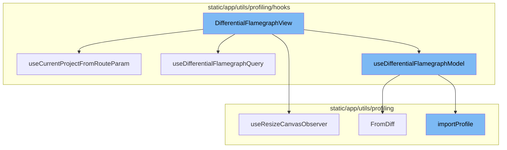
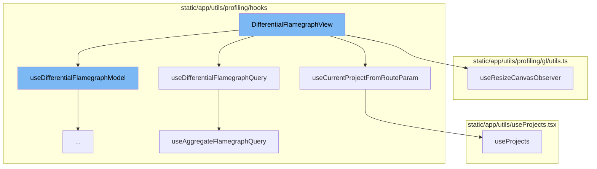
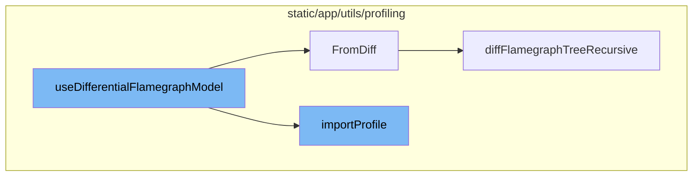

<SwmSnippet path="/static/app/views/profiling/differentialFlamegraph.tsx" line="54">

---

# DifferentialFlamegraphView

The `DifferentialFlamegraphView` function is the main component for rendering the differential flamegraph view. It uses several hooks to manage its state and behavior, including `useLocation`, `usePageFilters`, `useFlamegraphTheme`, `useFlamegraphPreferences`, `useFlamegraphProfiles`, and `useState`.

```tsx
function DifferentialFlamegraphView() {
  const location = useLocation();
  const selection = usePageFilters();
  const flamegraphTheme = useFlamegraphTheme();
  const {colorCoding} = useFlamegraphPreferences();
  const {selectedRoot} = useFlamegraphProfiles();

  const [frameFilterSetting, setFrameFilterSetting] = useState<
    'application' | 'system' | 'all'
  >('all');

  const frameFilter =
    frameFilterSetting === 'application'
      ? applicationFrameOnly
      : frameFilterSetting === 'system'
        ? systemFrameOnly
        : undefined;

  const project = useCurrentProjectFromRouteParam();

  const [negated, setNegated] = useState<boolean>(false);
```

---

</SwmSnippet>

<SwmSnippet path="/static/app/utils/profiling/hooks/useCurrentProjectFromRouteParam.tsx" line="5">

---

## useCurrentProjectFromRouteParam

The `useCurrentProjectFromRouteParam` hook is used within `DifferentialFlamegraphView` to get the current project from the route parameters. It uses the `useParams` and `useProjects` hooks to fetch the project data.

```tsx
export function useCurrentProjectFromRouteParam(): Project | null {
  const params = useParams();
  const projects = useProjects({limit: 1, slugs: [params?.projectId]});
  return projects.projects?.[0] ?? null;
}
```

---

</SwmSnippet>

<SwmSnippet path="/static/app/utils/profiling/hooks/useDifferentialFlamegraphQuery.ts" line="22">

---

## useDifferentialFlamegraphQuery

The `useDifferentialFlamegraphQuery` hook is used within `DifferentialFlamegraphView` to fetch the data for the differential flamegraph. It takes a set of parameters and returns the before and after data for the flamegraph.

```typescript
export function useDifferentialFlamegraphQuery(
  params: DifferentialFlamegraphQueryParameters
): DifferentialFlamegraphQueryResult {
  const sharedAggregateQueryParams: AggregateFlamegraphQueryParameters = useMemo(() => {
    const p: AggregateFlamegraphQueryParameters = {
      transaction: params.transaction,
      environments: params.environments,
      fingerprint: params.fingerprint,
      projects:
        params.projectID === null || isNaN(params.projectID) ? [] : [params.projectID],
      datetime: {},
    };

    return p;
  }, [params.transaction, params.environments, params.projectID, params.fingerprint]);

  const regressionDateRange = useRelativeDateTime({
    anchor: params.breakpoint,
    relativeDays: RELATIVE_DAYS_WINDOW,
  });

```

---

</SwmSnippet>

<SwmSnippet path="/static/app/utils/profiling/gl/utils.ts" line="820">

---

## useResizeCanvasObserver

The `useResizeCanvasObserver` hook is used within `DifferentialFlamegraphView` to handle resizing of the flamegraph canvas. It takes a set of canvases, a `CanvasPoolManager`, a `FlamegraphCanvas`, and a `CanvasView` as parameters and returns the bounds of the canvas.

```typescript
export function useResizeCanvasObserver(
  canvases: (HTMLCanvasElement | null)[],
  canvasPoolManager: CanvasPoolManager,
  canvas: FlamegraphCanvas | null,
  view: CanvasView<any> | null
): Rect {
  const [bounds, setCanvasBounds] = useState<Rect>(Rect.Empty());

  useLayoutEffect(() => {
    if (!canvas || !canvases.length) {
      return undefined;
    }

    if (canvases.some(c => c === null)) {
      return undefined;
    }

    const observer = watchForResize(canvases as HTMLCanvasElement[], entries => {
      const contentRect =
        entries[0].contentRect ?? entries[0].target.getBoundingClientRect();

```

---

</SwmSnippet>

<SwmSnippet path="/static/app/views/profiling/differentialFlamegraph.tsx" line="86">

---

## useDifferentialFlamegraphModel

The `useDifferentialFlamegraphModel` hook is used within `DifferentialFlamegraphView` to create the model for the differential flamegraph. It takes the before and after data from `useDifferentialFlamegraphQuery` and returns the differential flamegraph model.

```tsx
  const differentialFlamegraph = useDifferentialFlamegraphModel({
    before,
    after,
    frameFilter,
    negated,
  });

  const [flamegraphCanvasRef, setFlamegraphCanvasRef] =
```

---

</SwmSnippet>

<SwmSnippet path="/static/app/utils/profiling/hooks/useDifferentialFlamegraphModel.tsx" line="21">

---

# useDifferentialFlamegraphModel Function

The `useDifferentialFlamegraphModel` function is used to generate a differential flamegraph model from API data. It takes in properties from a before and after regression response. The function uses the `importProfile` function to create flamegraphs for the before and after data. It then uses these flamegraphs to create a differential flamegraph model.

```tsx
// Takes API data from a before and after regression response and
// generates a differential flamegraph model.
export function useDifferentialFlamegraphModel(
  props: UseDifferentialFlamegraphModelProps
): {
  afterFlamegraph: Flamegraph | null;
  afterProfileGroup: ProfileGroup | null;
  beforeFlamegraph: Flamegraph | null;
  differentialFlamegraph: DifferentialFlamegraphModel;
} {
  const theme = useFlamegraphTheme();
  const flamegraphPreferences = useFlamegraphPreferences();

  const beforeFlamegraph = useMemo(() => {
    if (!props.before.data) {
      return null;
    }

    const profile = importProfile(props.before.data, '', 'flamegraph', props.frameFilter);
    return new Flamegraph(profile.profiles[0], {
      sort: flamegraphPreferences.sorting,
```

---

</SwmSnippet>

<SwmSnippet path="/static/app/utils/profiling/profile/importProfile.tsx" line="49">

---

# importProfile Function

The `importProfile` function is used to import a profile based on the input provided. It supports various profile types including 'sentry-continuous', 'js-self-profile', 'sentry-sampled', and 'schema'. The function returns a `ProfileGroup` which is used in the `useDifferentialFlamegraphModel` function to create flamegraphs.

```tsx
export function importProfile(
  input: Readonly<Profiling.ProfileInput>,
  traceID: string,
  type: 'flamegraph' | 'flamechart',
  frameFilter?: (frame: Frame) => boolean
): ProfileGroup {
  return Sentry.withScope(scope => {
    const span = Sentry.startInactiveSpan({
      op: 'import',
      name: 'profiles.import',
    });

    try {
      if (isSentryContinuousProfileChunk(input)) {
        scope.setTag('profile.type', 'sentry-continuous');
        return importSentryContinuousProfileChunk(input, traceID, {
          span,
          type,
          frameFilter,
          continuous: true,
        });
```

---

</SwmSnippet>

<SwmSnippet path="/static/app/utils/profiling/differentialFlamegraph.tsx" line="41">

---

# FromDiff Method

The `FromDiff` method is a static method in the `DifferentialFlamegraph` class. It takes in two flamegraphs (before and after), a boolean indicating whether the view is negated, and a theme. The method generates a differential flamegraph that shows how the execution of the program changed between the before and after states.

```tsx
  static FromDiff(
    {before, after}: {after: Flamegraph; before: Flamegraph},
    // When drawing a negated view, the differential flamegraph renders the flamegraph
    // of the previous state, with the colors of the after state. This way we can see
    // how the exectution of the program changed, i.e. see into the future.
    {negated}: {negated: boolean},
    theme: FlamegraphTheme
  ): DifferentialFlamegraph {
    const sourceFlamegraph = negated ? before : after;

    const differentialFlamegraph = new DifferentialFlamegraph(sourceFlamegraph.profile, {
      inverted: after.inverted,
      sort: after.sort,
    });

    const colorMap = new Map<FlamegraphFrame['node'], ColorChannels>();
    const increasedFrames: FlamegraphFrame[] = [];
    const decreasedFrames: FlamegraphFrame[] = [];

    const INCREASED_FRAME_COLOR = theme.COLORS.DIFFERENTIAL_INCREASE;
    const DECREASED_FRAME_COLOR = theme.COLORS.DIFFERENTIAL_DECREASE;
```

---

</SwmSnippet>

<SwmSnippet path="/static/app/utils/profiling/differentialFlamegraph.tsx" line="159">

---

# diffFlamegraphTreeRecursive Function

The `diffFlamegraphTreeRecursive` function is used in the `FromDiff` method to recursively compare the nodes of the before and after flamegraphs. It returns an object containing the weights of the nodes, and lists of new and removed frames. This information is used to color the nodes in the differential flamegraph.

```tsx
export function diffFlamegraphTreeRecursive(
  beforeFlamegraph: Flamegraph,
  afterFlamegraph: Flamegraph,
  negated
): {
  newFrames: FlamegraphFrame[];
  removedFrames: FlamegraphFrame[];
  weights: Map<FlamegraphFrame['node'], {after: number; before: number}>;
} {
  let removedFrames: FlamegraphFrame[] = [];
  let newFrames: FlamegraphFrame[] = [];

  const weights = new Map<FlamegraphFrame['node'], {after: number; before: number}>();

  function visit(beforeFrame: FlamegraphFrame, afterFrame: FlamegraphFrame) {
    weights.set(negated ? beforeFrame.node : afterFrame.node, {
      before: beforeFrame.node.totalWeight,
      after: afterFrame.node.totalWeight,
    });

    const beforeFrameChildrenLength = beforeFrame.children.length;
```

---

</SwmSnippet>



# Flow drill down

First, we'll zoom into this section of the flow:



<SwmSnippet path="/static/app/views/profiling/differentialFlamegraph.tsx" line="54">

---

# DifferentialFlamegraphView

The `DifferentialFlamegraphView` function is the main component for rendering the differential flamegraph view. It uses several hooks to manage its state and behavior, including `useLocation`, `usePageFilters`, `useFlamegraphTheme`, `useFlamegraphPreferences`, `useFlamegraphProfiles`, and `useState`.

```tsx
function DifferentialFlamegraphView() {
  const location = useLocation();
  const selection = usePageFilters();
  const flamegraphTheme = useFlamegraphTheme();
  const {colorCoding} = useFlamegraphPreferences();
  const {selectedRoot} = useFlamegraphProfiles();

  const [frameFilterSetting, setFrameFilterSetting] = useState<
    'application' | 'system' | 'all'
  >('all');

  const frameFilter =
    frameFilterSetting === 'application'
      ? applicationFrameOnly
      : frameFilterSetting === 'system'
        ? systemFrameOnly
        : undefined;

  const project = useCurrentProjectFromRouteParam();

  const [negated, setNegated] = useState<boolean>(false);
```

---

</SwmSnippet>

<SwmSnippet path="/static/app/utils/profiling/hooks/useCurrentProjectFromRouteParam.tsx" line="5">

---

## useCurrentProjectFromRouteParam

The `useCurrentProjectFromRouteParam` hook is used within `DifferentialFlamegraphView` to get the current project from the route parameters. It uses the `useParams` and `useProjects` hooks to fetch the project data.

```tsx
export function useCurrentProjectFromRouteParam(): Project | null {
  const params = useParams();
  const projects = useProjects({limit: 1, slugs: [params?.projectId]});
  return projects.projects?.[0] ?? null;
}
```

---

</SwmSnippet>

<SwmSnippet path="/static/app/utils/profiling/hooks/useDifferentialFlamegraphQuery.ts" line="22">

---

## useDifferentialFlamegraphQuery

The `useDifferentialFlamegraphQuery` hook is used within `DifferentialFlamegraphView` to fetch the data for the differential flamegraph. It takes a set of parameters and returns the before and after data for the flamegraph.

```typescript
export function useDifferentialFlamegraphQuery(
  params: DifferentialFlamegraphQueryParameters
): DifferentialFlamegraphQueryResult {
  const sharedAggregateQueryParams: AggregateFlamegraphQueryParameters = useMemo(() => {
    const p: AggregateFlamegraphQueryParameters = {
      transaction: params.transaction,
      environments: params.environments,
      fingerprint: params.fingerprint,
      projects:
        params.projectID === null || isNaN(params.projectID) ? [] : [params.projectID],
      datetime: {},
    };

    return p;
  }, [params.transaction, params.environments, params.projectID, params.fingerprint]);

  const regressionDateRange = useRelativeDateTime({
    anchor: params.breakpoint,
    relativeDays: RELATIVE_DAYS_WINDOW,
  });

```

---

</SwmSnippet>

<SwmSnippet path="/static/app/utils/profiling/gl/utils.ts" line="820">

---

## useResizeCanvasObserver

The `useResizeCanvasObserver` hook is used within `DifferentialFlamegraphView` to handle resizing of the flamegraph canvas. It takes a set of canvases, a `CanvasPoolManager`, a `FlamegraphCanvas`, and a `CanvasView` as parameters and returns the bounds of the canvas.

```typescript
export function useResizeCanvasObserver(
  canvases: (HTMLCanvasElement | null)[],
  canvasPoolManager: CanvasPoolManager,
  canvas: FlamegraphCanvas | null,
  view: CanvasView<any> | null
): Rect {
  const [bounds, setCanvasBounds] = useState<Rect>(Rect.Empty());

  useLayoutEffect(() => {
    if (!canvas || !canvases.length) {
      return undefined;
    }

    if (canvases.some(c => c === null)) {
      return undefined;
    }

    const observer = watchForResize(canvases as HTMLCanvasElement[], entries => {
      const contentRect =
        entries[0].contentRect ?? entries[0].target.getBoundingClientRect();

```

---

</SwmSnippet>

<SwmSnippet path="/static/app/views/profiling/differentialFlamegraph.tsx" line="86">

---

## useDifferentialFlamegraphModel

The `useDifferentialFlamegraphModel` hook is used within `DifferentialFlamegraphView` to create the model for the differential flamegraph. It takes the before and after data from `useDifferentialFlamegraphQuery` and returns the differential flamegraph model.

```tsx
  const differentialFlamegraph = useDifferentialFlamegraphModel({
    before,
    after,
    frameFilter,
    negated,
  });

  const [flamegraphCanvasRef, setFlamegraphCanvasRef] =
```

---

</SwmSnippet>

Now, lets zoom into this section of the flow:



<SwmSnippet path="/static/app/utils/profiling/hooks/useDifferentialFlamegraphModel.tsx" line="21">

---

# useDifferentialFlamegraphModel Function

The `useDifferentialFlamegraphModel` function is used to generate a differential flamegraph model from API data. It takes in properties from a before and after regression response. The function uses the `importProfile` function to create flamegraphs for the before and after data. It then uses these flamegraphs to create a differential flamegraph model.

```tsx
// Takes API data from a before and after regression response and
// generates a differential flamegraph model.
export function useDifferentialFlamegraphModel(
  props: UseDifferentialFlamegraphModelProps
): {
  afterFlamegraph: Flamegraph | null;
  afterProfileGroup: ProfileGroup | null;
  beforeFlamegraph: Flamegraph | null;
  differentialFlamegraph: DifferentialFlamegraphModel;
} {
  const theme = useFlamegraphTheme();
  const flamegraphPreferences = useFlamegraphPreferences();

  const beforeFlamegraph = useMemo(() => {
    if (!props.before.data) {
      return null;
    }

    const profile = importProfile(props.before.data, '', 'flamegraph', props.frameFilter);
    return new Flamegraph(profile.profiles[0], {
      sort: flamegraphPreferences.sorting,
```

---

</SwmSnippet>

<SwmSnippet path="/static/app/utils/profiling/profile/importProfile.tsx" line="49">

---

# importProfile Function

The `importProfile` function is used to import a profile based on the input provided. It supports various profile types including 'sentry-continuous', 'js-self-profile', 'sentry-sampled', and 'schema'. The function returns a `ProfileGroup` which is used in the `useDifferentialFlamegraphModel` function to create flamegraphs.

```tsx
export function importProfile(
  input: Readonly<Profiling.ProfileInput>,
  traceID: string,
  type: 'flamegraph' | 'flamechart',
  frameFilter?: (frame: Frame) => boolean
): ProfileGroup {
  return Sentry.withScope(scope => {
    const span = Sentry.startInactiveSpan({
      op: 'import',
      name: 'profiles.import',
    });

    try {
      if (isSentryContinuousProfileChunk(input)) {
        scope.setTag('profile.type', 'sentry-continuous');
        return importSentryContinuousProfileChunk(input, traceID, {
          span,
          type,
          frameFilter,
          continuous: true,
        });
```

---

</SwmSnippet>

<SwmSnippet path="/static/app/utils/profiling/differentialFlamegraph.tsx" line="41">

---

# FromDiff Method

The `FromDiff` method is a static method in the `DifferentialFlamegraph` class. It takes in two flamegraphs (before and after), a boolean indicating whether the view is negated, and a theme. The method generates a differential flamegraph that shows how the execution of the program changed between the before and after states.

```tsx
  static FromDiff(
    {before, after}: {after: Flamegraph; before: Flamegraph},
    // When drawing a negated view, the differential flamegraph renders the flamegraph
    // of the previous state, with the colors of the after state. This way we can see
    // how the exectution of the program changed, i.e. see into the future.
    {negated}: {negated: boolean},
    theme: FlamegraphTheme
  ): DifferentialFlamegraph {
    const sourceFlamegraph = negated ? before : after;

    const differentialFlamegraph = new DifferentialFlamegraph(sourceFlamegraph.profile, {
      inverted: after.inverted,
      sort: after.sort,
    });

    const colorMap = new Map<FlamegraphFrame['node'], ColorChannels>();
    const increasedFrames: FlamegraphFrame[] = [];
    const decreasedFrames: FlamegraphFrame[] = [];

    const INCREASED_FRAME_COLOR = theme.COLORS.DIFFERENTIAL_INCREASE;
    const DECREASED_FRAME_COLOR = theme.COLORS.DIFFERENTIAL_DECREASE;
```

---

</SwmSnippet>

<SwmSnippet path="/static/app/utils/profiling/differentialFlamegraph.tsx" line="159">

---

# diffFlamegraphTreeRecursive Function

The `diffFlamegraphTreeRecursive` function is used in the `FromDiff` method to recursively compare the nodes of the before and after flamegraphs. It returns an object containing the weights of the nodes, and lists of new and removed frames. This information is used to color the nodes in the differential flamegraph.

```tsx
export function diffFlamegraphTreeRecursive(
  beforeFlamegraph: Flamegraph,
  afterFlamegraph: Flamegraph,
  negated
): {
  newFrames: FlamegraphFrame[];
  removedFrames: FlamegraphFrame[];
  weights: Map<FlamegraphFrame['node'], {after: number; before: number}>;
} {
  let removedFrames: FlamegraphFrame[] = [];
  let newFrames: FlamegraphFrame[] = [];

  const weights = new Map<FlamegraphFrame['node'], {after: number; before: number}>();

  function visit(beforeFrame: FlamegraphFrame, afterFrame: FlamegraphFrame) {
    weights.set(negated ? beforeFrame.node : afterFrame.node, {
      before: beforeFrame.node.totalWeight,
      after: afterFrame.node.totalWeight,
    });

    const beforeFrameChildrenLength = beforeFrame.children.length;
```

---

</SwmSnippet>

&nbsp;

*This is an auto-generated document by Swimm AI 🌊 and has not yet been verified by a human*

<SwmMeta version="3.0.0" repo-id="Z2l0aHViJTNBJTNBc2VudHJ5LWRlbW8lM0ElM0FTd2ltbS1EZW1v" repo-name="sentry-demo" doc-type="flows"><sup>Powered by [Swimm](/)</sup></SwmMeta>
