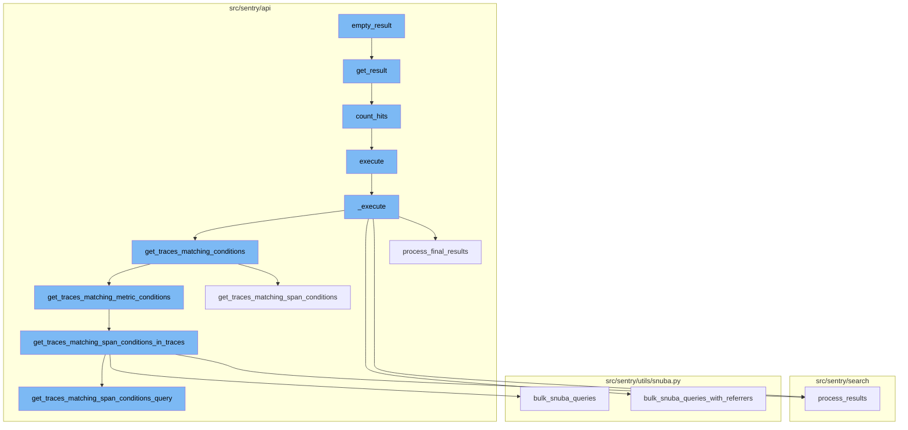
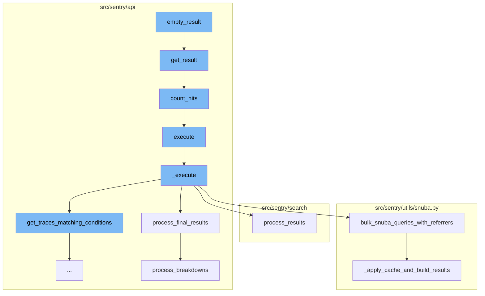
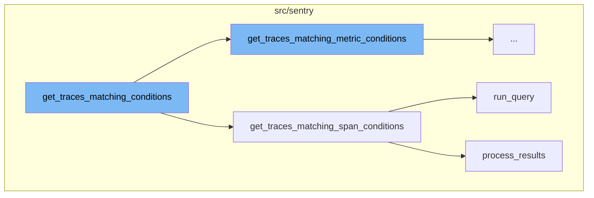
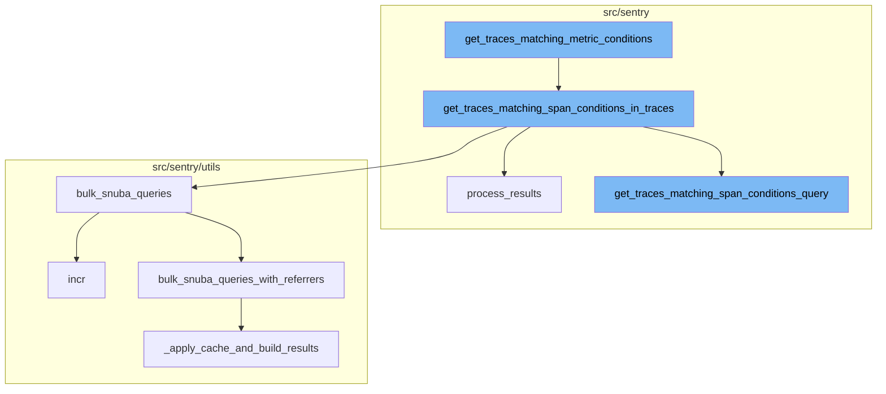

# Overview of 'empty_result'

The 'empty_result' is a function in the Sentry application that is used to return an empty result set. This is particularly useful as a placeholder when no data is available to be returned for a specific operation or query. The function is part of a larger flow that involves fetching and processing data.

# Flow of 'empty_result'

The flow begins with the 'empty_result' function. This function is then followed by the 'get_result' function which is responsible for fetching the actual data. The 'count_hits' function is then called within 'get_result' to count the number of hits or matches for the given query. The 'execute' function is then called, which is a wrapper around the '\_execute' function, containing the main logic of the flow. The '\_execute' function fetches traces matching certain conditions, refines the parameters based on the fetched traces, and then processes the results. Finally, the 'process_final_results' function is called to process the final results, including error handling and formatting the results for output.

# Detailed Flow

The flow further drills down into functions like 'get_traces_matching_conditions', 'get_traces_matching_span_conditions', 'run_query', and 'process_results'. These functions are responsible for determining which conditions to match when retrieving traces, executing the metrics query in Snuba, and processing the results of the query respectively. The flow also includes functions like 'get_traces_matching_metric_conditions', 'get_traces_matching_span_conditions_in_traces', 'bulk_snuba_queries', and 'get_traces_matching_span_conditions_query'. These functions are used to get traces that match certain metric conditions, get traces that match certain span conditions within the given traces, increment a metric for the snuba query, and get the query for traces that match certain span conditions respectively.



# Flow drill down

First, we'll zoom into this section of the flow:



<SwmSnippet path="/src/sentry/search/snuba/executors.py" line="213">

---

# Empty Result Flow

The flow begins with the `empty_result` function. This function returns an empty result set, which is used as a placeholder when no data is available.

```python
    @property
    def empty_result(self) -> CursorResult[Group]:
        # TODO: Add types to paginators and remove this
        return cast(CursorResult[Group], Paginator(Group.objects.none()).get_result())
```

---

</SwmSnippet>

<SwmSnippet path="/src/sentry/api/paginator.py" line="136">

---

Next, the `get_result` function is called. This function is responsible for fetching the actual data. It takes parameters such as limit, cursor, and count_hits to control the amount and type of data fetched.

```python
    def get_result(self, limit=100, cursor=None, count_hits=False, known_hits=None, max_hits=None):
        # cursors are:
        #   (identifier(integer), row offset, is_prev)
        if cursor is None:
            cursor = Cursor(0, 0, 0)

        limit = min(limit, self.max_limit)

        if cursor.value:
            cursor_value = self.value_from_cursor(cursor)
        else:
            cursor_value = 0

        queryset = self.build_queryset(cursor_value, cursor.is_prev)

        # TODO(dcramer): this does not yet work correctly for ``is_prev`` when
        # the key is not unique

        # max_hits can be limited to speed up the query
        if max_hits is None:
            max_hits = MAX_HITS_LIMIT
```

---

</SwmSnippet>

<SwmSnippet path="/src/sentry/api/paginator.py" line="27">

---

The `count_hits` function is then called within `get_result`. This function counts the number of hits or matches for the given query.

```python
def count_hits(queryset, max_hits):
    if not max_hits:
        return 0
    hits_query = queryset.values()[:max_hits].query
    # clear out any select fields (include select_related) and pull just the id
    hits_query.clear_select_clause()
    hits_query.add_fields(["id"])
    hits_query.clear_ordering(force=True, clear_default=True)
    try:
        h_sql, h_params = hits_query.sql_with_params()
    except EmptyResultSet:
        return 0
    cursor = connections[queryset.using_replica().db].cursor()
    cursor.execute(f"SELECT COUNT(*) FROM ({h_sql}) as t", h_params)
    return cursor.fetchone()[0]
```

---

</SwmSnippet>

<SwmSnippet path="/src/sentry/api/endpoints/organization_traces.py" line="341">

---

The `execute` function is then called. This function is a wrapper around the `_execute` function, which contains the main logic of the flow.

```python
    def execute(self, offset: int, limit: int):
        return {"data": self._execute()}
```

---

</SwmSnippet>

<SwmSnippet path="/src/sentry/api/endpoints/organization_traces.py" line="344">

---

The `_execute` function is where the main logic of the flow resides. It fetches traces matching certain conditions, refines the parameters based on the fetched traces, and then processes the results.

```python
    def _execute(self):
        with handle_span_query_errors():
            min_timestamp, max_timestamp, trace_ids = self.get_traces_matching_conditions(
                self.params,
                self.snuba_params,
            )

        self.refine_params(min_timestamp, max_timestamp)

        if not trace_ids:
            return []

        with handle_span_query_errors():
            params, snuba_params = self.params_with_all_projects()

            all_queries = self.get_all_queries(
                params,
                snuba_params,
                trace_ids,
            )

```

---

</SwmSnippet>

<SwmSnippet path="/src/sentry/api/endpoints/organization_traces.py" line="699">

---

Finally, the `process_final_results` function is called. This function processes the final results, including error handling and formatting the results for output.

```python
    def process_final_results(
        self,
        *,
        traces_metas_results,
        traces_errors_results,
        traces_occurrences_results,
        traces_breakdown_projects_results,
    ) -> list[TraceResult]:
        traces_range = {
            row["trace"]: {
                "start": row["first_seen()"],
                "end": row["last_seen()"],
                "slices": self.breakdown_slices,
            }
            for row in traces_metas_results["data"]
        }

        spans = [span for span in traces_breakdown_projects_results["data"]]
        spans.sort(key=lambda span: (span["precise.start_ts"], span["precise.finish_ts"]))

        try:
```

---

</SwmSnippet>

Now, lets zoom into this section of the flow:



<SwmSnippet path="/src/sentry/api/endpoints/organization_traces.py" line="415">

---

# get_traces_matching_conditions

The function `get_traces_matching_conditions` is the starting point of the flow. It checks if the `mri` attribute is not None, and if so, it sets a tag and calls `get_traces_matching_metric_conditions`. If `mri` is None, it calls `get_traces_matching_span_conditions` instead. This function is responsible for determining which conditions to match when retrieving traces.

```python
    def get_traces_matching_conditions(
        self,
        params: ParamsType,
        snuba_params: SnubaParams,
    ) -> tuple[datetime, datetime, list[str]]:
        if self.mri is not None:
            sentry_sdk.set_tag("mri", self.mri)
            return self.get_traces_matching_metric_conditions(params, snuba_params)

        return self.get_traces_matching_span_conditions(params, snuba_params)
```

---

</SwmSnippet>

<SwmSnippet path="/src/sentry/api/endpoints/organization_traces.py" line="492">

---

# get_traces_matching_span_conditions

The function `get_traces_matching_span_conditions` is called when `mri` is None. It retrieves a query and a timestamp column by calling `get_traces_matching_span_conditions_query`. The query is then executed by calling `run_query` and the results are processed by calling `process_results`. The function then iterates over the processed results, appending trace IDs and updating the min and max timestamps. If the number of matching trace IDs reaches the limit, the function returns early. Otherwise, it returns the min and max timestamps along with the matching trace IDs.

```python
    def get_traces_matching_span_conditions(
        self,
        params: ParamsType,
        snuba_params: SnubaParams,
        trace_ids: list[str] | None = None,
    ) -> tuple[datetime, datetime, list[str]]:
        query, timestamp_column = self.get_traces_matching_span_conditions_query(
            params,
            snuba_params,
        )

        results = query.run_query(
            referrer=Referrer.API_TRACE_EXPLORER_SPANS_LIST.value,
        )
        results = query.process_results(results)

        matching_trace_ids: list[str] = []
        min_timestamp = self.snuba_params.end
        max_timestamp = self.snuba_params.start
        assert min_timestamp is not None
        assert max_timestamp is not None
```

---

</SwmSnippet>

<SwmSnippet path="/src/sentry/snuba/metrics_layer/query.py" line="143">

---

# run_query

The function `run_query` is an entry point for executing a metrics query in Snuba. It takes a request as an argument and returns the result of the `bulk_run_query` function.

```python
def run_query(request: Request) -> Mapping[str, Any]:
    """
    Entrypoint for executing a metrics query in Snuba.
    """
    return bulk_run_query([request])[0]
```

---

</SwmSnippet>

<SwmSnippet path="/src/sentry/search/events/builder/base.py" line="1516">

---

# process_results

The function `process_results` is responsible for processing the results of the query. It starts a new span for tracking, sets the result count, and then processes the field meta and field results. The function returns a dictionary containing the processed data and meta.

```python
    def process_results(self, results: Any) -> EventsResponse:
        with sentry_sdk.start_span(op="QueryBuilder", description="process_results") as span:
            span.set_data("result_count", len(results.get("data", [])))
            translated_columns = {}
            if self.builder_config.transform_alias_to_input_format:
                translated_columns = {
                    column: function_details.field
                    for column, function_details in self.function_alias_map.items()
                }

                for column in list(self.function_alias_map):
                    translated_column = translated_columns.get(column, column)
                    if translated_column in self.function_alias_map:
                        continue
                    function_alias = self.function_alias_map.get(column)
                    if function_alias is not None:
                        self.function_alias_map[translated_column] = function_alias

                if self.raw_equations:
                    for index, equation in enumerate(self.raw_equations):
                        translated_columns[f"equation[{index}]"] = f"equation|{equation}"
```

---

</SwmSnippet>

Now, lets zoom into this section of the flow:



<SwmSnippet path="/src/sentry/api/endpoints/organization_traces.py" line="426">

---

# get_traces_matching_metric_conditions

This function is used to get traces that match certain metric conditions. It first checks if the executor class is valid, then creates an executor instance with the given parameters. It then gets the matching traces and timestamps. If there are user queries, it further refines the trace ids by applying them. If no trace ids are left after this, it returns an empty list. Otherwise, it takes the first N trace ids as the list to return.

```python
    def get_traces_matching_metric_conditions(
        self,
        params: ParamsType,
        snuba_params: SnubaParams,
    ) -> tuple[datetime, datetime, list[str]]:
        assert self.mri is not None

        executor_cls = get_sample_list_executor_cls(self.mri)
        if executor_cls is None:
            raise ParseError(detail=f"Unsupported MRI: {self.mri}")

        executor = executor_cls(
            mri=self.mri,
            params=params,
            snuba_params=snuba_params,
            fields=["trace"],
            max=self.metrics_max,
            min=self.metrics_min,
            operation=self.metrics_operation,
            query=self.metrics_query,
            referrer=Referrer.API_TRACE_EXPLORER_METRICS_SPANS_LIST,
```

---

</SwmSnippet>

<SwmSnippet path="/src/sentry/api/endpoints/organization_traces.py" line="526">

---

# get_traces_matching_span_conditions_in_traces

This function is used to get traces that match certain span conditions within the given traces. It first splits the trace ids into chunks to avoid hitting the max query size limit in ClickHouse. For each chunk, it gets the matching span conditions query and restricts the query to just this subset of trace ids. It then performs bulk snuba queries and processes the results. The function returns the minimum timestamp, maximum timestamp, and matching trace ids.

```python
    def get_traces_matching_span_conditions_in_traces(
        self,
        params: ParamsType,
        snuba_params: SnubaParams,
        trace_ids: list[str],
    ) -> tuple[datetime, datetime, list[str]]:
        all_queries: list[BaseQueryBuilder] = []
        timestamp_column: str | None = None

        # Putting all the trace ids into a single query will likely encounter the
        # max query size limit in ClickHouse. This tries to spread the trace ids
        # out evenly across N queries up to some limit per query.
        max_trace_ids_per_chunk = options.get(
            "performance.traces.trace-explorer-max-trace-ids-per-chunk"
        )
        num_chunks = math.ceil(len(trace_ids) / max_trace_ids_per_chunk)
        chunk_size = math.ceil(len(trace_ids) / num_chunks)

        for chunk in chunked(trace_ids, chunk_size):
            query, timestamp_column = self.get_traces_matching_span_conditions_query(
                params,
```

---

</SwmSnippet>

<SwmSnippet path="/src/sentry/search/events/builder/base.py" line="1516">

---

# process_results

This function is used to process the results from the snuba queries. It first translates the columns from the function alias map. It then processes the field meta and the field results. The function returns the processed data and meta.

```python
    def process_results(self, results: Any) -> EventsResponse:
        with sentry_sdk.start_span(op="QueryBuilder", description="process_results") as span:
            span.set_data("result_count", len(results.get("data", [])))
            translated_columns = {}
            if self.builder_config.transform_alias_to_input_format:
                translated_columns = {
                    column: function_details.field
                    for column, function_details in self.function_alias_map.items()
                }

                for column in list(self.function_alias_map):
                    translated_column = translated_columns.get(column, column)
                    if translated_column in self.function_alias_map:
                        continue
                    function_alias = self.function_alias_map.get(column)
                    if function_alias is not None:
                        self.function_alias_map[translated_column] = function_alias

                if self.raw_equations:
                    for index, equation in enumerate(self.raw_equations):
                        translated_columns[f"equation[{index}]"] = f"equation|{equation}"
```

---

</SwmSnippet>

<SwmSnippet path="/src/sentry/utils/snuba.py" line="900">

---

# bulk_snuba_queries

This function is an alias for `bulk_snuba_queries_with_referrers` that uses the same referrer for every request. It increments a metric for the snuba query and then calls `bulk_snuba_queries_with_referrers` with the requests and the referrer.

```python
def bulk_snuba_queries(
    requests: list[Request],
    referrer: str | None = None,
    use_cache: bool = False,
    query_source: (
        QuerySource | None
    ) = None,  # TODO: @athena Make this field required after updated all the callsites
) -> ResultSet:
    """
    Alias for `bulk_snuba_queries_with_referrers` that uses the same referrer for every request.
    """

    metrics.incr("snql.sdk.api", tags={"referrer": referrer or "unknown"})

    return bulk_snuba_queries_with_referrers(
        [(request, referrer) for request in requests],
        use_cache=use_cache,
        query_source=query_source,
    )
```

---

</SwmSnippet>

<SwmSnippet path="/src/sentry/api/endpoints/organization_traces.py" line="584">

---

# get_traces_matching_span_conditions_query

This function is used to get the query for traces that match certain span conditions. It first determines the timestamp column and the order by clause. It then creates a SpansIndexedQueryBuilder instance and adds the user queries to the where clause. If there are multiple user queries, it transforms the condition into its aggregate form so it can be used to match on the trace. The function returns the query and the timestamp column.

```python
    def get_traces_matching_span_conditions_query(
        self,
        params: ParamsType,
        snuba_params: SnubaParams,
        sort: str | None = None,
    ) -> tuple[BaseQueryBuilder, str]:
        if len(self.user_queries) < 2:
            timestamp_column = "timestamp"
        else:
            timestamp_column = "min(timestamp)"

        if sort == "-timestamp":
            orderby = [f"-{timestamp_column}"]
        else:
            # The orderby is intentionally `None` here as this query is much faster
            # if we let Clickhouse decide which order to return the results in.
            # This also means we cannot order by any columns or paginate.
            orderby = None

        if len(self.user_queries) < 2:
            # Optimization: If there is only a condition for a single span,
```

---

</SwmSnippet>

<SwmSnippet path="/src/sentry/utils/metrics.py" line="101">

---

# incr

This function is used to increment a metric. It first checks if the metrics system has started, and if not, it starts it. It then increments the metric with the given key, instance, tags, amount, and sample rate.

```python
    def incr(
        self,
        key: str,
        instance: str | None = None,
        tags: Tags | None = None,
        amount: int = 1,
        sample_rate: float = settings.SENTRY_METRICS_SAMPLE_RATE,
    ) -> None:
        if not self._started:
```

---

</SwmSnippet>

<SwmSnippet path="/src/sentry/utils/snuba.py" line="921">

---

# bulk_snuba_queries_with_referrers

This function is the main entrypoint to running queries in Snuba. It accepts requests for either MQL or SnQL queries and runs them on the appropriate endpoint. Each request is paired with a referrer to be used for that request. The function then applies the cache and builds the results.

```python
def bulk_snuba_queries_with_referrers(
    requests_with_referrers: list[tuple[Request, str | None]],
    use_cache: bool = False,
    query_source: (
        QuerySource | None
    ) = None,  # TODO: @athena Make this field required after updated all the callsites
) -> ResultSet:
    """
    The main entrypoint to running queries in Snuba. This function accepts
    Requests for either MQL or SnQL queries and runs them on the appropriate endpoint.

    Every request is paired with a referrer to be used for that request.
    """

    if "consistent" in OVERRIDE_OPTIONS:
        for request, _ in requests_with_referrers:
            request.flags.consistent = OVERRIDE_OPTIONS["consistent"]

    for request, referrer in requests_with_referrers:
        if referrer or query_source:
            request.tenant_ids = request.tenant_ids or dict()
```

---

</SwmSnippet>

<SwmSnippet path="/src/sentry/utils/snuba.py" line="993">

---

# \_apply_cache_and_build_results

This function is used to apply the cache and build the results for the snuba queries. It first gets the parent API from the current scope. It then checks if the cache should be used. If so, it gets the cache keys for the requests and gets the cache data. If the cache data is not available, it adds the request to the query list. Otherwise, it adds the cached result to the results list. If there are queries to be performed, it performs the snuba queries and adds the results to the results list. The function returns the results in the original param list order.

```python
def _apply_cache_and_build_results(
    snuba_requests: Sequence[SnubaRequest],
    use_cache: bool | None = False,
) -> ResultSet:
    parent_api: str = "<missing>"
    scope = sentry_sdk.Scope.get_current_scope()
    if scope.transaction:
        parent_api = scope.transaction.name

    # Store the original position of the query so that we can maintain the order
    snuba_requests_list: list[tuple[int, SnubaRequest]] = []
    for i, snuba_request in enumerate(snuba_requests):
        snuba_request.request.parent_api = parent_api
        snuba_requests_list.append((i, snuba_request))

    results = []

    to_query: list[tuple[int, SnubaRequest, str | None]] = []

    if use_cache:
        cache_keys = [
```

---

</SwmSnippet>

&nbsp;

*This is an auto-generated document by Swimm AI 🌊 and has not yet been verified by a human*

<SwmMeta version="3.0.0" repo-id="Z2l0aHViJTNBJTNBc2VudHJ5LWRlbW8lM0ElM0FTd2ltbS1EZW1v" repo-name="sentry-demo" doc-type="flows"><sup>Powered by [Swimm](/)</sup></SwmMeta>
